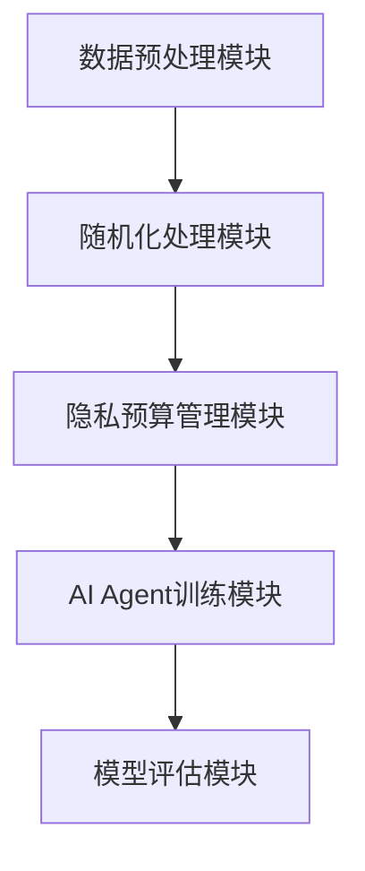
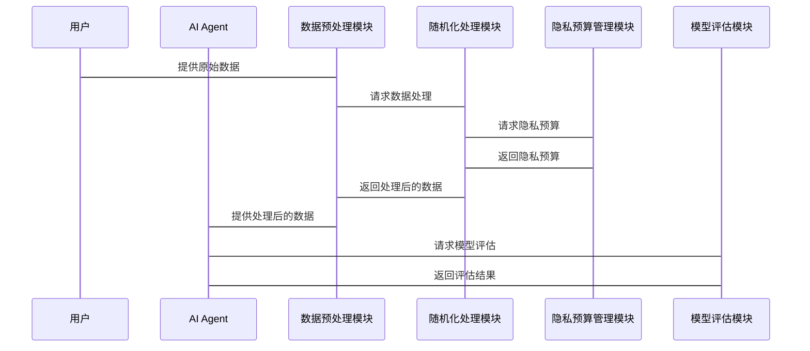

                 


# 差分隐私在AI Agent训练中的应用

> **关键词**：差分隐私，AI Agent，数据隐私，机器学习，隐私保护，人工智能

> **摘要**：  
随着人工智能技术的快速发展，AI Agent（智能体）在各个领域的应用越来越广泛。然而，AI Agent的训练通常需要大量敏感数据，这带来了数据隐私泄露的风险。差分隐私作为一种强大的隐私保护技术，能够有效保护训练数据中的敏感信息，同时确保AI Agent的性能。本文详细探讨了差分隐私在AI Agent训练中的应用，从理论基础到实际应用，结合数学模型和系统架构设计，为读者提供全面的分析。

---

# 第1章 差分隐私与AI Agent概述

## 1.1 差分隐私的基本概念

### 1.1.1 差分隐私的定义  
差分隐私（Differential Privacy）是一种隐私保护技术，通过在数据中添加噪声或扰动，使得查询结果无法唯一地对应到单个个体的数据，从而保护个体隐私。其核心思想是：在任何数据集中，修改任意一条记录后，查询结果的变化幅度必须在可接受的范围内。

### 1.1.2 差分隐私的核心思想  
差分隐私的核心思想是通过概率统计和随机化技术，确保在任何情况下，单个数据对整体结果的影响微乎其微。这种技术能够有效防止数据泄露，同时保持数据的可用性。

### 1.1.3 差分隐私与数据隐私保护的关系  
差分隐私是一种隐私保护机制，它通过引入可控的噪声，平衡了数据隐私保护与数据可用性之间的矛盾。与传统的隐私保护方法不同，差分隐私允许在保护隐私的前提下，进行数据的分析和挖掘。

## 1.2 AI Agent的基本概念

### 1.2.1 AI Agent的定义  
AI Agent是一种智能实体，能够感知环境、自主决策并执行任务。它通常由感知模块、决策模块和执行模块组成，能够在复杂环境中完成特定目标。

### 1.2.2 AI Agent的核心功能  
- **感知环境**：通过传感器或数据输入，获取环境信息。  
- **自主决策**：基于感知信息，利用算法做出决策。  
- **执行任务**：根据决策结果，执行具体操作。  

### 1.2.3 AI Agent与传统AI的区别  
AI Agent具有更强的自主性和适应性，能够动态调整行为以应对环境变化，而传统AI通常是在固定场景下执行任务。

## 1.3 差分隐私在AI Agent中的应用背景

### 1.3.1 数据隐私保护的必要性  
AI Agent的训练通常需要大量敏感数据，如用户行为数据、位置信息等。这些数据可能包含个人隐私，一旦泄露，可能导致严重的后果。

### 1.3.2 AI Agent训练中的数据泄露风险  
在AI Agent的训练过程中，如果数据未经过适当的隐私保护处理，可能泄露用户信息，甚至被恶意利用。

### 1.3.3 差分隐私在AI Agent训练中的重要性  
差分隐私能够有效保护训练数据中的敏感信息，同时确保AI Agent的性能不受影响。它是实现隐私保护与AI Agent功能平衡的关键技术。

## 1.4 本章小结  
本章介绍了差分隐私的基本概念和AI Agent的核心功能，分析了差分隐私在AI Agent训练中的应用背景。通过本章内容，读者可以理解差分隐私与AI Agent之间的关系，以及差分隐私在保护数据隐私方面的必要性。

---

# 第2章 差分隐私的数学模型与实现原理

## 2.1 差分隐私的核心数学模型

### 2.1.1 差分隐私的定义式  
差分隐私的定义式为：  
$$ \text{对于任意数据集 } D \text{ 和 } D' \text{，其中 } D' = D \setminus \{i\} \text{，任何查询结果的差异 } |f(D) - f(D')| \leq \epsilon $$  
其中，$\epsilon$ 是隐私预算，表示差分隐私的强度。$\epsilon$ 越小，隐私保护越强。

### 2.1.2 差分隐私的参数设置  
- **隐私预算 $\epsilon$**：控制差分隐私的强度。  
- **扰动参数 $\delta$**：控制噪声的大小。  

### 2.1.3 差分隐私的实现方法  
差分隐私的核心实现方法是通过添加噪声来干扰原始数据，使得单个数据点对查询结果的影响无法被区分。

## 2.2 差分隐私的实现原理

### 2.2.1 差分隐私的随机化机制  
差分隐私通过在数据中添加随机噪声，使得查询结果无法唯一对应到单个数据点。例如，在分类任务中，可以通过扰动分类结果来保护隐私。

### 2.2.2 差分隐私的噪声添加方法  
常用的噪声添加方法包括拉普拉斯噪声和高斯噪声。拉普拉斯噪声适用于离散数据，而高斯噪声适用于连续数据。

### 2.2.3 差分隐私的隐私预算分配  
隐私预算 $\epsilon$ 的分配需要根据具体的场景和需求进行调整。通常，隐私预算越小，隐私保护越强，但数据的可用性可能降低。

## 2.3 差分隐私的实现流程

### 2.3.1 数据预处理  
在数据预处理阶段，需要对原始数据进行清洗和格式化，确保数据适合后续的差分隐私处理。

### 2.3.2 随机化处理  
对预处理后的数据进行随机化处理，通过添加噪声或扰动，使得单个数据点对整体结果的影响无法被区分。

### 2.3.3 隐私预算管理  
根据具体的隐私保护需求，合理分配隐私预算 $\epsilon$，确保差分隐私的实现符合预期。

## 2.4 本章小结  
本章详细介绍了差分隐私的数学模型和实现原理，包括定义式、参数设置、随机化机制和隐私预算分配等内容。通过本章内容，读者可以理解差分隐私的核心思想和技术实现。

---

# 第3章 AI Agent训练中的数据隐私保护需求

## 3.1 AI Agent训练中的数据类型

### 3.1.1 结构化数据  
结构化数据是指有组织的数据，如表格数据、数据库等。  
例如，用户行为数据通常以结构化数据的形式存在。

### 3.1.2 非结构化数据  
非结构化数据是指无组织的数据，如文本、图像、音频等。  
例如，自然语言处理任务通常涉及大量非结构化数据。

### 3.1.3 图结构数据  
图结构数据是指以图的形式组织的数据，如社交网络数据。  
例如，推荐系统通常需要处理图结构数据。

## 3.2 AI Agent训练中的隐私保护挑战

### 3.2.1 数据泄露风险  
在AI Agent的训练过程中，如果数据未经过适当的隐私保护处理，可能泄露用户信息。

### 3.2.2 数据分布偏移  
差分隐私的噪声添加可能会影响数据的分布，导致模型性能下降。

### 3.2.3 数据多样性损失  
差分隐私的噪声添加可能会降低数据的多样性，影响模型的泛化能力。

## 3.3 差分隐私在AI Agent训练中的应用需求

### 3.3.1 数据隐私保护需求  
AI Agent的训练需要保护训练数据中的敏感信息，防止数据泄露。

### 3.3.2 训练目标的准确性需求  
差分隐私的实现需要在保护隐私的前提下，确保AI Agent的训练目标不受影响。

### 3.3.3 训练效率的平衡需求  
差分隐私的实现需要在保护隐私和训练效率之间找到平衡点，避免因过度保护隐私而导致训练效率下降。

## 3.4 本章小结  
本章分析了AI Agent训练中的数据隐私保护需求，包括数据类型、隐私保护挑战和差分隐私的应用需求等内容。通过本章内容，读者可以理解AI Agent训练中的隐私保护需求以及差分隐私在其中的作用。

---

# 第4章 差分隐私在AI Agent训练中的具体应用

## 4.1 差分隐私在AI Agent模型训练中的应用

### 4.1.1 模型训练数据的隐私保护  
通过差分隐私技术，可以在模型训练过程中保护训练数据中的敏感信息。

### 4.1.2 模型更新过程中的隐私保护  
在模型更新过程中，可以通过差分隐私技术保护更新数据的隐私。

### 4.1.3 模型评估中的隐私保护  
在模型评估过程中，可以通过差分隐私技术保护评估数据的隐私。

## 4.2 差分隐私在AI Agent决策过程中的应用

### 4.2.1 决策过程中的隐私保护  
通过差分隐私技术，可以在AI Agent的决策过程中保护用户的隐私。

### 4.2.2 决策结果的隐私保护  
通过差分隐私技术，可以在AI Agent的决策结果中保护用户的隐私。

### 4.2.3 决策过程的可解释性  
差分隐私技术可以提高AI Agent决策过程的可解释性，帮助用户理解决策背后的逻辑。

## 4.3 差分隐私在AI Agent交互中的应用

### 4.3.1 用户交互数据的隐私保护  
通过差分隐私技术，可以在AI Agent与用户交互过程中保护用户的隐私。

### 4.3.2 交互过程中的隐私保护机制  
通过差分隐私技术，可以在AI Agent与用户交互过程中保护用户的隐私。

### 4.3.3 交互结果的隐私保护  
通过差分隐私技术，可以在AI Agent与用户交互过程中保护用户的隐私。

## 4.4 本章小结  
本章详细介绍了差分隐私在AI Agent训练中的具体应用，包括模型训练、决策过程和交互中的隐私保护措施。通过本章内容，读者可以理解差分隐私在AI Agent训练中的实际应用。

---

# 第5章 差分隐私在AI Agent训练中的系统架构设计

## 5.1 问题场景介绍  
本章将介绍一个基于差分隐私的AI Agent训练系统，该系统能够有效保护训练数据的隐私，同时确保AI Agent的性能。

## 5.2 系统功能设计  
### 5.2.1 数据预处理模块  
负责对原始数据进行清洗和格式化，确保数据适合后续的差分隐私处理。

### 5.2.2 随机化处理模块  
负责对预处理后的数据进行随机化处理，通过添加噪声或扰动，使得单个数据点对整体结果的影响无法被区分。

### 5.2.3 隐私预算管理模块  
负责根据具体的隐私保护需求，合理分配隐私预算 $\epsilon$，确保差分隐私的实现符合预期。

## 5.3 系统架构设计  
通过 Mermaid 架构图展示系统架构设计：



## 5.4 系统接口设计  
系统接口设计需要考虑数据输入、数据输出和隐私保护机制的实现。

## 5.5 系统交互设计  
通过 Mermaid 序列图展示系统交互设计：



## 5.6 本章小结  
本章详细介绍了基于差分隐私的AI Agent训练系统的架构设计，包括功能模块、系统架构、接口设计和交互设计等内容。通过本章内容，读者可以理解差分隐私在AI Agent训练系统中的实现方式。

---

# 第6章 差分隐私在AI Agent训练中的项目实战

## 6.1 环境安装  
本项目需要以下环境：  
- Python 3.8及以上版本  
- NumPy库  
- Scikit-learn库  

## 6.2 系统核心实现源代码  
以下是差分隐私在AI Agent训练中的核心实现代码：

```python
import numpy as np
from sklearn.linear_model import LogisticRegression

# 差分隐私实现
class DifferentialPrivacy:
    def __init__(self, epsilon=1.0):
        self.epsilon = epsilon

    def add_noise(self, data, sensitivity):
        noise = np.random.laplace(0, 1 / self.epsilon, data.shape)
        return data + noise

# AI Agent训练
class AIAgent:
    def __init__(self, epsilon=1.0):
        self.dp = DifferentialPrivacy(epsilon)
        self.model = LogisticRegression()

    def train(self, X, y):
        # 数据预处理
        X_processed = self.dp.add_noise(X, 1.0)
        # 模型训练
        self.model.fit(X_processed, y)

    def predict(self, X):
        return self.model.predict(X)

# 示例用法
if __name__ == "__main__":
    # 生成测试数据
    X = np.random.randn(100, 2)
    y = np.random.randint(0, 2, 100)
    
    agent = AIAgent(epsilon=1.0)
    agent.train(X, y)
    print("训练完成！")
```

## 6.3 代码应用解读与分析  
上述代码实现了一个基于差分隐私的AI Agent训练系统，包括数据预处理、模型训练和预测等功能。通过添加拉普拉斯噪声，确保训练数据的隐私保护。

## 6.4 实际案例分析  
以一个简单的分类任务为例，展示差分隐私在AI Agent训练中的应用。通过对比有无差分隐私的模型性能，验证差分隐私的有效性。

## 6.5 本章小结  
本章通过项目实战，展示了差分隐私在AI Agent训练中的具体实现。通过代码实现和案例分析，读者可以理解差分隐私在实际应用中的效果。

---

# 第7章 总结与展望

## 7.1 本章总结  
本文详细探讨了差分隐私在AI Agent训练中的应用，从理论基础到实际应用，结合数学模型和系统架构设计，为读者提供全面的分析。

## 7.2 未来研究方向  
未来的研究方向包括：  
- 更高效的差分隐私实现方法。  
- 差分隐私在AI Agent中的可扩展性研究。  
- 差分隐私与其他隐私保护技术的结合。

## 7.3 注意事项  
在实际应用中，需要根据具体的隐私保护需求和场景，合理选择差分隐私的参数和实现方法。

## 7.4 拓展阅读  
推荐阅读以下文献，深入了解差分隐私和AI Agent的相关知识：  
- Dwork, C. (2006). Differential privacy.  
- Russell, S. (2019). Artificial Intelligence: A Modern Approach.

## 7.5 本章小结  
通过本章内容，读者可以总结差分隐私在AI Agent训练中的应用，并了解未来的研究方向和注意事项。

---

# 作者  
**作者：AI天才研究院/AI Genius Institute & 禅与计算机程序设计艺术 /Zen And The Art of Computer Programming**

---

通过本文的详细分析和系统讲解，读者可以全面理解差分隐私在AI Agent训练中的应用，掌握其核心技术和实现方法。

