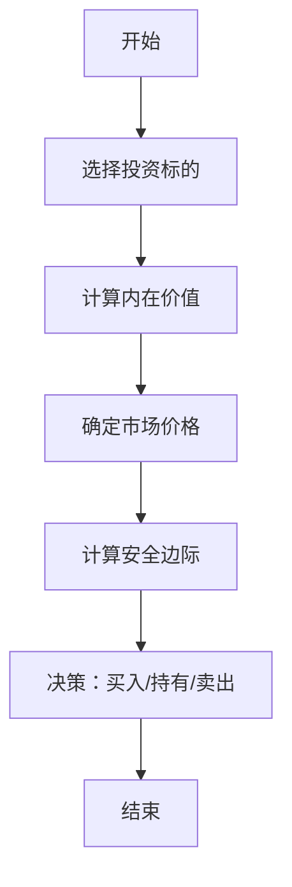
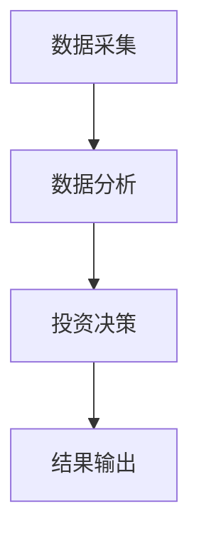

                 


# 巴菲特如何看待市场波动和长期投资

## 关键词：巴菲特，市场波动，长期投资，价值投资，安全边际，风险管理

## 摘要：本文深入探讨了巴菲特的投资理念，重点分析了他在面对市场波动时的策略，以及长期投资的重要性。文章从市场波动的定义与影响、长期投资的策略、安全边际的概念、投资策略的数学模型、系统架构设计，到实际案例分析，层层展开，揭示巴菲特成功的秘诀。通过本文，读者可以更好地理解巴菲特的投资哲学，并将其应用于实际投资中。

---

## 第一部分：引言

## 第1章：巴菲特的背景与投资哲学

### 1.1 巴菲特的生平简介
#### 1.1.1 巴菲特的早年经历
沃伦·巴菲特（Warren Buffett）于1934年8月30日出生于美国内布拉斯州的奥马哈市。他在童年时期展现出对数字和投资的浓厚兴趣，12岁时便开始购买股票。巴菲特的父亲是一名律师，同时也是一位国会议员，这为他提供了良好的经济和教育背景。

#### 1.1.2 巴菲特的合伙人制度
1950年代，巴菲特开始与他人合作建立合伙企业，逐步发展出独特的合伙人制度。这一制度的核心是通过合伙人的信任和长期合作，共同投资优质资产，分享收益。

#### 1.1.3 巴菲特的伯克希尔哈撒韦公司
1962年，巴菲特收购了伯克希尔哈撒韦公司（Berkshire Hathaway），这成为他投资生涯的重要转折点。伯克希尔哈撒韦不仅是他的旗舰公司，也是他实现价值投资理念的重要平台。

### 1.2 巴菲特的投资哲学
#### 1.2.1 价值投资的核心理念
巴菲特的价值投资理念强调以低于内在价值的价格购买优质资产。他认为市场短期波动可能会影响股价，但长期来看，企业的内在价值才是决定股价的关键。

#### 1.2.2 巴菲特的长期投资策略
巴菲特主张长期持有优质股票，避免频繁交易。他认为短期市场波动是不可避免的，但长期投资能够抵消波动带来的负面影响，最终实现收益。

#### 1.2.3 巴菲特的安全边际概念
安全边际是指买入价格与内在价值之间的差距。巴菲特认为，通过购买价格低于内在价值的股票，可以降低市场波动带来的风险，确保投资的安全性。

### 1.3 为什么研究巴菲特的投资观点重要
#### 1.3.1 巴菲特投资理念的现实意义
巴菲特的投资理念不仅适用于个人投资者，也为企业和机构投资者提供了宝贵的借鉴。他的方法强调长期思考和理性决策，这在当今快节奏的市场中尤为重要。

#### 1.3.2 巴菲特投资理念的长期有效性
尽管市场环境不断变化，巴菲特的投资理念始终经受住了时间的考验。他的长期投资策略和价值投资方法在全球范围内被广泛认可。

#### 1.3.3 巴菲特投资理念的可复制性
巴菲特的投资方法并非神秘，而是基于基本面分析和理性决策。虽然复制他的具体投资组合可能困难，但他的理念为投资者提供了清晰的指导。

---

## 第二部分：市场波动与长期投资的关系

## 第2章：市场波动的定义与影响

### 2.1 市场波动的定义
#### 2.1.1 市场波动的来源
市场波动主要来源于投资者情绪、经济数据变化、政策调整以及企业基本面变化等因素。这些因素共同作用，导致市场价格的短期波动。

#### 2.1.2 市场波动的特征
市场波动具有随机性和不可预测性，但可以通过历史数据分析和概率统计来估计其影响。

#### 2.1.3 市场波动对投资者的影响
短期波动可能导致投资者情绪波动，进而影响投资决策。然而，长期来看，波动为优质资产提供了买入机会。

### 2.2 巴菲特对市场波动的看法
#### 2.2.1 波动是市场的常态
巴菲特认为市场波动是市场的常态，短期波动不会影响企业的内在价值。

#### 2.2.2 长期投资的稳定性
通过长期投资，投资者可以避免短期波动带来的负面影响，专注于企业的长期增长。

#### 2.2.3 把握波动中的机会
巴菲特强调在市场波动中寻找优质资产的低估机会，这是实现超额收益的关键。

---

## 第3章：长期投资的策略与实践

### 3.1 长期投资的重要性
#### 3.1.1 长期投资的优势
长期投资能够分散短期波动的风险，同时享受复利效应，实现资产的长期增长。

#### 3.1.2 长期投资的劣势
长期投资需要投资者具备耐心和纪律性，避免被短期波动干扰。

#### 3.1.3 长期投资与复利效应
复利效应是长期投资的核心优势，通过持续的收益再投资，实现资产的指数增长。

### 3.2 长期投资的策略
#### 3.2.1 投资优质企业
巴菲特强调投资具有强大护城河的企业，这些企业能够在长期竞争中保持优势。

#### 3.2.2 分散投资风险
通过分散投资优质资产，降低单一资产波动带来的风险。

#### 3.2.3 长期持有与定期再平衡
定期审视投资组合，根据市场变化进行适当调整，保持投资组合的长期稳定。

---

## 第4章：安全边际与风险管理

### 4.1 安全边际的定义
安全边际是指买入价格与企业内在价值之间的差距，确保在市场波动中仍能实现收益。

### 4.2 安全边际的计算
#### 4.2.1 内在价值的计算方法
内在价值是通过对企业未来现金流的贴现计算得出。公式如下：

$$
\text{内在价值} = \sum_{t=1}^{n} \frac{\text{现金流}_t}{(1 + r)^t}
$$

其中，\( r \) 是折现率，\( \text{现金流}_t \) 是第 \( t \) 年的现金流。

#### 4.2.2 安全边际的计算
安全边际可以通过以下公式计算：

$$
\text{安全边际} = \text{内在价值} - \text{市场价格}
$$

### 4.3 风险管理的重要性
#### 4.3.1 风险管理的核心原则
风险管理的核心在于分散投资、控制仓位和避免过度杠杆。

#### 4.3.2 巴菲特的风险管理策略
巴菲特强调通过分散投资优质资产、保持充足流动性，并避免高风险投资来管理风险。

---

## 第5章：数学模型与算法原理

### 5.1 价值投资的数学模型
#### 5.1.1 内在价值计算模型
内在价值的计算模型基于现金流贴现法，公式如下：

$$
V = \frac{CF_1}{(1 + r)^1} + \frac{CF_2}{(1 + r)^2} + \cdots + \frac{CF_n}{(1 + r)^n}
$$

其中，\( V \) 是内在价值，\( CF_t \) 是第 \( t \) 年的现金流，\( r \) 是折现率。

#### 5.1.2 市场价格与安全边际的关系
市场价格与内在价值的关系可以通过以下公式表示：

$$
\text{安全边际} = V - P
$$

其中，\( V \) 是内在价值，\( P \) 是市场价格。

### 5.2 算法原理
#### 5.2.1 算法流程图
以下是一个简单的投资决策算法流程图：



#### 5.2.2 投资决策的数学公式
投资决策的数学公式如下：

$$
\text{投资决策} = \begin{cases}
\text{买入} & \text{如果 } V > P \\
\text{持有} & \text{如果 } V = P \\
\text{卖出} & \text{如果 } V < P
\end{cases}
$$

---

## 第6章：系统架构与项目实战

### 6.1 系统架构设计
#### 6.1.1 系统功能设计
系统功能包括数据采集、数据分析、投资决策和结果输出。

#### 6.1.2 系统架构图
以下是一个简单的系统架构图：



### 6.2 项目实战
#### 6.2.1 环境安装
需要安装Python、Pandas、NumPy等工具。

#### 6.2.2 核心代码实现
以下是一个简单的内在价值计算代码：

```python
import numpy as np

def calculate_intrinsic_value(cash_flows, discount_rate):
    return np.npv(discount_rate, cash_flows)
```

#### 6.2.3 案例分析
以苹果公司为例，计算其内在价值和安全边际。

---

## 第7章：结论与展望

### 7.1 结论
巴菲特的投资理念强调长期投资和价值投资，通过安全边际和风险管理来应对市场波动。这些理念为投资者提供了重要的指导。

### 7.2 展望
未来，随着市场的变化，巴菲特的投资理念仍将继续指导投资者，尤其是在长期投资和风险管理方面。

---

## 附录

### 附录A：术语表
- 内在价值：企业未来现金流的现值。
- 安全边际：买入价格与内在价值的差距。

### 附录B：进一步阅读
- 《巴菲特致股东的信》
- 《投资最重要的事情》

### 附录C：巴菲特的经典名言
- “价格是波动的，价值是永恒的。”
- “投资是简单的事，但也是困难的事。”

---

## 作者：AI天才研究院/AI Genius Institute & 禅与计算机程序设计艺术 /Zen And The Art of Computer Programming

