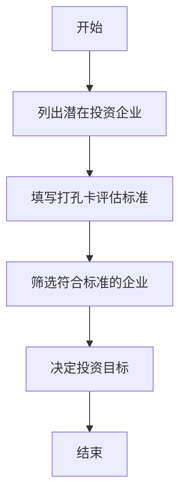
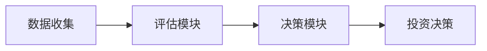
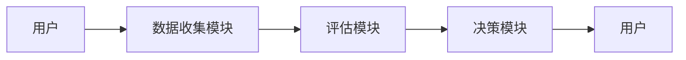

                 


# 巴菲特的20格打孔卡：集中投资策略

> 关键词：巴菲特，价值投资，集中投资，打孔卡，投资策略，股票分析

> 摘要：本文深入探讨了巴菲特的20格打孔卡方法，这是一种用于筛选和评估潜在投资标的工具，帮助投资者集中投资于优质企业。文章从投资基础、打孔卡方法的核心概念、算法原理、系统架构、项目实战等方面进行详细分析，结合实际案例和代码示例，提供全面的指导。

---

## 第一部分: 投资基础与巴菲特投资理念

### 第1章: 投资的基本概念

#### 1.1 投资的定义与分类

- **1.1.1 投资的定义**
  投资是指将资金投入到某个项目或资产中，以期望在未来获得收益或资本增值的行为。投资可以是股票、债券、房地产等多种形式。

- **1.1.2 投资的分类**
  - 股票投资：通过购买公司股份成为股东，分享公司利润。
  - 债券投资：购买政府或企业发行的债券，定期获得利息。
  - 实物投资：投资于房地产、黄金等实物资产。
  - 其他投资：如私募基金、对冲基金等。

- **1.1.3 投资的基本原则**
  - 风险与收益成正比：高收益意味着高风险。
  - 长期投资：避免频繁交易，降低交易成本。
  - 分散投资：不要将所有资金投入到单一资产。

#### 1.2 巴菲特的生平与投资哲学

- **1.2.1 巴菲特的生平简介**
  巴菲特（Warren Buffett）是世界著名投资者，生于1934年，伯克希尔哈撒韦公司董事长兼首席执行官。他以价值投资闻名，积累了巨额财富。

- **1.2.2 巴菲特的投资哲学**
  巴菲特强调价值投资，即以低于企业实际价值的价格购买优质企业。他注重企业的基本面分析，寻找具有持续竞争优势的企业。

- **1.2.3 巴菲特的价值投资理念**
  - 买入并持有：集中投资于少数优质企业，长期持有。
  - 安全边际：以低于内在价值的价格买入，确保安全边际。
  - 股东思维：将自己视为企业的股东，关注企业的长期发展。

### 第2章: 集中投资策略的背景与意义

#### 2.1 集中投资的定义与特点

- **2.1.1 集中投资的定义**
  集中投资是指将大部分资金投入到少数几只股票或资产中，以提高投资回报。

- **2.1.2 集中投资的特点**
  - 高风险：集中投资意味着更高的波动性和风险。
  - 高回报：通过投资优质企业，获得超额回报。

- **2.1.3 集中投资与分散投资的对比**
  | 特性        | 集中投资          | 分散投资          |
  |-------------|-------------------|-------------------|
  | 风险         | 高                | 低                |
  | 回报         | 高                | 平稳              |
  | 管理难度     | 高                | 低                |

#### 2.2 巴菲特集中投资策略的背景

- **2.2.1 美国股市的历史发展**
  美国股市经历了多次牛熊市，巴菲特在市场低迷时买入优质股票，长期持有。

- **2.2.2 巴菲特集中投资策略的形成**
  巴菲特在早期的投资实践中发现，集中投资于优质企业能够获得更高的回报，因此逐渐形成自己的投资策略。

- **2.2.3 集中投资策略的适用场景**
  - 市场低迷：低价买入优质企业。
  - 高质量企业：选择具有持续竞争优势的企业。

---

## 第二部分: 巴菲特的20格打孔卡方法

### 第3章: 打孔卡方法的核心概念

#### 3.1 打孔卡方法的定义

- **3.1.1 打孔卡的物理形式**
  打孔卡是一种纸质工具，由20个格子组成，每个格子代表一个评估标准。

- **3.1.2 打孔卡在投资中的应用**
  投资者通过打孔卡筛选出符合多个标准的企业，作为潜在投资目标。

- **3.1.3 打孔卡的逻辑结构**
  打孔卡包括企业基本面、财务指标、竞争优势等多个评估维度。

#### 3.2 打孔卡方法的核心要素

- **3.2.1 企业的基本面分析**
  - 行业地位：企业是否处于领先地位。
  - 财务健康：是否有稳定的收入和利润。
  - 管理团队：是否具备优秀管理能力。

- **3.2.2 企业的财务指标**
  - 净利润：企业的盈利能力。
  - 股东权益：企业的净资产。
  - 市盈率：市价与每股收益的比率。

- **3.2.3 企业的竞争优势**
  - 技术优势：企业是否拥有独特的技术。
  - 市场份额：企业在市场中的占有率。
  - 资源优势：企业是否拥有独特资源。

### 第4章: 打孔卡方法

#### 4.1 打孔卡方法的步骤

- **4.1.1 列出潜在投资企业**
  投资者列出感兴趣的股票，作为初步筛选对象。

- **4.1.2 填写打孔卡评估标准**
  根据每个企业的实际情况，填写打孔卡的各个格子。

- **4.1.3 筛选符合标准的企业**
  通过打孔卡的筛选，选出符合多个标准的企业，作为投资目标。

#### 4.2 打孔卡方法的优缺点

- **优点：**
  - 简化评估过程：通过打孔卡筛选出优质企业。
  - 提高投资效率：集中精力在少数优质企业上。
  - 降低投资风险：通过多维度评估，减少盲目投资。

- **缺点：**
  - 依赖评估标准：打孔卡的筛选标准可能过于主观。
  - 需要持续更新：市场变化可能导致评估标准失效。

---

## 第三部分: 巴菲特打孔卡方法的算法原理

### 第5章: 算法原理

#### 5.1 算法的核心思想

- 巴菲特的打孔卡方法是一种基于多维度评估的投资筛选工具，通过对企业基本面、财务指标和竞争优势的综合评估，筛选出优质企业。

#### 5.2 算法的具体实现

- **5.2.1 评估指标的权重分配**
  不同的评估指标具有不同的权重，例如净利润可能比市盈率更重要。

- **5.2.2 评估结果的计算**
  根据各个指标的权重，计算企业的综合得分，决定是否符合投资标准。

#### 5.3 算法的数学模型

- 现金流折现模型：
  $$
  \text{内在价值} = \sum_{t=1}^{n} \frac{\text{现金流}_t}{(1 + r)^t}
  $$
  其中，r是折现率，n是估计的年数。

- 市盈率分析：
  $$
  \text{市盈率} = \frac{\text{股价}}{\text{每股收益}}
  $$

#### 5.4 算法的流程图



---

## 第四部分: 巴菲特打孔卡方法的系统架构

### 第6章: 系统分析与架构设计

#### 6.1 系统功能设计

- 数据收集模块：收集企业的财务数据和市场信息。
- 评估模块：根据打孔卡的标准，评估企业的综合得分。
- 决策模块：根据评估结果，决定是否投资。

#### 6.2 系统架构设计



#### 6.3 系统接口设计

- 输入接口：企业财务数据、市场信息。
- 输出接口：评估结果、投资建议。

#### 6.4 系统交互设计



---

## 第五部分: 巴菲特打孔卡方法的项目实战

### 第7章: 项目实战

#### 7.1 环境安装

- Python环境：安装Python和必要的库，如Pandas、NumPy。

#### 7.2 核心实现代码

```python
import pandas as pd

def calculate_intrinsic_value(company_data, discount_rate):
    cash_flows = company_data['现金流']
    intrinsic_value = sum(cash_flows / (1 + discount_rate)**t for t in range(len(cash_flows)))
    return intrinsic_value

def calculate_pe_ratio(company_data):
    price = company_data['股价']
    eps = company_data['每股收益']
    pe_ratio = price / eps
    return pe_ratio

# 示例数据
data = {
    '现金流': [100, 120, 150],
    '股价': 100,
    '每股收益': 10
}

iv = calculate_intrinsic_value(data, 0.1)
pe = calculate_pe_ratio(data)

print(f"内在价值: {iv}")
print(f"市盈率: {pe}")
```

#### 7.3 实际案例分析

- 案例：以苹果公司为例，分析其内在价值和市盈率。

#### 7.4 项目小结

- 打孔卡方法通过系统的评估，帮助投资者筛选出优质企业。
- 代码示例展示了如何通过Python进行数据分析，辅助投资决策。

---

## 第六部分: 巴菲特打孔卡方法的最佳实践

### 第8章: 最佳实践

#### 8.1 投资者的注意事项

- 避免情绪化投资：遵循打孔卡的评估结果，避免受市场情绪影响。
- 定期更新评估：市场变化可能导致评估结果需要更新。

#### 8.2 小结

- 巴菲特的20格打孔卡方法是一种有效的投资工具。
- 通过多维度评估，帮助投资者集中投资于优质企业。

#### 8.3 注意事项

- 需要长期学习和实践，才能熟练掌握。
- 需要结合市场实际情况，灵活调整评估标准。

#### 8.4 拓展阅读

- 《巴菲特致股东的信》：了解巴菲特的投资理念。
- 《投资最重要的事情》：学习更多的投资策略。

---

## 附录

### 附录A: 打孔卡评估标准表格

| 评估维度         | 评估标准         | 分数权重 |
|------------------|------------------|----------|
| 行业地位         | 是否行业领先     | 0.2      |
| 财务健康         | 净利润是否稳定   | 0.3      |
| 管理团队         | 是否具备优秀管理能力 | 0.1     |
| 市场份额         | 是否具有竞争优势 | 0.2      |
| 技术优势         | 是否拥有核心技术   | 0.1      |

### 附录B: Python代码示例

```python
import pandas as pd

def calculate_intrinsic_value(company_data, discount_rate):
    cash_flows = company_data['现金流']
    return sum(cash_flows / (1 + discount_rate)**t for t in range(len(cash_flows)))

def calculate_pe_ratio(company_data):
    return company_data['股价'] / company_data['每股收益']

# 示例数据
data = {
    '现金流': [100, 120, 150],
    '股价': 100,
    '每股收益': 10
}

iv = calculate_intrinsic_value(data, 0.1)
pe = calculate_pe_ratio(data)

print(f"内在价值: {iv}")
print(f"市盈率: {pe}")
```

---

## 作者：AI天才研究院/AI Genius Institute & 禅与计算机程序设计艺术 /Zen And The Art of Computer Programming

---

这篇文章详细介绍了巴菲特的20格打孔卡方法，从理论到实践，结合算法原理和系统设计，帮助读者理解并应用这一集中投资策略。

