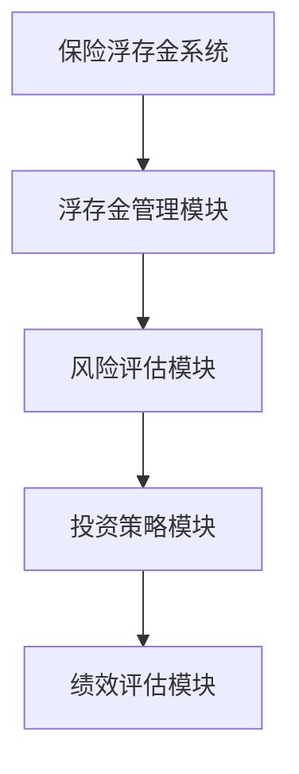

                 

# 巴菲特的保险浮存金运用之道

> 关键词：保险浮存金，巴菲特，投资策略，精算模型，风险管理

> 摘要：本文深入探讨了巴菲特如何利用保险浮存金进行投资，并分析了其背后的精算模型和风险管理策略。通过详细分析浮存金的来源、运作机制、数学模型和系统设计，揭示了这一投资模式的成功秘诀。

---

## 第一部分: 保险浮存金的背景与概念

### 第1章: 保险浮存金的背景与概念

#### 1.1 保险浮存金的定义与来源

保险浮存金（Float）是指保险公司收到的保费与未来需要支付的理赔之间的差额资金。这部分资金在保险公司资产负债表中被列为负债，但实际上可以被用于投资，创造额外收益。

- **定义**：保险浮存金是保险公司暂时持有、用于支付未来理赔的资金，其本质是保险公司的无息贷款。
- **来源**：浮存金主要来源于保费收入与理赔支出的时间差。保险公司收到保费后，需要在未来赔付，中间的时间差形成的资金就是浮存金。
- **特点**：
  - 时间跨度长：浮存金可以持有数年甚至更长时间。
  - 成本低：由于是负债，浮存金的投资收益归保险公司所有，成本几乎为零。
  - 灵活性高：保险公司可以根据市场情况调整浮存金的投资方向。

#### 1.2 巴菲特与保险浮存金的关联

巴菲特是保险浮存金投资模式的鼻祖，他通过控股保险公司（如伯克希尔·哈撒韦）利用浮存金进行长期投资，取得了巨大的成功。

- **巴菲特的保险投资理念**：巴菲特认为，保险浮存金是一种“免费的”资金来源，可以用来投资优质资产，创造超额收益。
- **浮存金在巴菲特投资组合中的地位**：浮存金是伯克希尔·哈撒韦的核心竞争优势之一，通过持有浮存金，巴菲特能够以极低的成本配置长期优质资产。
- **巴菲特对浮存金的独特见解**：巴菲特强调，浮存金的关键在于其低成本和长期性，通过合理的资产配置和风险管理，可以最大化其投资价值。

---

## 第二部分: 保险浮存金的核心概念与原理

### 第2章: 保险浮存金的核心概念与原理

#### 2.1 保险浮存金的核心概念

保险浮存金的核心概念包括其精算模型、内在价值计算以及风险管理。

- **精算模型**：精算模型用于估算未来理赔的时间和金额，从而确定浮存金的规模和使用方式。
- **内在价值计算**：浮存金的内在价值取决于其投资收益和风险管理能力。通过精算模型和投资策略的结合，可以最大化浮存金的价值。
- **风险管理**：浮存金的投资需要严格控制风险，确保在极端情况下保险公司能够履行赔付义务。

#### 2.2 保险浮存金的数学模型

保险浮存金的数学模型主要用于计算其现值和风险调整后的回报率。

- **现值计算公式**：
  $$ PV = \frac{FV}{(1 + r)^n} $$
  其中，PV 是现值，FV 是未来价值，r 是折现率，n 是时间跨度。
- **风险调整后的回报率**：
  $$ R = r + \beta \times (R_m - r) $$
  其中，R 是风险调整后的回报率，r 是无风险利率，β 是资产的贝塔系数，R_m 是市场回报率。

---

## 第三部分: 巴菲特的保险浮存金投资模式

### 第3章: 巴菲特的保险浮存金投资模式

#### 3.1 投资模式的运作机制

巴菲特的保险浮存金投资模式以低成本、长期性和稳健性为核心特点。

- **运作机制**：
  - **浮存金的持有成本**：由于浮存金是负债，其持有成本接近于零，因此可以以极低的成本配置长期资产。
  - **资金成本优化**：通过长期投资优质资产，最大化浮存金的投资收益。
  - **风险管理策略**：巴菲特注重分散投资和长期优质资产配置，确保在市场波动中保持稳健。

#### 3.2 成功案例分析

伯克希尔·哈撒韦是巴菲特保险浮存金投资模式的典型成功案例。

- **案例分析**：
  - **浮存金的规模**：伯克希尔的浮存金规模庞大，近年来一直维持在 1000 亿美元以上。
  - **投资策略**：伯克希尔利用浮存金投资于长期优质资产，如股票、债券和房地产，取得了远超无风险利率的投资回报。
  - **风险管理**：伯克希尔注重分散投资和长期稳健的资产配置，确保在市场波动中保持安全。

---

## 第四部分: 保险浮存金的长期投资策略

### 第4章: 保险浮存金的长期投资策略

#### 4.1 长期资金配置理论

长期资金配置理论是巴菲特投资模式的核心之一。

- **资产配置的黄金法则**：巴菲特强调长期投资优质资产，避免短期波动的干扰。
- **不同资产类别的风险收益比**：股票的风险较高，但长期回报率也较高；债券的风险较低，回报率相对稳定。
- **长期投资的再平衡策略**：定期调整投资组合，确保资产配置符合长期目标。

#### 4.2 投资组合管理

投资组合管理是实现浮存金长期投资收益的关键。

- **投资组合的构建与优化**：巴菲特注重分散投资，避免过度集中于某一种资产。
- **风险管理的量化方法**：通过贝塔系数和波动率等指标，量化投资组合的风险。
- **投资组合的绩效评估**：定期评估投资组合的绩效，确保其符合长期目标。

---

## 第五部分: 保险浮存金系统的分析与设计

### 第5章: 保险浮存金系统的分析与设计

#### 5.1 系统架构设计

保险浮存金系统的架构设计需要考虑其功能模块和交互流程。

- **系统功能模块划分**：
  - 浮存金管理模块：负责浮存金的收缴和分配。
  - 风险评估模块：评估浮存金投资的风险。
  - 投资策略模块：制定和优化投资策略。
  - 绩效评估模块：评估投资组合的绩效。
- **系统架构的 Mermaid 图**：

#### 5.2 系统功能设计

系统功能设计需要详细考虑每个模块的功能和交互流程。

- **浮存金的精算模型**：通过精算模型估算浮存金的规模和使用方式。
- **投资策略的优化算法**：通过数学模型优化投资策略，最大化浮存金的投资收益。
- **风险管理的实时监控**：实时监控浮存金投资的风险，确保投资组合的稳健。

---

## 第六部分: 保险浮存金投资的系统实现

### 第6章: 保险浮存金投资的系统实现

#### 6.1 环境安装与配置

系统实现需要考虑环境安装和配置。

- **投资分析工具的安装**：安装并配置专业的投资分析工具，如Excel、Python等。
- **数据库的搭建与配置**：搭建数据库，存储浮存金相关的数据，如保费、理赔、投资回报等。
- **系统接口的开发与测试**：开发系统接口，确保各模块之间的数据交互流畅。

#### 6.2 核心代码实现

核心代码实现需要详细考虑每个模块的功能和交互流程。

- **精算模型的实现**：通过Python代码实现精算模型，计算浮存金的现值和内在价值。
- **投资策略的优化算法**：通过优化算法，找到最佳的投资组合。
- **风险管理的实时监控**：通过实时监控，确保浮存金投资的风险在可控范围内。

---

## 第七部分: 总结与展望

### 第7章: 总结与展望

#### 7.1 成功经验总结

巴菲特的成功经验总结：

- **低成本资金来源**：浮存金是低成本的资金来源，可以用于长期投资。
- **稳健的投资策略**：通过长期投资优质资产，实现稳健的回报。
- **严格的风险管理**：通过分散投资和风险管理，确保投资的安全性。

#### 7.2 未来展望

未来展望：

- **技术进步**：随着技术的进步，浮存金的投资和管理将更加智能化和自动化。
- **市场变化**：未来的市场环境可能会发生变化，浮存金的投资策略也需要不断调整。
- **风险管理**：风险管理将更加重要，需要通过技术和数据分析实现更精准的管理。

---

## 作者信息

作者：AI天才研究院/AI Genius Institute & 禅与计算机程序设计艺术 /Zen And The Art of Computer Programming

---

这篇文章通过详细分析保险浮存金的背景、核心概念、投资模式、长期策略和系统设计，全面揭示了巴菲特的保险浮存金投资模式的成功秘诀。通过数学模型和系统设计的详细讲解，为读者提供了从理论到实践的全面指导。

