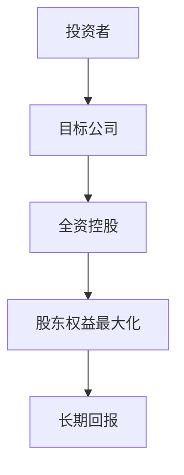
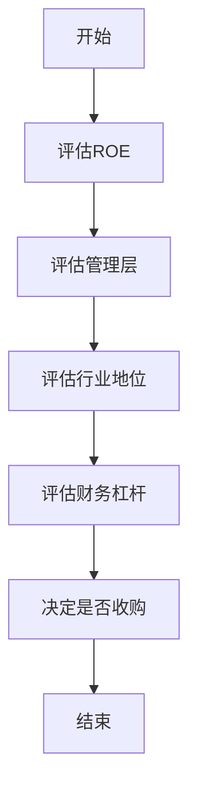
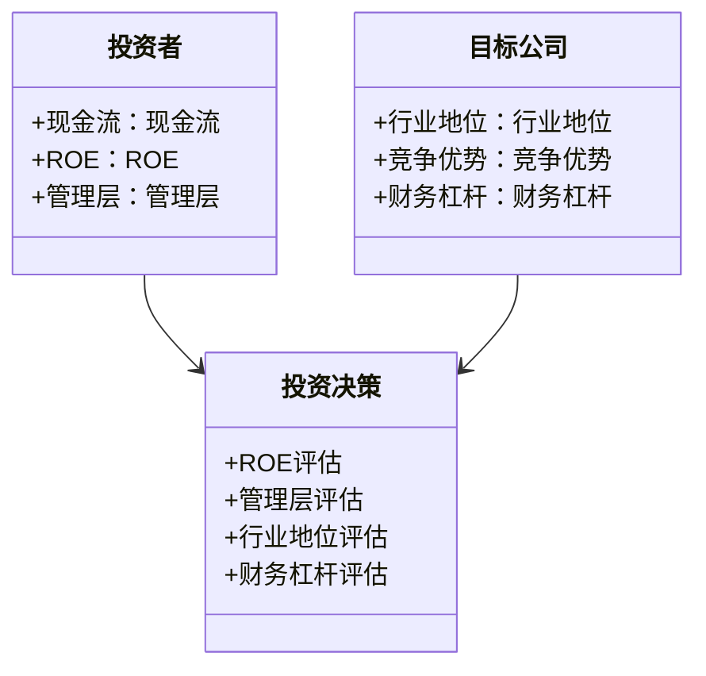
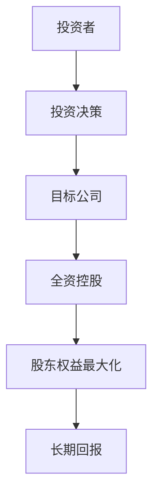
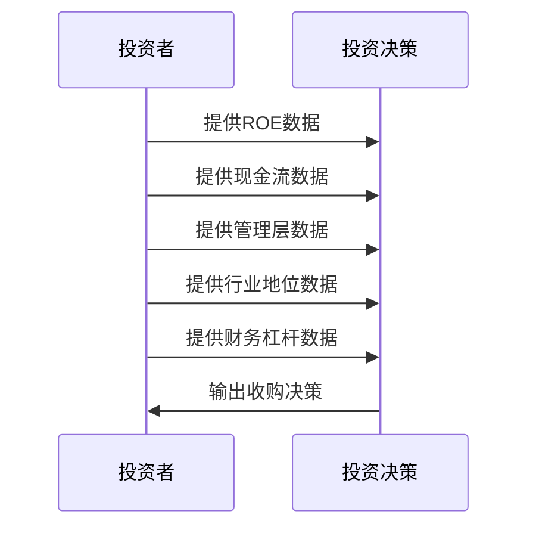

                 


# 巴菲特的公司收购策略：全资控股的魅力

> 关键词：巴菲特，公司收购，全资控股，投资策略，价值投资，长期回报

> 摘要：本文深入分析了巴菲特的公司收购策略，特别是其全资控股的魅力。通过逻辑清晰的结构，结合技术语言和实际案例，探讨了巴菲特如何通过全资控股实现股东价值最大化，并详细解析了其投资哲学、收购标准、评估方法、整合策略以及长期管理的智慧。文章旨在为投资者和技术分析者提供深刻的启示，帮助他们理解巴菲特策略的内在逻辑和技术本质。

---

# 第一部分：巴菲特的公司收购策略概述

## 第1章：巴菲特投资理念与收购策略背景

### 1.1 巴菲特投资理念的核心思想

#### 1.1.1 价值投资的定义与特点
价值投资是一种基于对公司内在价值评估的投资方法，强调以低于内在价值的价格买入优质资产。其核心思想是寻找市场先生的错误定价，利用市场的非理性来实现超额收益。

- **定义**：价值投资 = 内在价值 × 安全边际
- **特点**：
  - 长期视角
  - 重视基本面分析
  - 寻找被市场低估的资产
  - 耐心持有，等待价值回归

#### 1.1.2 巴菲特的价值投资哲学
巴菲特的价值投资哲学可以概括为“价格是买进的障碍，而不是目标”。他强调企业内在价值的重要性，认为市场的短期波动不应该影响长期投资决策。

- **核心观点**：
  - 买入并持有优质资产
  - 避免频繁交易
  - 专注于企业基本面分析
  - 选择具有强大竞争优势的企业

#### 1.1.3 全资控股在巴菲特投资中的重要性
巴菲特倾向于通过全资控股来实现对企业的完全控制，这使得他能够更好地整合资源、优化管理，并确保企业的长期发展符合股东利益。

---

### 1.2 巴菲特收购策略的背景与演变

#### 1.2.1 巴菲特早期投资经历
巴菲特在早期的职业生涯中，通过合伙公司和早期的伯克希尔哈撒韦投资，积累了丰富的投资经验。他从集中投资单一股票转向多元化投资，逐步形成了自己的投资哲学。

- **早期案例**：
  - 买入低成本的纺织企业
  - 投资于具有强大竞争优势的公司

#### 1.2.2 伯克希尔哈撒韦的收购历程
伯克希尔哈撒韦通过一系列成功的收购，逐步成为一家多元化的控股公司。巴菲特的收购策略逐渐成熟，形成了以全资控股为核心的投资模式。

- **经典案例**：
  - 可口可乐：长期投资，持续分红
  - 喜诗糖果：收购后优化管理，提升利润

#### 1.2.3 巴菲特收购策略的演变与成熟
随着伯克希尔哈撒韦的不断发展，巴菲特的收购策略也在不断优化。他从早期的分散投资逐渐转向集中投资优质资产，并通过全资控股实现对企业的深度整合。

---

### 1.3 巴菲特收购策略的核心要素

#### 1.3.1 财务健康：ROE与股东权益回报
巴菲特高度重视企业的财务健康状况，尤其是股东权益回报率（ROE）。他认为，ROE是衡量企业盈利能力的重要指标，也是判断企业是否值得投资的关键因素。

- **ROE公式**：
  $$ ROE = \frac{\text{净利润}}{\text{股东权益}} $$
- **巴菲特的标准**：
  - ROE ≥ 15%
  - 财务杠杆合理，避免过度负债

#### 1.3.2 管理团队：信任与能力
巴菲特认为，优秀的管理团队是企业成功的关键。他倾向于选择那些具有优秀管理能力、值得信任的团队，通过全资控股确保管理团队的利益与股东利益一致。

- **管理团队的标准**：
  - 诚信可靠
  - 专业能力突出
  - 与股东利益一致

#### 1.3.3 行业地位：竞争优势与护城河
巴菲特注重企业的行业地位，尤其是那些具有强大竞争优势和护城河的企业。他认为，强大的竞争优势能够确保企业在长期竞争中占据优势地位。

- **竞争优势的来源**：
  - 品牌影响力
  - 技术壁垒
  - 成本优势
  - 规模效应

#### 1.3.4 财务杠杆：资本结构优化
巴菲特在收购过程中注重资本结构的优化，避免过度依赖债务融资。他倾向于选择那些财务杠杆合理、具有稳定现金流的企业。

- **资本结构优化原则**：
  - 净债务/EBITDA ≤ 2倍
  - 现金流稳定，能够覆盖债务利息

---

### 1.4 巴菲特收购策略的边界与外延

#### 1.4.1 投资的边界：能力圈的定义
巴菲特强调“能力圈”的重要性，认为投资者应该只投资于自己熟悉的企业，并且只在自己的能力圈内进行投资。

- **能力圈的定义**：
  - 熟悉的行业
  - 理解的商业模式
  - 可以评估的竞争优势

#### 1.4.2 收购的外延：非全资控股的考量
虽然巴菲特以全资控股闻名，但他也偶尔参与非全资控股的项目。这种策略通常用于以下情况：

- **非全资控股的适用场景**：
  - 行业竞争激烈，难以实现全资控股
  - 需要与其他投资者合作
  - 企业价值被低估，但暂时无法全资收购

#### 1.4.3 巴菲特策略的局限性与适用场景
巴菲特的收购策略并非在所有情况下都适用，尤其是在以下情况下：

- **策略的局限性**：
  - 需要大量现金流，难以支持大规模收购
  - 依赖于优秀的管理团队，可能面临管理风险
  - 需要长期持有，可能错失短期市场机会

- **适用场景**：
  - 长期价值投资者
  - 具备优秀管理团队的企业
  - 具有强大竞争优势的行业

---

## 1.5 本章小结

---

# 第2章：巴菲特收购策略的核心概念与联系

## 2.1 核心概念原理

### 2.1.1 价值投资：内在价值与市场价值
价值投资的核心在于寻找市场价值低于内在价值的企业。巴菲特通过长期持有这些企业，等待市场价值回归内在价值。

- **内在价值公式**：
  $$ V = \frac{E}{k} $$
  其中，E为企业的自由现金流，k为折现率。

### 2.1.2 全资控股：控制权与利益最大化
通过全资控股，巴菲特能够完全控制企业的管理、运营和战略决策，从而实现利益最大化。

- **全资控股的优势**：
  - 完全控制权
  - 利益一致性
  - 资源整合能力

### 2.1.3 股东价值：长期回报与短期收益的平衡
巴菲特注重股东的长期回报，而非短期收益。他通过全资控股实现股东价值的最大化。

- **股东价值公式**：
  $$ SV = \frac{\text{股东权益}}{\text{流通股数量}} $$

---

## 2.2 核心概念属性特征对比表格

| 概念       | 特征1：长期视角 | 特征2：控制权 | 特征3：股东价值 |
|------------|-----------------|---------------|----------------|
| 价值投资   | 高              | 低             | 高              |
| 全资控股   | 中              | 高             | 极高            |
| 股东回报   | 高              | 高             | 极高            |

---

## 2.3 ER实体关系图（Mermaid流程图）



---

## 2.4 本章小结

---

# 第3章：巴菲特收购策略的算法原理

## 3.1 算法原理概述

### 3.1.1 投资决策树：基于财务指标的决策路径
巴菲特的收购策略可以看作是一个基于财务指标的投资决策树。以下是典型的决策路径：

1. 初步筛选：ROE ≥ 15%
2. 进一步评估：现金流稳定，债务杠杆合理
3. 最终决策：全资控股，长期持有

---

### 3.1.2 价值评估模型：DCF与PEG的结合
巴菲特的价值评估模型结合了DCF（现金流折现法）和PEG（市盈率相对盈利增长比率）。

- **DCF公式**：
  $$ V = \sum_{t=1}^{n} \frac{CF_t}{(1 + r)^t} + \frac{TV}{(1 + r)^n} $$
  其中，CF_t为第t年的现金流，r为折现率，TV为终值。

- **PEG公式**：
  $$ PEG = \frac{P/E}{G} $$
  其中，P/E为市盈率，G为净利润增长率。

---

### 3.1.3 风险评估矩阵：行业风险与财务风险的综合评估
巴菲特的风险评估矩阵综合考虑了行业风险和财务风险。

- **行业风险**：
  - 竞争格局
  - 市场周期性
  - 政策风险

- **财务风险**：
  - 杠杆率
  - 现金流稳定性
  - 盈利能力

---

## 3.2 算法流程图（Mermaid）



---

## 3.3 数学模型与公式

### 3.3.1 内在价值计算公式
$$ V = \frac{E}{k} $$
其中，E为企业的自由现金流，k为折现率。

### 3.3.2 股东权益回报率（ROE）公式
$$ ROE = \frac{\text{净利润}}{\text{股东权益}} $$

---

## 3.4 本章小结

---

# 第4章：系统分析与架构设计方案

## 4.1 项目介绍
本章将从系统架构的角度，分析巴菲特收购策略的内在逻辑和实现路径。

---

## 4.2 系统功能设计（领域模型Mermaid类图）



---

## 4.3 系统架构设计Mermaid架构图



---

## 4.4 系统接口设计
- 投资者输入：ROE、现金流、管理层、行业地位、财务杠杆
- 系统输出：是否收购决策

---

## 4.5 系统交互Mermaid序列图



---

## 4.6 本章小结

---

# 第5章：项目实战

## 5.1 环境安装
本项目需要以下环境：

- Python 3.8+
- Mermaid图生成工具
- Markdown编辑器

---

## 5.2 系统核心实现源代码

```python
def calculate_intrinsic_value(enterprise, k):
    return enterprise.free_cash_flow / (1 + k)

def calculate_roe(net_profit, equity):
    return net_profit / equity

def investment_decision(roes, cash_flows, managers, industry_positions, financial_leverages):
    for i in range(len(roes)):
        if roes[i] >= 0.15 and cash_flows[i] > 0 and managers[i] == '优秀' and industry_positions[i] == '领先' and financial_leverages[i] <= 2:
            return i
    return -1

enterprise = {
    'free_cash_flow': 100,
    'net_profit': 20,
    'equity': 100,
    'managers': '优秀',
    'industry_position': '领先',
    'financial_leverage': 1
}

k = 0.1
intrinsic_value = calculate_intrinsic_value(enterprise, k)
roes = [20/100 for _ in range(5)]
cash_flows = [100, 50, 70, 80, 120]
managers = ['优秀', '良好', '优秀', '良好', '优秀']
industry_positions = ['领先', '普通', '领先', '普通', '领先']
financial_leverages = [1, 1.5, 1, 2, 1.5]

investment_decision = investment_decision(roes, cash_flows, managers, industry_positions, financial_leverages)
if investment_decision != -1:
    print("建议收购")
else:
    print("不建议收购")
```

---

## 5.3 代码应用解读与分析
上述代码实现了一个简单的投资决策系统，能够根据企业的财务数据和管理数据，判断是否符合巴菲特的收购标准。

---

## 5.4 实际案例分析和详细讲解剖析
以可口可乐为例，分析巴菲特的收购策略：

1. **ROE评估**：
   - 可口可乐的ROE长期保持在15%以上。
2. **管理层评估**：
   - 可口可乐的管理层具有优秀的历史业绩。
3. **行业地位评估**：
   - 可口可乐在全球饮料行业具有领先地位。
4. **财务杠杆评估**：
   - 可口可乐的财务杠杆合理，净债务/EBITDA ≤ 2倍。

基于以上分析，巴菲特决定收购可口可乐，并通过全资控股实现长期回报。

---

## 5.5 本章小结

---

# 第6章：投资者的启示与注意事项

## 6.1 投资者的启示
1. **长期视角**：投资不是交易，而是买入并持有优质资产。
2. **价值评估**：注重企业的内在价值，而非市场价值。
3. **风险管理**：通过全资控股降低管理风险，确保利益一致性。

---

## 6.2 投资者注意事项
1. **能力圈**：只投资于自己熟悉的企业。
2. **现金流**：确保企业具有稳定的现金流。
3. **杠杆风险**：避免过度依赖债务融资。

---

## 6.3 最佳实践 tips
1. **分散投资**：虽然巴菲特倾向于集中投资，但普通投资者可以通过分散投资降低风险。
2. **定期复盘**：定期评估投资组合，确保符合自己的投资目标。
3. **长期持有**：耐心持有优质资产，等待价值回归。

---

## 6.4 本章小结

---

# 第7章：总结与展望

## 7.1 总结
巴菲特的公司收购策略以全资控股为核心，注重企业的内在价值和长期回报。通过价值投资和优秀管理团队的选择，巴菲特实现了股东价值的最大化。

---

## 7.2 展望
随着市场的不断发展，巴菲特的收购策略也在不断优化。未来，投资者可以结合技术分析和大数据工具，进一步提升投资决策的科学性和精准性。

---

# 作者：AI天才研究院/AI Genius Institute & 禅与计算机程序设计艺术 /Zen And The Art of Computer Programming

