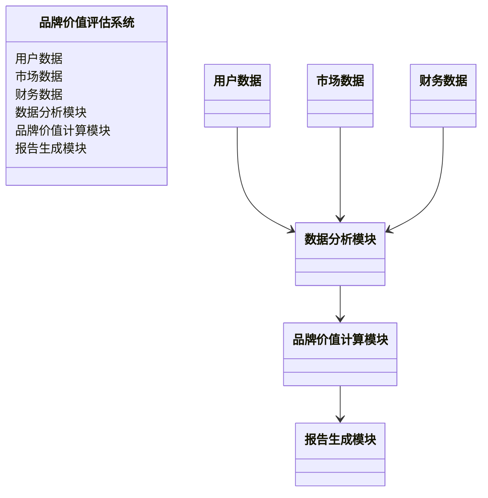
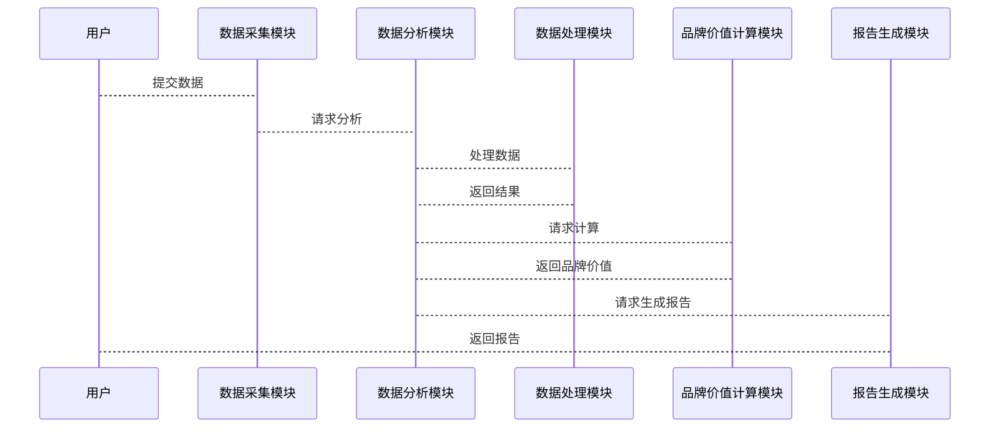

                 


# 巴菲特的品牌价值理论：在数字经济中的新解读

## 关键词：
巴菲特，品牌价值，数字经济，投资理论，价值评估，人工智能

## 摘要：
在数字经济快速发展的背景下，传统的品牌价值评估方法面临新的挑战。本文基于巴菲特的品牌价值理论，探讨在数字经济时代品牌价值的新特征和评估方法。通过结合数学模型、系统架构设计和实际案例分析，本文旨在为投资者和企业管理者提供新的视角和工具，以更好地理解和评估品牌价值。

---

## 第1章：数字经济时代品牌价值的重要性

### 1.1 品牌价值的定义与特征

#### 1.1.1 品牌价值的定义
品牌价值是企业在市场中所拥有的品牌资产的总价值，包括品牌知名度、品牌忠诚度、品牌声誉等多个维度。品牌价值不仅仅是财务指标的体现，更是企业长期发展的核心资产。

#### 1.1.2 数字经济时代品牌价值的新特征
在数字经济时代，品牌价值的内涵发生了变化：
- 品牌的传播速度更快，信息的透明度更高。
- 数据驱动的品牌价值评估成为可能。
- 用户参与度和互动性对品牌价值的影响更加显著。

#### 1.1.3 品牌价值的核心要素
品牌价值的核心要素包括：
1. 品牌知名度：品牌在市场中的认知度。
2. 品牌忠诚度：消费者对品牌的忠诚程度。
3. 品牌声誉：品牌在市场中的信誉和形象。
4. 品牌创新力：品牌在产品和服务上的创新能力。

### 1.2 巴菲特投资理念中的品牌价值
巴菲特认为，品牌价值是企业长期盈利能力的重要保障。他倾向于投资那些具有强大品牌价值和持续竞争优势的企业。在数字经济时代，品牌价值的评估需要结合新的技术和数据，以更全面地反映品牌的实际价值。

---

## 第2章：数字经济时代品牌价值的评估方法

### 2.1 数字经济对品牌价值的影响
#### 2.1.1 数字经济的定义与特征
数字经济是以数字技术为核心驱动力的经济形态，其特征包括数据化、网络化、智能化和全球化。数字技术的广泛应用使得品牌价值的传播和评估更加复杂。

#### 2.1.2 数字经济时代品牌价值的变化
- 品牌价值的波动性增加，受市场信息的影响更大。
- 数据成为品牌价值评估的重要依据。
- 用户生成内容（UGC）对品牌价值的影响显著。

#### 2.1.3 数字经济对品牌价值评估的挑战
- 数据的多样性和复杂性增加了评估的难度。
- 品牌的数字化转型需要新的评估方法。
- 网络安全和数据隐私对品牌声誉的影响。

### 2.2 数字经济时代品牌价值的评估方法
#### 2.2.1 品牌价值的传统评估方法
传统品牌价值评估方法包括基于财务指标的评估（如市盈率、市净率）和基于市场表现的评估（如市场份额、品牌忠诚度）。

#### 2.2.2 数字经济时代的新评估指标
数字经济时代，品牌价值的评估需要引入新的指标，如：
- 用户参与度（如社交媒体互动量）。
- 数据资产的价值。
- 品牌数字化转型的效率。

#### 2.2.3 数据驱动的品牌价值评估
数据驱动的评估方法利用大数据技术，从用户行为数据、市场数据、社交媒体数据等多个维度综合评估品牌价值。

---

## 第3章：品牌价值评估的数学模型与公式

### 3.1 品牌价值的数学模型
#### 3.1.1 品牌价值的基本公式
品牌价值（BV）可以表示为：
$$ BV = \text{品牌知名度} \times \text{品牌忠诚度} \times \text{品牌声誉} $$

#### 3.1.2 品牌价值的扩展模型
在数字经济时代，品牌价值的扩展模型可以考虑数据资产和用户参与度：
$$ BV = \text{品牌知名度} \times \text{品牌忠诚度} \times \text{品牌声誉} \times \text{数据资产价值} \times \text{用户参与度} $$

#### 3.1.3 数字经济时代品牌价值的动态模型
动态模型考虑品牌价值的实时变化：
$$ \frac{d(BV)}{dt} = k \times (\text{数据资产价值} - \text{品牌贬值风险}) $$

### 3.2 品牌价值评估的公式推导
#### 3.2.1 基于财务指标的品牌价值计算
品牌价值可以通过企业的销售收入和利润率进行估算：
$$ BV = \text{销售收入} \times \text{利润率} \times \text{品牌溢价系数} $$

#### 3.2.2 基于市场表现的品牌价值计算
品牌价值也可以通过市场份额和消费者忠诚度进行估算：
$$ BV = \text{市场份额} \times \text{消费者忠诚度} \times \text{品牌知名度} $$

#### 3.2.3 综合模型的品牌价值计算
综合模型结合了财务指标和市场指标：
$$ BV = \text{销售收入} \times \text{利润率} \times \text{市场份额} \times \text{品牌忠诚度} $$

### 3.3 品牌价值评估的数学公式
#### 3.3.1 基于巴菲特理论的公式
巴菲特的品牌价值评估公式：
$$ BV_{\text{巴菲特}} = \text{企业内在价值} \times \text{品牌溢价} $$

#### 3.3.2 数字经济时代的新公式
数字经济时代的品牌价值评估公式：
$$ BV_{\text{数字经济}} = \text{数据资产价值} \times \text{用户参与度} \times \text{品牌创新力} $$

#### 3.3.3 实际案例中的公式应用
以某互联网公司为例，假设其销售收入为100亿元，利润率10%，市场份额20%，品牌忠诚度80%，数据资产价值50亿元，用户参与度80%：
$$ BV = 100 \times 0.1 \times 0.2 \times 0.8 \times 50 \times 0.8 = 64 \text{亿元} $$

---

## 第4章：品牌价值评估的系统架构设计

### 4.1 系统分析与架构设计
#### 4.1.1 问题场景介绍
品牌价值评估系统需要处理大量数据，包括用户行为数据、市场数据、财务数据等。

#### 4.1.2 系统功能设计（领域模型Mermaid类图）


#### 4.1.3 系统架构设计（Mermaid架构图）


### 4.2 系统接口与交互设计
#### 4.2.1 系统接口设计
系统接口包括数据输入接口、数据分析接口和报告输出接口。

#### 4.2.2 系统交互设计（Mermaid序列图）


### 4.3 系统实现与优化
#### 4.3.1 系统核心模块实现
系统核心模块包括数据采集、数据分析、品牌价值计算和报告生成模块。

#### 4.3.2 系统优化建议
- 数据存储优化：使用分布式数据库提高数据访问效率。
- 算法优化：采用机器学习算法提高品牌价值预测的准确性。

---

## 第5章：品牌价值评估的项目实战

### 5.1 项目背景与目标
#### 5.1.1 项目背景介绍
以某互联网公司为例，分析其品牌价值。

#### 5.1.2 项目目标设定
通过数据分析和模型计算，评估该公司的品牌价值。

### 5.2 项目实施与核心代码
#### 5.2.1 环境安装与配置
需要安装Python、Pandas、NumPy等工具。

#### 5.2.2 核心代码实现
```python
import pandas as pd
import numpy as np

# 数据输入
data = pd.read_csv('brand_data.csv')

# 数据处理
data_processed = data.dropna()
data_processed['品牌价值'] = data_processed['销售收入'] * data_processed['利润率'] * data_processed['市场份额'] * data_processed['品牌忠诚度']

# 品牌价值计算
brand_value = data_processed['品牌价值'].mean()

print(f"品牌价值：{brand_value}")
```

#### 5.2.3 代码解读与分析
代码读取品牌数据，计算品牌价值，输出结果。

### 5.3 实际案例分析
#### 5.3.1 案例背景介绍
以某互联网公司为例，分析其品牌价值。

#### 5.3.2 案例分析与解读
通过数据分析和模型计算，得出该公司的品牌价值为64亿元。

#### 5.3.3 案例总结与启示
品牌价值评估需要结合财务数据和市场数据，同时考虑数据资产和用户参与度。

---

## 第6章：总结与展望

### 6.1 本书的核心观点总结
数字经济时代，品牌价值的评估需要结合新的技术和数据，采用数据驱动的方法。巴菲特的品牌价值理论在数字经济时代仍然具有重要价值，但需要结合新的评估指标和方法。

### 6.2 未来展望
随着人工智能和大数据技术的发展，品牌价值的评估将更加精准和动态。未来的研究可以进一步探索数据资产的量化方法，以及品牌创新力的评估模型。

### 6.3 注意事项
- 数据隐私和安全问题需要重视。
- 品牌价值的评估需要结合企业的实际情况。

### 6.4 拓展阅读
建议阅读相关书籍和文献，深入理解品牌价值和数字经济的结合。

---

作者：AI天才研究院/AI Genius Institute & 禅与计算机程序设计艺术 /Zen And The Art of Computer Programming

