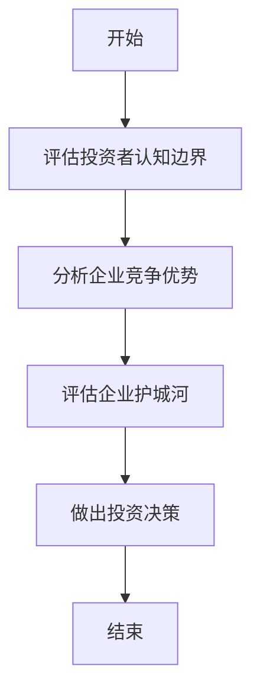
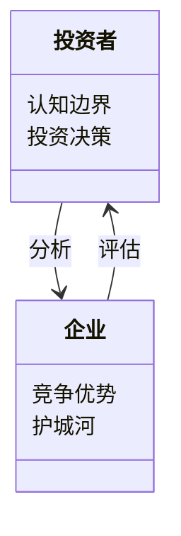

                 


# 巴菲特的圈子理论：投资你懂的行业

## 关键词：
巴菲特，投资理论，价值投资，护城河，企业分析，投资决策

## 摘要：
本文详细探讨了巴菲特的圈子理论，解释了如何通过投资自己熟悉和理解的行业来实现长期价值增长。文章从背景介绍、核心概念、算法原理、系统分析到项目实战，逐步解析了巴菲特投资理念的精髓，帮助读者理解如何通过分析企业的竞争优势和护城河来做出明智的投资决策。

---

## 第一部分：背景介绍

### 1.1 巴菲特投资理念概述

#### 1.1.1 巴菲特的生平与投资风格
沃伦·巴菲特（Warren Buffett）是全球著名的价值投资者，以其长期稳定的投资收益闻名。他出生于1930年，早年通过股票投资和合伙企业积累了大量财富，后来创立了伯克希尔哈撒韦公司（Berkshire Hathaway），并将其打造成一个多元化的投资帝国。

巴菲特的投资风格以长期价值投资为核心，他注重企业基本面分析，寻找具有持续竞争优势和合理估值的企业进行投资。他的投资理念强调安全性、确定性和长期性，反对短期投机。

#### 1.1.2 巴菲特投资理念的核心思想
巴菲特的价值投资理念可以用一句话概括：**“价格是你支付的，价值是你得到的。”** 他强调买入具有持续竞争优势的企业，并以合理的价格买入，长期持有，等待企业价值的自然增长。

#### 1.1.3 圈子理论的背景
巴菲特在其投资实践中提出了一种独特的理论——“圈子理论”（Circle Theory）。这一理论的核心思想是，投资者应该将投资范围限制在自己熟悉和理解的领域内。通过专注于自己熟悉的行业和企业，投资者可以更好地评估企业的内在价值，降低投资风险，提高投资成功的概率。

### 1.2 圈子理论的定义与核心要素

#### 1.2.1 圈子理论的基本定义
巴菲特的圈子理论是指投资者在选择投资标的时，应优先考虑自己熟悉和理解的企业。这种选择不仅基于企业的基本面，还基于投资者对行业和企业的深刻理解。通过集中投资于自己熟悉的领域，投资者可以更好地把握企业的竞争优势和潜在风险。

#### 1.2.2 圈子理论的核心要素分析
圈子理论的核心要素包括以下几点：
1. **投资者的认知边界**：投资者对某些行业或企业的深入了解，使其能够在这些领域中做出明智的投资决策。
2. **企业竞争优势**：企业必须具有某种独特的竞争优势，如成本优势、品牌优势、技术优势等。
3. **企业护城河**：企业必须具备某种“护城河”，即竞争对手难以复制的核心竞争力，确保企业在长期竞争中保持优势。

#### 1.2.3 圈子理论与投资决策的关系
圈子理论通过限制投资范围，帮助投资者专注于自己熟悉和理解的领域，从而提高投资决策的准确性和成功率。通过深入分析企业的竞争优势和护城河，投资者可以更好地评估企业的长期价值，并做出明智的投资决策。

### 1.3 圈子理论的背景与应用范围

#### 1.3.1 圈子理论的适用场景
圈子理论适用于所有类型的投资，尤其是长期价值投资。对于个人投资者和机构投资者而言，通过专注于自己熟悉和理解的行业，可以降低投资风险，提高投资回报率。

#### 1.3.2 圈子理论的边界与外延
圈子理论的边界在于投资者的认知能力和对行业的理解深度。投资者需要不断扩展自己的知识边界，以覆盖更多的行业和领域。同时，圈子理论的外延也包括对企业的深入分析，如财务状况、管理团队、市场地位等。

#### 1.3.3 圈子理论与其他投资理论的对比
与传统的技术分析和短期投机不同，圈子理论强调长期价值和企业基本面分析。与基本面分析相比，圈子理论更注重投资者对企业的理解和信任，通过深入分析企业的竞争优势和护城河，帮助投资者做出更明智的投资决策。

---

## 第二部分：核心概念与联系

### 2.1 核心概念原理

#### 2.1.1 投资者的认知边界
投资者的认知边界是指投资者对某些行业或企业的深入了解和理解。认知边界越广，投资者在这些领域中做出明智投资决策的能力就越强。认知边界的核心在于投资者对行业和企业的深刻理解，以及对企业竞争优势和护城河的识别能力。

#### 2.1.2 企业竞争优势
企业竞争优势是指企业在市场上相对于竞争对手的独特优势。这些优势可以是成本优势、品牌优势、技术优势、管理优势等。竞争优势是企业长期盈利能力的重要保障。

#### 2.1.3 企业护城河
企业护城河是指企业能够长期保持竞争优势的核心竞争力。护城河可以是技术专利、品牌忠诚度、成本优势、网络效应等。企业护城河的存在可以有效防止竞争对手的侵蚀，确保企业在长期竞争中保持优势。

### 2.2 核心概念属性特征对比

| 核心概念 | 定义 | 特征 | 重要性 |
|----------|------|------|--------|
| 认知边界 | 投资者对行业的理解和熟悉程度 | 深度、广度、准确性 | 决定投资者的投资能力 |
| 竞争优势 | 企业在市场上的独特优势 | 成本、品牌、技术 | 决定企业的盈利能力 |
| 护城河 | 企业长期保持竞争优势的能力 | 技术、品牌、网络效应 | 决定企业的长期生存能力 |

### 2.3 ER实体关系图架构

```mermaid
erd
    投资者
    企业
    认知边界
    竞争优势
    护城河
    投资决策

    投资者 --> 认知边界
    认知边界 --> 企业
    企业 --> 竞争优势
    企业 --> 护城河
    投资决策 --> 企业
```

---

## 第三部分：算法原理

### 3.1 算法原理概述

#### 3.1.1 投资者认知边界评估
认知边界评估是通过投资者对行业的理解和熟悉程度来确定其投资能力。评估方法包括：
1. 投资者的行业知识储备
2. 投资者的投资经验
3. 投资者对行业趋势的把握能力

#### 3.1.2 企业竞争优势分析
竞争优势分析是通过对企业在市场上的独特优势进行分析，评估其盈利能力。分析方法包括：
1. 成本优势分析
2. 品牌优势分析
3. 技术优势分析

#### 3.1.3 企业护城河评分
护城河评分是通过对企业长期保持竞争优势的能力进行评估，确定其投资价值。评分方法包括：
1. 技术专利评分
2. 品牌忠诚度评分
3. 网络效应评分

### 3.2 算法流程图



### 3.3 算法数学模型

#### 投资者认知边界评估公式：
$$ \text{认知边界} = \frac{\text{已知信息量}}{\text{潜在信息量}} $$

#### 企业竞争优势分析公式：
$$ \text{竞争优势} = \text{市场份额} \times \text{利润率} $$

#### 企业护城河评分公式：
$$ \text{护城河评分} = \sum_{i=1}^{n} (\text{竞争优势}_i \times \text{稳定性}_i) $$

---

## 第四部分：系统分析与架构设计

### 4.1 问题场景介绍

#### 投资者如何通过圈子理论做出投资决策
投资者需要通过分析企业的竞争优势和护城河，评估其投资价值，并做出投资决策。

#### 企业如何构建竞争优势和护城河
企业需要通过技术研发、品牌建设、成本控制等方式，构建竞争优势和护城河，确保长期盈利能力。

### 4.2 系统功能设计

#### 领域模型设计



---

## 第五部分：项目实战

### 5.1 环境安装

#### 安装Python和必要的库
需要安装Python 3.6及以上版本，并安装pandas、numpy、matplotlib等库。

#### 系统核心实现源代码

```python
import pandas as pd
import numpy as np
import matplotlib.pyplot as plt

# 数据加载
df = pd.read_csv('企业数据.csv')

# 计算竞争优势指数
df['竞争优势指数'] = df['市场份额'] * df['利润率']

# 计算护城河评分
df['护城河评分'] = df.apply(lambda x: sum([x['竞争优势指数'] * x['稳定性']]), axis=1)

# 可视化
plt.figure(figsize=(10,6))
plt.plot(df['企业名称'], df['护城河评分'], 'b-')
plt.title('护城河评分分布')
plt.xlabel('企业名称')
plt.ylabel('护城河评分')
plt.show()
```

### 5.2 代码应用解读与分析

#### 代码功能概述
该代码通过读取企业数据，计算企业的竞争优势指数和护城河评分，并绘制护城河评分分布图。

#### 代码实现细节
1. 数据加载：读取企业数据，包括市场份额、利润率、稳定性等指标。
2. 竞争优势指数计算：通过市场份额和利润率的乘积计算竞争优势指数。
3. 护城河评分计算：通过竞争优势指数和稳定性的乘积求和计算护城河评分。
4. 数据可视化：绘制护城河评分分布图，直观展示企业的护城河评分。

### 5.3 实际案例分析

#### 案例背景
假设我们有以下企业数据：

| 企业名称 | 市场份额 | 利润率 | 稳定性 |
|----------|----------|--------|--------|
| 企业A    | 0.3      | 0.2    | 0.8    |
| 企业B    | 0.5      | 0.3    | 0.6    |
| 企业C    | 0.4      | 0.25   | 0.7    |

#### 分析过程
1. 计算竞争优势指数：
   - 企业A：0.3 × 0.2 = 0.06
   - 企业B：0.5 × 0.3 = 0.15
   - 企业C：0.4 × 0.25 = 0.10
2. 计算护城河评分：
   - 企业A：0.06 × 0.8 = 0.048
   - 企业B：0.15 × 0.6 = 0.09
   - 企业C：0.10 × 0.7 = 0.07

#### 投资决策
根据护城河评分，企业B的护城河评分为0.09，高于企业A和企业C，因此企业B具有更强的竞争优势和护城河，值得投资。

### 5.4 项目小结
通过实际案例分析，我们可以看到，巴菲特的圈子理论在实际投资决策中的应用非常有效。通过计算企业的竞争优势指数和护城河评分，可以帮助投资者更好地评估企业的投资价值。

---

## 第六部分：最佳实践

### 6.1 小结
巴菲特的圈子理论强调投资自己熟悉和理解的行业，通过分析企业的竞争优势和护城河，做出明智的投资决策。投资者应不断扩展自己的知识边界，深入分析企业的基本面，确保投资决策的准确性和长期性。

### 6.2 注意事项
1. **避免盲目跟风**：投资者应避免盲目跟随市场潮流，而是应基于对企业基本面的深入分析做出投资决策。
2. **注重长期价值**：投资应注重企业的长期价值，而不是短期的价格波动。
3. **定期评估和调整**：投资者应定期评估投资组合的表现，根据市场变化和企业基本面的变动进行必要的调整。

### 6.3 拓展阅读
1. **《巴菲特传》**：了解巴菲特的投资理念和人生经历。
2. **《价值投资入门》**：学习价值投资的基本原理和方法。
3. **《投资最重要的少数法则》**：深入理解巴菲特的投资策略和原则。

---

## 结语

巴菲特的圈子理论为投资者提供了一种科学的投资方法，通过专注于自己熟悉和理解的行业，深入分析企业的竞争优势和护城河，做出明智的投资决策。希望本文能够帮助读者更好地理解巴菲特的圈子理论，并将其应用于实际投资中，实现长期稳定的财富增长。

---

## 作者信息

作者：AI天才研究院/AI Genius Institute & 禅与计算机程序设计艺术/Zen And The Art of Computer Programming

