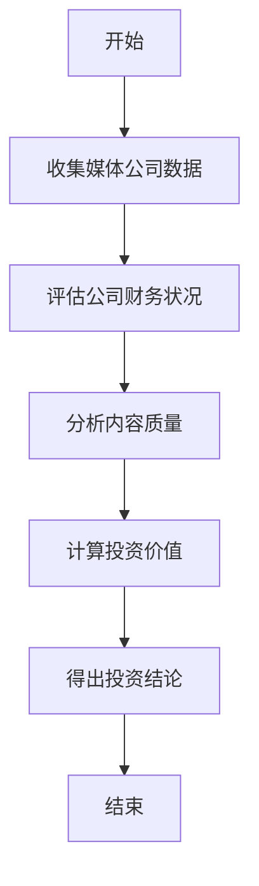
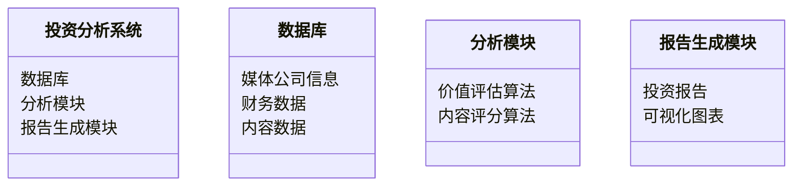
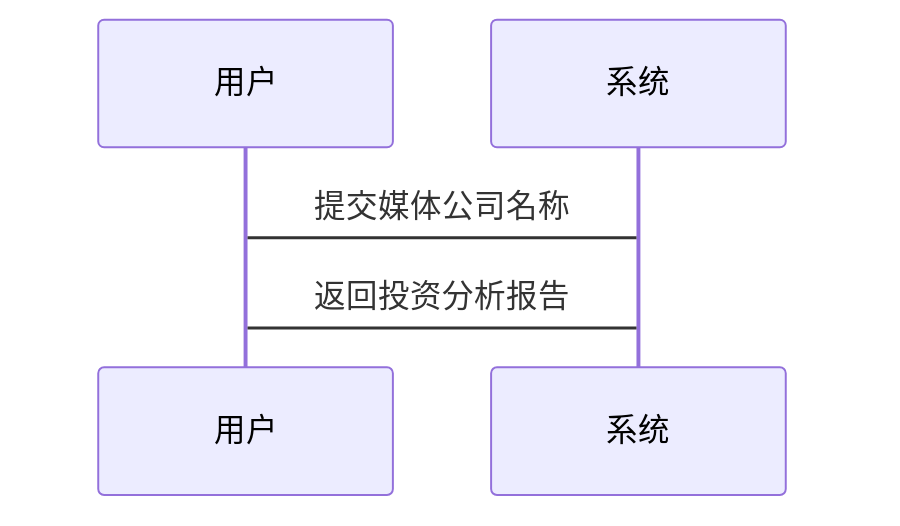

                 


# 巴菲特的媒体行业投资：内容为王的时代

## 关键词：巴菲特、媒体行业、内容为王、价值投资、护城河、投资策略

## 摘要：本文深入分析了巴菲特在媒体行业的投资理念，重点探讨了“内容为王”时代的核心要素、价值评估模型、系统架构设计以及实战案例。通过技术视角，我们详细解析了巴菲特的投资策略，并结合算法与系统设计，展示了如何在媒体行业中实现长期价值投资。

---

## 第一部分：背景介绍

### 第1章：巴菲特投资理念概述

#### 1.1 价值投资的核心思想

- **价值投资的定义**：价值投资是一种以低于内在价值的价格购买优质资产的投资策略，强调长期持有和对企业基本面的深入分析。
- **巴菲特的成功案例**：通过投资可口可乐、富国银行等企业，巴菲特展示了价值投资的强大威力。
- **媒体行业的特殊性**：媒体行业具有高波动性和高回报率的特点，内容质量是核心竞争力。

#### 1.2 媒体行业的数字化转型

- **媒体行业的定义与分类**：包括传统媒体（如报纸、电视）和新媒体（如流媒体、社交媒体）。
- **内容为王时代的特征**：优质内容是吸引用户的关键，内容生产与传播效率成为竞争优势。
- **数字化对媒体行业的影响**：技术进步改变了内容生产、分发和消费方式，推动媒体行业向数据驱动型转变。

---

## 第二部分：内容为王的核心概念

### 第2章：媒体行业的核心要素

#### 2.1 内容生产与传播的流程

- **内容生产**：包括创意生成、制作、审核等环节。
- **内容传播**：通过多种渠道（如社交媒体、流媒体平台）进行分发。
- **用户需求与内容价值**：用户需求驱动内容生产，优质内容创造更高价值。

#### 2.2 用户需求与内容价值的关系

- **用户需求的层次**：从信息获取到娱乐需求，用户需求多样化。
- **内容价值的评估**：通过用户参与度、点击率等指标衡量内容价值。
- **内容质量与用户满意度的关系**：高质量内容能提高用户满意度和忠诚度。

#### 2.3 媒体平台的商业模式

- **广告模式**：通过广告收入获取收益。
- **订阅模式**：通过订阅服务获取稳定收入。
- **混合模式**：结合广告和订阅的混合商业模式。

### 第3章：巴菲特投资理念与内容为王的结合

#### 3.1 价值投资与内容价值的评估

- **价值投资的核心：企业基本面分析**：巴菲特注重企业的财务状况、盈利能力和发展潜力。
- **内容质量与企业价值的关系**：优质内容是企业核心竞争力，决定长期价值。
- **内容为王时代的企业护城河**：优质内容、用户粘性和品牌影响力是企业的护城河。

#### 3.2 媒体行业中的护城河分析

- **护城河的定义**：巴菲特提出的“护城河”是指企业长期竞争优势的来源。
- **内容行业的护城河要素**：优质内容、品牌影响力、用户粘性和技术优势。
- **护城河的评估方法**：通过市场份额、用户增长率和利润率等指标评估护城河的强度。

#### 3.3 内容质量与企业长期价值的关系

- **内容质量对企业价值的影响**：优质内容提升企业盈利能力和社会影响力。
- **内容创新对企业发展的推动作用**：创新内容吸引用户，推动企业持续发展。
- **内容为王时代的投资策略**：选择具有强大内容生产能力的企业进行投资。

---

## 第三部分：媒体行业投资的数学模型与算法

### 第4章：媒体行业投资的数学模型

#### 4.1 价值评估的公式

$$ 价值 = \frac{未来现金流的现值}{折现率} $$

- **未来现金流的计算**：预测企业未来几年的现金流。
- **折现率的确定**：根据市场利率和企业风险确定折现率。
- **价值评估的步骤**：收集数据、预测现金流、计算现值、确定折现率、计算最终价值。

#### 4.2 内容质量的评分系统

$$ 内容质量评分 = \sum_{i=1}^{n} (权重_i \times 评分_i) $$

- **权重的确定**：根据内容类型（如新闻、娱乐）赋予不同权重。
- **评分的指标**：包括用户满意度、点击率、完播率等。
- **评分系统的应用**：用于企业内容质量评估和投资决策。

### 第5章：算法流程图



---

## 第四部分：系统架构设计

### 第6章：投资分析系统架构

#### 6.1 系统功能设计

- **数据收集模块**：收集媒体公司的财务数据、内容数据和市场数据。
- **分析模块**：包括价值评估算法和内容质量评分算法。
- **报告生成模块**：生成投资报告和可视化图表。

#### 6.2 系统架构图



#### 6.3 系统接口设计



---

## 第五部分：项目实战与案例分析

### 第7章：项目实战

#### 7.1 环境安装与数据准备

- **环境安装**：安装Python、数据分析库（如Pandas、NumPy）和可视化工具（如Matplotlib）。
- **数据来源**：从公开数据库获取媒体公司数据。
- **数据清洗**：处理缺失值和异常值。

#### 7.2 核心代码实现

```python
def calculate_intrinsic_value(company_data):
    cash_flows = company_data['cash_flows']
    discount_rate = company_data['discount_rate']
    present_value = sum(cash_flows[i] / (1 + discount_rate) ** i for i in range(len(cash_flows)))
    return present_value / (1 - (1 + discount_rate) ** (-len(cash_flows)))

def content_quality_score(company_data):
    weights = company_data['weights']
    scores = company_data['scores']
    total_score = sum(weights[i] * scores[i] for i in range(len(weights)))
    return total_score
```

#### 7.3 实际案例分析

- **案例一：奈飞（Netflix）**
  - 公司概况：流媒体巨头，订阅模式主导。
  - 投资价值评估：高用户增长率和优质内容库是其核心竞争力。
  - 投资建议：长期持有，关注内容扩展和订阅用户增长。

- **案例二：迪士尼（Disney）**
  - 公司概况：传统媒体与流媒体双线布局，内容丰富。
  - 投资价值评估：强大的品牌影响力和多元化的收入来源。
  - 投资建议：关注Disney+的用户增长和内容创新能力。

---

## 第六部分：总结与展望

### 第8章：总结与展望

#### 8.1 投资总结

- **巴菲特投资理念的启示**：坚持价值投资，注重企业基本面和长期竞争优势。
- **内容为王时代的投资策略**：选择具有优质内容和强大护城河的企业。
- **技术驱动的投资分析**：利用数据分析和算法优化投资决策。

#### 8.2 未来展望

- **技术进步对投资的影响**：人工智能和大数据技术将进一步提升投资分析的精准度。
- **媒体行业的未来趋势**：内容生产智能化、分发渠道多元化和用户需求个性化。
- **投资策略的演变**：从被动投资向主动投资转变，注重企业创新能力和技术优势。

---

## 作者：AI天才研究院/AI Genius Institute & 禅与计算机程序设计艺术 /Zen And The Art of Computer Programming

