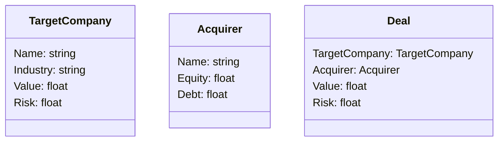

                 


# 巴菲特的并购策略：在跨境并购中的新考量

> 关键词：巴菲特，并购策略，跨境并购，风险管理，价值评估，股东利益

> 摘要：本文深入探讨了巴菲特并购策略的核心理念，并重点分析了其在跨境并购中的新考量。文章从背景介绍、核心概念、算法原理、系统分析、项目实战等多方面展开，结合实际案例和数学模型，详细阐述了巴菲特并购策略在跨境并购中的应用与挑战。

---

## 第1章: 巴菲特并购策略的核心理念

### 1.1 巴菲特投资哲学的演变

#### 1.1.1 从合伙企业到个人投资的转变
巴菲特的投资哲学起源于他在合伙企业时期的实践。他通过分析企业的基本面，寻找具有持续竞争优势和良好管理团队的企业进行投资。这种投资理念强调长期价值，而非短期市场波动。

#### 1.1.2 巴菲特价值投资的核心原则
巴菲特的价值投资原则包括：
1. **安全边际**：买入价格低于企业内在价值。
2. **长期思维**：关注企业的长期盈利能力，而非短期股价波动。
3. **竞争优势**：投资具有持续竞争优势的企业。

#### 1.1.3 并购策略与长期投资的结合
巴菲特的并购策略强调对目标企业的深入了解和控制权的获取。他倾向于收购具有稳定现金流和强大管理团队的企业，并通过并购实现资产的优化配置。

### 1.2 巴菲特并购策略的特点

#### 1.2.1 企业价值评估的核心方法
巴菲特使用多种方法评估企业价值，包括：
- **DCF模型**：通过现金流折现计算企业价值。
- **相对估值法**：比较市盈率、市净率等指标。

#### 1.2.2 股东利益最大化的原则
巴菲特始终将股东利益放在首位，通过并购实现股东价值的最大化。他注重企业的长期盈利能力，避免短期投机行为。

#### 1.2.3 风险控制与安全边际的重要性
巴菲特强调风险控制，通过安全边际（即买入价格低于内在价值）来降低投资风险。他在并购中注重企业的财务健康状况和行业前景。

---

## 第2章: 跨境并购的背景与挑战

### 2.1 跨境并购的定义与现状

#### 2.1.1 跨境并购的定义
跨境并购是指一家企业收购另一家不同国家的企业。这种并购方式可以帮助企业快速进入新市场，扩大业务规模。

#### 2.1.2 全球化背景下跨境并购的兴起
随着经济全球化的发展，企业通过跨境并购实现国际化扩张已成为趋势。近年来，跨国并购交易量持续增长，涉及的行业广泛。

#### 2.1.3 跨境并购的主要驱动因素
1. **市场扩张**：进入新市场，扩大销售规模。
2. **资源整合**：获取技术、品牌或生产能力。
3. **成本优势**：通过并购降低生产成本。

### 2.2 跨境并购的主要挑战

#### 2.2.1 跨国法律与监管环境的差异
不同国家的法律法规差异可能导致并购过程中的复杂性。例如，反垄断法、税收政策和劳动法的差异可能影响并购决策。

#### 2.2.2 文化差异与管理整合的难题
文化差异可能导致管理整合困难。例如，不同国家的管理风格和员工期望可能不一致，影响并购后的协同效应。

#### 2.2.3 财务风险与汇率波动的影响
汇率波动可能导致并购后的财务损失。此外，目标企业的财务状况和当地经济环境可能影响并购的财务可行性。

### 2.3 巴菲特并购策略在跨境并购中的新考量

#### 2.3.1 价值评估的复杂性
在跨境并购中，企业需要考虑目标企业的财务状况、市场环境和法律风险。这些因素可能影响企业的内在价值评估。

#### 2.3.2 股东利益与全球化的平衡
在全球化背景下，巴菲特需要在并购中平衡股东利益和企业全球化战略。他需要确保并购活动符合长期投资目标。

#### 2.3.3 跨境并购中的风险管理
在跨境并购中，风险管理尤为重要。巴菲特需要考虑政治风险、汇率风险和市场风险，并制定相应的风险管理策略。

---

## 第3章: 巴菲特并购策略中的关键模型

### 3.1 股东权益收益率（ROE）模型

#### 3.1.1 ROE的定义与计算公式
ROE（Return on Equity）是衡量企业盈利能力的重要指标，公式为：
$$ROE = \frac{净利润}{股东权益}$$

#### 3.1.2 ROE在并购决策中的应用
巴菲特在并购中使用ROE模型评估目标企业的盈利能力。如果目标企业的ROE高于行业平均水平，说明其具有较高的投资价值。

#### 3.1.3 ROE与企业价值的关系
ROE高的企业通常具有较高的企业价值。然而，ROE并非越高越好，需要结合企业的财务杠杆和行业特点进行综合分析。

### 3.2 内部收益率（IRR）模型

#### 3.2.1 IRR的定义与计算公式
IRR（Internal Rate of Return）是衡量投资项目收益能力的指标，公式为：
$$IRR = r \text{ 满足 } \sum_{t=1}^{n} \frac{CF_t}{(1 + r)^t} = 0$$

#### 3.2.2 IRR在并购项目评估中的应用
巴菲特使用IRR模型评估并购项目的收益能力。如果项目的IRR高于资本成本，说明其具有较高的投资价值。

#### 3.2.3 IRR与净现值（NPV）的对比分析
IRR和NPV都是常用的项目评估指标。NPV更适用于规模较大的项目，而IRR更适用于小型项目。两者结合使用可以更好地评估项目的价值。

### 3.3 股票估值模型

#### 3.3.1 现金流折现模型（DCF）
DCF模型通过折现未来现金流计算企业价值。公式为：
$$\text{企业价值} = \sum_{t=1}^{n} \frac{\text{现金流}_t}{(1 + r)^t}$$

#### 3.3.2 市盈率与市净率分析
市盈率（P/E）和市净率（P/B）是常用的估值指标。巴菲特通常关注企业的市盈率和市净率是否合理。

#### 3.3.3 股票内在价值的计算方法
股票内在价值是企业未来现金流的现值。巴菲特通过DCF模型计算股票的内在价值，并与市场价格进行比较。

---

## 第4章: 并购风险评估与控制

### 4.1 并购风险的主要类型

#### 4.1.1 市场风险
市场风险指并购后市场环境变化对企业价值的影响。例如，经济衰退可能导致企业盈利下降。

#### 4.1.2 财务风险
财务风险指并购后的财务状况可能恶化。例如，高负债率可能导致企业财务危机。

#### 4.1.3 管理风险
管理风险指并购后的管理整合可能失败。例如，文化差异可能导致管理团队的冲突。

### 4.2 并购风险的量化分析

#### 4.2.1 风险评估模型的构建
巴菲特使用概率加权模型评估并购风险。公式为：
$$\text{风险价值} = \sum_{i=1}^{n} P_i \times V_i$$

#### 4.2.2 风险概率与影响
风险概率指风险发生的可能性，风险影响指风险对企业价值的影响程度。巴菲特通过概率加权模型量化并购风险。

---

## 第5章: 算法原理

### 5.1 巴菲特并购策略的算法模型

#### 5.1.1 DCF模型的实现
使用Python代码实现DCF模型，计算企业价值。

```python
def calculate_enterprise_value(FCF, WACC, horizon):
    TV = FCF * (1 + WACC)**-horizon
    TV += FCF * (1 + WACC)**-(horizon + 1)
    return TV / WACC
```

#### 5.1.2 ROE与IRR的对比分析
通过代码比较ROE和IRR在并购决策中的应用。

---

## 第6章: 系统分析与架构设计

### 6.1 系统功能设计

#### 6.1.1 领域模型（mermaid类图）


### 6.2 系统架构设计（mermaid架构图）


---

## 第7章: 项目实战

### 7.1 环境安装

#### 7.1.1 安装Python和相关库
安装Python和Pandas、Matplotlib等库，用于数据处理和可视化。

### 7.2 系统核心实现源代码

#### 7.2.1 DCF模型实现
```python
import pandas as pd
import numpy as np

def calculateenterprisevalue(FCF, WACC, horizon):
    TV = 0
    for t in range(1, horizon + 1):
        TV += FCF * (1 + WACC)**-t
    TV += FCF * (1 + WACC)**-(horizon + 1)
    TV /= WACC
    return TV

FCF = [100, 120, 140]
WACC = 0.1
horizon = 3
EV = calculateenterprisevalue(FCF, WACC, horizon)
print(EV)
```

#### 7.2.2 ROE与IRR的对比分析
```python
import numpy as np

def calculate_ROE(net_profit, equity):
    return net_profit / equity

def calculate_IRR(cash_flows):
    return np.irr(cash_flows)

net_profit = 50
equity = 200
ROE = calculate_ROE(net_profit, equity)
print("ROE:", ROE)

cash_flows = [-100, 200, 200]
IRR = calculate_IRR(cash_flows)
print("IRR:", IRR)
```

### 7.3 代码应用解读与分析
通过代码实现DCF模型和ROE、IRR模型，分析目标企业的价值和投资回报。

### 7.4 实际案例分析
以某跨国并购案例为例，分析巴菲特并购策略在跨境并购中的应用。

---

## 第8章: 最佳实践、小结、注意事项和拓展阅读

### 8.1 最佳实践

#### 8.1.1 并购前的尽职调查
在跨境并购中，尽职调查尤为重要。企业需要全面评估目标企业的财务状况、法律风险和管理团队。

#### 8.1.2 风险管理与控制
通过制定风险管理策略，降低并购后的财务和运营风险。

### 8.2 小结
本文系统分析了巴菲特并购策略的核心理念，并重点探讨了其在跨境并购中的新考量。通过数学模型和实际案例，详细阐述了并购决策中的关键问题。

### 8.3 注意事项

#### 8.3.1 财务风险控制
在跨境并购中，企业需要注重财务风险控制，避免因汇率波动和财务杠杆过高导致的财务危机。

#### 8.3.2 文化整合与管理协调
并购后的文化整合和管理协调是实现协同效应的关键。企业需要制定有效的整合策略，确保管理团队的顺利合作。

### 8.4 拓展阅读

#### 8.4.1 推荐书籍
1. 《巴菲特传》
2. 《并购的艺术》

#### 8.4.2 相关研究
1. 全球并购趋势分析
2. 数字经济下的跨境并购策略

---

## 作者：AI天才研究院 & 禅与计算机程序设计艺术

通过本文的分析，读者可以深入了解巴菲特并购策略的核心思想，并掌握其在跨境并购中的应用技巧。

