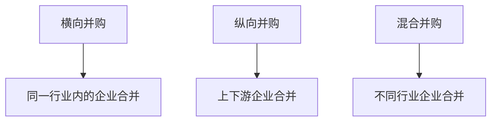

                 

# 巴菲特的并购艺术：在全球化背景下的新策略

> 关键词：巴菲特，并购策略，价值投资，全球化，竞争优势

> 摘要：本文深入分析了巴菲特的并购艺术，探讨了其在全球化背景下的新策略。文章从巴菲特的并购哲学、分析方法、经典案例到全球化对并购策略的影响进行了系统性阐述，结合实际案例和数学模型，为读者提供了全面的视角。

---

# 第一部分: 巴菲特的并购艺术基础

## 第1章: 巴菲特并购策略概述

### 1.1 巴菲特并购的核心理念

#### 1.1.1 投资哲学与并购策略
巴菲特的投资哲学以“价值投资”为核心，强调寻找具有持续竞争优势的企业，并在合理估值下进行投资。并购是其投资策略的重要组成部分，他倾向于收购那些具有强大护城河（竞争优势）的企业。

**表格：巴菲特的核心投资哲学对比**

| 投资理念         | 描述                                                                 |
|------------------|----------------------------------------------------------------------|
| 价值投资         | 寻找被市场低估的企业，长期持有，等待价值回归。                     |
| 并购策略         | 收购具有强大竞争优势、管理优秀、财务健康的公司，实现价值增长。     |

#### 1.1.2 股东价值最大化原则
巴菲特认为，企业的终极目标是为股东创造最大价值。并购过程中，他注重企业的长期盈利能力，而非短期股价波动。

#### 1.1.3 安全边际概念
安全边际是巴菲特并购策略中的重要原则。他倾向于以低于企业内在价值的价格进行并购，以降低风险并确保长期收益。

### 1.2 并购的基本概念与分类

#### 1.2.1 并购的定义与类型
并购（Mergers and Acquisitions, M&A）是指一家企业与其他企业合并或收购其资产、股权的过程。并购可以分为横向并购、纵向并购和混合并购。

**图1.1 并购类型分类图**

#### 1.2.2 并购的驱动因素与动机
企业进行并购的动机包括市场扩展、资源获取、技术整合、成本协同等。

---

## 第2章: 巴菲特并购的内在驱动力

### 2.1 巴菲特的选股标准

#### 2.1.1 公司竞争优势分析
竞争优势是巴菲特选股的核心。他寻找那些具有强大护城河（如品牌、技术、成本优势）的企业。

**表格：竞争优势分析维度**

| 维度         | 描述                                                                 |
|--------------|----------------------------------------------------------------------|
| 品牌         | 强大的品牌影响力，如可口可乐。                                         |
| 技术         | 具有独特技术或专利的企业。                                             |
| 成本优势     | 拥有成本优势，如规模经济。                                             |

#### 2.1.2 财务健康状况评估
巴菲特注重企业的财务健康，包括低债务、稳定的现金流、合理的利润率等。

#### 2.1.3 管理层质量与企业治理
优秀的管理层和良好的企业治理是巴菲特选股的重要标准。他倾向于投资那些管理透明、管理层具备长期愿景的企业。

### 2.2 并购中的价值评估方法

#### 2.2.1 现金流折现法

现金流折现法是巴菲特常用的一种估值方法，通过预测企业未来现金流并将其折现为现值来评估企业价值。

**公式：**

$$
\text{企业价值} = \sum_{t=1}^{n} \frac{\text{现金流}_t}{(1 + r)^t}
$$

其中，\( r \) 是折现率。

#### 2.2.2 市盈率与市净率分析

市盈率（P/E）和市净率（P/B）是常用的估值指标。

**公式：**

$$
\text{市盈率} = \frac{\text{股价}}{\text{每股收益}}
$$

$$
\text{市净率} = \frac{\text{股价}}{\text{每股净资产}}
$$

#### 2.2.3 股权价值评估模型

股权价值评估模型包括DCF模型、相对估值模型等。

### 2.3 巴菲特并购决策的逻辑

#### 2.3.1 从烟蒂投资到蓝筹并购
巴菲特早期的投资风格是寻找被市场低估的“烟蒂”企业，后期逐渐转向投资具有强大竞争优势的蓝筹企业。

#### 2.3.2 长期投资与价值回归理论
巴菲特相信市场短期可能疯狂，但长期会回归理性，企业的真实价值终将反映在股价中。

#### 2.3.3 并购中的风险控制
巴菲特注重企业的财务健康和管理质量，避免高风险的并购。

---

## 第3章: 巴菲特并购策略的全球化扩展

### 3.1 全球化背景下的并购新策略

#### 3.1.1 经济全球化与跨国并购
经济全球化促进了跨国并购的发展，企业通过并购实现全球布局。

#### 3.1.2 新兴市场与跨国并购机会
新兴市场的发展为企业提供了新的并购机会，尤其是科技、消费等领域。

#### 3.1.3 全球化并购中的文化与法律挑战
跨文化整合和法律差异是全球化并购中的主要挑战。

### 3.2 巴菲特并购策略的全球应用

#### 3.2.1 跨国并购中的价值评估
在全球化背景下，巴菲特的估值方法需要考虑汇率、政治风险等因素。

#### 3.2.2 全球化视角下的竞争优势分析
竞争优势的分析需要考虑全球市场的竞争格局。

#### 3.2.3 跨国并购中的风险管理
全球化并购中的风险管理包括汇率风险、法律风险等。

---

## 第4章: 巴菲特并购策略的创新与调整

### 4.1 全球化背景下并购策略的调整

#### 4.1.1 并购目标选择的变化
在全球化背景下，巴菲特倾向于选择那些具有全球竞争优势的企业。

#### 4.1.2 并购支付方式的创新
并购支付方式包括现金支付、股票支付等，需要根据具体情况选择。

#### 4.1.3 并购后的整合与管理
并购后的整合包括战略、组织、文化等多方面的整合。

### 4.2 巴菲特并购策略的未来趋势

#### 4.2.1 数字化与科技驱动的并购
科技企业的并购成为趋势，尤其是人工智能、大数据等领域。

#### 4.2.2 可持续发展与ESG因素
ESG（环境、社会、治理）因素在并购中的重要性日益增加。

#### 4.2.3 全球经济波动下的并购机会
全球经济波动可能带来新的并购机会，尤其是行业整合。

---

## 第5章: 巴菲特并购策略的实战分析

### 5.1 可口可乐并购案

#### 5.1.1 并购背景与动机
可口可乐的并购案例展示了巴菲特对品牌和竞争优势的重视。

#### 5.1.2 价值评估与决策过程
通过现金流折现法和市盈率分析，巴菲特评估了可口可乐的长期价值。

#### 5.1.3 并购后的整合与管理
并购后，可口可乐进一步扩大了市场，提升了全球竞争力。

### 5.2 吉列公司并购案

#### 5.2.1 并购前的市场分析
吉列公司是一家具有强大竞争优势的消费品企业。

#### 5.2.2 并购中的估值与支付方式
巴菲特通过相对估值法确定了吉列的合理价格，并选择股票支付方式。

#### 5.2.3 并购后的协同效应
并购后，吉列与可口可乐的协同效应提升了整体竞争力。

---

## 第6章: 巴菲特并购策略的全球化应用与挑战

### 6.1 全球化并购中的竞争优势

#### 6.1.1 全球市场中的品牌优势
强大的品牌在全球市场中具有竞争优势。

#### 6.1.2 全球化布局与成本优势
全球化布局可以帮助企业降低生产成本，提高效率。

### 6.2 全球化并购中的风险管理

#### 6.2.1 汇率风险
汇率波动对跨国并购的影响。

#### 6.2.2 法律与文化风险
不同国家的法律和文化差异对并购的影响。

### 6.3 巴菲特并购策略的全球扩展

#### 6.3.1 全球化视角下的投资机会
新兴市场和科技领域的投资机会。

#### 6.3.2 全球化并购中的长期价值创造
通过全球化并购实现长期价值增长。

---

## 第7章: 巴菲特并购策略的未来展望

### 7.1 全球经济环境的变化

#### 7.1.1 经济全球化的新趋势
经济全球化可能面临新的挑战和机遇。

#### 7.1.2 科技革命对企业并购的影响
科技革命推动了新的并购趋势。

### 7.2 巴菲特并购策略的演变

#### 7.2.1 数字化与智能化并购
人工智能和大数据在并购中的应用。

#### 7.2.2 可持续发展与ESG因素
可持续发展和ESG因素在并购中的重要性。

### 7.3 巴菲特并购策略的长期价值

#### 7.3.1 长期投资与价值回归
巴菲特的长期投资策略在并购中的应用。

#### 7.3.2 全球化背景下的价值创造
通过全球化并购实现长期价值增长。

---

## 第8章: 巴菲特并购策略的最佳实践

### 8.1 并购前的准备工作

#### 8.1.1 市场分析与竞争分析
全面的市场和竞争分析是并购的前提。

#### 8.1.2 财务分析与估值
准确的财务分析和估值是并购的关键。

### 8.2 并购过程中的风险管理

#### 8.2.1 风险评估与控制
全面评估并购中的各种风险并制定控制措施。

#### 8.2.2 并购后的整合管理
制定有效的整合计划，确保并购后的协同效应。

### 8.3 并购后的监控与优化

#### 8.3.1 并购后的企业管理
优化企业治理和管理结构。

#### 8.3.2 并购后的绩效评估
定期评估并购绩效，调整策略。

---

## 第9章: 巴菲特并购策略的总结与启示

### 9.1 巴菲特并购策略的核心总结

#### 9.1.1 价值投资与长期视角
巴菲

