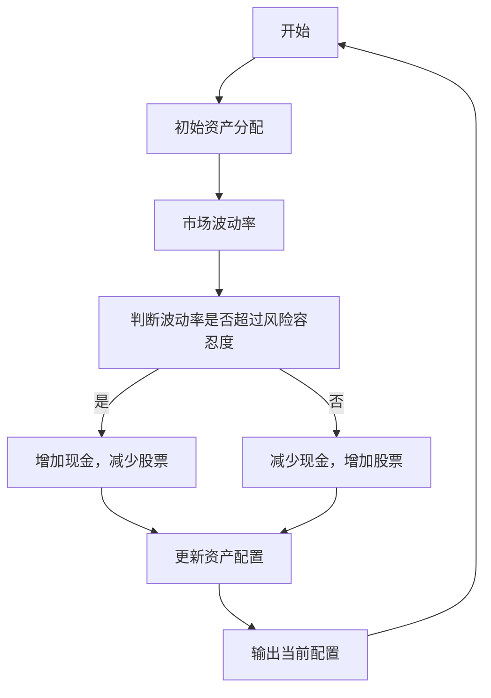
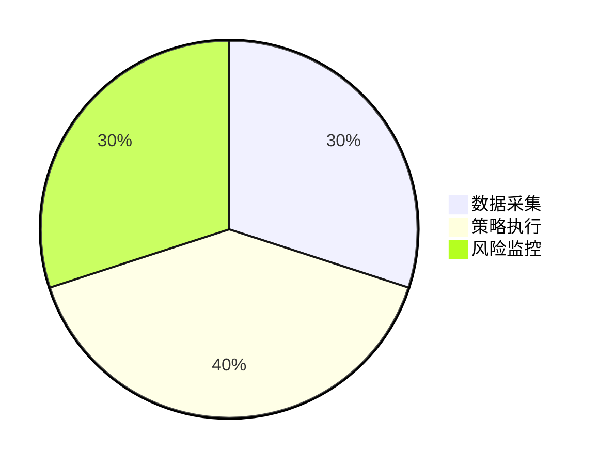

                 


# 巴菲特的杠铃策略：现金+股票的平衡

> 关键词：杠铃策略，巴菲特，资产配置，风险管理，投资组合优化

> 摘要：本文深入探讨了巴菲特的杠铃策略，分析了现金和股票在投资组合中的平衡配置，以及如何在波动的市场环境中优化资产配置和风险管理。通过系统的分析和实战案例，为投资者提供科学的投资策略参考。

---

## 第1章：背景介绍

### 1.1 巴菲特的杠铃策略概述

巴菲特的杠铃策略是一种经典的资产配置策略，强调在现金和股票之间保持平衡。这种策略通过在市场波动时持有部分现金和优质股票，以应对不确定性，同时在市场上涨时捕捉收益。

### 1.2 资产配置的重要性

资产配置是投资组合成功的关键，杠铃策略通过平衡现金和股票，降低整体风险，同时捕捉市场上涨的机会。

### 1.3 现金与股票的特征对比

| 特性 | 现金 | 股票 |
|------|------|------|
| 流动性 | 高 | 中 |
| 风险 | 低 | 高 |
| 收益 | 稳定 | 波动 |

### 1.4 巴菲特杠铃策略的核心思想

- 现金作为缓冲，股票作为收益来源。
- 动态调整资产配置比例，应对市场变化。

---

## 第2章：杠铃策略的核心概念

### 2.1 现金管理策略

现金管理注重流动性、安全性和收益性，确保在市场低迷时有足够的资金应对。

### 2.2 股票投资策略

选择优质股票，长期持有，注重价值投资和风险管理。

### 2.3 现金与股票的平衡机制

通过动态再平衡，维持资产配置比例，应对市场波动。

---

## 第3章：杠铃策略的算法原理

### 3.1 算法流程

1. 确定初始资产分配比例。
2. 定期评估市场环境。
3. 动态调整现金和股票比例。

### 3.2 算法实现步骤

- **步骤1**：设定初始分配比例。
- **步骤2**：定期评估市场指标。
- **步骤3**：根据评估结果调整比例。

### 3.3 算法实现的Python代码

```python
def balance_strategy(initial_cash, initial_stock, risk_tolerance):
    cash = initial_cash
    stock = initial_stock
    while True:
        market_volatility = get_market_volatility()
        if market_volatility > risk_tolerance:
            adjustment = max(0, (risk_tolerance - market_volatility) * 0.1)
            cash += adjustment
            stock -= adjustment
        else:
            adjustment = max(0, (market_volatility - risk_tolerance) * 0.1)
            cash -= adjustment
            stock += adjustment
        print(f"Cash: {cash}, Stock: {stock}")
        time.sleep(360)  # 每月评估一次
```

### 3.4 算法流程图



---

## 第4章：数学模型与公式

### 4.1 资产配置模型

$$ \text{现金比例} = 50\% + 20\% \times \text{市场波动率} $$

$$ \text{股票比例} = 50\% - 20\% \times \text{市场波动率} $$

### 4.2 风险管理公式

$$ \text{风险敞口} = \text{股票资产} \times \text{波动率} $$

### 4.3 投资组合收益公式

$$ \text{总收益} = \text{现金收益} + \text{股票收益} $$

---

## 第5章：系统架构设计

### 5.1 系统功能设计

- 数据采集模块：收集市场数据。
- 策略执行模块：根据杠铃策略调整资产。
- 风险监控模块：实时监控风险指标。

### 5.2 系统架构图



---

## 第6章：项目实战

### 6.1 环境安装

- 安装Python和必要的库，如pandas、numpy、matplotlib。

### 6.2 核心代码实现

```python
import pandas as pd
import numpy as np

def get_market_volatility():
    # 示例：获取市场波动率
    return np.random.normal(0.1, 0.05)

initial_cash = 50000
initial_stock = 50000
risk_tolerance = 0.15

# 模拟运行
for _ in range(12):
    volatility = get_market_volatility()
    if volatility > risk_tolerance:
        adjustment = (risk_tolerance - volatility) * 0.1
        new_cash = initial_cash + adjustment
        new_stock = initial_stock - adjustment
    else:
        adjustment = (volatility - risk_tolerance) * 0.1
        new_cash = initial_cash - adjustment
        new_stock = initial_stock + adjustment
    print(f"市场波动率: {volatility:.2f}%")
    print(f"调整后：现金 {new_cash:.2f}，股票 {new_stock:.2f}")
    initial_cash, initial_stock = new_cash, new_stock
```

### 6.3 案例分析

模拟运行一年，显示每月的调整情况，观察资产配置的变化。

---

## 第7章：小结与展望

### 7.1 总结

杠铃策略通过现金和股票的平衡配置，有效管理风险，捕捉收益。动态调整机制使策略适应市场变化。

### 7.2 展望

未来，随着市场环境的变化，杠铃策略需要结合更多因素，如通胀、政策等，进行优化。

---

## 参考文献

1. 巴菲特《巴菲特致股东的信》
2. 《投资学原理》

---

**作者：AI天才研究院 & 禅与计算机程序设计艺术**

