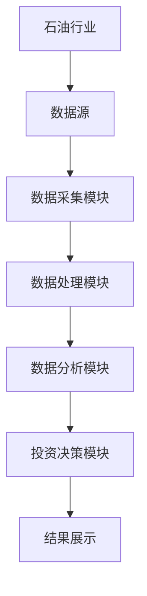

                 


# 巴菲特的石油行业投资逻辑：必需品的魅力

> 关键词：巴菲特，石油行业，投资逻辑，价值投资，必需品魅力

> 摘要：本文深入分析了巴菲特在石油行业的投资逻辑，探讨了石油作为必需品的独特魅力。通过系统分析和架构设计，结合实际案例，展示了如何将巴菲特的投资理念与现代技术相结合，实现长期稳定的收益。

---

## 目录

# {{此处是文章标题}}

## 关键词

## 摘要

---

## 第一部分: 巴菲特投资理念与石油行业的结合

## 第1章: 巴菲特投资理念的核心思想

### 1.1 价值投资的基本原则

- 1.1.1 价值投资的定义
- 1.1.2 价值投资的核心要素：安全边际
- 1.1.3 价值投资的长期视角

### 1.2 巴菲特对石油行业的独特见解

- 1.2.1 石油行业的战略地位
- 1.2.2 石油作为必需品的独特性
- 1.2.3 巴菲特对石油行业的长期看好

### 1.3 石油行业的特点与投资机会

- 1.3.1 石油行业的周期性与波动性
- 1.3.2 石油行业的供需格局
- 1.3.3 石油行业的政策环境

## 第2章: 巴菲特投资逻辑的背景分析

### 2.1 石油行业的供需分析

- 2.1.1 全球石油供需格局
- 2.1.2 石油价格的影响因素
- 2.1.3 石油行业的替代品分析

### 2.2 石油行业的政策与技术环境

- 2.2.1 石油行业的政策风险
- 2.2.2 石油行业的技术创新
- 2.2.3 石油行业的可持续发展

### 2.3 巴菲特投资逻辑的形成过程

- 2.3.1 巴菲特的投资哲学
- 2.3.2 巴菲特的石油投资案例
- 2.3.3 巴菲特对石油行业的长期判断

---

## 第二部分: 石油行业的系统分析与架构设计

## 第3章: 石油行业的系统架构

### 3.1 石油行业的整体架构

- 3.1.1 石油行业的核心模块
- 3.1.2 石油行业的数据流分析
- 3.1.3 石油行业的系统边界

### 3.2 石油行业的系统功能设计

- 3.2.1 数据采集与处理模块
- 3.2.2 数据分析与建模模块
- 3.2.3 投资决策支持模块

### 3.3 石油行业的系统架构图



## 第4章: 石油行业的算法原理

### 4.1 石油行业的核心算法

- 4.1.1 时间序列分析模型
- 4.1.2 价格预测算法
- 4.1.3 风险评估模型

### 4.2 算法实现

```python
import pandas as pd
import numpy as np
from sklearn.metrics import mean_squared_error
import matplotlib.pyplot as plt

# 示例代码：石油价格预测模型
def oil_price_prediction(data):
    # 数据预处理
    data['price_diff'] = data['price'].diff()
    # 时间序列模型
    model = ARIMA(data['price'], order=(1,1,0))
    model_fit = model.fit(disp=-1)
    # 预测
    forecast = model_fit.forecast(steps=10)
    return forecast

# 数据可视化
data.plot()
plt.show()
```

---

## 第三部分: 巴菲特投资逻辑的实战应用

## 第5章: 石油行业投资实战

### 5.1 环境安装与数据准备

- 5.1.1 环境配置
- 5.1.2 数据来源
- 5.1.3 数据清洗

### 5.2 核心代码实现

```python
# 示例代码：石油企业财务分析
def calculate_intrinsic_value(financial_data):
    # 计算内在价值
    gdp_growth = financial_data['gdp_growth']
    roe = financial_data['roe']
    book_value = financial_data['book_value']
    # 内在价值公式
    intrinsic_value = (book_value * (1 + gdp_growth / 100)) * roe
    return intrinsic_value

# 应用示例
data = {
    'gdp_growth': 3,
    'roe': 15,
    'book_value': 100
}
print(calculate_intrinsic_value(data))
```

### 5.3 案例分析与解读

- 5.3.1 案例背景
- 5.3.2 数据分析
- 5.3.3 投资决策

---

## 第四部分: 总结与展望

## 第6章: 总结与投资建议

### 6.1 巴菲特投资逻辑的核心要点

- 6.1.1 价值投资的长期性
- 6.1.2 石油行业的必需品属性
- 6.1.3 投资中的风险管理

### 6.2 对投资者的建议

- 6.2.1 长期投资的重要性
- 6.2.2 石油行业的配置策略
- 6.2.3 风险管理的必要性

### 6.3 未来展望

- 6.3.1 可再生能源的挑战
- 6.3.2 石油行业的转型
- 6.3.3 投资逻辑的演变

---

## 作者

作者：AI天才研究院/AI Genius Institute & 禅与计算机程序设计艺术/Zen And The Art of Computer Programming

