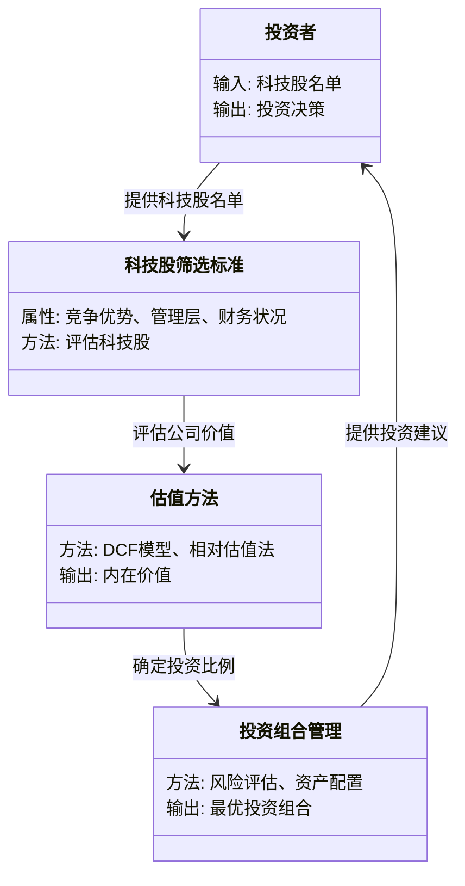
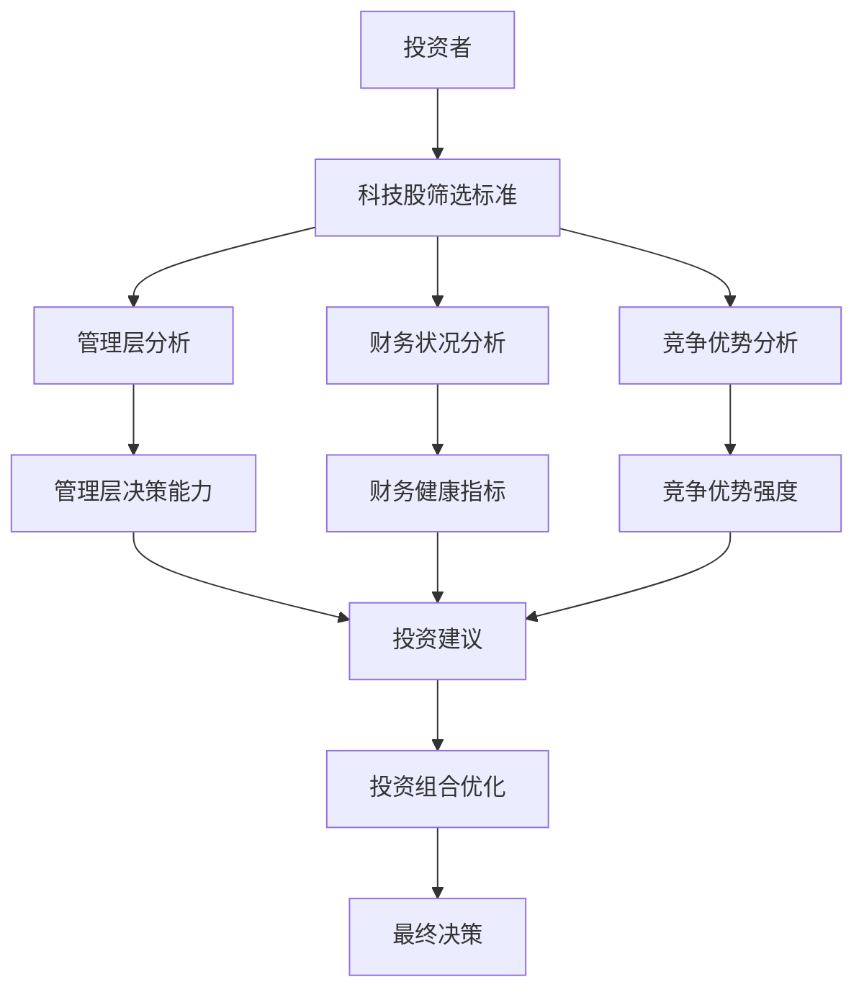
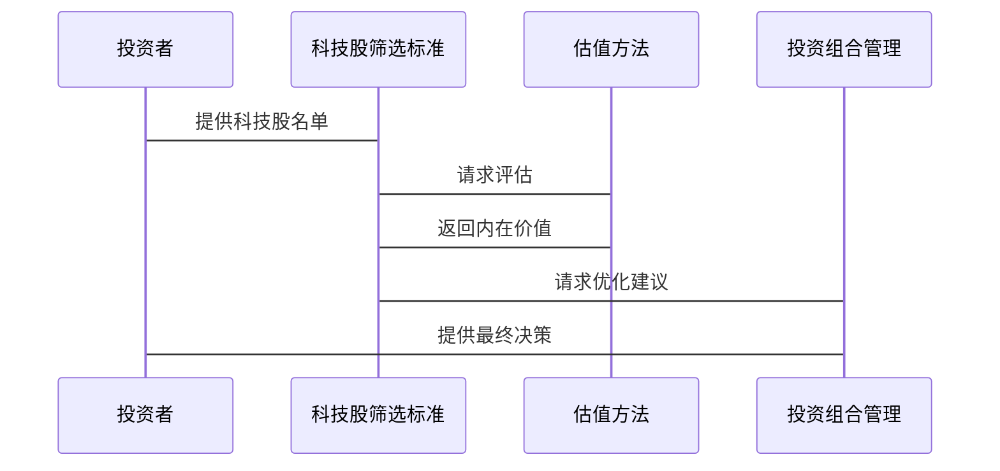

                 

# 巴菲特的科技股投资：从回避到拥抱

## 关键词：
巴菲特，科技股，投资策略，价值投资，风险管理

## 摘要：
本文探讨了巴菲特从回避科技股到拥抱科技股的投资策略转变，分析了科技股的特点、其投资策略的核心要素以及如何在科技股中实现长期价值投资。通过实际案例和系统分析，本文详细阐述了巴菲特在科技股投资中的独特见解和成功经验，为投资者提供了宝贵的参考和启示。

---

# 巴菲特的科技股投资：从回避到拥抱

## 第一部分：背景介绍

### 第1章：巴菲特的投资理念演变

#### 1.1 巴菲特的投资哲学

- **1.1.1 价值投资的定义与核心原则**
  - 价值投资是一种长期投资策略，强调以低于内在价值的价格购买优质资产。
  - 核心原则包括：安全边际、企业基本面分析、长期持有和集中投资。

- **1.1.2 巴菲特早期的投资策略**
  - 早期投资以传统行业为主，如制造业、零售业和银行业。
  - 强调企业的财务健康、稳定的收益和可预测的增长。

- **1.1.3 巴菲特对科技股的态度转变**
  - 早期回避科技股，认为其高波动性和不确定性难以预测。
  - 后来意识到科技行业的巨大潜力，开始投资科技巨头如苹果、亚马逊。

#### 1.2 科技股的特点与挑战

- **1.2.1 科技行业的创新与风险**
  - 科技行业以创新为核心，技术进步迅速，但失败风险高。
  - 公司成功与否取决于创新能力、研发能力和市场适应性。

- **1.2.2 科技股的高波动性与估值难题**
  - 科技股价格波动剧烈，受市场情绪和技术变化影响大。
  - 估值困难：高增长的未来现金流难以准确评估，市盈率和市净率等传统指标适用性受限。

- **1.2.3 科技股对传统投资策略的挑战**
  - 科技股的高增长和不确定性对价值投资的长期稳定性构成挑战。
  - 投资者需平衡短期波动与长期价值。

#### 1.3 巴菲特与科技股的结合

- **1.3.1 巴菲特投资科技股的契机**
  - 认识到科技在经济中的核心地位，尤其是云计算、人工智能等领域的巨大潜力。
  - 苹果的成功商业模式和稳定的现金流吸引了巴菲特的关注。

- **1.3.2 科技股对巴菲特投资组合的影响**
  - 科技股的高增长和高利润率提升了投资组合的回报率。
  - 增加了投资组合的多样性和抗风险能力。

- **1.3.3 巴菲特对科技股的长期看法**
  - 认为科技股将继续推动经济发展，但投资需谨慎选择具有持续竞争优势的公司。

---

## 第二部分：核心概念与联系

### 第2章：巴菲特投资科技股的策略分析

#### 2.1 巴菲特科技股投资的核心要素

- **2.1.1 企业的竞争优势（护城河）**
  - 竞争优势是巴菲特选股的核心标准。
  - 苹果的生态系统和品牌忠诚度、亚马逊的网络效应和成本优势。
  - 护城河的可持续性：技术垄断、品牌影响力、规模效应等。

- **2.1.2 管理层的品质与决策能力**
  - 优秀的管理层是企业长期成功的关键。
  - 苹果的乔布斯和库克、亚马逊的贝索斯：愿景清晰、决策果断、勇于创新。
  - 管理层的诚信和长期导向。

- **2.1.3 财务健康状况与盈利能力**
  - 强调企业的财务健康：稳定的现金流、低债务、高利润率。
  - 亚马逊早期的负现金流与高增长的平衡：投资未来而非短期利润。

#### 2.2 科技股的估值方法

- **2.2.1 市盈率与市净率的适用性**
  - 市盈率（P/E）：适用于盈利稳定的公司，但高增长科技公司可能市盈率偏高。
  - 市净率（P/B）：适用于资产密集型行业，科技公司资产轻，市净率参考价值有限。

- **2.2.2 现金流折现法的应用**
  - DCF模型是评估科技股的常用方法。
  - 通过预测未来现金流，计算内在价值。
  - 示例：苹果未来现金流的折现计算。

- **2.2.3 市场地位与未来增长潜力的结合**
  - 市场占有率：苹果在智能手机市场的领先地位。
  - 增长潜力：亚马逊云计算业务的扩展性。

#### 2.3 风险管理与投资组合的优化

- **2.3.1 风险分散的重要性**
  - 不将所有资金投入科技股，保持投资组合的多样性。
  - 通过分散投资降低行业风险，如同时投资科技、消费和金融行业。

- **2.3.2 科技股在投资组合中的比重**
  - 根据市场环境和个人风险承受能力调整比重。
  - 巴菲特的投资组合中科技股占比约为20%，确保分散风险。

- **2.3.3 定期评估与调整策略**
  - 定期审视投资组合，根据企业基本面和市场变化进行调整。
  - 例如，当科技股估值过高时，减少持仓；当出现低估机会时，增加投入。

---

## 第三部分：系统分析与架构设计

### 第3章：投资决策框架

#### 3.1 问题场景介绍

- 投资者在科技股选择中面临的主要问题：
  - 如何筛选具有长期竞争优势的公司？
  - 如何评估科技公司的未来增长潜力？
  - 如何平衡短期波动与长期价值？

#### 3.2 项目介绍

- 本文构建一个基于巴菲特投资策略的科技股投资框架，帮助投资者做出明智决策。

#### 3.3 系统功能设计（领域模型）

#### 3.4 系统架构设计

#### 3.5 系统接口设计

- 输入：科技股名单、市场数据。
- 输出：投资决策报告，包括推荐股票、投资比例和风险管理建议。

#### 3.6 系统交互

---

## 第四部分：项目实战

### 第4章：苹果与亚马逊的投资分析

#### 4.1 苹果公司的投资案例

- **公司分析**：
  - 竞争优势：强大的品牌、封闭的生态系统、高利润率的iPhone和服务业。
  - 管理层：库克的执行力和创新精神。
  - 财务状况：稳定的现金流，高分红率。

- **投资决策**：
  - 2016年投资苹果，持有至今。
  - 投资比例：占投资组合的一定比例，分散风险。

- **实际收益**：
  - 苹果股价从2016年的110美元增长到2023年的160美元，年均收益约10%。

#### 4.2 亚马逊的投资案例

- **公司分析**：
  - 竞争优势：强大的云计算业务（AWS）、物流网络和Prime会员体系。
  - 管理层：贝索斯的长期愿景和执行力。
  - 财务状况：前期投资大，但现金流增长迅速。

- **投资决策**：
  - 2014年投资亚马逊，长期持有。
  - 投资比例：根据增长潜力调整仓位。

- **实际收益**：
  - 亚马逊股价从2014年的300美元增长到2023年的1200美元，年均收益约30%。

#### 4.3 项目小结

- 成功的关键在于选择具有强大竞争优势和优秀管理层的公司。
- 长期持有和分散投资是降低风险的有效策略。

---

## 第五部分：最佳实践

### 第5章：总结与建议

#### 5.1 总结

- 巴菲特的投资策略强调长期价值，而非短期波动。
- 科技股的投资需要结合企业的竞争优势、管理层决策和财务状况。
- 通过系统化的框架和分散投资，可以有效平衡风险与收益。

#### 5.2 投资建议

- **选择公司**：
  - 优先考虑具有强大护城河和优秀管理层的科技公司。
  - 评估公司的财务健康状况和未来增长潜力。

- **风险管理**：
  - 分散投资，避免过度集中于单一行业或公司。
  - 定期审视投资组合，根据市场变化进行调整。

- **长期持有**：
  - 长期持有优质股票，避免频繁交易。
  - 通过复利效应实现财富增长。

#### 5.3 小结

- 巴菲特的成功在于对投资原则的坚持和对企业的深刻理解。
- 科技股的投资需要结合价值投资的长期视角和对行业趋势的敏锐洞察。

---

## 第六部分：注意事项与拓展阅读

### 6.1 注意事项

- **市场波动**：科技股价格波动大，需做好心理准备。
- **信息获取**：及时获取公司财报和行业动态，保持信息更新。
- **长期视角**：避免短期波动影响投资决策，坚持长期价值。

### 6.2 拓展阅读

- 《巴菲特传：一个美国资本家的成功之路》
- 《科技行业的未来：人工智能与云计算的趋势分析》
- 《价值投资：从格雷厄姆到巴菲特》

---

## 作者信息

作者：AI天才研究院/AI Genius Institute & 禅与计算机程序设计艺术 /Zen And The Art of Computer Programming

---

通过以上结构和内容，本文系统地探讨了巴菲特在科技股投资中的策略转变，结合实际案例和系统分析，为投资者提供了深刻的见解和实用的建议。希望读者能够从中获益，更好地理解科技股投资的本质，并在实际操作中灵活运用这些策略。

