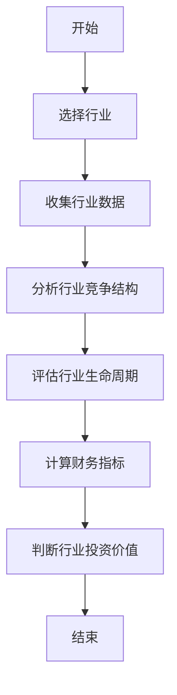
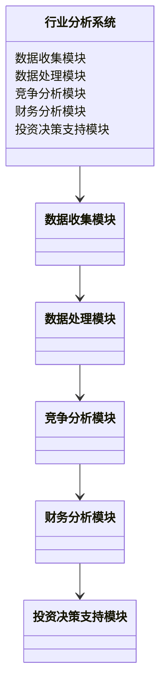
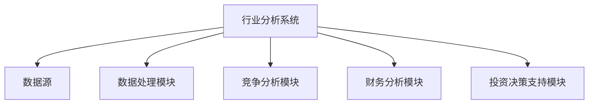
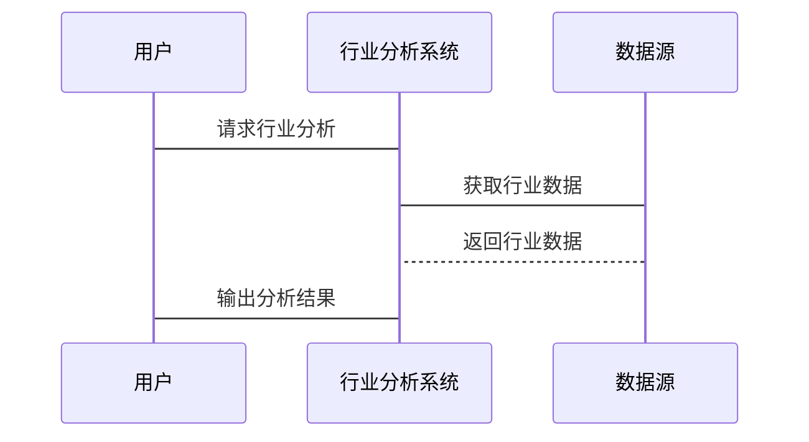

                 


## 目录大纲

# 巴菲特的行业分析方法：应对产业边界模糊化的挑战

> 关键词：巴菲特，行业分析，投资策略，产业边界，模糊化，竞争优势

> 摘要：本文深入探讨了巴菲特的行业分析方法，并分析了如何应对产业边界模糊化的挑战。通过详细阐述巴菲特的投资哲学、行业分析的核心要素，以及如何构建数学模型和系统架构，本文为读者提供了从理论到实践的完整指导。通过实际案例分析和项目实战，读者能够掌握巴菲特的行业分析方法，并在复杂多变的市场环境中做出明智的投资决策。

---

# 第一部分：引言

# 第1章：巴菲特投资理念概述

## 1.1 巴菲特投资理念的核心思想

### 1.1.1 巴菲特的投资哲学

- **长期投资**：巴菲特强调长期投资的重要性，认为短期市场波动不应影响长期投资决策。
- **价值投资**：寻找具有持续竞争优势和良好管理的公司，注重公司的内在价值而非市场情绪。
- **安全边际**：在投资中，安全边际是确保投资回报的关键，即以低于内在价值的价格买入。

### 1.1.2 巴菲特的长期投资策略

- **买入并持有**：巴菲特倾向于买入优质股票并长期持有，而非频繁交易。
- **分散投资**：虽然巴菲特定律是集中投资，但他的投资组合通常是分散的，以降低风险。
- **注重基本面**：深入分析公司的财务报表、管理层能力和行业地位。

### 1.1.3 巴菲特的价值投资原则

- **寻找护城河**：公司必须具备竞争优势，形成护城河，以防止竞争对手的侵蚀。
- **管理层质量**：管理层的诚信和能力是公司成功的关键因素。
- **合理估值**：在合理估值的基础上进行投资，避免过度乐观或悲观。

## 1.2 巴菲特的行业分析方法

### 1.2.1 行业分析的基本概念

- 行业分析是指对某一行业进行研究，了解其市场结构、竞争格局、发展趋势等，以评估行业的投资价值。
- 行业分析的核心在于识别行业中的优势企业，这些企业具备持续的竞争优势和盈利能力。

### 1.2.2 巴菲特的行业分析框架

- **行业生命周期**：分析行业所处的生命周期阶段，判断其增长潜力和风险。
- **行业结构**：分析行业的竞争结构，包括市场集中度、进入壁垒等。
- **行业趋势**：关注行业的发展趋势，如技术进步、政策变化等。

### 1.2.3 行业分析的实践意义

- 帮助投资者识别具有长期增长潜力的行业。
- 评估行业的风险和机会，制定投资策略。
- 通过行业分析，找到具有竞争优势的公司，提高投资成功的概率。

## 1.3 产业边界模糊化的挑战

### 1.3.1 产业边界模糊化的定义

- 产业边界模糊化是指传统行业之间的界限逐渐模糊，新兴技术和商业模式的出现使得行业之间的界限不再清晰。
- 例如，互联网技术的应用使得传统零售业与电子商务之间的界限变得模糊。

### 1.3.2 模糊化对行业分析的影响

- 行业分类的难度增加：传统的行业分类方法可能不再适用，需要采用更灵活的分类方法。
- 行业竞争格局变化：新兴行业可能与传统行业产生竞争，改变原有的竞争格局。
- 分析复杂性增加：行业分析需要考虑更多的因素，如技术融合、跨界竞争等。

### 1.3.3 巴菲特方法的适应性

- 巴菲特的方法注重基本面分析和长期投资，适用于产业边界模糊化的环境。
- 通过深入分析公司的竞争优势和管理层能力，巴菲特定律能够识别出在复杂环境中依然具备竞争优势的企业。

---

# 第2章：行业分析的核心概念与联系

## 2.1 巴菲特行业分析的核心要素

### 2.1.1 行业的竞争结构

- **市场集中度**：行业中的主要竞争者数量及其市场份额。
- **进入壁垒**：新进入者进入行业的难易程度，包括技术、资金、政策等壁垒。
- **竞争策略**：行业内主要企业的竞争策略，如成本领先、差异化等。

### 2.1.2 行业的生命周期

- **导入期**：行业刚刚起步，市场需求较小，竞争者较少。
- **成长期**：市场需求迅速增长，竞争者增多。
- **成熟期**：市场需求稳定，竞争格局稳定，利润率下降。
- **衰退期**：市场需求下降，竞争者逐渐退出。

### 2.1.3 行业的财务指标

- **营业收入增长率**：衡量行业收入增长的速度。
- **净利润率**：衡量行业的盈利能力。
- **资产负债率**：衡量行业的财务风险。

## 2.2 核心概念的对比分析

### 2.2.1 行业分析与企业分析的对比

| 对比维度 | 行业分析 | 企业分析 |
|----------|----------|----------|
| 分析对象 | 行业整体 | 单个企业 |
| 分析目的 | 判断行业投资价值 | 判断企业投资价值 |
| 分析内容 | 行业竞争结构、趋势等 | 企业财务状况、管理能力等 |

### 2.2.2 巴菲特方法与其他分析方法的对比

| 对比维度 | 巴菲特方法 | 其他方法（如PE分析） |
|----------|------------|----------------------|
| 分析重点 | 公司竞争优势、管理层能力 | 公司估值、市盈率等 |
| 分析步骤 | 财务分析、行业分析、竞争优势分析 | 市盈率分析、行业比较等 |

### 2.2.3 实体关系图（ER图）分析

- ER图用于展示行业分析中的实体及其关系。
- 实体包括：行业、企业、财务指标、竞争者、政策等。
- 关系包括：行业包含多个企业，企业具有多个财务指标，行业受政策影响等。

---

# 第3章：巴菲特行业分析方法的数学模型

## 3.1 行业分析的数学模型概述

- 行业分析的数学模型主要用于量化分析，帮助投资者做出科学决策。
- 常用的数学模型包括：回归分析、时间序列分析、决策树分析等。

## 3.2 财务指标的详细分析

### 3.2.1 营业收入增长率的计算

$$\text{营业收入增长率} = \frac{\text{本期营业收入} - \text{上期营业收入}}{\text{上期营业收入}} \times 100\%$$

### 3.2.2 净利润率的计算

$$\text{净利润率} = \frac{\text{净利润}}{\text{营业收入}} \times 100\%$$

### 3.2.3 资产负债率的计算

$$\text{资产负债率} = \frac{\text{总负债}}{\text{总资产}} \times 100\%$$

## 3.3 行业分析的算法流程

### 3.3.1 算法流程图



### 3.3.2 算法实现的Python代码示例

```python
import pandas as pd
import numpy as np

# 假设我们有一个行业数据集，包含多个行业的财务指标
# 数据预处理
data = pd.read_csv('industry_data.csv')
data = data.dropna()

# 计算营业收入增长率
data['营业收入增长率'] = (data['本期营业收入'] - data['上期营业收入']) / data['上期营业收入'] * 100

# 计算净利润率
data['净利润率'] = data['净利润'] / data['营业收入'] * 100

# 计算资产负债率
data['资产负债率'] = data['总负债'] / data['总资产'] * 100

# 输出结果
print(data.head())
```

---

# 第4章：系统分析与架构设计

## 4.1 系统分析

### 4.1.1 系统分析的背景介绍

- 随着产业边界模糊化，传统的行业分析方法需要与现代技术相结合，构建一个更加灵活和动态的分析系统。

### 4.1.2 系统分析的功能设计

- 数据收集与处理：从多个来源收集行业数据，进行清洗和预处理。
- 竞争分析：分析行业内的竞争结构，识别主要竞争者。
- 财务分析：计算和评估关键财务指标，如营业收入增长率、净利润率等。
- 投资决策支持：基于分析结果，提供投资建议和决策支持。

### 4.1.3 系统分析的领域模型



## 4.2 系统架构设计

### 4.2.1 系统架构图



### 4.2.2 系统接口设计

- 数据接口：与数据源对接，获取行业数据。
- 用户接口：提供友好的用户界面，方便用户进行分析和查询。
- 输出接口：输出分析结果，包括图表、报告等。

### 4.2.3 系统交互流程



---

# 第5章：项目实战

## 5.1 环境安装

### 5.1.1 安装Python和相关库

```bash
pip install pandas numpy matplotlib
```

## 5.2 系统核心实现

### 5.2.1 行业数据收集与处理

```python
import pandas as pd
import numpy as np

# 数据预处理
data = pd.read_csv('industry_data.csv')
data = data.dropna()
```

### 5.2.2 竞争分析模块

```python
def competition_analysis(data):
    # 计算市场集中度
    market_share = data['市场份额']
    market_concentration = sum(market_share) / len(market_share)
    return market_concentration

print(competition_analysis(data))
```

### 5.2.3 财务分析模块

```python
def financial_analysis(data):
    # 计算净利润率
    net_profit_ratio = data['净利润'] / data['营业收入'] * 100
    return net_profit_ratio

print(financial_analysis(data))
```

## 5.3 案例分析与解读

### 5.3.1 案例背景

- 假设我们分析的是科技行业，选择几个主要公司进行分析。

### 5.3.2 分析结果

- 市场集中度较高，主要竞争者市场份额较大。
- 净利润率较高，显示出行业的盈利能力较强。

## 5.4 项目小结

- 通过项目实战，我们可以看到巴菲特的行业分析方法在实际操作中的应用。
- 数据分析和模型构建是行业分析的重要工具，能够帮助投资者做出更明智的决策。

---

# 第6章：最佳实践与小结

## 6.1 最佳实践

### 6.1.1 定期更新行业数据

- 行业分析需要持续关注行业动态，定期更新数据。

### 6.1.2 多维度分析

- 结合财务指标、行业趋势、竞争结构等多个维度进行综合分析。

## 6.2 小结

- 巴菲特的行业分析方法是一种有效的投资工具，尤其适用于产业边界模糊化的环境。
- 通过结合现代数据分析技术，我们可以进一步提升行业分析的准确性和效率。

## 6.3 注意事项

- 投资有风险，需谨慎操作。
- 数据分析结果仅供参考，需结合实际情况进行判断。

## 6.4 拓展阅读

- 《巴菲特的智慧》
- 《投资学原理》

---

# 作者

作者：AI天才研究院/AI Genius Institute & 禅与计算机程序设计艺术/Zen And The Art of Computer Programming

