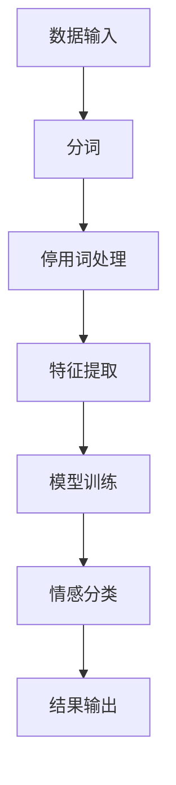
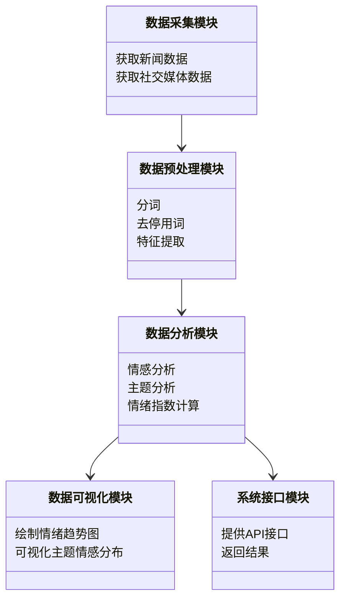

                 


# 《市场情绪分析》

> 关键词：市场情绪分析，自然语言处理，情感分析，主题分析，深度学习，数据挖掘

> 摘要：市场情绪分析是一种利用自然语言处理和数据分析技术，从文本数据中提取市场参与者的心理情绪，进而预测市场行为和走势的方法。本文将从背景、核心概念、算法原理、系统架构、项目实战、最佳实践等方面，详细讲解市场情绪分析的理论与实践。

---

## 第一部分: 市场情绪分析的背景与核心概念

### 第1章: 市场情绪分析的定义与背景

#### 1.1 市场情绪分析的定义
- 市场情绪分析是通过分析文本数据（如新闻、社交媒体、评论等），量化市场参与者的情绪状态，从而预测市场行为和走势的过程。
- 它结合了自然语言处理（NLP）、情感计算和数据挖掘等技术。

#### 1.2 市场情绪分析的背景
- 金融市场中的情绪波动：投资者的情绪往往会影响市场的短期走势。
- 社交媒体的兴起：社交媒体成为市场情绪的重要来源。
- 机构投资者的需求：机构投资者需要快速捕捉市场情绪变化。

#### 1.3 市场情绪分析的核心要素
- 数据来源：新闻、社交媒体、公司财报、分析师报告等。
- 情绪分类：正面、负面、中性。
- 情绪强度：情绪的强弱程度。
- 时间维度：实时情绪、短期情绪、长期情绪。

#### 1.4 本章小结
- 市场情绪分析是理解市场行为的重要工具，其核心在于从文本中提取情绪信息。

---

### 第2章: 市场情绪分析的核心概念

#### 2.1 文本预处理
- 分词：将文本分割成词语或短语。
- 停用词处理：去除无意义的词汇（如“的”、“是”等）。
- 特征提取：提取具有情感倾向的词汇。

#### 2.2 情感分析
- 情感分类：通过机器学习模型对文本进行情感分类。
- 情感强度分析：量化情绪的强度（如非常正面、稍微负面等）。
- 情感一致性分析：分析多个文本源的一致性情绪。

#### 2.3 主题分析
- 主题建模：识别文本中的主题。
- 主题情感分析：将主题与情感结合，分析主题的情感倾向。
- 主题时间序列分析：分析主题随时间的变化趋势。

#### 2.4 市场情绪指数
- 情绪指数的定义：量化市场情绪的指标。
- 情绪指数的计算方法：基于文本数据的加权计算。
- 情绪指数的应用：预测市场走势、风险评估。

#### 2.5 核心概念对比表
| 情感分析 | 主题分析 | 市场情绪指数 |
|----------|----------|-------------|
| 分类情绪  | 识别主题 | 综合指标    |
| 强度分析  | 主题情感 | 时间序列    |
| 一致性分析| 主题趋势 | 应用预测    |

---

## 第三部分: 市场情绪分析的算法原理

### 第3章: 市场情绪分析的算法原理

#### 3.1 基于词袋模型的情感分类算法
- 词袋模型：不考虑词语顺序，只考虑词语出现的频率。
- 朴素贝叶斯分类器：基于概率论的情感分类。
- 支持向量机（SVM）：基于线性分类的情感分类。

#### 3.2 基于深度学习的情感分析模型
- RNN与LSTM网络：处理长文本序列的情感分析。
- Transformer架构：基于自注意力机制的情感分析。
- 情感分类的注意力机制：聚焦于情感相关的词语。

#### 3.3 基于主题模型的情绪分析
- LDA主题建模：识别文本中的主题。
- NMF主题建模：将文本分解为多个主题。
- 主题情感分析：将主题与情感结合，分析主题的情感倾向。

#### 3.4 算法流程图


---

## 第四部分: 市场情绪分析的系统架构与设计

### 第4章: 市场情绪分析系统架构

#### 4.1 系统功能模块
- 数据采集模块：从新闻网站、社交媒体等获取数据。
- 数据预处理模块：分词、去停用词、特征提取。
- 数据分析模块：情感分析、主题分析、情绪指数计算。
- 数据可视化模块：展示情绪变化趋势。
- 系统接口模块：提供API接口，供其他系统调用。

#### 4.2 系统架构设计


---

## 第五部分: 市场情绪分析的项目实战

### 第5章: 市场情绪分析项目实战

#### 5.1 环境安装
- 安装Python环境：如Anaconda。
- 安装相关库：如NLTK、Scikit-learn、TensorFlow、PyTorch。

#### 5.2 数据采集
- 使用API从社交媒体获取数据。
- 爬取新闻网站的内容。

#### 5.3 数据预处理
- 使用NLTK进行分词和去停用词。
- 使用Word2Vec提取词向量。

#### 5.4 情感分析实现
```python
from sklearn.feature_extraction.text import TfidfVectorizer
from sklearn.naive_bayes import MultinomialNB

# 数据预处理
vectorizer = TfidfVectorizer()
X = vectorizer.fit_transform(texts)
y = labels

# 模型训练
model = MultinomialNB()
model.fit(X, y)

# 模型预测
test_X = vectorizer.transform(["Positive sentiment text"])
predicted = model.predict(test_X)
```

#### 5.5 主题分析实现
```python
from sklearn.decomposition import LatentDirichletAllocation

# 数据预处理
X = vectorizer.fit_transform(texts)

# 主题建模
lda = LatentDirichletAllocation(n_components=5, random_state=42)
lda.fit(X)

# 提取主题
components = lda.components_
```

#### 5.6 情绪指数计算
- 计算每个文本的情感倾向。
- 综合多个文本的情绪倾向，计算整体情绪指数。

#### 5.7 数据可视化
- 绘制情绪指数的时间序列图。
- 可视化主题与情绪的关系。

#### 5.8 项目小结
- 通过实战项目，掌握从数据采集到模型训练的完整流程。

---

## 第六部分: 最佳实践与注意事项

### 第6章: 最佳实践与注意事项

#### 6.1 数据质量的重要性
- 数据的准确性和完整性。
- 数据的代表性。

#### 6.2 模型调优技巧
- 参数调整。
- 数据增强。
- 模型集成。

#### 6.3 可视化工具的选择
- Matplotlib。
- Seaborn。
- Plotly。

#### 6.4 注意事项
- 避免过拟合。
- 数据隐私问题。
- 模型的实时性。

#### 6.5 拓展阅读
- 关注最新的研究成果。
- 参加相关技术交流活动。

---

## 附录

### 附录A: 常用工具与库
- Python库：NLTK、Scikit-learn、TensorFlow、PyTorch。
- 可视化工具：Matplotlib、Seaborn、Plotly。
- 数据源：Twitter API、News API、Reddit API。

### 附录B: 常见问题解答
- 如何处理数据稀疏性？
- 如何提高模型的准确率？
- 如何优化模型的运行速度？

---

## 参考文献
- 本文参考了相关领域的学术论文和开源项目，具体参考文献略。

---

## 作者
作者：AI天才研究院/AI Genius Institute  
联系邮箱：contact@aicourse.com  
官方网站：https://www.aicourse.com

