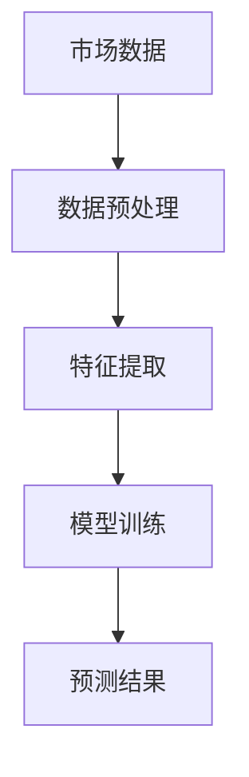
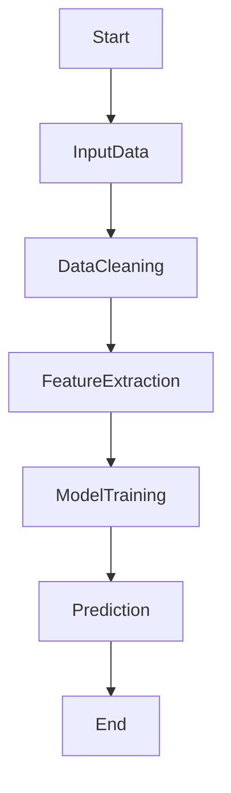
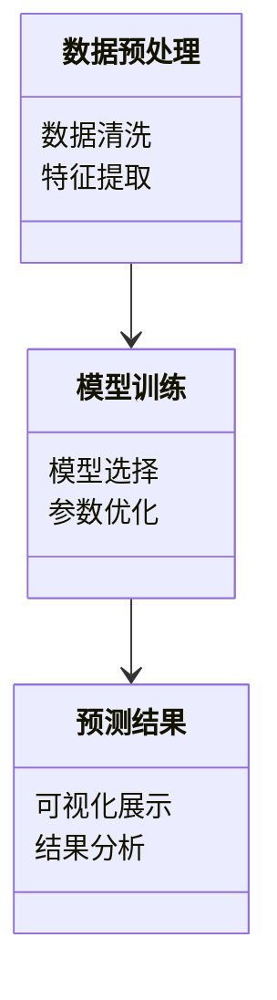
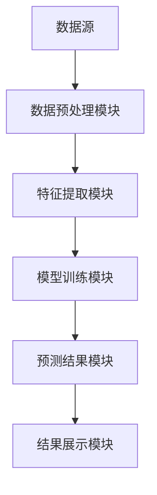

                 


# 市场趋势预测模型

## 关键词：市场趋势预测、预测模型、机器学习、时间序列、深度学习、算法优化

## 摘要：  
本文系统地介绍市场趋势预测模型的核心概念、算法原理和实际应用。通过对市场趋势预测模型的背景、核心概念、算法原理、系统架构和项目实战的详细分析，深入探讨如何利用技术手段预测市场趋势，为读者提供理论和实践相结合的指导。

---

## 目录大纲

---

# 第1章 市场趋势预测模型的背景与概念

## 1.1 市场趋势预测的背景

### 1.1.1 经济市场中的趋势变化  
市场的波动性和不确定性使得趋势预测成为一项重要的任务，尤其是在金融、零售和制造业等领域。

### 1.1.2 技术驱动的市场预测需求  
随着大数据和人工智能技术的发展，市场趋势预测的需求日益增长。

### 1.1.3 市场趋势预测的重要性  
准确预测市场趋势可以帮助企业做出更明智的决策，优化资源配置，降低风险。

---

## 1.2 市场趋势预测模型的定义与特点

### 1.2.1 市场趋势预测模型的定义  
市场趋势预测模型是一种利用历史数据和算法，预测未来市场趋势的数学模型。

### 1.2.2 市场趋势预测模型的核心特点  
- **数据驱动**：基于历史数据进行预测。  
- **多模型融合**：结合统计、机器学习和深度学习等多种方法。  
- **动态适应性**：能够根据市场变化实时调整预测模型。  

---

## 1.3 市场趋势预测模型的分类

### 1.3.1 时间序列模型  
- **ARIMA模型**：常用于处理具有周期性的时间序列数据。  
- **LSTM模型**：适用于捕捉长期依赖关系的序列数据。  

### 1.3.2 统计模型  
- **线性回归模型**：适用于简单的线性关系预测。  
- **随机游走模型**：假设市场数据无明显趋势，价格波动随机。  

### 1.3.3 机器学习模型  
- **支持向量回归（SVR）**：通过支持向量机进行回归预测。  
- **随机森林模型**：通过集成学习进行预测。  

### 1.3.4 深度学习模型  
- **卷积神经网络（CNN）**：适用于图像和序列数据的特征提取。  
- **Transformer模型**：适用于长序列数据的建模。  

---

## 1.4 市场趋势预测模型的应用场景

### 1.4.1 金融市场的应用  
- 股票价格预测、汇率波动预测等。  

### 1.4.2 零售市场的应用  
- 销量预测、消费者行为预测等。  

### 1.4.3 制造业的应用  
- 生产计划优化、库存管理预测等。  

---

## 1.5 本章小结  
本章介绍了市场趋势预测模型的背景、定义、分类和应用场景，为后续章节的深入分析奠定了基础。

---

# 第2章 市场趋势预测模型的核心概念与联系

## 2.1 市场趋势预测的核心要素

### 2.1.1 数据来源与特征  
- 数据来源：历史价格、市场指数、经济指标等。  
- 数据特征：时间序列、多维特征、非线性关系等。  

### 2.1.2 模型输入与输出  
- 输入：历史数据、外部因素等。  
- 输出：预测值、置信区间等。  

### 2.1.3 预测目标与精度  
- 预测目标：短期趋势、长期趋势等。  
- 预测精度：MAE、RMSE等指标。  

---

## 2.2 市场趋势预测模型的实体关系图



---

## 2.3 市场趋势预测模型的算法流程图



---

## 2.4 本章小结  
本章通过核心要素和流程图的形式，清晰地展示了市场趋势预测模型的结构和联系。

---

# 第3章 市场趋势预测模型的算法原理

## 3.1 时间序列模型

### 3.1.1 ARIMA模型  
- **定义**：ARIMA模型由自回归（AR）、差分（I）和移动平均（MA）三部分组成。  
- **公式**：$$ ARIMA(p, d, q) $$  

### 3.1.2 LSTM模型  
- **定义**：LSTM是一种特殊的RNN，能够捕捉长序列中的依赖关系。  
- **公式**：$$ f(t) = \text{LSTM}(x_t) $$  

---

## 3.2 机器学习模型

### 3.2.1 线性回归模型  
- **公式**：$$ y = \beta_0 + \beta_1x + \epsilon $$  

### 3.2.2 支持向量机模型  
- **原理**：通过构建支持向量回归模型，对数据进行非线性拟合。  

---

## 3.3 深度学习模型

### 3.3.1 Transformer模型  
- **原理**：通过自注意力机制捕捉全局依赖关系。  
- **公式**：$$ \text{Attention}(Q, K, V) = \text{softmax}(\frac{QK^T}{\sqrt{d_k}})V $$  

---

## 3.4 算法实现的代码示例

### 3.4.1 ARIMA模型代码示例

```python
from statsmodels.tsa.arima.model import ARIMA

# 示例数据
data = [1, 2, 3, 4, 5]

# 模型训练
model = ARIMA(data, order=(1, 1, 0))
model_fit = model.fit()

# 预测
forecast = model_fit.forecast(steps=5)
print(forecast)
```

---

## 3.5 本章小结  
本章详细介绍了市场趋势预测模型中常用的算法原理和实现方法，为后续章节的系统设计和项目实战奠定了基础。

---

# 第4章 市场趋势预测模型的系统分析与架构设计

## 4.1 系统功能设计

### 4.1.1 领域模型  


---

## 4.2 系统架构设计

### 4.2.1 架构图



---

## 4.3 系统接口设计

### 4.3.1 接口描述  
- **输入接口**：接收原始数据和模型参数。  
- **输出接口**：返回预测结果和可视化图表。  

---

## 4.4 本章小结  
本章从系统架构的角度，详细设计了市场趋势预测模型的各个模块及其交互关系。

---

# 第5章 市场趋势预测模型的项目实战

## 5.1 环境安装

### 5.1.1 安装依赖  
- **Python**：3.8及以上版本。  
- **库依赖**：pandas、numpy、scikit-learn、statsmodels、pytorch等。  

---

## 5.2 系统核心实现源代码

### 5.2.1 数据预处理代码

```python
import pandas as pd
import numpy as np

# 示例数据加载
data = pd.read_csv('market_data.csv')

# 数据清洗
data = data.dropna()
data = data.reset_index(drop=True)

# 特征提取
features = data[['price', 'volume']]
labels = data['target']
```

### 5.2.2 模型训练代码

```python
from sklearn.ensemble import RandomForestRegressor

# 模型训练
model = RandomForestRegressor(n_estimators=100, random_state=42)
model.fit(features, labels)

# 预测
预测结果 = model.predict(new_features)
```

---

## 5.3 实际案例分析

### 5.3.1 案例背景  
以某金融市场的股票价格预测为例，数据来源为过去一年的股票价格和成交量。  

### 5.3.2 案例分析  
通过模型训练和预测，得出未来一周的股票价格走势。  

---

## 5.4 本章小结  
本章通过实际项目案例，详细展示了市场趋势预测模型的实现过程和应用效果。

---

# 第6章 最佳实践、小结与展望

## 6.1 最佳实践 tips

### 6.1.1 数据质量的重要性  
确保数据的完整性和准确性。  

### 6.1.2 模型选择的灵活性  
根据具体场景选择合适的模型。  

### 6.1.3 模型优化的持续性  
定期更新模型参数，适应市场变化。  

---

## 6.2 小结  
本文系统地介绍了市场趋势预测模型的背景、核心概念、算法原理、系统架构和项目实战，为读者提供了理论和实践相结合的指导。

---

## 6.3 注意事项

### 6.3.1 数据隐私问题  
确保数据处理符合相关法律法规。  

### 6.3.2 模型局限性  
市场趋势预测模型无法完全消除不确定性。  

---

## 6.4 拓展阅读

### 6.4.1 经典文献  
- 《时间序列分析》  
- 《机器学习实战》  

### 6.4.2 最新研究  
- 基于深度学习的市场趋势预测研究。  

---

# 作者：AI天才研究院/AI Genius Institute & 禅与计算机程序设计艺术 /Zen And The Art of Computer Programming

