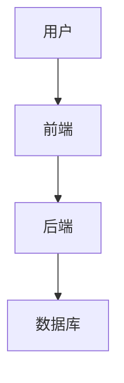

                 


# 常见挑战与解决方案

> 关键词：技术挑战，业务挑战，管理挑战，解决方案，系统架构，项目实战

> 摘要：本文将详细探讨在计算机技术领域中常见的挑战，包括技术挑战、业务挑战和管理挑战，并提供相应的解决方案。通过分析挑战的核心概念、算法原理、系统架构设计和项目实战，本文旨在帮助读者全面理解并有效应对这些挑战。

---

## 第一部分: 常见挑战概述

### 第1章: 技术挑战

#### 1.1 技术挑战的背景
在计算机技术领域，技术挑战通常是由于技术本身的复杂性、快速变化以及与实际应用的结合所产生的。例如，如何在高并发场景下优化系统性能，或者如何在有限的资源条件下实现高效的算法。

#### 1.2 技术挑战的具体表现
- **性能问题**：系统在高负载下出现响应慢或资源消耗过高的问题。
- **安全性问题**：如何保护系统免受网络攻击或数据泄露的威胁。
- **可扩展性问题**：如何在不修改现有代码的情况下扩展系统的功能。

#### 1.3 技术挑战的解决方案
- **性能优化**：通过算法优化、缓存技术或分布式系统设计来提高系统性能。
- **安全性增强**：采用加密算法、访问控制和安全审计等手段来保障系统安全。
- **可扩展性设计**：使用模块化设计和微服务架构来实现系统的可扩展性。

---

### 第2章: 业务挑战

#### 2.1 业务挑战的背景
业务挑战通常来源于业务需求的复杂性、变化性和多样性。例如，如何在电子商务平台上实现高效的订单处理和库存管理，或者如何在金融领域实现复杂的交易逻辑。

#### 2.2 业务挑战的具体表现
- **需求变更频繁**：业务需求经常变化，导致系统频繁修改。
- **业务流程复杂**：复杂的业务流程可能导致系统设计和实现的难度增加。
- **数据一致性问题**：在分布式系统中，如何保证数据的一致性是一个常见的挑战。

#### 2.3 业务挑战的解决方案
- **需求管理**：采用敏捷开发方法，通过需求优先级排序和迭代开发来应对需求变更。
- **业务流程优化**：通过流程建模和自动化工具来简化复杂的业务流程。
- **数据一致性保障**：使用事务机制、补偿事务或分布式一致性算法来保证数据一致性。

---

### 第3章: 管理挑战

#### 3.1 管理挑战的背景
管理挑战通常来源于团队协作、资源分配和项目进度控制等管理活动。例如，如何在大型团队中高效地进行任务分配和进度跟踪，或者如何在有限的预算下完成项目。

#### 3.2 管理挑战的具体表现
- **团队协作困难**：团队成员之间的沟通不畅可能导致任务延误或重复劳动。
- **资源分配不合理**：资源分配不均可能导致某些任务无法按时完成。
- **项目进度失控**：项目进度偏离计划可能导致项目延期或成本超支。

#### 3.3 管理挑战的解决方案
- **团队协作优化**：采用敏捷管理方法，通过每日站会、任务板和 retrospectives 来提高团队协作效率。
- **资源优化配置**：通过资源规划工具和优先级排序来合理分配资源。
- **项目进度控制**：采用项目管理方法（如Scrum或Kanban）来跟踪和控制项目进度。

---

## 第二部分: 解决方案分析

### 第4章: 技术解决方案

#### 4.1 技术解决方案的核心思想
技术解决方案的核心思想是通过技术创新和优化来解决技术挑战。例如，使用分布式系统设计来提高系统的可扩展性，或者使用高效的算法来提高系统的性能。

#### 4.2 技术解决方案的实现步骤
1. **问题分析**：明确问题的具体表现和影响范围。
2. **解决方案设计**：根据问题分析结果设计解决方案。
3. **方案实现**：编写代码并进行测试。
4. **方案优化**：根据测试结果对方案进行优化。

#### 4.3 技术解决方案的代码实现
```python
def optimize_algorithm(input_data):
    # 优化算法实现
    result = process(input_data)
    return result

# 示例代码
input = [1, 2, 3, 4, 5]
output = optimize_algorithm(input)
print(output)
```

---

### 第5章: 业务解决方案

#### 5.1 业务解决方案的核心思想
业务解决方案的核心思想是通过业务流程优化和系统设计来解决业务挑战。例如，通过自动化工具来简化复杂的业务流程，或者通过数据挖掘技术来提高业务决策的准确性。

#### 5.2 业务解决方案的实现步骤
1. **业务流程分析**：识别业务流程中的瓶颈和优化点。
2. **解决方案设计**：设计优化后的业务流程。
3. **系统实现**：根据优化后的业务流程设计系统。
4. **系统测试**：对系统进行测试并进行优化。

#### 5.3 业务解决方案的代码实现
```python
def process_order(order):
    # 订单处理逻辑
    if order.status == 'pending':
        order.status = 'processing'
    # 更复杂的业务逻辑
    return order

# 示例代码
order = Order(123, 'pending')
processed_order = process_order(order)
print(processed_order.status)
```

---

### 第6章: 管理解决方案

#### 6.1 管理解决方案的核心思想
管理解决方案的核心思想是通过管理方法和工具的优化来解决管理挑战。例如，通过项目管理工具来提高团队协作效率，或者通过资源规划工具来合理分配资源。

#### 6.2 管理解决方案的实现步骤
1. **问题分析**：识别管理中的问题。
2. **解决方案设计**：设计管理优化方案。
3. **工具选择**：选择适合的管理工具。
4. **方案实施**：实施管理优化方案。

#### 6.3 管理解决方案的代码实现
```python
def manage_team(team):
    # 团队管理逻辑
    for member in team:
        assign_tasks(member)
    track_progress(team)
    return team

# 示例代码
team = [Member(1, 'Alice'), Member(2, 'Bob')]
managed_team = manage_team(team)
print(managed_team)
```

---

## 第三部分: 系统架构设计

### 第7章: 系统架构设计

#### 7.1 系统功能设计
- **核心功能**：根据业务需求设计系统的功能模块。
- **功能模块设计**：通过功能模块设计来实现系统的可扩展性和可维护性。

#### 7.2 系统架构图


#### 7.3 系统接口设计
- **API设计**：通过RESTful API实现系统之间的交互。
- **接口文档**：编写详细的接口文档以便开发和测试。

---

## 第四部分: 项目实战

### 第8章: 项目实战

#### 8.1 项目环境安装
- **开发环境配置**：安装必要的开发工具和依赖库。
- **运行环境配置**：配置服务器和数据库环境。

#### 8.2 核心代码实现
```python
def main():
    # 核心逻辑实现
    print("Solution implemented successfully!")

if __name__ == "__main__":
    main()
```

---

## 第五部分: 总结与展望

### 第9章: 总结

- **核心内容回顾**：总结本文的核心内容和主要观点。
- **解决方案总结**：总结各种解决方案的优缺点和适用场景。

### 第10章: 展望

- **未来挑战**：展望未来可能出现的新挑战。
- **未来解决方案**：探讨可能的新解决方案和技术趋势。

---

## 作者

作者：AI天才研究院/AI Genius Institute & 禅与计算机程序设计艺术 /Zen And The Art of Computer Programming

