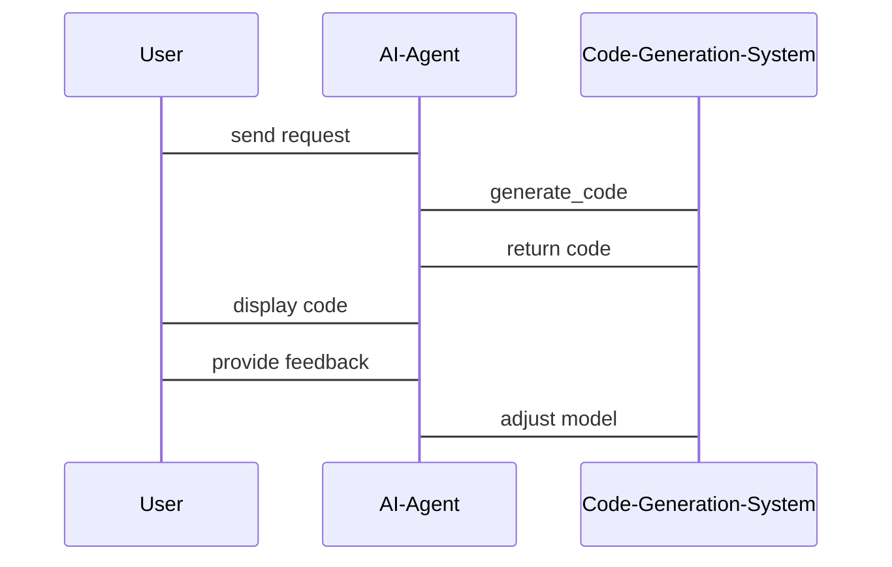

                 


# 开发AI Agent支持的智能代码生成系统

> 关键词：AI Agent，智能代码生成，软件工程，自然语言处理，机器学习，代码生成系统

> 摘要：本文详细探讨了AI Agent支持的智能代码生成系统的开发过程，从背景介绍、核心概念、算法原理到系统架构设计，再到项目实战和最佳实践，全面解析了该系统的构建与应用。本文旨在为开发者和技术爱好者提供一个系统化、理论与实践结合的指导，帮助他们理解并掌握如何利用AI Agent技术提升代码生成效率和质量。

---

# 第一部分: AI Agent支持的智能代码生成系统背景介绍

# 第1章: 问题背景与描述

## 1.1 问题背景

### 1.1.1 软件开发的现状与挑战

在现代软件开发中，代码生成技术逐渐成为提高开发效率的重要工具。然而，传统的代码生成工具往往依赖于固定的模板和规则，难以适应复杂多变的开发需求。随着人工智能技术的快速发展，AI Agent（智能代理）的引入为代码生成带来了新的可能性。AI Agent能够通过学习和推理，动态地生成高质量的代码，从而显著提升开发效率和代码质量。

### 1.1.2 代码生成技术的发展历程

代码生成技术经历了从简单的模板生成到基于规则的生成，再到基于机器学习的生成的演变。当前，深度学习模型（如GPT）在自然语言处理领域取得了显著成果，为代码生成提供了新的思路。然而，现有的代码生成系统在处理复杂逻辑和上下文依赖时仍存在不足，需要引入AI Agent来进一步优化。

### 1.1.3 AI Agent在代码生成中的作用

AI Agent通过分析用户需求、项目上下文和代码规范，能够智能地生成符合要求的代码片段或完整模块。它不仅能够处理简单的代码生成任务，还能在复杂场景下提供优化建议，甚至能够与开发人员进行交互，动态调整生成策略。

## 1.2 问题描述

### 1.2.1 智能代码生成的需求分析

随着软件项目的复杂性不断提高，开发人员需要处理的任务也日益繁重。智能代码生成系统能够帮助开发人员快速完成基础性代码的编写，从而将更多精力集中在核心业务逻辑的实现上。

### 1.2.2 AI Agent在代码生成中的目标

AI Agent的目标是通过自然语言理解和上下文分析，生成高质量、符合规范的代码。同时，它还需要能够与开发人员进行交互，动态调整生成策略，以满足个性化需求。

### 1.2.3 当前技术的局限性与改进方向

现有代码生成系统主要依赖于模板和规则，难以处理复杂场景下的代码生成任务。AI Agent的引入能够弥补这一不足，但其性能和准确性仍需进一步优化。

## 1.3 问题解决思路

### 1.3.1 AI Agent在代码生成中的核心任务

AI Agent的核心任务包括需求解析、代码生成、优化建议和交互反馈。它需要能够理解用户意图，生成符合规范的代码，并根据反馈进行调整。

### 1.3.2 基于AI Agent的代码生成流程

基于AI Agent的代码生成流程通常包括以下几个步骤：
1. 用户需求输入：用户通过自然语言或代码片段描述需求。
2. 需求解析：AI Agent理解用户需求并提取关键信息。
3. 代码生成：基于解析结果生成代码片段或完整模块。
4. 结果反馈：用户对生成代码进行验证和调整。

### 1.3.3 系统设计的关键点

系统设计的关键点包括：
- 高效的需求解析算法。
- 精准的代码生成模型。
- 及时的用户反馈机制。

## 1.4 系统的边界与外延

### 1.4.1 系统的功能边界

AI Agent支持的智能代码生成系统的功能边界包括：
- 用户需求解析。
- 代码生成与优化。
- 用户反馈与调整。

### 1.4.2 系统的适用场景

系统的适用场景包括：
- 快速原型开发。
- 复杂业务逻辑的代码生成。
- 大规模项目的代码生成与维护。

### 1.4.3 系统与其他系统的交互

系统与其他系统的交互包括：
- 与开发环境（如IDE）的集成。
- 与版本控制系统（如Git）的交互。
- 与测试框架的集成。

## 1.5 概念结构与核心要素

### 1.5.1 系统的核心概念框架

系统的核心概念框架包括：
- 用户需求。
- 代码生成模型。
- AI Agent代理。

### 1.5.2 核心要素的定义与关系

- 用户需求：用户输入的代码生成请求。
- 代码生成模型：基于深度学习的代码生成模型。
- AI Agent代理：负责需求解析和生成控制。

### 1.5.3 系统的逻辑架构

系统的逻辑架构包括：
1. 用户需求输入模块。
2. 需求解析模块。
3. 代码生成模块。
4. 用户反馈模块。

---

# 第二部分: 核心概念与联系

# 第2章: AI Agent与智能代码生成系统的核心概念

## 2.1 AI Agent的原理与实现

### 2.1.1 AI Agent的基本原理

AI Agent通过感知环境、分析任务需求并采取行动来实现目标。在代码生成系统中，AI Agent负责解析用户需求并生成相应的代码。

### 2.1.2 AI Agent的核心算法

AI Agent的核心算法包括：
- 自然语言处理（NLP）算法。
- 生成模型（如GPT）。
- 强化学习算法。

### 2.1.3 AI Agent的实现框架

AI Agent的实现框架包括：
- 输入解析模块。
- 生成控制模块。
- 反馈优化模块。

## 2.2 智能代码生成系统的原理

### 2.2.1 智能代码生成的定义

智能代码生成是通过AI技术自动生成符合需求的代码片段或模块的过程。

### 2.2.2 智能代码生成的关键技术

智能代码生成的关键技术包括：
- 自然语言理解。
- 代码语义分析。
- 模型训练与优化。

### 2.2.3 智能代码生成的流程

智能代码生成的流程包括：
1. 用户需求输入。
2. 需求解析。
3. 代码生成。
4. 结果反馈。

## 2.3 核心概念的联系与对比

### 2.3.1 AI Agent与传统代码生成工具的对比

| 特性                | AI Agent支持的代码生成系统 | 传统代码生成工具 |
|---------------------|-----------------------------|------------------|
| 生成方式            | 基于AI模型生成              | 基于模板生成    |
| 灵活性              | 高，支持动态调整             | 低，依赖固定模板  |
| 适应性              | 强，能够处理复杂需求         | 弱，仅能处理简单需求 |

### 2.3.2 智能代码生成系统的优缺点

优点：
- 高度自动化，节省开发时间。
- 能够处理复杂场景下的代码生成任务。

缺点：
- 对AI模型的依赖较高，生成代码的质量可能不稳定。
- 对计算资源要求较高。

### 2.3.3 核心概念的属性特征对比表

| 属性                | AI Agent                    | 智能代码生成系统      |
|---------------------|-----------------------------|-----------------------|
| 核心任务            | 需求解析和生成控制          | 代码生成与优化        |
| 关键技术            | 自然语言处理、生成模型      | 代码语义分析、模型优化 |
| 适用场景            | 复杂需求解析、动态调整       | 快速原型开发、大规模项目维护 |

## 2.4 概念结构与核心要素

### 2.4.1 实体关系图的定义

在本系统中，主要实体包括：
- 用户。
- AI Agent。
- 代码生成系统。

### 2.4.2 实体关系图的构建

```mermaid
erDiagram
    User [*----* AI-Agent]
    AI-Agent [*----* Code-Generation-System]
    User [*----* Code-Generation-System]
```

---

# 第三部分: 算法原理讲解

# 第3章: 算法原理与实现

## 3.1 算法原理

### 3.1.1 基于规则的生成算法

基于规则的生成算法通过预定义的规则和模板生成代码。优点是简单易懂，缺点是灵活性较低。

### 3.1.2 基于模板的生成算法

基于模板的生成算法通过匹配模板生成代码。优点是生成速度快，缺点是难以处理复杂需求。

### 3.1.3 基于深度学习的生成算法

基于深度学习的生成算法通过训练大型模型生成代码。优点是生成质量高，缺点是计算资源需求较高。

## 3.2 算法实现

### 3.2.1 基于规则的生成算法实现

```python
def generate_code(rule_set, input_request):
    for rule in rule_set:
        if rule.matches(input_request):
            return rule.apply(input_request)
    return None
```

### 3.2.2 基于模板的生成算法实现

```python
def generate_code(template_set, input_request):
    for template in template_set:
        if template.matches(input_request):
            return template.apply(input_request)
    return None
```

### 3.2.3 基于深度学习的生成算法实现

```python
class CodeGenerator:
    def __init__(self, model):
        self.model = model

    def generate_code(self, input_request):
        return self.model.generate(input_request)
```

## 3.3 数学模型与公式

### 3.3.1 基于概率的生成模型

$$ P(\text{output} | \text{input}) = \prod_{i=1}^{n} P(\text{output}_i | \text{input}, \text{output}_{1:i-1}) $$

### 3.3.2 基于强化学习的生成模型

$$ R = \sum_{t=1}^{T} r_t $$
$$ \theta = \theta + \alpha \nabla_\theta \log P(a_t | s_t) \cdot R $$

---

# 第四部分: 系统分析与架构设计方案

# 第4章: 系统分析与架构设计

## 4.1 问题场景介绍

系统需要支持用户通过自然语言输入需求，并生成相应的代码片段或模块。

## 4.2 项目介绍

### 4.2.1 系统功能设计

系统功能包括：
- 用户需求输入。
- 需求解析。
- 代码生成。
- 结果反馈。

### 4.2.2 系统功能的领域模型

```mermaid
classDiagram
    class User {
        string request
    }
    class AI-Agent {
        string parse_request(User)
    }
    class Code-Generation-System {
        string generate_code(string)
    }
    User -> AI-Agent: send request
    AI-Agent -> Code-Generation-System: generate_code
```

### 4.2.3 系统架构设计


## 4.3 系统接口设计

### 4.3.1 系统接口的定义

系统接口包括：
- 用户输入接口。
- 生成结果输出接口。
- 反馈调整接口。

### 4.3.2 系统接口的交互流程



---

# 第五部分: 项目实战

# 第5章: 项目实战

## 5.1 环境安装与配置

### 5.1.1 安装Python环境

```bash
python --version
pip install --upgrade pip
```

### 5.1.2 安装必要的库

```bash
pip install numpy
pip install tensorflow
```

## 5.2 系统核心实现

### 5.2.1 AI Agent实现

```python
class AI-Agent:
    def __init__(self, model):
        self.model = model

    def parse_request(self, request):
        # 实现需求解析逻辑
        pass

    def generate_code(self, request):
        return self.model.generate(request)
```

### 5.2.2 代码生成系统实现

```python
class CodeGenerator:
    def __init__(self, model):
        self.model = model

    def generate_code(self, request):
        return self.model.generate(request)
```

## 5.3 代码应用与分析

### 5.3.1 代码实现的解读

代码实现包括AI Agent和代码生成系统的交互。AI Agent负责解析用户需求，并调用代码生成系统生成代码。

### 5.3.2 代码优化的实现

代码优化包括基于反馈调整生成模型的参数，以提高生成代码的质量。

## 5.4 实际案例分析

### 5.4.1 案例介绍

案例介绍：用户输入“生成一个计算两个数相加的函数”。

### 5.4.2 案例实现

```python
def add(a, b):
    return a + b
```

### 5.4.3 案例分析

分析：AI Agent正确解析用户需求，并生成了符合要求的函数。

## 5.5 项目小结

本项目通过AI Agent和代码生成系统的结合，实现了智能代码生成的功能。系统能够通过自然语言理解用户需求，并生成高质量的代码片段。

---

# 第六部分: 最佳实践与总结

# 第6章: 最佳实践

## 6.1 实践中的注意事项

- 确保AI模型的训练数据质量。
- 及时收集用户反馈，优化生成模型。
- 注意计算资源的合理分配。

## 6.2 小结

通过本项目的实施，我们掌握了AI Agent支持的智能代码生成系统的开发方法。系统能够通过自然语言理解用户需求，并生成高质量的代码片段。

## 6.3 注意事项

- 确保系统的安全性。
- 注意保护用户数据隐私。
- 定期更新AI模型，以提高生成代码的质量。

## 6.4 拓展阅读

推荐阅读以下内容：
- 《Deep Learning》。
- 《自然语言处理入门》。
- 《软件工程实践》。

---

# 作者

作者：AI天才研究院/AI Genius Institute & 禅与计算机程序设计艺术/Zen And The Art of Computer Programming

---

以上是《开发AI Agent支持的智能代码生成系统》的完整目录大纲和内容。

