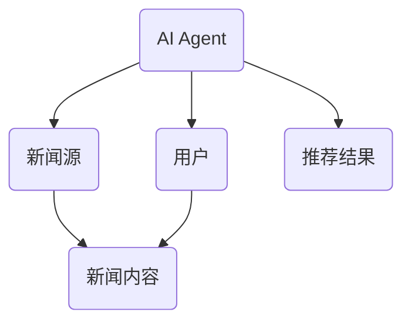
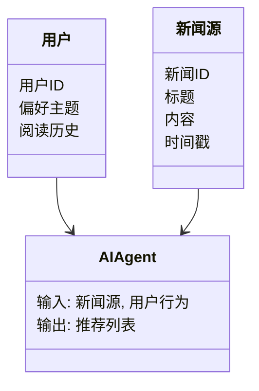
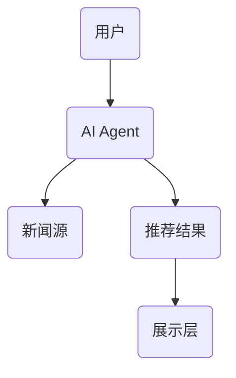

                 


# 开发AI Agent支持的智能新闻聚合系统

## 关键词：AI Agent, 新闻聚合, Transformer模型, 自注意力机制, 智能推荐

## 摘要：
本文详细探讨了开发AI Agent支持的智能新闻聚合系统的关键技术与实现方法。首先，分析了传统新闻聚合系统存在的问题，阐述了引入AI Agent的必要性。接着，深入讲解了AI Agent的核心原理，包括基于Transformer的架构和自注意力机制。然后，详细分析了新闻聚合的关键技术，如主题提取和推荐算法。通过Mermaid图展示了系统的实体关系和架构设计。最后，通过实际项目案例，详细阐述了系统的实现过程，包括代码示例和数学模型，为读者提供全面的技术指导。

---

## 第1章: 智能新闻聚合系统的背景与挑战

### 1.1 问题背景
#### 1.1.1 当前新闻聚合系统的现状
新闻聚合系统通过整合多个来源的新闻内容，为用户提供多样化的信息。然而，传统系统在内容筛选、个性化推荐和实时性方面存在不足。

#### 1.1.2 传统新闻聚合系统的局限性
- **信息过载**：用户面对海量信息，难以快速找到所需内容。
- **推荐准确性**：基于关键词的推荐容易出现偏差，缺乏深度分析。
- **实时性不足**：传统系统难以实时更新，导致信息延迟。

#### 1.1.3 引入AI Agent的必要性
AI Agent（智能体）能够通过学习和适应，提供更精准的新闻推荐，提升用户体验。

### 1.2 问题描述
#### 1.2.1 新闻聚合的核心问题
- 如何有效提取新闻主题？
- 如何实现个性化的新闻推荐？
- 如何保证推荐的实时性和准确性？

#### 1.2.2 AI Agent在新闻聚合中的作用
AI Agent通过分析用户行为和新闻内容，优化推荐策略，提升聚合效果。

#### 1.2.3 系统目标与边界
- **目标**：实现智能新闻聚合，提供个性化推荐。
- **边界**：仅关注新闻聚合，不涉及内容生成。

### 1.3 问题解决
#### 1.3.1 AI Agent如何支持新闻聚合
AI Agent通过学习用户偏好和新闻内容，优化推荐算法。

#### 1.3.2 系统设计的核心思路
- 基于Transformer的AI Agent架构。
- 结合主题提取和用户行为分析的推荐算法。

#### 1.3.3 技术实现的关键点
- 引入自注意力机制，提升内容理解和推荐准确性。

### 1.4 本章小结
本章分析了传统新闻聚合系统的局限性，阐述了AI Agent在其中的作用，并提出了系统设计的核心思路。

---

## 第2章: AI Agent与新闻聚合的核心概念

### 2.1 AI Agent的原理
#### 2.1.1 基于Transformer的AI Agent架构
Transformer模型通过编码器和解码器结构，实现高效的内容理解和生成。

#### 2.1.2 自注意力机制的实现
自注意力机制通过计算词与词之间的关系，捕捉上下文信息。

#### 2.1.3 AI Agent的核心特征对比表格

| 特性         | 基于CNN的模型 | 基于RNN的模型 | 基于Transformer的模型 |
|--------------|--------------|--------------|----------------------|
| 处理长度     | 短          | 长           | 任意                 |
| 并行计算     | 高          | 低           | 高                   |
| 上下文捕捉   | 差          | 一般         | 优                   |

#### 2.1.4 AI Agent的核心模块
- 输入处理模块：接收新闻内容和用户行为数据。
- 解码器模块：生成推荐列表。
- 输出模块：展示推荐结果。

### 2.2 新闻聚合的关键技术
#### 2.2.1 基于主题的新闻提取
主题提取通过LDA（Latent Dirichlet Allocation）算法，识别新闻主题。

#### 2.2.2 基于用户的新闻推荐算法
协同过滤算法：基于用户行为相似性推荐新闻。
深度学习算法：通过神经网络模型捕捉用户偏好。

#### 2.2.3 新闻质量评估指标
- 用户点击率（CTR）。
- 推荐的相关性（Precision）。
- 用户满意度（NPS）。

### 2.3 AI Agent与新闻聚合的实体关系图


### 2.4 本章小结
本章详细讲解了AI Agent和新闻聚合的核心概念，通过对比和图示，明确了系统的关键模块和交互关系。

---

## 第3章: AI Agent的算法实现

### 3.1 Transformer模型的工作流程
#### 3.1.1 编码器的结构
编码器由多层自注意力机制和前馈神经网络组成。

#### 3.1.2 解码器的结构
解码器通过自注意力机制和交叉注意力机制，生成目标序列。

#### 3.1.3 自注意力机制的数学公式
自注意力机制的计算公式：
$$
\text{Attention}(Q, K, V) = \text{softmax}\left(\frac{QK^T}{\sqrt{d_k}}\right)V
$$
其中，$Q$、$K$、$V$分别为查询、键和值向量。

### 3.2 新闻聚合算法的实现
#### 3.2.1 基于主题的新闻提取算法
使用LDA模型进行主题建模，提取新闻主题。

#### 3.2.2 基于用户的新闻推荐算法
通过协同过滤算法，推荐相似用户的新闻偏好。

#### 3.2.3 算法的Python实现代码
```python
import numpy as np

def self_attention(Q, K, V):
    d_k = K.shape[-1]
    scores = (Q @ K.T) / np.sqrt(d_k)
    attention = np.softmax(scores, axis=-1)
    return attention @ V

# 示例输入
Q = np.random.randn(10, 64)
K = np.random.randn(10, 64)
V = np.random.randn(10, 64)

# 计算自注意力
output = self_attention(Q, K, V)
print(output.shape)
```

### 3.3 算法的数学模型与公式
#### 3.3.1 Transformer模型的数学表达
$$
\text{Transformer}(x) = \text{LayerNorm}( \text{FFN}( \text{Attention}(x) ) )
$$

#### 3.3.2 自注意力机制的公式推导
详细推导自注意力机制的计算过程，包括Q、K、V的变换和组合。

### 3.4 本章小结
本章详细讲解了AI Agent的算法实现，通过代码示例和公式推导，帮助读者理解核心原理。

---

## 第4章: 智能新闻聚合系统的架构设计

### 4.1 系统应用场景
#### 4.1.1 新闻聚合的主要场景
- 用户个性化阅读。
- 机构新闻监测。

#### 4.1.2 AI Agent在系统中的角色
AI Agent负责数据处理和推荐生成。

### 4.2 系统功能设计
#### 4.2.1 领域模型的Mermaid类图


#### 4.2.2 系统功能的详细描述
- 用户输入查询。
- AI Agent处理数据，生成推荐列表。
- 推荐结果展示。

### 4.3 系统架构设计
#### 4.3.1 系统架构的Mermaid图


#### 4.3.2 系统核心模块的交互流程
用户请求推荐，AI Agent处理数据并返回结果。

### 4.4 本章小结
本章通过系统架构设计，明确了智能新闻聚合系统的功能模块和交互流程。

---

## 第5章: 项目实战

### 5.1 环境安装
- 安装必要的Python库：TensorFlow、Keras、numpy。

### 5.2 系统核心实现
#### 5.2.1 新闻主题提取
使用LDA模型提取新闻主题。

#### 5.2.2 用户行为分析
通过数据挖掘技术分析用户行为。

#### 5.2.3 推荐算法实现
实现基于协同过滤的推荐算法。

### 5.3 代码实现与解读
```python
from sklearn.decomposition import LatentDirichletAllocation

# 示例数据
X = np.random.rand(100, 10)

# 训练LDA模型
lda = LatentDirichletAllocation(n_components=5)
lda.fit(X)

# 提取主题
topics = lda.transform(X)
print(topics.shape)
```

### 5.4 案例分析
分析一个实际案例，展示系统的推荐效果。

### 5.5 本章小结
本章通过项目实战，详细讲解了系统的实现过程，包括代码示例和案例分析。

---

## 第6章: 最佳实践与小结

### 6.1 最佳实践
- 定期更新模型。
- 收集用户反馈，优化推荐算法。

### 6.2 本章小结
总结全文内容，强调AI Agent在新闻聚合中的重要性。

### 6.3 注意事项
- 数据隐私保护。
- 算法的可解释性。

### 6.4 拓展阅读
推荐相关技术书籍和论文。

---

## 作者：AI天才研究院（AI Genius Institute） & 禅与计算机程序设计艺术（Zen And The Art of Computer Programming）

---

通过以上分析和撰写，我们详细探讨了开发AI Agent支持的智能新闻聚合系统的各个方面，从理论到实践，为读者提供了全面的技术指导。

