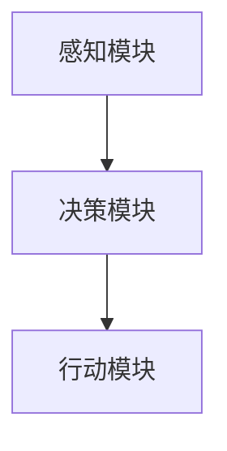
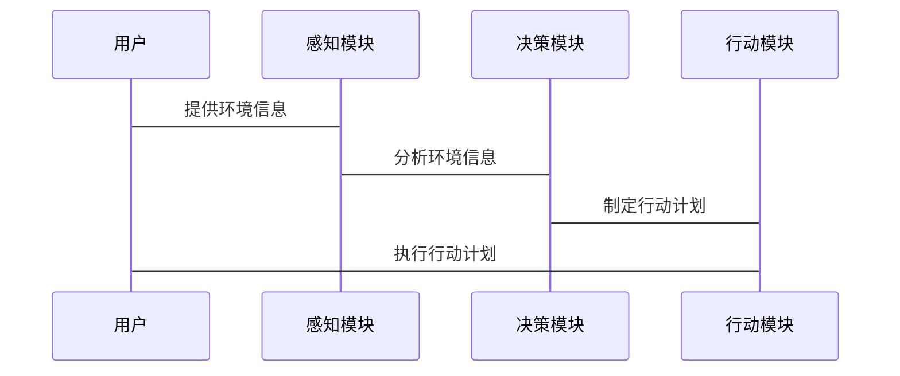

                 


# 开发AI Agent支持的智能虚拟现实系统

## 关键词：
AI Agent, 虚拟现实, 人机交互, 人工智能, 系统架构设计, 算法实现, 智能交互

## 摘要：
随着人工智能和虚拟现实技术的快速发展，AI Agent在智能虚拟现实系统中的应用日益广泛。本文系统地介绍了AI Agent支持的智能虚拟现实系统的开发过程，从核心概念到算法实现，再到系统架构设计，全面阐述了相关技术和应用案例。通过详细的技术分析和项目实战，本文为读者提供了从理论到实践的完整指南。

---

# 第一部分: AI Agent与虚拟现实系统概述

## 第1章: AI Agent与虚拟现实系统概述

### 1.1 AI Agent的基本概念

#### 1.1.1 AI Agent的定义
AI Agent（人工智能代理）是指在计算机系统中，能够感知环境并采取行动以实现目标的智能实体。它可以是一个软件程序，也可以是一个硬件设备，通过与环境交互来完成特定任务。

#### 1.1.2 AI Agent的核心特征
- **自主性**：能够在没有外部干预的情况下自主决策。
- **反应性**：能够根据环境变化实时调整行为。
- **目标导向**：所有行为都围绕实现特定目标展开。
- **学习能力**：通过经验或数据不断优化自身性能。

#### 1.1.3 AI Agent与传统程序的区别
传统程序遵循固定的算法和规则，而AI Agent具备学习和适应能力，能够根据环境反馈动态调整策略。

---

### 1.2 虚拟现实系统的基本概念

#### 1.2.1 虚拟现实的定义
虚拟现实（Virtual Reality，VR）是一种能够模拟人类感官体验的技术，通过计算机生成的三维环境，为用户提供沉浸式的交互体验。

#### 1.2.2 虚拟现实的核心技术
- **头显设备**：如Oculus Rift、HTC Vive等。
- **图形渲染**：使用高性能图形处理器生成实时三维画面。
- **交互技术**：通过手柄、手势识别等方式实现用户与虚拟环境的互动。

#### 1.2.3 虚拟现实的应用场景
- **游戏娱乐**：提供沉浸式游戏体验。
- **教育培训**：用于模拟培训，如医疗手术模拟。
- **工业设计**：用于产品设计和虚拟 prototyping。

---

### 1.3 AI Agent在虚拟现实中的作用

#### 1.3.1 AI Agent在虚拟现实中的功能
- **环境感知**：实时获取用户的动作、位置和行为。
- **智能交互**：根据用户需求提供个性化服务。
- **动态调整**：根据用户反馈优化虚拟环境。

#### 1.3.2 AI Agent与虚拟现实结合的优势
- **提升用户体验**：通过智能代理实现更自然的交互。
- **增强系统功能**：AI Agent能够处理复杂任务，如路径规划和任务分配。

#### 1.3.3 AI Agent在虚拟现实中的应用案例
- **虚拟助手**：在VR环境中提供实时帮助。
- **智能NPC**：在游戏或培训中实现智能角色。

---

## 第2章: AI Agent支持的智能虚拟现实系统背景

### 2.1 智能虚拟现实系统的背景

#### 2.1.1 智能虚拟现实系统的定义
智能虚拟现实系统是一种结合了AI Agent和虚拟现实技术的系统，能够通过智能代理提供更高级的交互体验。

#### 2.1.2 智能虚拟现实系统的演进历程
- **初期阶段**：简单的虚拟现实体验，缺乏智能性。
- **发展阶段**：引入基本的AI代理功能。
- **成熟阶段**：实现高度智能的交互体验。

#### 2.1.3 智能虚拟现实系统的现状
当前，智能虚拟现实系统在游戏、教育、医疗等领域得到了广泛应用，但仍有诸多技术挑战需要解决。

---

### 2.2 AI Agent在智能虚拟现实系统中的必要性

#### 2.2.1 AI Agent在智能虚拟现实系统中的角色
- **用户行为分析**：实时分析用户的动作和意图。
- **环境动态调整**：根据用户反馈优化虚拟环境。

#### 2.2.2 AI Agent对用户体验的提升
- **个性化服务**：根据用户偏好提供定制化体验。
- **实时反馈**：快速响应用户需求。

#### 2.2.3 AI Agent对系统效率的优化
- **资源优化分配**：合理分配计算资源，提高系统效率。
- **任务自动化**：通过AI代理自动完成重复性任务。

---

### 2.3 智能虚拟现实系统的应用前景

#### 2.3.1 智能虚拟现实系统的潜在应用场景
- **教育领域**：虚拟教室、远程培训。
- **医疗领域**：手术模拟、患者康复训练。
- **娱乐领域**：智能游戏、虚拟社交。

#### 2.3.2 智能虚拟现实系统的市场价值
随着技术的进步，智能虚拟现实系统在多个领域的应用前景广阔，市场潜力巨大。

#### 2.3.3 智能虚拟现实系统的技术挑战
- **计算能力限制**：需要更高的计算性能。
- **用户交互体验**：提升自然交互的流畅性。

---

# 第二部分: AI Agent的核心技术与原理

## 第3章: AI Agent的核心技术

### 3.1 AI Agent的感知技术

#### 3.1.1 感知技术的定义
AI Agent通过传感器或其他输入设备获取环境信息，如视觉、听觉和触觉信息。

#### 3.1.2 常见的感知技术类型
- **视觉感知**：通过摄像头获取图像信息。
- **听觉感知**：通过麦克风获取声音信息。
- **触觉感知**：通过触摸屏或力反馈设备获取触觉信息。

#### 3.1.3 感知技术的实现原理
AI Agent通过传感器获取环境信息，然后通过算法处理这些信息，提取有用特征。

---

### 3.2 AI Agent的决策技术

#### 3.2.1 决策技术的定义
AI Agent根据感知到的信息，结合自身目标，制定行动计划。

#### 3.2.2 常见的决策算法
- **规则引擎**：基于预定义规则进行决策。
- **机器学习模型**：通过训练数据学习决策策略。
- **强化学习**：通过与环境交互学习最优策略。

#### 3.2.3 决策技术的实现原理
AI Agent通过分析环境信息，选择最优行动方案。

---

### 3.3 AI Agent的行动技术

#### 3.3.1 行动技术的定义
AI Agent根据决策结果，执行具体行动，如移动、发声或操作设备。

#### 3.3.2 常见的行动方式
- **物理操作**：通过机械臂或其他设备执行物理操作。
- **信息输出**：通过屏幕、扬声器等方式输出信息。

#### 3.3.3 行动技术的实现原理
AI Agent通过执行机构完成具体行动，实现与环境的互动。

---

## 第4章: AI Agent的算法实现

### 4.1 路径规划算法

#### 4.1.1 路径规划算法的定义
路径规划算法用于计算从起点到目标点的最优路径。

#### 4.1.2 常见的路径规划算法
- **A*算法**：基于启发式搜索的路径规划算法。
- **RRT算法**：用于高维空间路径规划的采样算法。

#### 4.1.3 路径规划算法的实现原理
通过构建环境地图，计算从起点到目标点的最优路径。

---

### 4.2 自然语言处理算法

#### 4.2.1 自然语言处理算法的定义
自然语言处理算法用于理解和生成人类语言。

#### 4.2.2 常见的自然语言处理算法
- **词袋模型**：基于词频的文本分类算法。
- **循环神经网络**：用于序列数据处理的深度学习模型。

#### 4.2.3 自然语言处理算法的实现原理
通过机器学习模型，实现对文本的理解和生成。

---

## 第5章: AI Agent的系统架构设计

### 5.1 系统功能设计

#### 5.1.1 系统功能模块
- **感知模块**：负责环境信息的采集。
- **决策模块**：负责制定行动计划。
- **行动模块**：负责执行具体行动。

#### 5.1.2 功能模块之间的关系
感知模块提供环境信息，决策模块制定行动方案，行动模块执行具体行动。

---

### 5.2 系统架构设计

#### 5.2.1 系统架构图


#### 5.2.2 系统交互流程


---

## 第6章: AI Agent的项目实战

### 6.1 环境配置

#### 6.1.1 开发环境
- **操作系统**：Windows 10或更高版本。
- **开发工具**：PyCharm或Jupyter Notebook。
- **AI框架**：TensorFlow或Keras。

#### 6.1.2 虚拟现实开发框架
- **Unity**：用于开发虚拟现实应用。
- **OpenCV**：用于计算机视觉处理。

---

### 6.2 核心代码实现

#### 6.2.1 路径规划算法实现
```python
import math

def a_star(start, end, grid):
    # 初始化优先队列
    open_set = set([start])
    came_from = {}
    g_score = {start: 0}
    f_score = {start: heuristic(start, end)}
    
    while open_set:
        current = pop from open_set with lowest f_score
        if current == end:
            break
        for neighbor in neighbors(current, grid):
            tentative_g_score = g_score.get(current, float('inf')) + distance(current, neighbor)
            if tentative_g_score < g_score.get(neighbor, float('inf')):
                came_from[neighbor] = current
                g_score[neighbor] = tentative_g_score
                f_score[neighbor] = g_score[neighbor] + heuristic(neighbor, end)
                if neighbor not in open_set:
                    add neighbor to open_set
    return came_from, g_score
```

#### 6.2.2 自然语言处理算法实现
```python
from tensorflow.keras import models, layers

def create_model():
    model = models.Sequential()
    model.add(layers.Embedding(input_dim=10000, output_dim=50))
    model.add(layers.LSTM(64))
    model.add(layers.Dense(1, activation='sigmoid'))
    model.compile(optimizer='adam', loss='binary_crossentropy', metrics=['accuracy'])
    return model
```

---

## 第7章: 总结与展望

### 7.1 总结
本文详细介绍了AI Agent支持的智能虚拟现实系统的开发过程，从核心概念到算法实现，再到系统架构设计，为读者提供了全面的技术指南。

### 7.2 展望
随着人工智能和虚拟现实技术的进一步发展，AI Agent在智能虚拟现实系统中的应用将更加广泛，未来的研究方向包括提高系统的交互性和智能化水平。

---

作者：AI天才研究院/AI Genius Institute & 禅与计算机程序设计艺术 /Zen And The Art of Computer Programming

