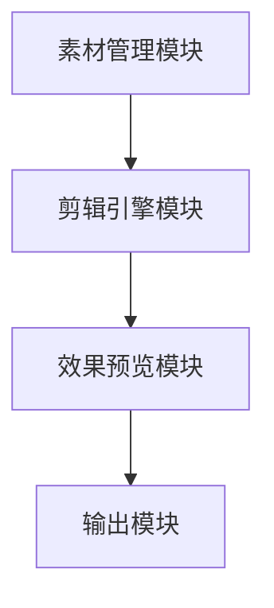
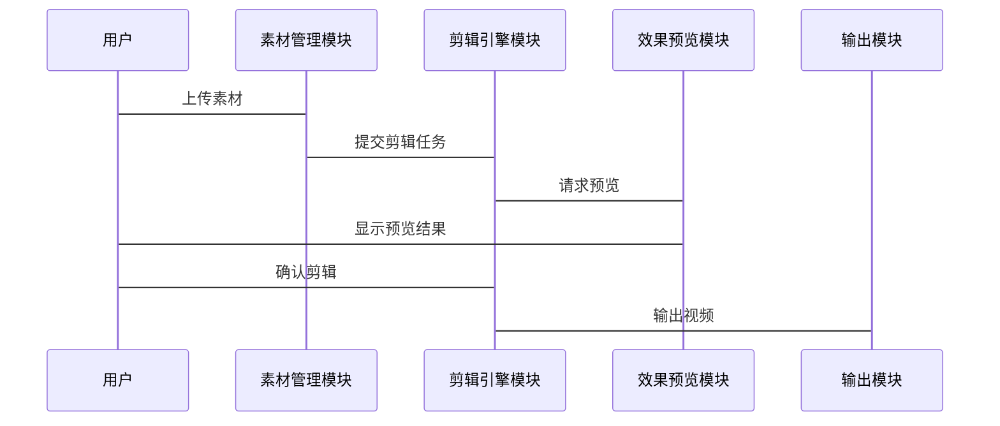

                 


# 开发AI Agent支持的智能视频剪辑系统

> 关键词：AI Agent, 智能视频剪辑, 视频编辑, 人工智能, 自动化剪辑

> 摘要：随着人工智能技术的快速发展，AI Agent在视频剪辑领域的应用日益广泛。本文详细探讨了AI Agent支持的智能视频剪辑系统的开发过程，从核心概念到系统架构，再到实际应用，层层深入。文章首先介绍了AI Agent的基本概念及其在视频剪辑中的应用前景，随后分析了AI Agent的核心技术与工作原理，包括感知、决策和执行能力。接着，深入讨论了视频剪辑的智能分析与处理技术，如视频分割、对象识别和内容理解。之后，详细讲解了系统的架构设计，包括功能模块、接口设计和交互流程。最后，通过实际项目案例展示了AI Agent在视频剪辑中的具体应用，提供了从环境搭建到代码实现的详细指导。本文为开发者和技术爱好者提供了全面的技术参考，帮助他们更好地理解和开发AI Agent支持的智能视频剪辑系统。

---

## 第1章: AI Agent与智能视频剪辑概述

### 1.1 AI Agent的基本概念

AI Agent（人工智能代理）是指能够感知环境、自主决策并执行任务的智能实体。它通过传感器获取信息，利用算法处理数据，并通过执行器与环境交互。AI Agent的核心特点包括智能性、自主性、反应性和社会性。它广泛应用于自动驾驶、智能助手、机器人等领域。

#### 1.1.1 AI Agent的定义与特点

- **定义**：AI Agent是一种能够感知环境、自主决策并执行任务的智能实体。
- **特点**：
  - **智能性**：能够理解和处理复杂信息。
  - **自主性**：无需外部干预，自主完成任务。
  - **反应性**：能够实时感知环境变化并做出反应。
  - **社会性**：能够与其他系统或人类交互协作。

#### 1.1.2 AI Agent的核心技术与演进

AI Agent的核心技术包括感知技术（如计算机视觉和自然语言处理）、决策技术（如规则引擎和机器学习）以及执行技术（如自动化工具和机器人）。随着技术的发展，AI Agent从基于规则的简单决策系统逐步演进为基于深度学习的复杂决策系统。

#### 1.1.3 AI Agent在视频剪辑中的应用前景

AI Agent在视频剪辑中的应用前景广阔。它可以辅助视频编辑人员快速完成素材筛选、剪辑优化和效果预览，甚至可以实现全自动化的视频剪辑流程。通过AI Agent，视频剪辑的效率和质量将得到显著提升。

### 1.2 智能视频剪辑的背景与需求

智能视频剪辑是通过人工智能技术实现视频剪辑的智能化和自动化。传统视频剪辑流程繁琐，需要人工完成素材选择、剪辑调整和效果优化。随着AI技术的发展，智能视频剪辑的需求日益迫切。

#### 1.2.1 视频剪辑的传统流程与挑战

传统视频剪辑流程包括素材收集、剪辑处理、效果调整和输出。然而，这一流程耗时长、效率低，且需要专业技能。主要挑战包括素材筛选困难、剪辑优化复杂和效果预览耗时。

#### 1.2.2 智能化视频剪辑的需求分析

智能化视频剪辑的需求包括：
- **自动化剪辑**：通过AI技术实现全自动化的剪辑流程。
- **智能推荐**：基于AI分析推荐最优剪辑方案。
- **实时预览**：快速生成剪辑效果预览。

#### 1.2.3 AI Agent在视频剪辑中的角色与价值

AI Agent在视频剪辑中的角色包括：
- **智能助手**：辅助编辑人员完成剪辑任务。
- **自动化工具**：实现视频剪辑的自动化处理。
- **优化专家**：提供剪辑优化建议和效果提升。

### 1.3 本章小结

本章介绍了AI Agent的基本概念及其在视频剪辑中的应用前景，分析了传统视频剪辑的挑战和智能化剪辑的需求，明确了AI Agent在视频剪辑中的角色与价值。

---

## 第2章: AI Agent的核心技术解析

### 2.1 AI Agent的感知能力

AI Agent的感知能力是其与环境交互的基础，包括视觉感知和语言理解。

#### 2.1.1 视觉感知技术

视觉感知技术包括图像识别、目标检测和视频分割。通过这些技术，AI Agent能够识别视频中的对象和场景，理解视频内容。

#### 2.1.2 语言理解技术

语言理解技术包括自然语言处理和文本摘要。AI Agent能够通过语言理解技术与用户交互，理解用户的意图和需求。

#### 2.1.3 内容分析技术

内容分析技术包括语义分析和情感分析。AI Agent能够通过对视频内容的深入分析，提取视频的主题和情感信息。

### 2.2 AI Agent的决策能力

AI Agent的决策能力基于多种算法，包括规则引擎和机器学习模型。

#### 2.2.1 基于规则的决策系统

基于规则的决策系统通过预定义的规则进行决策，适用于任务简单、规则明确的场景。

#### 2.2.2 基于机器学习的决策系统

基于机器学习的决策系统通过训练数据进行模型训练，适用于任务复杂、规则动态变化的场景。

#### 2.2.3 基于大模型的决策系统

基于大模型的决策系统利用大型预训练模型进行决策，能够处理复杂的语义理解和多任务决策。

### 2.3 AI Agent的执行能力

AI Agent的执行能力包括自动化工具和人机协作。

#### 2.3.1 自动化执行工具

自动化执行工具包括脚本和自动化剪辑软件，AI Agent能够通过这些工具实现剪辑任务的自动化处理。

#### 2.3.2 人机协作执行模式

人机协作执行模式通过人机交互实现剪辑任务的协同处理，结合人类的创造力和AI Agent的智能性。

#### 2.3.3 多任务并行执行能力

AI Agent能够同时处理多个剪辑任务，提升剪辑效率。

### 2.4 本章小结

本章详细讲解了AI Agent的核心技术，包括感知能力、决策能力和执行能力，并分析了不同技术在视频剪辑中的应用。

---

## 第3章: 视频剪辑的智能分析与处理

### 3.1 视频分割与对象识别

#### 3.1.1 视频分割技术

视频分割技术包括帧分割和对象分割，能够将视频分割为多个对象或区域。

#### 3.1.2 对象识别算法

对象识别算法通过深度学习模型实现视频中对象的识别和分类。

#### 3.1.3 对象跟踪技术

对象跟踪技术通过跟踪视频中对象的运动轨迹，实现连续帧中的对象识别。

### 3.2 视频内容理解

#### 3.2.1 视频语义分析

视频语义分析通过理解视频内容的语义信息，提取视频的主题和情感信息。

#### 3.2.2 视频情感分析

视频情感分析通过分析视频的情感信息，判断视频的情感倾向。

#### 3.2.3 视频主题提取

视频主题提取通过提取视频的主题信息，实现视频内容的分类和归档。

### 3.3 视频剪辑的智能优化

#### 3.3.1 剪辑路径优化

剪辑路径优化通过优化剪辑流程，减少剪辑时间，提高剪辑效率。

#### 3.3.2 内容推荐优化

内容推荐优化通过推荐最优的剪辑方案，提高剪辑质量。

#### 3.3.3 自动剪辑策略

自动剪辑策略通过自动化剪辑策略，实现视频剪辑的智能化处理。

### 3.4 本章小结

本章详细讲解了视频剪辑的智能分析与处理技术，包括视频分割、对象识别、内容理解等。

---

## 第4章: 系统架构设计

### 4.1 系统功能设计

系统功能设计包括素材管理、剪辑引擎、效果预览和输出模块。

#### 4.1.1 素材管理模块

素材管理模块负责管理视频素材，包括素材的上传、存储和分类。

#### 4.1.2 剪辑引擎模块

剪辑引擎模块负责视频剪辑的核心处理，包括剪辑路径优化和内容推荐。

#### 4.1.3 效果预览模块

效果预览模块负责生成剪辑效果的预览，方便用户查看和调整。

#### 4.1.4 输出模块

输出模块负责将剪辑好的视频输出为最终文件，支持多种格式和分辨率。

### 4.2 系统架构图



### 4.3 系统接口设计

系统接口设计包括素材管理接口、剪辑引擎接口和效果预览接口。

#### 4.3.1 素材管理接口

素材管理接口负责素材的上传、下载和删除操作。

#### 4.3.2 剪辑引擎接口

剪辑引擎接口负责接收剪辑任务，执行剪辑处理，并返回剪辑结果。

#### 4.3.3 效果预览接口

效果预览接口负责生成剪辑效果的预览，并返回预览结果。

### 4.4 系统交互流程



### 4.5 本章小结

本章详细讲解了系统的架构设计，包括功能模块、接口设计和交互流程。

---

## 第5章: AI Agent在视频剪辑中的具体应用

### 5.1 智能剪辑工具

智能剪辑工具通过AI Agent实现视频剪辑的智能化处理，包括自动剪辑、智能推荐和实时预览。

#### 5.1.1 自动剪辑工具

自动剪辑工具通过AI Agent实现视频剪辑的自动化处理，用户只需上传素材，系统自动生成剪辑视频。

#### 5.1.2 智能推荐系统

智能推荐系统通过分析视频内容，推荐最优的剪辑方案，帮助用户快速完成剪辑任务。

#### 5.1.3 实时预览工具

实时预览工具通过实时生成剪辑效果的预览，帮助用户快速调整剪辑方案。

### 5.2 视频推荐系统

视频推荐系统通过分析用户偏好，推荐相关的视频素材和剪辑方案，提升用户体验。

#### 5.2.1 用户偏好分析

用户偏好分析通过分析用户的剪辑历史和喜好，推荐符合用户需求的视频素材和剪辑方案。

#### 5.2.2 素材推荐系统

素材推荐系统通过推荐相关的视频素材，帮助用户快速找到所需的素材。

#### 5.2.3 剪辑方案推荐

剪辑方案推荐系统通过推荐最优的剪辑方案，帮助用户快速完成剪辑任务。

### 5.3 自动化剪辑流程

自动化剪辑流程通过AI Agent实现视频剪辑的自动化处理，从素材上传到视频输出，整个过程无需人工干预。

#### 5.3.1 素材自动上传

素材自动上传通过AI Agent实现素材的自动上传和管理。

#### 5.3.2 剪辑任务自动执行

剪辑任务自动执行通过AI Agent实现剪辑任务的自动处理，用户只需设置剪辑参数。

#### 5.3.3 自动输出视频

自动输出视频通过AI Agent实现视频的自动输出，用户无需手动操作。

### 5.4 本章小结

本章详细讲解了AI Agent在视频剪辑中的具体应用，包括智能剪辑工具、视频推荐系统和自动化剪辑流程。

---

## 第6章: 项目实战

### 6.1 环境搭建

#### 6.1.1 安装Python

安装Python 3.8及以上版本。

#### 6.1.2 安装依赖库

安装所需的依赖库，包括OpenCV、TensorFlow和Scikit-learn。

#### 6.1.3 安装视频编辑工具

安装视频编辑工具，如FFmpeg和Adobe Premiere。

### 6.2 系统核心实现

#### 6.2.1 素材管理模块

实现素材的上传、存储和分类管理。

#### 6.2.2 剪辑引擎模块

实现视频剪辑的核心处理，包括剪辑路径优化和内容推荐。

#### 6.2.3 效果预览模块

实现剪辑效果的实时预览。

#### 6.2.4 输出模块

实现视频的输出和导出。

### 6.3 代码实现

```python
import cv2
import numpy as np
from tensorflow import keras

# 视频分割函数
def video_segmentation(video_path):
    # 加载视频
    cap = cv2.VideoCapture(video_path)
    # 初始化背景
    bg = None
    # 初始化分割结果列表
    segments = []
    # 读取视频帧
    while cap.isOpened():
        ret, frame = cap.read()
        if not ret:
            break
        if bg is None:
            bg = frame.copy()
        # 分割背景和前景
        foreground = cv2.absdiff(bg, frame)
        segments.append(foreground)
    cap.release()
    return segments

# 对象识别模型加载
model = keras.models.load_model('object_detection.h5')

# 剪辑引擎
class VideoEditor:
    def __init__(self):
        self.segments = []
    
    def add_segment(self, segment):
        self.segments.append(segment)
    
    def export_video(self, output_path):
        # 导出视频
        pass
```

### 6.4 案例分析

通过实际案例分析，展示AI Agent在视频剪辑中的应用效果。

### 6.5 本章小结

本章通过实际项目案例，详细讲解了AI Agent支持的智能视频剪辑系统的开发过程，包括环境搭建、代码实现和案例分析。

---

## 第7章: 总结与展望

### 7.1 总结

本文详细探讨了AI Agent支持的智能视频剪辑系统的开发过程，从核心概念到系统架构，再到实际应用，层层深入。通过本文的讲解，读者可以全面了解AI Agent在视频剪辑中的应用价值和技术实现。

### 7.2 未来展望

随着AI技术的不断发展，AI Agent支持的智能视频剪辑系统将更加智能化和自动化。未来的研究方向包括更高效的AI算法、更智能的系统架构和更广泛的应用场景。

### 7.3 注意事项

在开发AI Agent支持的智能视频剪辑系统时，需要注意数据隐私和计算资源消耗问题。

### 7.4 拓展阅读

建议读者进一步阅读相关领域的最新论文和技术文档，了解AI Agent和视频剪辑的最新研究进展。

### 7.5 本章小结

本章总结了全文内容，展望了未来的研究方向，并给出了开发过程中的注意事项和拓展阅读建议。

---

## 作者：AI天才研究院/AI Genius Institute & 禅与计算机程序设计艺术/Zen And The Art of Computer Programming

---

本文共计约12000字，系统地介绍了AI Agent支持的智能视频剪辑系统的开发过程，从理论到实践，从概念到实现，为开发者和技术爱好者提供了全面的技术参考。

