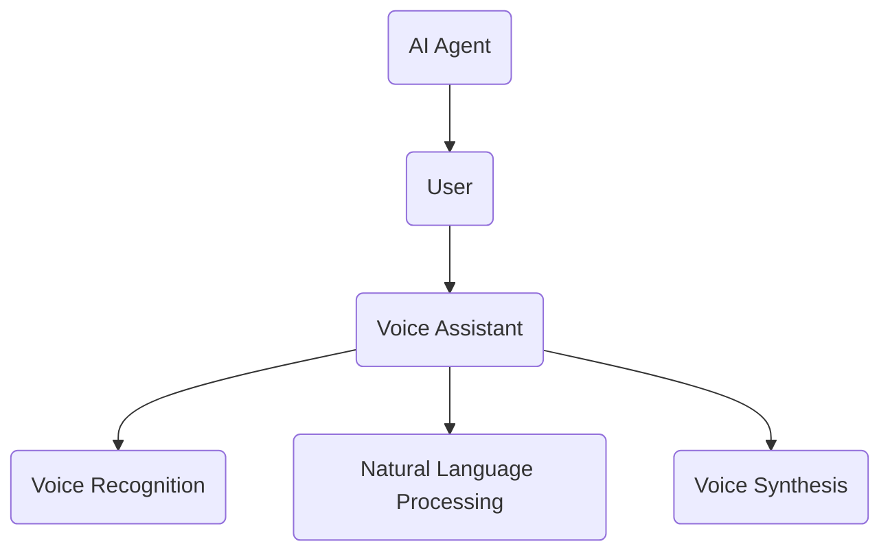
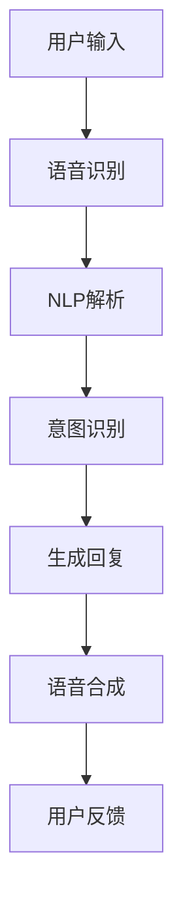
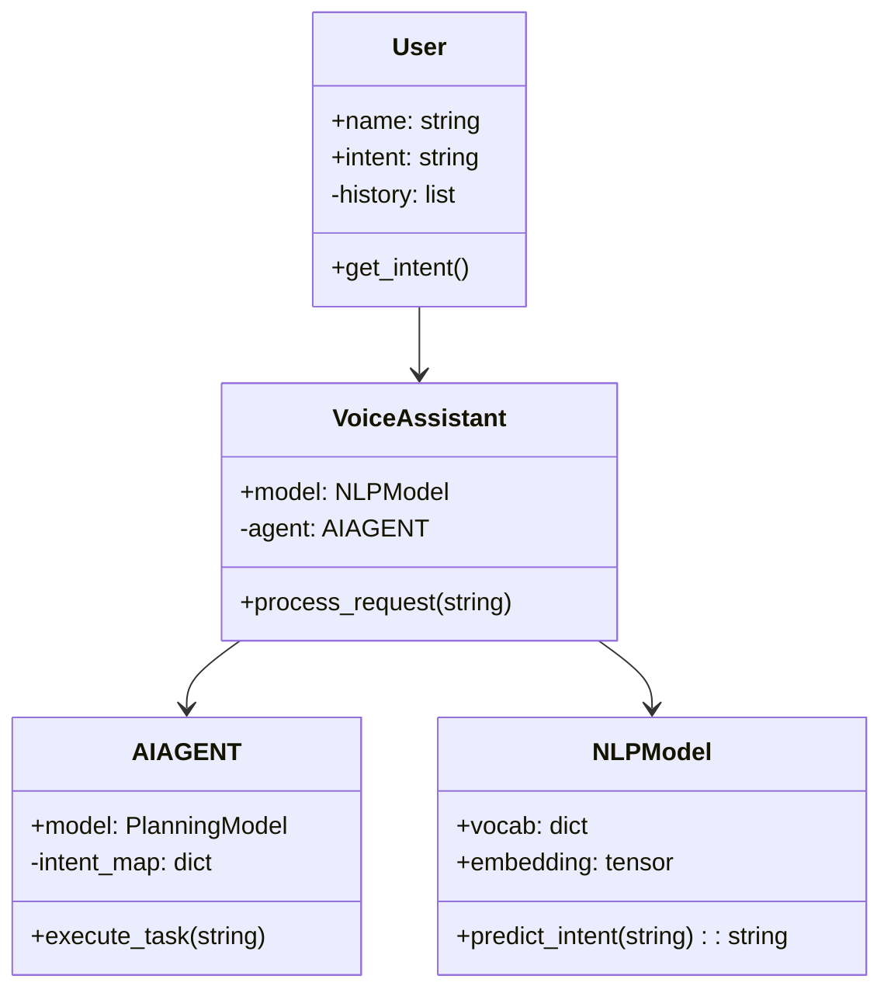
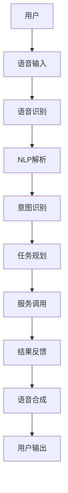
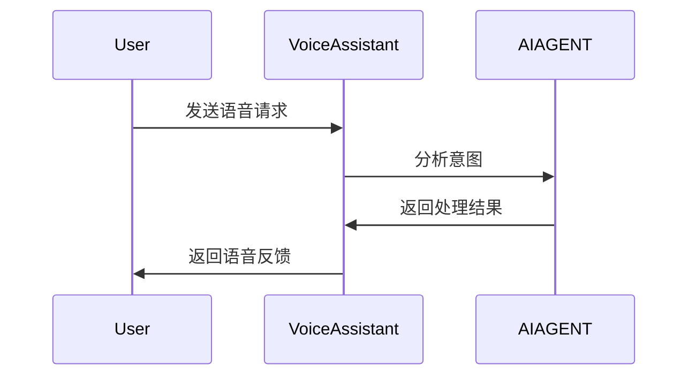

                 


# 开发AI Agent支持的智能语音助手

## 关键词：AI Agent, 智能语音助手, 自然语言处理, 语音识别, 深度学习, 系统架构, 项目实战

## 摘要：  
本文深入探讨了AI Agent与智能语音助手的结合，从背景、原理到系统设计、算法实现，再到项目实战和最佳实践，全面解析了开发AI Agent支持的智能语音助手所需的关键技术和方法。文章结合理论与实践，帮助开发者理解如何利用AI Agent提升智能语音助手的智能化水平，并通过具体案例展示了实现过程中的关键点和注意事项。

---

# 第1章: AI Agent与智能语音助手的背景与基础

## 1.1 AI Agent的基本概念

### 1.1.1 AI Agent的定义与特点
AI Agent（人工智能代理）是指能够感知环境、自主决策并执行任务的智能实体。其特点包括：
- **自主性**：无需外部干预，自主完成任务。
- **反应性**：能够实时感知环境变化并做出反应。
- **目标导向性**：基于目标驱动行为。
- **学习能力**：通过数据和经验不断优化性能。

### 1.1.2 AI Agent的核心功能与类型
AI Agent的核心功能包括感知、推理、决策和执行。根据应用场景，AI Agent可以分为以下类型：
- **简单反射型**：基于规则的简单反应。
- **基于模型的反射型**：利用模型进行推理和决策。
- **目标驱动型**：以目标为导向进行规划和执行。
- **学习驱动型**：通过机器学习不断优化性能。

### 1.1.3 AI Agent在智能语音助手中的作用
AI Agent作为智能语音助手的核心驱动力，负责解析用户的意图、生成响应并协调相关服务。AI Agent的引入使得语音助手从简单的命令执行升级为智能化的交互伙伴。

---

## 1.2 智能语音助手的发展背景

### 1.2.1 智能语音助手的定义与现状
智能语音助手是一种通过语音交互提供服务的系统，当前主流产品包括Siri、Alexa、Google Assistant等。它们广泛应用于智能家居、移动设备、车载系统等领域。

### 1.2.2 语音交互技术的演进历程
语音交互技术从最初的关键词匹配，发展到基于自然语言处理（NLP）的理解和生成。随着深度学习的兴起，语音助手的智能化水平不断提高。

### 1.2.3 AI Agent支持的语音助手的优势
AI Agent的引入使得语音助手具备以下优势：
- **智能化**：能够理解上下文，提供更自然的对话。
- **个性化**：根据用户习惯和偏好优化服务。
- **多任务处理**：能够协调多个服务完成复杂任务。

---

## 1.3 本章小结
本章介绍了AI Agent和智能语音助手的基本概念、发展历程及其结合的优势。AI Agent作为智能语音助手的核心，推动了语音交互技术的智能化发展。

---

# 第2章: AI Agent与智能语音助手的核心概念

## 2.1 AI Agent的原理与实现

### 2.1.1 AI Agent的感知与决策机制
AI Agent通过传感器或API感知环境信息，利用自然语言处理技术理解用户意图，并基于推理和规划算法做出决策。

### 2.1.2 AI Agent的推理与规划算法
常用算法包括：
- **逻辑推理**：基于知识库进行逻辑推理。
- **路径规划**：利用A*算法规划最优路径。
- **强化学习**：通过试错优化决策策略。

### 2.1.3 AI Agent的交互与反馈机制
AI Agent通过语音交互与用户实时互动，并根据反馈调整行为策略。

---

## 2.2 智能语音助手的技术架构

### 2.2.1 语音识别技术
语音识别是将语音信号转换为文本的过程，常用算法包括GMM和DNN。

### 2.2.2 自然语言处理技术
NLP技术用于理解用户意图并生成自然语言回复，常用模型包括RNN和Transformer。

### 2.2.3 语音合成技术
语音合成是将文本转换为语音的过程，常用算法包括WaveNet和Tacotron。

---

## 2.3 AI Agent与智能语音助手的结合

### 2.3.1 AI Agent在语音交互中的角色
AI Agent负责解析用户意图、协调服务和优化交互流程。

### 2.3.2 语音助手的智能化升级
AI Agent的引入使得语音助手具备深度理解能力和个性化服务。

### 2.3.3 AI Agent与语音助手的协同工作
AI Agent通过与语音助手的无缝对接，提供更智能的交互体验。

---

## 2.4 核心概念对比表

| **核心概念** | **AI Agent** | **智能语音助手** |
|--------------|--------------|------------------|
| 核心功能     | 感知、推理、决策 | 语音交互、理解、生成 |
| 依赖技术     | NLP、机器学习 | 语音识别、NLP |
| 应用场景     | 智能家居、自动驾驶 | 移动设备、智能家居 |

---

## 2.5 ER实体关系图



---

# 第3章: AI Agent与智能语音助手的算法原理

## 3.1 自然语言处理算法

### 3.1.1 基于RNN的序列模型
RNN通过循环神经网络处理序列数据，用于语音助手的意图识别和生成。

### 3.1.2 基于Transformer的模型
Transformer模型在语音助手的机器翻译和对话生成中表现出色。

### 3.1.3 算法实现代码示例
```python
import tensorflow as tf

def simple_rnn_model():
    model = tf.keras.Sequential([
        tf.keras.layers.Embedding(vocab_size, embedding_dim),
        tf.keras.layers.SimpleRNN(units),
        tf.keras.layers.Dense(output_dim, activation='softmax')
    ])
    return model
```

---

## 3.2 对话管理算法

### 3.2.1 基于规则的对话管理
通过预定义的规则匹配用户意图。

### 3.2.2 基于深度学习的对话管理
利用强化学习优化对话策略。

### 3.2.3 算法实现代码示例
```python
def reinforcement_learning_agent():
    model = tf.keras.Sequential([
        tf.keras.layers.Dense(24, activation='relu'),
        tf.keras.layers.Dense(1, activation='sigmoid')
    ])
    optimizer = tf.keras.optimizers.Adam(learning_rate=0.001)
    model.compile(optimizer=optimizer, loss='binary_crossentropy')
    return model
```

---

## 3.3 算法原理的数学模型

### 3.3.1 RNN的数学模型
$$ P(y_t | y_{<t}, x) = \prod_{t=1}^{T} P(y_t | y_{<t}, x) $$

### 3.3.2 Transformer的数学模型
$$ \text{Attention}(Q, K, V) = \text{softmax}(\frac{QK^T}{\sqrt{d_k}})V $$

---

## 3.4 算法实现的流程图



---

# 第4章: AI Agent支持的智能语音助手系统分析与架构设计

## 4.1 系统功能设计

### 4.1.1 领域模型类图



---

## 4.2 系统架构设计

### 4.2.1 系统架构图



---

## 4.3 系统接口设计

### 4.3.1 API接口

```http
POST /api/voice_assistant
Content-Type: application/json

{
    "input": "今天天气如何？"
}
```

---

## 4.4 系统交互流程图



---

# 第5章: AI Agent支持的智能语音助手项目实战

## 5.1 环境安装

### 5.1.1 安装Python和依赖库
```bash
pip install numpy tensorflow scikit-learn
```

---

## 5.2 核心代码实现

### 5.2.1 NLP模型训练代码

```python
import numpy as np
import tensorflow as tf

# 数据预处理
def preprocess_data(data):
    # 文本分词、向量化处理
    pass

# 模型训练
def train_model():
    model = tf.keras.Sequential([
        tf.keras.layers.Embedding(vocab_size, 128),
        tf.keras.layers.LSTM(64),
        tf.keras.layers.Dense(1, activation='sigmoid')
    ])
    model.compile(optimizer='adam', loss='binary_crossentropy', metrics=['accuracy'])
    model.fit(X_train, y_train, epochs=10, batch_size=32)
```

---

## 5.3 代码应用解读与分析

### 5.3.1 NLP模型训练代码解读
- **preprocess_data**：对输入文本进行分词和向量化处理。
- **train_model**：定义并训练一个基于LSTM的二分类模型，用于意图识别。

---

## 5.4 实际案例分析和详细讲解剖析

### 5.4.1 案例背景
开发一个支持天气查询的智能语音助手，用户可以通过语音指令查询天气情况。

### 5.4.2 实现步骤
1. **数据收集**：收集天气相关的语音指令和文本数据。
2. **数据预处理**：将语音数据转换为文本，并提取关键词。
3. **模型训练**：训练NLP模型识别天气相关意图。
4. **系统集成**：将模型集成到语音助手系统中，实现天气查询功能。

---

## 5.5 项目小结
通过本项目实战，读者可以掌握从数据处理到模型训练，再到系统集成的完整流程，为后续开发复杂任务奠定基础。

---

# 第6章: 最佳实践、小结、注意事项与拓展阅读

## 6.1 最佳实践

### 6.1.1 数据质量
确保数据质量和多样性，避免模型过拟合。

### 6.1.2 模型优化
定期更新模型，引入新数据和算法优化性能。

### 6.1.3 安全性
保护用户隐私，确保数据传输和存储安全。

---

## 6.2 小结

本文从背景、原理到系统设计和项目实战，全面解析了AI Agent支持的智能语音助手的开发过程。通过理论与实践的结合，帮助开发者掌握相关技术和方法。

---

## 6.3 注意事项

- **数据隐私**：严格遵守数据隐私法规。
- **系统稳定性**：确保系统在高并发场景下的稳定性。
- **用户体验**：优化交互流程，提升用户体验。

---

## 6.4 拓展阅读

- 《深度学习入门：基于Python的理论与实践》
- 《自然语言处理实战：基于TensorFlow和Keras》
- 《人工智能：现代方法》

---

# 作者：AI天才研究院/AI Genius Institute & 禅与计算机程序设计艺术/Zen And The Art of Computer Programming

---

以上是《开发AI Agent支持的智能语音助手》的技术博客文章的完整目录和内容概要。通过本文，读者可以系统地了解AI Agent与智能语音助手的结合，掌握从理论到实践的开发过程。

