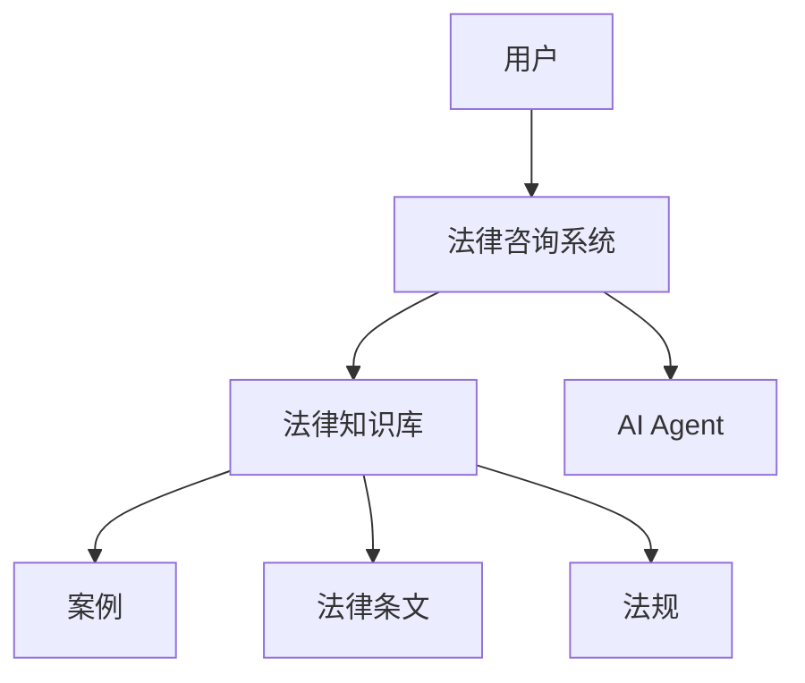
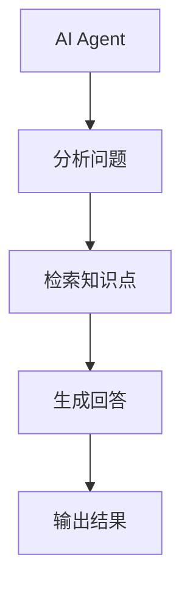

                 


# 《开发AI Agent支持的法律咨询系统》

## 关键词：AI Agent, 法律咨询, 系统架构, 知识库, 深度学习, 自然语言处理

## 摘要：本文详细探讨了开发AI Agent支持的法律咨询系统的各个方面，从核心概念到系统架构，从知识库构建到AI代理的实现，再到系统测试与优化。通过系统的理论分析和实践案例，本文为读者提供了一个全面的视角，帮助他们理解如何利用AI技术提升法律咨询服务的效率和准确性。

---

# 第1章: AI Agent与法律咨询系统概述

## 1.1 问题背景

### 1.1.1 当前法律咨询服务的痛点
传统法律咨询服务存在效率低、成本高、资源分配不均等问题。用户在寻求法律帮助时，常常面临咨询渠道有限、咨询效率低下、咨询质量参差不齐等挑战。

### 1.1.2 AI技术在法律咨询中的应用潜力
随着AI技术的快速发展，AI Agent（智能代理）在法律咨询中的应用潜力巨大。AI Agent可以通过自然语言处理技术理解用户的问题，结合法律知识库提供准确的解答，并根据实际情况动态调整响应策略。

### 1.1.3 法律咨询系统的需求与目标
法律咨询系统的需求主要集中在提高咨询效率、降低咨询成本、提升用户体验等方面。系统的目标是通过AI Agent实现24/7的法律咨询服务，提供准确、个性化的法律建议，并支持多种交互方式。

## 1.2 问题描述

### 1.2.1 法律咨询系统的核心功能
法律咨询系统需要具备以下核心功能：
- 用户身份验证与权限管理
- 法律问题理解与解析
- 法律知识检索与匹配
- 智能回答生成
- 历史记录与跟踪

### 1.2.2 AI Agent在法律咨询中的角色
AI Agent在法律咨询中扮演着多重角色：
- 作为用户界面，接收用户的法律问题
- 作为知识检索引擎，快速定位相关法律条文和案例
- 作为智能解答者，生成准确的法律建议
- 作为反馈收集者，持续优化系统性能

### 1.2.3 系统的边界与外延
系统的边界包括用户端、AI Agent、法律知识库和后台管理系统。外延则涉及与司法系统、律师事务所等外部系统的接口集成。

## 1.3 问题解决

### 1.3.1 AI Agent如何支持法律咨询
AI Agent通过自然语言处理技术理解用户的问题，结合法律知识库生成准确的回答。同时，AI Agent还可以根据用户的历史咨询记录，提供个性化的法律建议。

### 1.3.2 系统设计的总体思路
系统设计的总体思路是模块化设计，包括法律知识库、AI Agent、用户界面和后台管理系统。各模块之间通过标准化接口进行通信，确保系统的可扩展性和可维护性。

### 1.3.3 系统实现的关键技术
系统实现的关键技术包括：
- 自然语言处理（NLP）技术
- 知识图谱构建与查询技术
- 深度学习模型训练技术
- 分布式系统架构设计技术

## 1.4 本章小结
本章从问题背景、问题描述和问题解决三个方面，全面介绍了AI Agent支持的法律咨询系统的开发背景和需求。通过分析系统的边界与外延，明确了系统设计的总体思路和关键实现技术。

---

# 第2章: AI Agent的核心原理

## 2.1 AI Agent的基本原理

### 2.1.1 AI Agent的定义与分类
AI Agent是指能够感知环境并采取行动以实现目标的智能实体。根据应用场景的不同，AI Agent可以分为任务型AI Agent和对话型AI Agent。

### 2.1.2 AI Agent的核心算法
AI Agent的核心算法包括：
- 基于规则的推理算法
- 基于案例的推理算法
- 基于知识图谱的推理算法
- 基于深度学习的生成算法

### 2.1.3 AI Agent的决策机制
AI Agent的决策机制通常包括以下步骤：
1. 感知环境：通过传感器或输入接口获取环境信息
2. 分析问题：利用知识库和推理引擎分析问题的本质
3. 制定策略：基于分析结果生成多种可能的解决方案
4. 执行决策：选择最优方案并执行相应的动作
5. 反馈优化：根据执行结果调整决策策略

## 2.2 法律咨询系统的需求分析

### 2.2.1 用户需求分析
用户需求包括：
- 快速响应：用户希望得到及时的法律咨询
- 准确性：用户需要得到准确的法律建议
- 个性化：用户希望得到个性化的法律方案
- 隐私保护：用户关注咨询过程中的隐私安全

### 2.2.2 系统功能需求
系统功能需求包括：
- 用户注册与登录
- 法律问题提交
- AI Agent智能解答
- 历史记录查询
- 系统反馈与优化

### 2.2.3 系统性能需求
系统性能需求包括：
- 响应时间：确保用户提问的快速响应
- 处理能力：支持高并发用户请求
- 知识库更新：保持法律知识库的最新性
- 安全性：保障用户数据的安全

## 2.3 核心概念对比分析

### 2.3.1 AI Agent与传统法律咨询工具的对比
| 对比维度 | AI Agent | 传统法律咨询工具 |
|----------|-----------|--------------------|
| 响应时间 | 实时响应   | 需要人工处理       |
| 覆盖范围 | 全面覆盖   | 局限于特定领域     |
| 成本     | 降低      | 较高               |
| 可扩展性 | 高         | 低                |

### 2.3.2 不同AI Agent模型的性能对比
| 对比维度       | 基于规则的AI Agent | 基于深度学习的AI Agent |
|----------------|--------------------|-------------------------|
| 处理复杂性     | 低                 | 高                      |
| 知识库依赖     | 高                 | 较低                    |
| 可解释性       | 高                 | 较低                    |
| 精准度         | 中等               | 高                      |

### 2.3.3 法律知识库与普通数据库的对比
| 对比维度       | 法律知识库         | 普通数据库             |
|----------------|-------------------|-----------------------|
| 数据类型       | 结构化法律知识     | 任意数据类型           |
| 数据关联性     | 高度关联          | 低                   |
| 数据处理方式   | 支持语义理解       | 不支持语义理解         |
| 查询效率       | 较低              | 较高                 |

## 2.4 ER实体关系图


## 2.5 本章小结
本章详细介绍了AI Agent的核心原理，并从用户需求和系统功能的角度分析了法律咨询系统的需求。通过对AI Agent与传统法律咨询工具的对比，明确了AI Agent的优势和适用场景。

---

# 第3章: 法律知识库的构建

## 3.1 知识库设计原则

### 3.1.1 知识库的结构化设计
法律知识库需要结构化设计，包括法律条文、法规、案例等多个模块。每个模块都需要有明确的分类和标签，以便快速检索。

### 3.1.2 知识库的标准化
知识库的标准化包括：
- 数据格式统一
- 分类标准统一
- 标签体系统一

### 3.1.3 知识库的动态更新
法律知识库需要支持动态更新，确保知识库内容的时效性和准确性。动态更新可以通过自动化爬取和人工审核相结合的方式实现。

## 3.2 知识库的数据来源

### 3.2.1 法律条文
包括宪法、法律、法规等基本法律条文。

### 3.2.2 法律案例
包括最高人民法院的典型案例、地方法院的判例等。

### 3.2.3 法律法规解读
包括权威机构对法律条文的解读和阐释。

## 3.3 知识库的构建流程

### 3.3.1 数据收集
从多种渠道收集法律相关数据，包括官方网站、法律数据库、学术论文等。

### 3.3.2 数据清洗
对收集到的数据进行预处理，包括去重、格式转换、噪声去除等。

### 3.3.3 数据标注
对数据进行标注，包括分类、标签化、语义分析等。

### 3.3.4 数据存储
将标注后的数据存储到知识库中，采用分布式存储技术，确保数据的安全性和可扩展性。

## 3.4 知识抽取与语义分析

### 3.4.1 知识抽取
使用自然语言处理技术从法律文本中抽取关键信息，如法律条文、案例要点等。

### 3.4.2 语义分析
对抽取的知识进行语义分析，构建法律知识图谱，支持语义检索和关联分析。

## 3.5 本章小结
本章详细介绍了法律知识库的构建过程，包括设计原则、数据来源、构建流程、知识抽取与语义分析等方面。通过构建高质量的法律知识库，可以为AI Agent提供坚实的知识基础。

---

# 第4章: AI Agent的实现

## 4.1 算法原理

### 4.1.1 基于规则的推理算法
基于规则的推理算法通过预定义的规则对法律问题进行分析和解答。例如，根据合同条款生成违约责任分析。

### 4.1.2 基于深度学习的生成算法
基于深度学习的生成算法通过训练大量的法律文本，生成符合用户需求的法律建议。例如，利用GPT模型生成合同范本。

## 4.2 系统实现

### 4.2.1 系统核心代码实现
以下是一个基于规则的AI Agent实现示例：
```python
class LegalAI:
    def __init__(self, knowledge_base):
        self.knowledge_base = knowledge_base

    def analyze_question(self, question):
        # 分析问题并返回相关知识点
        pass

    def generate_answer(self,知识点):
        # 根据知识点生成回答
        pass
```

### 4.2.2 接口设计
系统需要设计标准化的接口，方便与其他模块的集成。例如，AI Agent与法律知识库之间的接口需要定义明确的输入输出格式。

### 4.2.3 交互设计
交互设计需要考虑用户体验，提供友好的用户界面和多渠道的交互方式，如文本输入、语音输入等。

## 4.3 算法流程图


## 4.4 本章小结
本章详细介绍了AI Agent的实现过程，包括算法原理和系统实现。通过具体的代码示例和流程图，展示了AI Agent如何与法律知识库协同工作，为用户提供准确的法律咨询。

---

# 第5章: 系统的测试与优化

## 5.1 测试方法

### 5.1.1 功能测试
测试系统的核心功能，包括用户注册、问题提交、回答生成等。

### 5.1.2 性能测试
测试系统的响应时间和处理能力，确保系统在高并发情况下的稳定运行。

### 5.1.3 安全测试
测试系统的安全性，确保用户数据的安全和隐私保护。

## 5.2 系统优化

### 5.2.1 知识库优化
优化知识库的存储结构和检索算法，提高查询效率。

### 5.2.2 算法优化
优化AI Agent的算法，提高回答的准确性和生成速度。

### 5.2.3 系统架构优化
优化系统架构，采用分布式架构和负载均衡技术，提高系统的扩展性和容错能力。

## 5.3 优化效果评估
通过测试数据和用户反馈，评估系统优化的效果，持续改进系统的性能和用户体验。

## 5.4 本章小结
本章详细介绍了系统的测试与优化方法，包括测试方法、系统优化和优化效果评估。通过系统的测试和优化，可以确保法律咨询系统的高效性和稳定性。

---

# 第6章: 总结与展望

## 6.1 总结
本文详细探讨了开发AI Agent支持的法律咨询系统的各个方面，包括系统设计、知识库构建、AI Agent实现等。通过系统的理论分析和实践案例，为读者提供了一个全面的视角。

## 6.2 展望
未来，随着AI技术的不断发展，AI Agent在法律咨询中的应用将更加广泛和深入。可以通过引入更多先进的技术，如增强学习、知识图谱等，进一步提升系统的智能化水平。

## 6.3 本章小结
本章总结了全文的主要内容，并对未来的研究方向进行了展望，为读者提供了进一步学习和研究的方向。

---

# 作者：AI天才研究院/AI Genius Institute & 禅与计算机程序设计艺术 /Zen And The Art of Computer Programming

