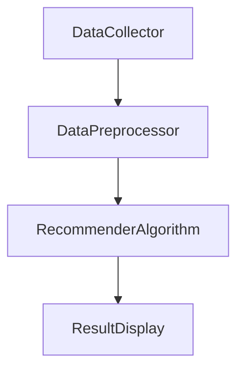
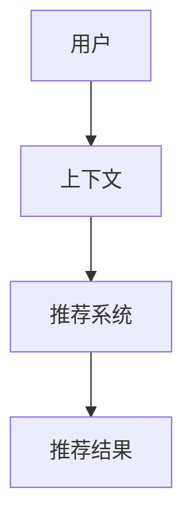
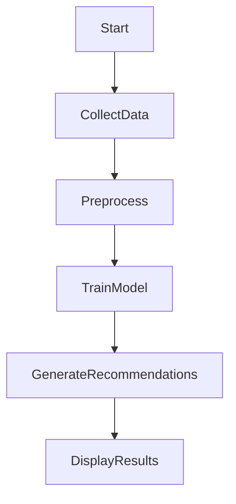
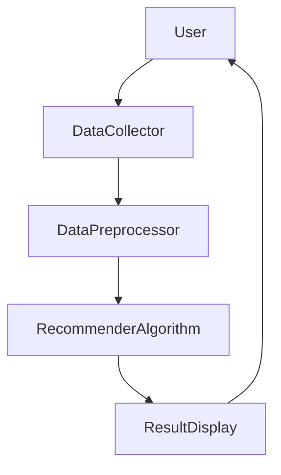

                 


# 开发AI Agent的上下文感知推荐系统

> 关键词：AI Agent, 上下文感知推荐系统, 推荐算法, 系统架构, 项目实战

> 摘要：本文详细探讨了AI Agent在上下文感知推荐系统中的应用，从背景介绍、核心概念、算法原理到系统架构和项目实战，逐步分析了如何利用AI Agent增强推荐系统的智能性和动态适应性。通过具体案例和代码实现，展示了如何构建一个高效、智能的推荐系统，帮助读者全面理解并掌握相关技术。

---

# 第一部分：AI Agent与上下文感知推荐系统概述

## 第1章：背景介绍

### 1.1 问题背景

#### 1.1.1 传统推荐系统的局限性
传统的推荐系统主要依赖协同过滤和基于内容的推荐方法，这些方法在处理大规模数据时存在以下问题：
- **数据稀疏性**：当用户数量庞大时，用户之间的相似性可能较低，导致推荐结果不够准确。
- **实时性不足**：传统推荐系统通常基于静态数据进行推荐，难以实时适应用户行为的变化。
- **缺乏上下文理解**：无法有效利用时间、地点、设备等上下文信息，导致推荐结果不够精准。

#### 1.1.2 上下文感知推荐的必要性
上下文感知推荐系统通过整合多模态数据（如用户行为、地理位置、时间、社交网络等），能够提供更个性化和动态的推荐结果。例如：
- 在电商平台上，可以根据用户的浏览历史和当前时间推荐商品。
- 在音乐播放器中，可以根据用户的听歌习惯和当前心情推荐歌曲。

#### 1.1.3 AI Agent在推荐系统中的作用
AI Agent（智能体）是一种能够感知环境、执行任务并进行自适应的智能系统。在推荐系统中，AI Agent可以：
- 实时收集和分析用户行为数据。
- 根据上下文信息动态调整推荐策略。
- 与用户进行交互，提供更个性化的推荐服务。

### 1.2 问题描述

#### 1.2.1 推荐系统的定义与目标
推荐系统是一种信息过滤技术，旨在为用户提供与其兴趣相关的内容或商品。其目标包括：
- 提高用户满意度。
- 增加用户参与度。
- 提升系统的推荐准确率和召回率。

#### 1.2.2 上下文感知推荐的核心问题
上下文感知推荐的核心问题在于如何有效地利用上下文信息来提升推荐的准确性和相关性。这需要解决以下问题：
- 如何高效地收集和处理多模态上下文数据。
- 如何将上下文信息与用户偏好相结合，生成个性化的推荐结果。

#### 1.2.3 AI Agent在推荐系统中的角色
AI Agent在推荐系统中扮演着桥梁的角色，负责：
- 感知环境：收集用户的上下文信息，如地理位置、时间、设备类型等。
- 分析数据：利用机器学习算法分析数据，生成推荐候选。
- 与用户交互：根据用户反馈调整推荐策略，提供实时推荐。

### 1.3 问题解决思路

#### 1.3.1 基于上下文信息的推荐方法
上下文感知推荐系统可以通过以下方法实现：
- **协同过滤增强**：结合上下文信息进行协同过滤，提升推荐准确率。
- **内容推荐结合**：将上下文信息与内容特征相结合，生成更精准的推荐。
- **混合推荐策略**：结合多种推荐方法，根据上下文动态选择最优策略。

#### 1.3.2 AI Agent如何增强推荐系统的智能性
AI Agent通过以下方式增强推荐系统的智能性：
- **实时学习**：AI Agent能够实时学习用户的偏好，快速调整推荐策略。
- **多模态数据处理**：AI Agent能够处理文本、图像、语音等多种数据类型，提供更全面的上下文信息。
- **自适应推荐**：AI Agent能够根据用户行为和环境变化，动态调整推荐策略。

#### 1.3.3 系统设计的总体思路
系统设计的总体思路包括以下步骤：
1. **数据采集**：收集用户行为数据、上下文信息等。
2. **数据预处理**：清洗和标准化数据，提取特征。
3. **推荐算法设计**：选择合适的推荐算法，并结合上下文信息进行优化。
4. **系统集成**：将算法集成到推荐系统中，实现实时推荐。
5. **系统优化**：根据用户反馈优化推荐策略，提升推荐效果。

### 1.4 系统的边界与外延

#### 1.4.1 推荐系统的边界
推荐系统的边界包括：
- 输入：用户行为数据、上下文信息。
- 输出：推荐结果。
- 界面：与用户的交互界面。

#### 1.4.2 上下文感知推荐的外延
上下文感知推荐的外延包括：
- 多模态数据处理：整合文本、图像、语音等多种数据类型。
- 动态调整：根据实时数据动态调整推荐策略。
- 跨场景应用：在不同场景（如移动应用、网页、物联网设备）中应用。

#### 1.4.3 AI Agent与其他推荐方法的界限
AI Agent与其他推荐方法的界限在于：
- AI Agent具有自主性和智能性，能够主动感知环境并做出决策。
- 其他推荐方法通常基于固定规则或静态数据，缺乏动态调整能力。

### 1.5 核心概念结构与组成

#### 1.5.1 系统的核心组成模块
推荐系统的组成模块包括：
1. **数据采集模块**：收集用户行为数据、上下文信息。
2. **数据预处理模块**：清洗数据，提取特征。
3. **推荐算法模块**：实现推荐算法，生成候选推荐。
4. **结果展示模块**：将推荐结果呈现给用户。

#### 1.5.2 各模块之间的关系
模块之间的关系可以用以下流程图表示：



#### 1.5.3 核心要素的定义与作用
核心要素包括：
- **用户数据**：用户的浏览历史、点击行为、购买记录等。
- **上下文数据**：时间、地点、设备类型、社交网络信息等。
- **推荐算法**：协同过滤、基于内容的推荐、基于知识图谱的推荐等。

---

## 第2章：核心概念与联系

### 2.1 AI Agent的核心原理

#### 2.1.1 AI Agent的基本定义
AI Agent是一种智能体，能够感知环境、执行任务并进行自适应。在推荐系统中，AI Agent可以：
- 收集用户的上下文信息。
- 分析数据，生成推荐候选。
- 与用户交互，提供个性化推荐。

#### 2.1.2 基于上下文的推理机制
基于上下文的推理机制包括：
- **上下文特征提取**：从多模态数据中提取有用的特征。
- **关联分析**：分析上下文特征与用户偏好的关联性。
- **动态调整**：根据上下文信息动态调整推荐策略。

#### 2.1.3 多模态数据处理能力
AI Agent能够处理多种数据类型，如文本、图像、语音等。例如：
- 通过自然语言处理技术分析用户的文本输入。
- 通过计算机视觉技术处理图像数据。

### 2.2 上下文感知推荐系统的原理

#### 2.2.1 上下文信息的采集与处理
上下文信息的采集与处理包括：
- **数据采集**：通过传感器、日志记录等方式获取上下文数据。
- **数据预处理**：清洗数据，提取特征。
- **数据融合**：将多模态数据进行融合，生成综合的上下文信息。

#### 2.2.2 动态适应用户需求的机制
动态适应用户需求的机制包括：
- **实时反馈**：根据用户的实时行为调整推荐策略。
- **预测模型**：利用机器学习模型预测用户的偏好变化。
- **自适应算法**：采用自适应算法，动态优化推荐结果。

#### 2.2.3 上下文信息与推荐结果的关联
上下文信息与推荐结果的关联可以通过以下方式实现：
- **特征加权**：根据上下文信息对推荐特征进行加权。
- **模型融合**：将上下文信息融入推荐模型中，提升推荐效果。

### 2.3 核心概念对比表

| 比较维度       | AI Agent                         | 上下文感知推荐系统                     |
|----------------|----------------------------------|---------------------------------------|
| 核心目标       | 执行任务，感知环境               | 提供个性化推荐                         |
| 输入数据       | 用户行为、上下文信息             | 多模态数据                             |
| 输出结果       | 推荐结果                         | 推荐结果                               |
| 自适应能力     | 强，能够动态调整推荐策略         | 强，能够根据上下文信息动态调整         |
| 应用场景       | 个性化推荐、智能助手             | 电商、音乐、视频推荐                   |

### 2.4 ER实体关系图



---

## 第3章：算法原理讲解

### 3.1 算法原理概述

#### 3.1.1 基于协同过滤的推荐算法
协同过滤是一种经典的推荐算法，通过分析用户的行为数据，找到相似的用户或物品，进行推荐。公式如下：
$$
similarity(u, v) = \frac{\sum_{i \in I} (r_{u,i} - \bar{r}_u)(r_{v,i} - \bar{r}_v)}{\sqrt{\sum_{i \in I} (r_{u,i} - \bar{r}_u)^2} \cdot \sqrt{\sum_{i \in I} (r_{v,i} - \bar{r}_v)^2}}
$$
其中，$\bar{r}_u$和$\bar{r}_v$分别是用户u和v的平均评分。

#### 3.1.2 基于内容的推荐算法
基于内容的推荐算法通过分析物品的特征，找到与用户兴趣相似的物品。例如，在音乐推荐中，可以分析歌曲的特征向量，找到相似的歌曲进行推荐。

#### 3.1.3 基于知识图谱的推荐算法
基于知识图谱的推荐算法通过构建知识图谱，分析物品之间的语义关系，推荐相关的物品。例如，在电商中，可以推荐与当前商品相关联的其他商品。

### 3.2 算法流程图



### 3.3 Python代码实现

```python
def collaborative_filtering(user_data, target_user):
    # 计算用户相似性
    similarities = {}
    for user in user_data:
        if user != target_user:
            similarity = calculate_similarity(user_data[user], user_data[target_user])
            similarities[user] = similarity
    # 找到相似度最高的用户
    similar_user = max(similarities, key=lambda k: similarities[k])
    return user_data[similar_user]
```

---

## 第4章：系统架构设计

### 4.1 系统架构概述

#### 4.1.1 系统组成模块
推荐系统的组成模块包括：
1. **数据采集模块**：收集用户行为数据和上下文信息。
2. **数据预处理模块**：清洗数据，提取特征。
3. **推荐算法模块**：实现推荐算法，生成候选推荐。
4. **结果展示模块**：将推荐结果呈现给用户。

#### 4.1.2 系统功能设计
系统功能设计包括：
- 数据采集：通过日志记录、传感器等方式获取用户行为和上下文信息。
- 数据预处理：清洗数据，去除噪声，提取有用的特征。
- 推荐算法：实现协同过滤、基于内容的推荐、基于知识图谱的推荐等算法。
- 结果展示：将推荐结果以用户友好的形式展示。

### 4.2 系统架构图



---

## 第5章：项目实战

### 5.1 项目背景与目标

#### 5.1.1 项目背景
以电商推荐系统为例，目标是通过AI Agent实现上下文感知推荐，提升用户购买率和满意度。

#### 5.1.2 项目目标
- 实现基于用户行为和上下文信息的推荐系统。
- 提升推荐系统的准确性和实时性。

### 5.2 项目实现步骤

#### 5.2.1 环境搭建
- 安装必要的库：Python、TensorFlow、Keras、Pandas等。
- 配置开发环境：安装Jupyter Notebook或IDE。

#### 5.2.2 数据预处理
- 数据清洗：去除无效数据，处理缺失值。
- 特征提取：提取用户ID、商品ID、时间戳等特征。

#### 5.2.3 模型训练
- 选择推荐算法：基于协同过滤的推荐算法。
- 训练模型：利用用户行为数据训练推荐模型。

#### 5.2.4 结果展示
- 展示推荐结果：将推荐结果以列表形式展示给用户。
- 收集用户反馈：记录用户的点击、购买等行为，用于后续优化。

### 5.3 代码实现

```python
import pandas as pd
from sklearn.metrics.pairwise import cosine_similarity

def main():
    # 加载数据
    data = pd.read_csv('user_behavior.csv')
    # 数据预处理
    data = data.dropna()
    # 计算相似度
    user_similarity = cosine_similarity(data[['rating']], data[['rating']])
    # 生成推荐结果
    recommendations = []
    for i in range(len(data)):
        similar_users = user_similarity[i].argsort()[::-1][:5]
        recommendations.append(data.iloc[similar_users]['item'].values)
    # 展示结果
    print(recommendations)

if __name__ == '__main__':
    main()
```

---

## 第6章：最佳实践

### 6.1 小结

#### 6.1.1 核心内容回顾
本文详细介绍了AI Agent在上下文感知推荐系统中的应用，包括背景介绍、核心概念、算法原理、系统架构和项目实战。

#### 6.1.2 系统设计的关键点
- 数据采集与处理：确保数据的完整性和准确性。
- 算法选择：根据具体场景选择合适的推荐算法。
- 系统优化：根据用户反馈不断优化推荐策略。

### 6.2 注意事项

#### 6.2.1 开发中的常见问题
- 数据稀疏性：可以通过引入外部数据或采用混合推荐策略来解决。
- 实时性问题：可以通过分布式计算和缓存技术提升推荐速度。

#### 6.2.2 实际应用中的注意事项
- 确保数据隐私和用户安全。
- 定期更新模型，避免过时数据影响推荐效果。

### 6.3 拓展阅读

#### 6.3.1 推荐的书籍和资源
- 《推荐系统实战》
- 《机器学习实战》
- TensorFlow官方文档

#### 6.3.2 热门研究方向
- 基于强化学习的推荐系统。
- 基于图神经网络的推荐系统。

---

# 作者

作者：AI天才研究院 & 禅与计算机程序设计艺术

