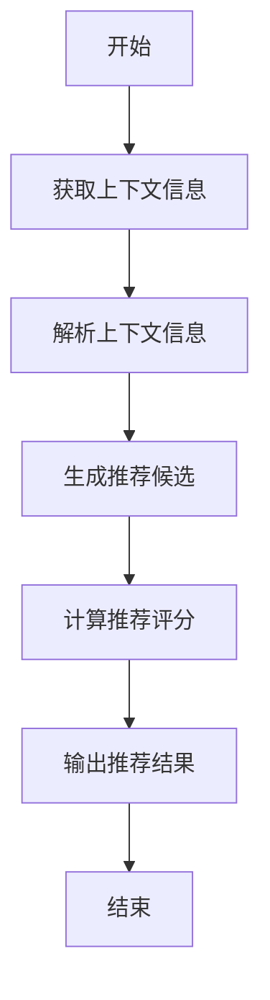
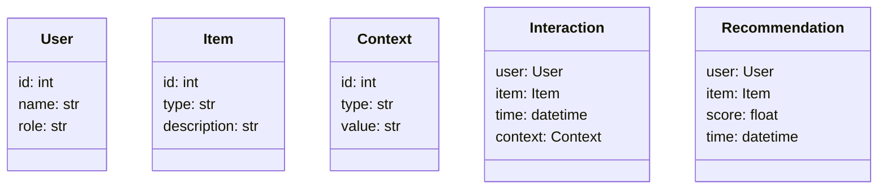
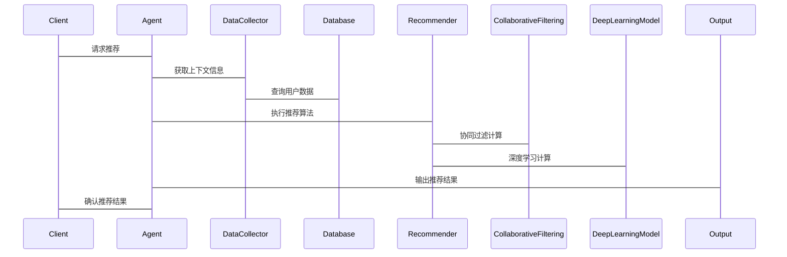

                 


# 开发AI Agent的上下文感知推荐系统

关键词：上下文感知推荐、AI Agent、推荐系统、深度学习、协同过滤

摘要：本文深入探讨了开发AI Agent驱动的上下文感知推荐系统的理论基础、算法原理和系统架构。通过分析上下文感知推荐的核心概念、AI Agent的角色与功能，结合实际应用场景，详细阐述了系统设计与实现的关键技术，包括算法选择、系统架构设计、接口设计和交互流程。文章还提供了具体的代码实现和案例分析，帮助读者理解如何构建高效、智能的推荐系统。最后，总结了开发此类系统的最佳实践和未来研究方向。

---

# 第一部分: 背景介绍与核心概念

## 第1章: 背景介绍与核心概念

### 1.1 问题背景与问题描述

#### 1.1.1 推荐系统的发展历程
推荐系统作为一种重要的信息过滤技术，经历了从简单到复杂的演变。早期的推荐系统基于协同过滤算法，通过用户行为数据进行推荐。随着技术的发展，推荐系统逐渐引入了机器学习、深度学习等技术，进一步提升了推荐的准确性和个性化。然而，传统的推荐系统往往忽视了上下文信息，导致推荐结果缺乏灵活性和适应性。

#### 1.1.2 上下文感知推荐的必要性
上下文感知推荐是一种基于当前用户行为、环境和交互状态的推荐方式。例如，在电商场景中，用户的行为可能受到时间、地点、设备类型等因素的影响。传统的推荐系统难以捕捉这些动态变化的信息，而上下文感知推荐能够通过实时获取和分析这些信息，提供更精准的推荐结果。

#### 1.1.3 AI Agent在推荐系统中的角色
AI Agent（人工智能代理）是一种能够感知环境、自主决策并执行任务的智能实体。在推荐系统中，AI Agent可以作为推荐过程的核心驱动力，通过收集、分析和处理上下文信息，动态调整推荐策略，从而实现更智能、更个性化的推荐。

### 1.2 核心概念与问题解决

#### 1.2.1 上下文感知推荐的定义
上下文感知推荐是一种基于动态上下文信息的推荐技术，旨在通过分析用户行为、环境特征和交互状态，生成更符合用户需求的推荐结果。其核心在于利用实时信息提升推荐的准确性和用户体验。

#### 1.2.2 AI Agent的定义与特点
AI Agent是一种能够感知环境、自主决策并执行任务的智能系统。其特点包括：
1. **自主性**：能够在没有外部干预的情况下完成任务。
2. **反应性**：能够实时感知环境变化并做出相应调整。
3. **学习能力**：能够通过数据和经验不断优化自身的推荐策略。

#### 1.2.3 问题解决的思路与方法
上下文感知推荐系统的核心思路在于结合AI Agent的自主性和学习能力，动态分析用户的上下文信息，实时调整推荐策略。具体方法包括：
1. **数据采集**：通过传感器、日志记录等方式获取用户的实时行为数据。
2. **上下文分析**：对采集到的上下文信息进行解析，提取关键特征。
3. **推荐策略优化**：基于上下文信息，动态调整推荐算法的参数，生成更精准的推荐结果。

### 1.3 概念结构与核心要素

#### 1.3.1 上下文感知推荐系统的构成
上下文感知推荐系统主要由以下几个部分构成：
1. **数据采集模块**：负责采集用户的实时行为数据。
2. **上下文分析模块**：对采集到的上下文信息进行解析和特征提取。
3. **推荐算法模块**：基于上下文信息，生成推荐结果。
4. **AI Agent模块**：作为系统的控制中心，协调各个模块的工作，动态调整推荐策略。

#### 1.3.2 AI Agent的核心要素
AI Agent的核心要素包括：
1. **感知模块**：用于感知环境和用户行为。
2. **决策模块**：基于感知信息，制定推荐策略。
3. **执行模块**：根据决策结果，执行推荐操作。

#### 1.3.3 两者的相互关系与边界
上下文感知推荐系统与AI Agent之间存在密切的关系。AI Agent作为系统的控制中心，负责协调各个模块的工作，动态调整推荐策略。而上下文感知推荐系统则通过采集和分析上下文信息，为AI Agent提供决策依据。两者的结合使得推荐系统更加智能化和个性化。

---

## 第2章: 核心概念与联系

### 2.1 核心概念原理

#### 2.1.1 上下文感知推荐的原理
上下文感知推荐的原理在于通过实时采集和分析用户的上下文信息，动态调整推荐策略。具体步骤包括：
1. **数据采集**：通过传感器、日志记录等方式采集用户的实时行为数据。
2. **上下文分析**：对采集到的上下文信息进行解析，提取关键特征。
3. **推荐策略优化**：基于上下文信息，动态调整推荐算法的参数，生成更精准的推荐结果。

#### 2.1.2 AI Agent的工作原理
AI Agent的工作原理包括感知、决策和执行三个阶段：
1. **感知阶段**：通过传感器或日志记录等方式感知环境和用户行为。
2. **决策阶段**：基于感知信息，制定推荐策略。
3. **执行阶段**：根据决策结果，执行推荐操作。

#### 2.1.3 两者的结合方式
上下文感知推荐与AI Agent的结合方式主要体现在以下几个方面：
1. **数据共享**：上下文感知推荐系统采集的上下文信息被AI Agent感知模块获取。
2. **策略调整**：AI Agent根据感知到的上下文信息，动态调整推荐策略。
3. **协同工作**：AI Agent协调上下文感知推荐系统和推荐算法模块的工作，实现更智能的推荐。

### 2.2 概念属性特征对比

#### 2.2.1 上下文感知推荐的属性特征
| 属性 | 描述 |
|------|------|
| 数据源 | 用户行为、环境特征、交互状态 |
| 数据类型 | 结构化数据、非结构化数据 |
| 数据采集方式 | 传感器、日志记录、用户输入 |
| 数据处理方式 | 实时处理、离线处理 |

#### 2.2.2 AI Agent的属性特征
| 属性 | 描述 |
|------|------|
| 自主性 | 能够自主决策和执行任务 |
| 反应性 | 能够实时感知环境变化并做出相应调整 |
| 学习能力 | 能够通过数据和经验不断优化自身策略 |

#### 2.2.3 对比分析与总结
上下文感知推荐和AI Agent在属性特征上存在一定的差异。上下文感知推荐更注重数据的采集和处理，而AI Agent更注重自主性和学习能力。然而，两者在实现智能化推荐方面具有互补性，结合两者的优势，可以构建更高效、更智能的推荐系统。

### 2.3 ER实体关系图

```mermaid
er
  actor(AgentID, Name, Role)
  item(ItemID, Type, Description)
  interaction(AgentID, ItemID, Time, Context)
  context(ContextID, Type, Value)
  recommendation(AgentID, ItemID, Score, Time)
```

---

## 第3章: 算法原理讲解

### 3.1 算法原理概述

#### 3.1.1 上下文感知推荐的基本算法
上下文感知推荐的基本算法包括协同过滤、基于内容的推荐和基于深度学习的推荐。其中，协同过滤是一种经典的推荐算法，基于用户行为数据进行推荐。

#### 3.1.2 AI Agent推荐的算法特点
AI Agent推荐的算法特点包括实时性、动态性和个性化。AI Agent能够实时感知环境和用户行为，动态调整推荐策略，从而实现个性化的推荐。

### 3.2 算法流程图



### 3.3 核心算法实现

#### 3.3.1 协同过滤算法

```python
def collaborative_filtering(user_id, user_data):
    # 计算用户相似度
    similarities = {}
    for user in user_data:
        if user != user_id:
            similarities[user] = cosine_similarity(user_data[user_id], user_data[user])
    # 找出最相似的用户
    similar_users = sorted(similarities.items(), key=lambda x: x[1], reverse=True)[:5]
    # 生成推荐列表
    recommendations = {}
    for user in similar_users:
        for item in user_data[user]:
            if item not in recommendations:
                recommendations[item] = 1
    return recommendations
```

---

## 第4章: 系统分析与架构设计

### 4.1 系统功能设计

#### 4.1.1 功能模块划分
系统功能模块包括：
1. **数据采集模块**：负责采集用户的实时行为数据。
2. **上下文分析模块**：对采集到的上下文信息进行解析和特征提取。
3. **推荐算法模块**：基于上下文信息，生成推荐结果。
4. **AI Agent模块**：作为系统的控制中心，协调各个模块的工作，动态调整推荐策略。

#### 4.1.2 领域模型类图



#### 4.1.3 系统架构设计

```mermaid
architectural
    Client --> Agent: 请求推荐
    Agent --> DataCollector: 收集数据
    DataCollector --> Database: 存储数据
    Agent --> Recommender: 执行推荐
    Recommender --> CollaborativeFiltering: 协同过滤算法
    Recommender --> DeepLearningModel: 深度学习模型
    Agent --> Output: 输出推荐结果
```

#### 4.1.4 接口设计
系统接口设计包括：
1. **数据采集接口**：用于采集用户的实时行为数据。
2. **上下文分析接口**：用于解析和特征提取上下文信息。
3. **推荐结果接口**：用于输出推荐结果。

#### 4.1.5 交互流程



---

## 第5章: 项目实战

### 5.1 环境安装

#### 5.1.1 系统要求
- Python 3.6+
- numpy、pandas、scikit-learn、tensorflow等库

#### 5.1.2 安装依赖
```bash
pip install numpy pandas scikit-learn tensorflow
```

### 5.2 系统核心实现

#### 5.2.1 数据采集模块

```python
import numpy as np
import pandas as pd
from sklearn.metrics import cosine_similarity

def collaborative_filtering(user_id, user_data):
    # 计算用户相似度
    similarities = {}
    for user in user_data:
        if user != user_id:
            similarities[user] = cosine_similarity(user_data[user_id], user_data[user])
    # 找出最相似的用户
    similar_users = sorted(similarities.items(), key=lambda x: x[1], reverse=True)[:5]
    # 生成推荐列表
    recommendations = {}
    for user in similar_users:
        for item in user_data[user]:
            if item not in recommendations:
                recommendations[item] = 1
    return recommendations
```

#### 5.2.2 AI Agent模块

```python
class AI_Agent:
    def __init__(self, user_data):
        self.user_data = user_data

    def recommend(self, user_id):
        # 获取上下文信息
        context = self.get_context(user_id)
        # 生成推荐候选
        candidates = self.generate_candidates(user_id, context)
        # 计算推荐评分
        scores = self.calculate_scores(user_id, candidates, context)
        # 输出推荐结果
        return self.output_results(user_id, candidates, scores)

    def get_context(self, user_id):
        # 获取用户的上下文信息
        pass

    def generate_candidates(self, user_id, context):
        # 生成推荐候选
        pass

    def calculate_scores(self, user_id, candidates, context):
        # 计算推荐评分
        pass

    def output_results(self, user_id, candidates, scores):
        # 输出推荐结果
        pass
```

#### 5.2.3 案例分析

```python
user_data = {
    'user1': {'item1': 5, 'item2': 4, 'item3': 3},
    'user2': {'item1': 4, 'item4': 5},
    'user3': {'item2': 4, 'item5': 5}
}

agent = AI_Agent(user_data)
recommendations = agent.recommend('user1')
print(recommendations)
```

### 5.3 项目总结

#### 5.3.1 系统优势
- 实时性：能够实时感知用户行为和环境变化，动态调整推荐策略。
- 个性化：通过上下文信息，实现更个性化的推荐。
- 高效性：结合AI Agent和深度学习算法，提升推荐效率和准确性。

#### 5.3.2 改进建议
- 引入更复杂的深度学习模型，如Transformer或GNN，进一步提升推荐效果。
- 增强系统的实时性，通过流处理技术优化上下文信息的处理速度。
- 优化系统的可扩展性，支持更大规模的数据和用户。

---

## 第6章: 最佳实践与注意事项

### 6.1 最佳实践

#### 6.1.1 数据采集
- 确保数据的实时性和准确性。
- 处理缺失值和噪声数据。

#### 6.1.2 算法选择
- 根据具体场景选择合适的算法，如协同过滤、深度学习等。
- 组合多种算法，提升推荐效果。

#### 6.1.3 系统设计
- 优化系统的架构设计，提升系统的可扩展性和可维护性。
- 使用容器化技术（如Docker）部署系统，简化部署和管理。

### 6.2 小结
上下文感知推荐系统与AI Agent的结合，为推荐系统的发展提供了新的思路和方向。通过实时感知用户行为和环境变化，动态调整推荐策略，可以实现更智能、更个性化的推荐。

### 6.3 注意事项
- 注意数据隐私和安全问题，确保用户数据的保护。
- 确保系统的实时性和响应速度，避免影响用户体验。
- 定期优化系统的算法和架构，提升推荐效果和系统性能。

---

## 第7章: 拓展阅读与进一步思考

### 7.1 拓展阅读
- 《推荐系统导论》
- 《深度学习在推荐系统中的应用》
- 《人工智能代理的设计与实现》

### 7.2 进一步思考
- 如何在上下文感知推荐系统中引入更多类型的上下文信息，如情感分析、语境理解等？
- 如何结合强化学习，进一步优化AI Agent的推荐策略？
- 如何在边缘计算和物联网环境下，实现更高效的上下文感知推荐？

---

作者：AI天才研究院/AI Genius Institute & 禅与计算机程序设计艺术 /Zen And The Art of Computer Programming

