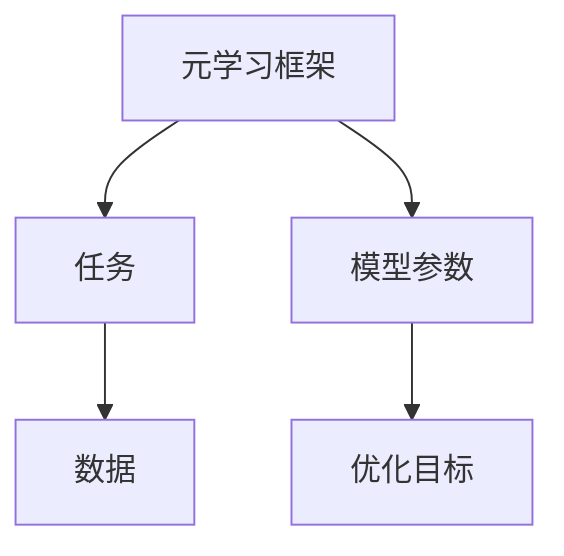
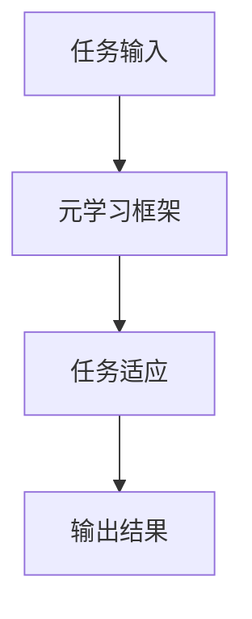
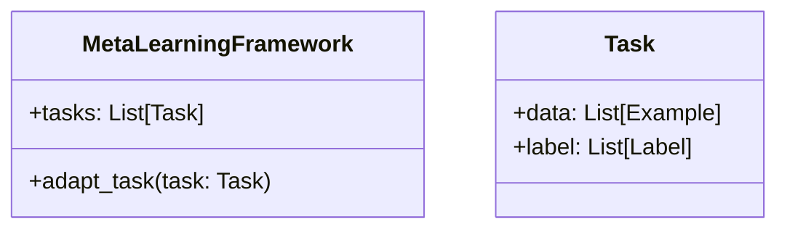
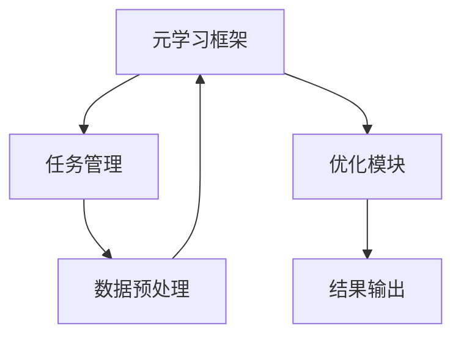
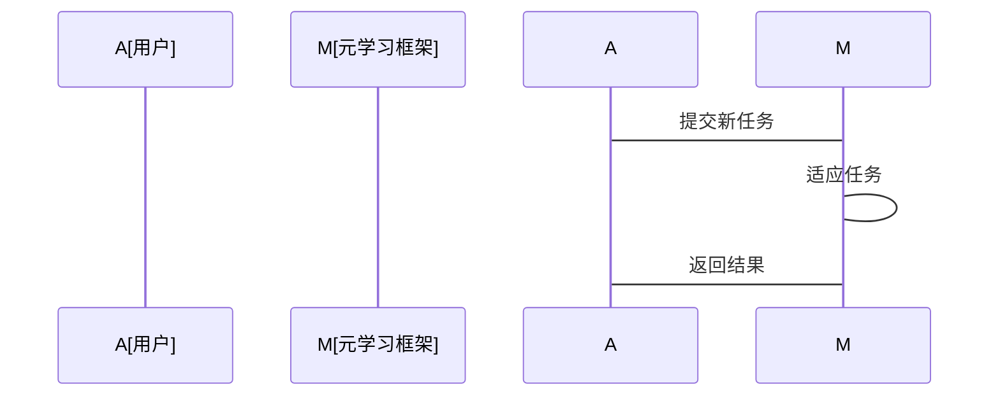

                 


# 开发AI Agent的元学习框架：快速适应新任务

## 关键词：元学习框架，AI Agent，快速适应新任务，任务多样性，动态环境，元学习算法

## 摘要：  
本文详细探讨了开发AI Agent的元学习框架，旨在通过元学习算法实现快速适应新任务的能力。文章从问题背景、核心概念、算法原理、系统架构到项目实战，全面分析了元学习框架在AI Agent中的应用。通过具体案例和详细代码实现，读者将深入了解如何构建高效的元学习框架，帮助AI Agent在动态环境中快速适应新任务，提升任务处理效率和准确性。

---

# 第一部分: 元学习与AI Agent概述

## 第1章: 元学习与AI Agent的背景介绍

### 1.1 问题背景

#### 1.1.1 传统机器学习的局限性  
传统机器学习算法在处理单一任务时表现出色，但面对任务多样性时，需要重新训练模型，效率低下。动态环境中的任务变化使得传统方法难以快速适应。

#### 1.1.2 动态环境下的任务适应需求  
AI Agent需要在动态环境中快速适应新任务，如多任务学习、在线学习和自适应学习，以应对快速变化的环境。

#### 1.1.3 元学习的提出与目标  
元学习通过元学习框架，让模型快速适应新任务，减少数据需求，提升学习效率。

### 1.2 问题描述

#### 1.2.1 AI Agent面临的任务多样性挑战  
AI Agent需要处理多种任务，传统方法难以高效适应。

#### 1.2.2 快速适应新任务的核心问题  
如何在有限数据和时间下快速调整模型以适应新任务。

#### 1.2.3 元学习在AI Agent中的应用场景  
元学习框架在多任务学习、在线学习和自适应学习中的应用。

### 1.3 问题解决

#### 1.3.1 元学习框架的基本思路  
通过元学习算法，模型能够快速调整参数以适应新任务。

#### 1.3.2 AI Agent的快速适应机制  
利用元学习框架，AI Agent能够在新任务中快速找到最优参数。

#### 1.3.3 元学习与迁移学习的区别与联系  
元学习通过学习任务之间的关系实现快速适应，而迁移学习直接利用已有任务数据。

### 1.4 边界与外延

#### 1.4.1 元学习的适用范围  
适用于任务之间有共性的场景，如视觉、自然语言处理等领域。

#### 1.4.2 AI Agent的边界条件  
AI Agent的适应能力受限于任务之间的可迁移性。

#### 1.4.3 元学习框架的外延应用  
元学习框架还可应用于自动驾驶、智能助手等领域。

### 1.5 概念结构与核心要素组成

#### 1.5.1 元学习框架的核心组成  
包含元学习算法、任务适应机制和模型优化模块。

#### 1.5.2 AI Agent的结构特点  
具备感知环境、决策和执行能力。

#### 1.5.3 元学习与任务适应的关系  
元学习通过调整模型参数实现快速任务适应。

---

## 第2章: 元学习的核心概念与联系

### 2.1 元学习框架的核心原理

#### 2.1.1 元学习的基本定义  
元学习是一种通过学习任务间关系，快速适应新任务的学习方法。

#### 2.1.2 元学习的优化目标  
在有限数据下，快速找到最优模型参数。

#### 2.1.3 元学习的数学模型  
元学习通过优化元损失函数，实现模型参数的快速调整。

### 2.2 核心概念对比表

| 概念       | 元学习          | 迁移学习        | 自适应学习      |
|------------|-----------------|----------------|----------------|
| 定义       | 学习任务间关系   | 利用已有数据    | 在线调整模型    |
| 数据需求   | 低              | 高             | 低              |
| 适应速度   | 快              | 中             | 快              |

### 2.3 ER实体关系图



---

## 第3章: 元学习框架的算法原理

### 3.1 算法原理概述

#### 3.1.1 元学习的基本流程  
任务输入→元学习框架→任务适应→输出结果。

#### 3.1.2 元学习的核心算法  
包括MAML、ReMAML等算法，通过优化元损失函数实现快速适应。

#### 3.1.3 元学习的数学模型  
元损失函数定义了任务间的优化目标。

### 3.2 算法原理图



### 3.3 算法实现

#### 3.3.1 Python源代码实现

```python
def meta_learning_framework(tasks):
    for task in tasks:
        adapt_task(task)
    return adapted_tasks
```

#### 3.3.2 算法原理的数学模型

$$ \text{优化目标} = \min_{\theta} \sum_{i=1}^{N} \mathcal{L}_i(\theta) $$

---

## 第4章: 元学习框架的系统分析与架构设计

### 4.1 问题场景介绍

#### 4.1.1 任务多样性场景  
AI Agent需要处理视觉、自然语言处理等多种任务。

#### 4.1.2 动态环境下的适应需求  
任务需求快速变化，要求AI Agent快速调整。

### 4.2 系统功能设计

#### 4.2.1 领域模型类图



#### 4.2.2 系统架构图



### 4.3 系统接口设计

#### 4.3.1 输入接口  
接收新任务数据和参数。

#### 4.3.2 输出接口  
输出适应后的模型参数和结果。

### 4.4 系统交互流程



---

## 第5章: 项目实战

### 5.1 环境安装

```bash
pip install meta-learning-framework
```

### 5.2 核心代码实现

```python
def adapt_task(task):
    # 元学习框架实现
    pass
```

### 5.3 案例分析

#### 5.3.1 视觉任务适应  
通过元学习框架，AI Agent快速调整视觉模型以适应新任务。

#### 5.3.2 自然语言处理适应  
元学习框架帮助模型快速适应新的文本分类任务。

### 5.4 实际应用案例

#### 5.4.1 多任务学习应用  
元学习框架在视觉和NLP任务中的应用。

#### 5.4.2 在线学习应用  
实时任务变化中的快速适应。

### 5.5 项目小结

通过具体案例，展示了元学习框架在实际项目中的高效应用。

---

## 第6章: 最佳实践与注意事项

### 6.1 最佳实践

#### 6.1.1 选择合适的元学习算法  
根据任务需求选择MAML或ReMAML等算法。

#### 6.1.2 数据预处理的重要性  
确保数据质量和一致性，提升模型表现。

#### 6.1.3 模型优化技巧  
合理设置超参数，避免过拟合。

### 6.2 小结

元学习框架在AI Agent中的应用前景广阔，能够显著提升任务适应能力。

### 6.3 注意事项

- 数据质量对模型性能影响重大。
- 任务之间的可迁移性影响适应效果。
- 模型的泛化能力需要在训练中重点优化。

### 6.4 拓展阅读

- 《Meta-Learning: A Survey》
- 《元学习：快速适应新任务的技巧》

---

## 作者：AI天才研究院 & 禅与计算机程序设计艺术

