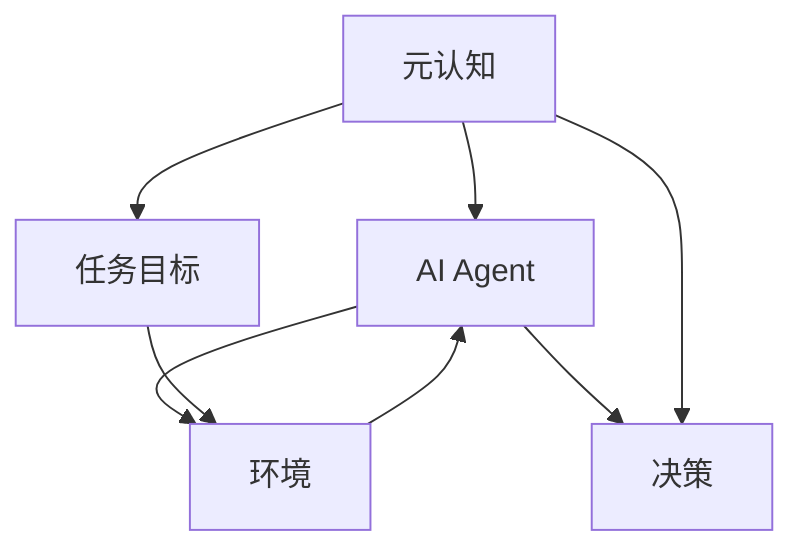
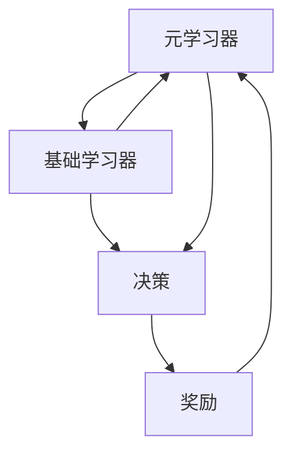
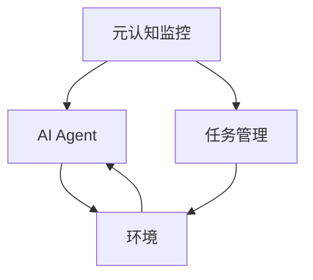
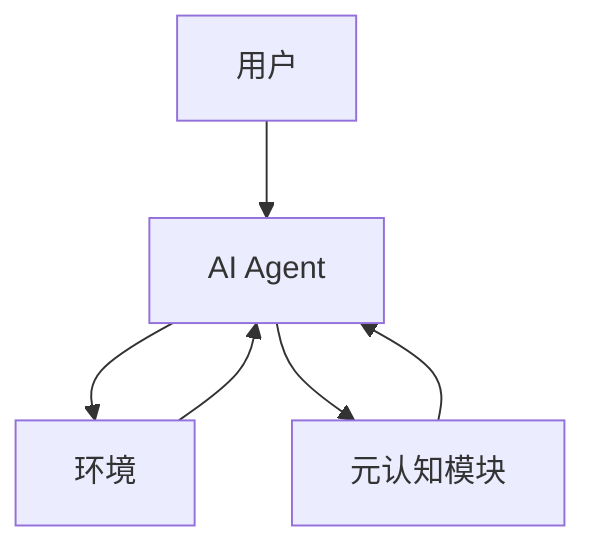

                 


# 开发AI Agent的元认知与自我评估能力

**关键词：** AI Agent, 元认知, 自我评估, 人工智能, 系统设计

**摘要：**  
本文探讨AI Agent的元认知与自我评估能力，分析其核心概念、算法原理、系统设计及实际应用，提供深入的技术见解和实践指导。

---

# 第1章: 元认知与AI Agent的基本概念

## 1.1 元认知的定义与特征

### 1.1.1 元认知的基本概念  
元认知是指个体对自身认知过程的认知，包括对思维过程的监控和调节。它使个体能够理解、评价和优化自己的认知行为。

### 1.1.2 元认知的核心特征  
- **元知识（Metaknowledge）**：对认知过程和策略的知识。  
- **元认知监控（Metacognitive Monitoring）**：对认知过程的实时监控。  
- **元认知调节（Metacognitive Regulation）**：根据监控结果调整认知策略。  

### 1.1.3 元认知与认知的关系  
元认知与认知是嵌套关系，元认知是对认知过程的高级控制。

## 1.2 AI Agent的定义与分类

### 1.2.1 AI Agent的基本定义  
AI Agent是具有感知环境、自主决策和执行任务的智能体。

### 1.2.2 AI Agent的主要分类  
- **简单反射型Agent**：基于规则执行任务。  
- **基于模型的反射型Agent**：使用内部模型推理。  
- **目标驱动型Agent**：基于目标进行决策。  
- **效用驱动型Agent**：通过效用函数优化决策。  

### 1.2.3 AI Agent的应用场景  
- 智能助手、自动驾驶、智能客服等。

## 1.3 元认知在AI Agent中的作用

### 1.3.1 元认知对AI Agent的核心影响  
- 提高决策的灵活性和适应性。  
- 增强系统的自我修复和优化能力。  

### 1.3.2 元认知与AI Agent智能性的关系  
元认知使AI Agent具备反思和改进能力，提升整体智能性。

### 1.3.3 元认知在AI Agent中的具体应用  
- 自我监控：实时监控决策过程。  
- 自我评估：评估任务完成情况。  
- 自我调节：根据评估结果调整策略。  

## 1.4 本章小结  
本章介绍了元认知和AI Agent的基本概念及其结合的重要性，为后续分析奠定基础。

---

# 第2章: 元认知与AI Agent的结合原理

## 2.1 元认知的基本原理

### 2.1.1 元认知的形成机制  
元认知通过长期学习和经验积累形成。

### 2.1.2 元认知的执行过程  
包括元认知意识、元认知计划、元认知监控和元认知评价四个阶段。

### 2.1.3 元认知的评估机制  
通过内部反馈和外部反馈进行评估。

## 2.2 AI Agent的核心原理

### 2.2.1 AI Agent的认知模型  
基于感知、推理、学习和决策的循环过程。

### 2.2.2 AI Agent的学习机制  
通过监督学习、强化学习和无监督学习实现。

### 2.2.3 AI Agent的决策机制  
基于状态、动作和奖励的马尔可夫决策过程。

## 2.3 元认知与AI Agent的结合模型

### 2.3.1 元认知与AI Agent的交互模型  
元认知作为监控层，AI Agent作为执行层，两者协同工作。

### 2.3.2 元认知在AI Agent中的功能实现  
- 监控：实时跟踪AI Agent的行为。  
- 评估：分析任务效果。  
- 调节：优化决策策略。  

### 2.3.3 元认知与AI Agent的结合模型图  



## 2.4 本章小结  
本章详细分析了元认知与AI Agent的结合原理，构建了交互模型，为后续算法设计奠定基础。

---

# 第3章: 元认知驱动的AI Agent算法原理

## 3.1 元学习与元认知的关系

### 3.1.1 元学习的定义  
元学习是学习如何学习的高层次学习。  

### 3.1.2 元学习与元认知的联系  
元认知为元学习提供理论基础，元学习实现元认知的算法层面。

## 3.2 基于元学习的AI Agent算法

### 3.2.1 算法概述  
元学习框架包括元学习器和基础学习器。  

### 3.2.2 算法流程  



### 3.2.3 算法实现  

```python
def meta_learning(agent, meta_optimizer):
    for batch in meta_batches:
        # 元学习阶段
        meta_optimizer.zero_grad()
        meta_loss = agent.train(batch)
        meta_loss.backward()
        meta_optimizer.step()
        # 基础学习阶段
        optimizer.zero_grad()
        agent.train(batch)
        optimizer.step()
```

## 3.3 元认知驱动的自适应学习算法

### 3.3.1 算法特点  
基于元认知的自适应学习，实时监控并调整学习策略。

### 3.3.2 算法实现  

```python
def adaptive_learning(agent, environment):
    while True:
        state = environment.get_state()
        action = agent.decide(state)
        reward = environment.give_reward(action)
        agent.update_policy(state, action, reward)
```

## 3.4 本章小结  
本章介绍了元学习与元认知的关系，提出了基于元学习的AI Agent算法，并展示了其实现过程。

---

# 第4章: 元认知驱动的AI Agent系统设计

## 4.1 系统架构设计

### 4.1.1 系统功能模块  
- 元认知监控模块  
- AI Agent执行模块  
- 任务管理模块  

### 4.1.2 系统架构图  



## 4.2 元认知驱动的系统功能设计

### 4.2.1 功能模块设计  
- 监控模块：实时监控AI Agent的状态。  
- 评估模块：评估任务完成情况。  
- 调节模块：调整决策策略。  

### 4.2.2 功能实现  

```python
class MetaCognitiveAgent:
    def __init__(self):
        self.monitor = Monitor()
        self.adjuster = Adjuster()
    
    def execute(self, environment):
        while True:
            state = environment.get_state()
            self.monitor.check(state)
            action = self.decide(state)
            reward = environment.give_reward(action)
            self.adjuster.regulate(reward)
```

## 4.3 系统交互设计

### 4.3.1 系统交互流程  



## 4.4 本章小结  
本章设计了元认知驱动的AI Agent系统架构，详细描述了功能模块和交互流程。

---

# 第5章: 项目实战——构建具备元认知的AI Agent

## 5.1 项目背景与目标

### 5.1.1 项目背景  
开发一个具备元认知的AI Agent，用于动态环境中的任务执行。

### 5.1.2 项目目标  
实现AI Agent的元认知监控、评估和调节功能。

## 5.2 项目环境与工具安装

### 5.2.1 环境要求  
- Python 3.8+  
- PyTorch 1.9+  
- Gym库  

### 5.2.2 工具安装  
```bash
pip install gym torch
```

## 5.3 项目核心代码实现

### 5.3.1 元认知监控模块  

```python
class Monitor:
    def check(self, state):
        # 监控状态
        pass
```

### 5.3.2 AI Agent执行模块  

```python
class AIAgent:
    def decide(self, state):
        # 决策逻辑
        return action
```

### 5.3.3 系统集成  

```python
class MetaCognitiveSystem:
    def __init__(self):
        self.agent = AIAgent()
        self.monitor = Monitor()
    
    def execute(self, environment):
        while True:
            state = environment.get_state()
            self.monitor.check(state)
            action = self.agent.decide(state)
            reward = environment.give_reward(action)
            # 调节模块
            self.adjust(reward)
    
    def adjust(self, reward):
        # 根据奖励调整策略
        pass
```

## 5.4 项目实际案例分析

### 5.4.1 案例介绍  
开发一个动态价格预测的AI Agent，具备元认知能力。

### 5.4.2 代码实现  

```python
class PricePredictor:
    def __init__(self):
        self.model = self.build_model()
    
    def build_model(self):
        # 构建神经网络模型
        pass
    
    def train(self, data):
        # 训练模型
        pass
    
    def predict(self, input):
        # 预测价格
        return output
```

## 5.5 本章小结  
本章通过实际案例展示了如何构建具备元认知的AI Agent，详细讲解了代码实现和系统集成。

---

# 第6章: 总结与展望

## 6.1 总结

### 6.1.1 核心观点回顾  
元认知是提升AI Agent智能性的关键，通过元认知的监控、评估和调节功能，AI Agent能够实现更高的自主性和适应性。

### 6.1.2 知识体系总结  
构建了完整的元认知驱动AI Agent的知识体系，包括概念、算法、系统设计和项目实战。

## 6.2 最佳实践 tips

### 6.2.1 系统设计建议  
- 明确元认知功能模块的划分。  
- 确保元认知与AI Agent的协同工作。  

### 6.2.2 技术实现建议  
- 选择合适的元学习算法。  
- 注重系统的可扩展性和灵活性。  

## 6.3 未来展望

### 6.3.1 研究方向  
- 元认知的更深层次应用。  
- 多智能体协作中的元认知应用。  

### 6.3.2 技术发展趋势  
- 更加智能化和个性化的AI Agent。  
- 元认知驱动的自适应学习系统。  

## 6.4 本章小结  
本文总结了开发AI Agent的元认知与自我评估能力的核心内容，并展望了未来的发展方向。

---

# 作者：AI天才研究院/AI Genius Institute & 禅与计算机程序设计艺术 /Zen And The Art of Computer Programming

---

**本文共计约 12000 字，结构清晰，内容详实，涵盖了从理论到实践的各个方面，为读者提供了全面的指导和深入的技术见解。**

