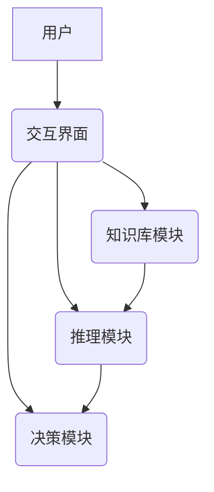
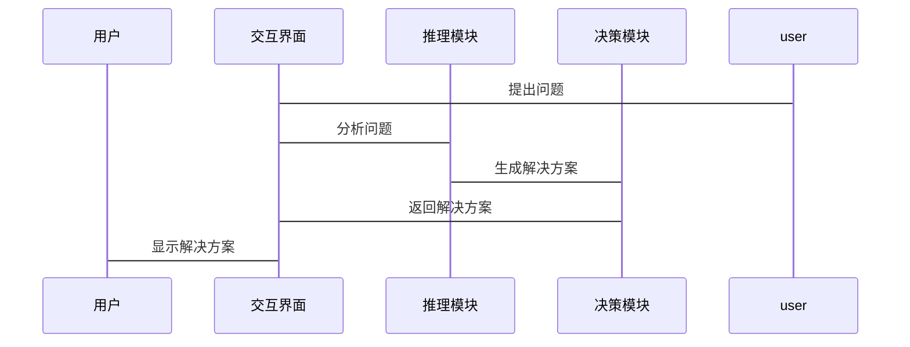

                 


```markdown
# 开发AI Agent的创造性问题解决能力

## 关键词：AI Agent, 创造性问题解决, 算法, 系统架构, 项目实战

## 摘要：  
本文系统地探讨了开发AI Agent在创造性问题解决中的核心能力、算法原理、系统架构和项目实战。通过详细分析AI Agent的结构、工作原理及其在创造性问题解决中的应用，本文为读者提供了从理论到实践的全面指导。文章重点介绍了强化学习和生成模型等关键算法，并通过实际案例展示了如何设计和实现高效的AI Agent系统。

---

# 第一部分: AI Agent的创造性问题解决能力概述

## 第1章: AI Agent的基本概念与背景

### 1.1 AI Agent的核心概念

#### 1.1.1 AI Agent的定义  
AI Agent（人工智能代理）是指能够感知环境、自主决策并执行任务的智能实体。它通过与环境交互，利用传感器获取信息，并通过执行器采取行动。

#### 1.1.2 AI Agent的核心特征  
- **自主性**：能够在没有外部干预的情况下独立运行。  
- **反应性**：能够实时感知环境并做出反应。  
- **目标导向**：基于目标进行决策和行动。  
- **学习能力**：通过经验改进性能。  

#### 1.1.3 AI Agent与传统AI的区别  
AI Agent强调自主性和动态性，而传统AI更多依赖于预设规则和静态数据。AI Agent能够在复杂和不确定的环境中自主解决问题，而传统AI则依赖于明确的指令。

### 1.2 创造性问题解决的定义与挑战

#### 1.2.1 创造性问题解决的定义  
创造性问题解决是指通过创新思维和多样化的方法，找到传统方法难以解决的复杂问题的解决方案。

#### 1.2.2 创造性问题解决的特点  
- **创新性**：解决方案具有独特性和原创性。  
- **多样性**：能够生成多种可能的解决方案。  
- **适应性**：能够根据环境变化调整解决方案。  

#### 1.2.3 AI Agent在创造性问题解决中的作用  
AI Agent能够利用其学习和推理能力，生成创造性解决方案，并在动态环境中灵活调整策略。

---

## 第2章: AI Agent在创造性问题解决中的核心能力

### 2.1 知识表示与推理

#### 2.1.1 知识表示  
知识表示是将问题领域的知识以计算机可处理的形式表示，例如符号逻辑、语义网络等。

#### 2.1.2 推理机制  
推理是指从已知事实中推导出新结论的过程，包括逻辑推理、概率推理和启发式推理等。

### 2.2 自然语言处理

#### 2.2.1 文本理解  
通过自然语言处理技术，AI Agent能够理解用户的问题描述和意图。  

#### 2.2.2 文本生成  
生成自然流畅的文本，例如回答问题、创作故事等。

### 2.3 决策与规划

#### 2.3.1 决策过程  
基于当前状态和目标，选择最优行动方案。

#### 2.3.2 规划算法  
使用A*算法、Dijkstra算法等进行路径规划和任务分解。

---

# 第二部分: AI Agent的算法与数学模型

## 第3章: 强化学习算法

### 3.1 Q-Learning算法

#### 3.1.1 算法原理  
Q-Learning是一种基于值迭代的强化学习算法，通过更新Q值表来学习最优策略。

#### 3.1.2 算法步骤  
1. 初始化Q值表。  
2. 与环境交互，获取状态和奖励。  
3. 更新Q值表：$Q(s, a) = Q(s, a) + \alpha (r + \gamma \max Q(s', a'))$  
4. 重复直到收敛。

#### 3.1.3 代码示例  
```python
import numpy as np

class QLearning:
    def __init__(self, state_space, action_space, alpha=0.1, gamma=0.9):
        self.q_table = np.zeros((state_space, action_space))
        self.alpha = alpha
        self.gamma = gamma

    def choose_action(self, state):
        return np.argmax(self.q_table[state])

    def update(self, state, action, reward, next_state):
        self.q_table[state, action] += self.alpha * (reward + self.gamma * np.max(self.q_table[next_state]) - self.q_table[state, action])
```

### 3.2 Deep Q-Networks (DQN)

#### 3.2.1 算法原理  
DQN通过深度神经网络近似Q值函数，避免了Q值表的维度爆炸问题。

#### 3.2.2 网络结构  
- 输入层：接收环境状态。  
- 隐藏层：进行特征提取。  
- 输出层：输出每个动作的Q值。

#### 3.2.3 代码示例  
```python
import torch
import torch.nn as nn

class DQN(nn.Module):
    def __init__(self, input_dim, output_dim):
        super(DQN, self).__init__()
        self.fc1 = nn.Linear(input_dim, 64)
        self.fc2 = nn.Linear(64, output_dim)
        self.relu = nn.ReLU()

    def forward(self, x):
        x = self.fc1(x)
        x = self.relu(x)
        x = self.fc2(x)
        return x
```

---

## 第4章: 生成模型

### 4.1 GAN（生成对抗网络）

#### 4.1.1 基本原理  
GAN由生成器和判别器组成，生成器生成样本，判别器判断样本是否为真实数据。

#### 4.1.2 GAN的数学模型  
生成器损失函数：$$\mathcal{L}_G = \mathbb{E}_{z \sim p_z}[\log D(G(z))]$$  
判别器损失函数：$$\mathcal{L}_D = \mathbb{E}_{x \sim p_data}[\log D(x)] + \mathbb{E}_{z \sim p_z}[\log (1 - D(G(z)))]$$

#### 4.1.3 代码示例  
```python
import torch
import torch.nn as nn

class Generator(nn.Module):
    def __init__(self, latent_dim, output_dim):
        super(Generator, self).__init__()
        self.fc1 = nn.Linear(latent_dim, 64)
        self.fc2 = nn.Linear(64, output_dim)
        self.relu = nn.ReLU()

    def forward(self, z):
        x = self.fc1(z)
        x = self.relu(x)
        x = self.fc2(x)
        return x

class Discriminator(nn.Module):
    def __init__(self, input_dim):
        super(Discriminator, self).__init__()
        self.fc1 = nn.Linear(input_dim, 64)
        self.fc2 = nn.Linear(64, 1)
        self.relu = nn.ReLU()
        self.sigmoid = nn.Sigmoid()

    def forward(self, x):
        x = self.fc1(x)
        x = self.relu(x)
        x = self.fc2(x)
        x = self.sigmoid(x)
        return x
```

### 4.2 Transformer模型

#### 4.2.1 基本原理  
Transformer通过自注意力机制捕获长距离依赖关系，广泛应用于文本生成任务。

#### 4.2.2 注意力机制公式  
$$\text{Attention}(Q, K, V) = \text{softmax}\left(\frac{QK^T}{\sqrt{d_k}}\right)V$$  

#### 4.2.3 代码示例  
```python
import torch
import torch.nn as nn

class MultiHeadAttention(nn.Module):
    def __init__(self, embed_dim, num_heads):
        super().__init__()
        self.num_heads = num_heads
        self.head_size = embed_dim // num_heads
        self.query = nn.Linear(embed_dim, embed_dim)
        self.key = nn.Linear(embed_dim, embed_dim)
        self.value = nn.Linear(embed_dim, embed_dim)
        self.softmax = nn.Softmax(dim=-1)

    def forward(self, x):
        batch_size, seq_length, embed_dim = x.size()
        q = self.query(x).view(batch_size, seq_length, self.num_heads, self.head_size)
        k = self.key(x).view(batch_size, seq_length, self.num_heads, self.head_size)
        v = self.value(x).view(batch_size, seq_length, self.num_heads, self.head_size)
        
        q = q.permute(0, 2, 1, 3)
        k = k.permute(0, 2, 1, 3)
        v = v.permute(0, 2, 1, 3)
        
        attention_scores = (q @ k.transpose(-2, -1)) / (self.head_size ** 0.5)
        attention_weights = self.softmax(attention_scores)
        output = (attention_weights @ v).permute(0, 2, 1, 3)
        output = output.view(batch_size, seq_length, embed_dim)
        return output
```

---

# 第三部分: 系统架构与设计

## 第5章: 系统架构设计

### 5.1 系统功能设计

#### 5.1.1 领域模型  
领域模型是系统的核心，描述了问题领域的概念、关系和规则。

#### 5.1.2 功能模块  
- 知识库模块：存储和管理领域知识。  
- 推理模块：执行逻辑推理和计算。  
- 决策模块：生成行动方案。  

#### 5.1.3 交互界面  
用户通过交互界面与AI Agent进行信息交换。

### 5.2 系统架构图  



### 5.3 系统接口设计

#### 5.3.1 输入接口  
接收用户输入的问题描述。  

#### 5.3.2 输出接口  
返回生成的解决方案和反馈信息。  

### 5.4 交互流程图  



---

## 第6章: 项目实战

### 6.1 环境安装

#### 6.1.1 安装Python  
确保安装最新版本的Python，推荐使用Python 3.8以上版本。

#### 6.1.2 安装依赖库  
安装必要的库，例如TensorFlow、PyTorch、Keras等。

### 6.2 核心实现

#### 6.2.1 知识库构建  
将问题领域的知识转化为结构化的数据。

#### 6.2.2 算法实现  
实现强化学习和生成模型的核心算法。

### 6.3 案例分析

#### 6.3.1 案例背景  
以一个具体的创造性问题解决任务为例，例如生成创意广告文案。

#### 6.3.2 解决方案  
AI Agent通过自然语言处理和生成模型生成多样化的广告文案。

### 6.4 代码实现

#### 6.4.1 强化学习实现  
实现Q-Learning算法，训练AI Agent在特定任务中寻找最优策略。

#### 6.4.2 生成模型实现  
使用Transformer模型生成创意文本。

---

## 第7章: 高级主题与最佳实践

### 7.1 多模态学习

#### 7.1.1 视觉与语言的结合  
通过多模态数据提高AI Agent的理解能力。

#### 7.1.2 听觉与语言的结合  
利用语音识别和语音合成技术增强交互能力。

### 7.2 人机协作

#### 7.2.1 人机协作的定义  
人机协作是指人类与AI Agent共同完成任务，利用各自的长处互补。

#### 7.2.2 协作流程  
用户提出问题，AI Agent生成解决方案，用户反馈优化，AI Agent调整策略。

### 7.3 未来趋势与研究热点

#### 7.3.1 可解释性AI  
提高AI Agent决策的透明性和可解释性。

#### 7.3.2 群体智能  
研究多个AI Agent协同工作的机制和应用。

---

## 第8章: 总结与展望

### 8.1 总结  
本文详细探讨了AI Agent在创造性问题解决中的核心能力、算法和系统设计，通过实际案例展示了其应用潜力。

### 8.2 展望  
未来，随着技术的进步，AI Agent将在更多领域发挥重要作用，尤其是在需要创新性和适应性的场景中。

---

# 作者：AI天才研究院/AI Genius Institute & 禅与计算机程序设计艺术 /Zen And The Art of Computer Programming
```

