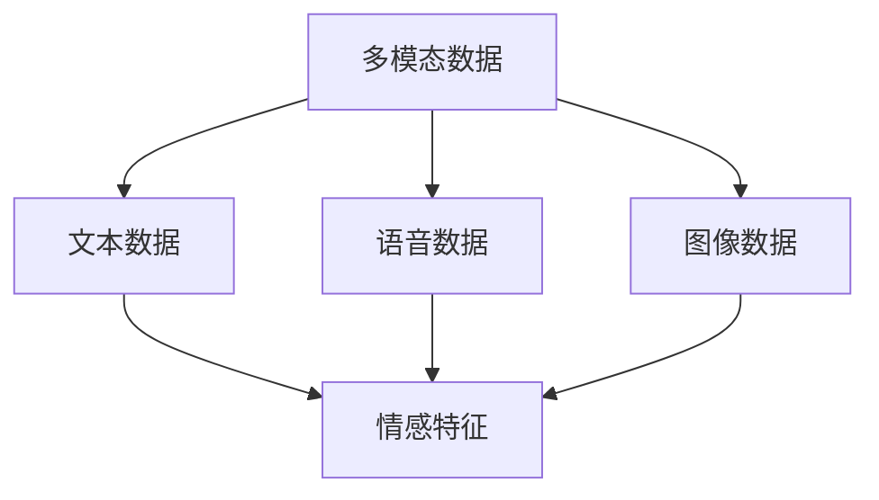
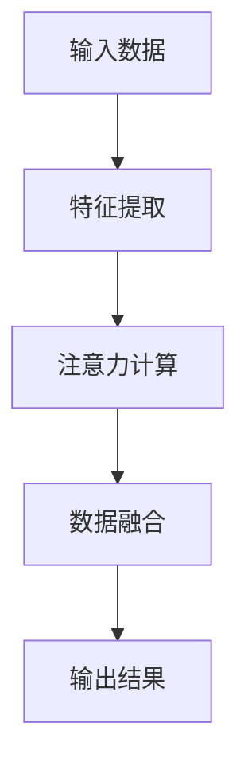
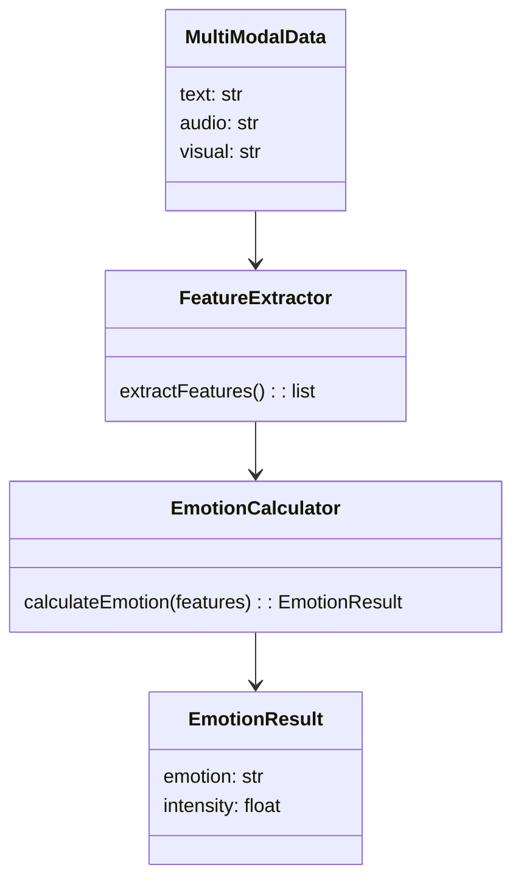

                 


# 开发AI Agent的多模态情感计算引擎

> 关键词：AI Agent，多模态情感计算，情感计算引擎，深度学习，自然语言处理

> 摘要：本文探讨了开发AI Agent的多模态情感计算引擎的核心技术，包括多模态数据处理、情感计算算法、系统架构设计以及项目实现。通过理论分析和实际案例，深入讲解了如何构建一个高效的情感计算引擎，以提升AI Agent的智能化水平。

---

# 第1章: AI Agent与多模态情感计算引擎概述

## 1.1 问题背景与问题描述

### 1.1.1 情感计算的定义与重要性
情感计算（Affective Computing）是指通过计算手段理解和分析人类情感、情绪和心理状态的过程。在AI Agent中，情感计算是实现人机交互智能化的核心技术之一。随着技术的发展，用户与AI Agent的交互越来越依赖于情感理解能力，这使得情感计算的重要性日益凸显。

### 1.1.2 多模态数据的定义与特点
多模态数据指的是来自不同感官渠道的数据，包括文本、语音、图像和视频等。与单模态数据相比，多模态数据能够更全面地反映用户的情感状态，从而提高情感计算的准确性和鲁棒性。

### 1.1.3 AI Agent的核心概念与目标
AI Agent（人工智能代理）是一种能够感知环境、自主决策并执行任务的智能系统。在情感计算领域，AI Agent的目标是通过多模态数据处理和情感分析，实现对用户情感状态的实时感知和响应。

## 1.2 问题解决与边界

### 1.2.1 情感计算在AI Agent中的作用
情感计算能够帮助AI Agent更好地理解用户的需求和情感状态，从而提供更个性化的服务和更自然的交互体验。例如，在智能客服系统中，情感计算可以用于识别用户的不满情绪，并及时调整服务策略。

### 1.2.2 多模态数据处理的挑战与解决方案
多模态数据处理的挑战主要体现在数据异构性、数据同步性和计算复杂性等方面。解决方案包括数据预处理、特征提取和多模态融合等技术。

### 1.2.3 AI Agent情感计算引擎的边界与外延
AI Agent情感计算引擎的边界在于其功能范围，即仅专注于情感计算和相关数据处理。外延则包括与其他模块（如决策引擎、执行引擎）的交互。

## 1.3 核心概念与结构

### 1.3.1 多模态数据处理流程
多模态数据处理流程通常包括数据采集、预处理、特征提取、数据融合和情感分析等步骤。

### 1.3.2 情感计算引擎的组成
情感计算引擎通常由数据输入模块、特征提取模块、情感计算模块和结果输出模块组成。

### 1.3.3 AI Agent与情感计算引擎的关系
AI Agent通过情感计算引擎实现对用户情感状态的理解和响应，从而提升交互的智能化水平。

## 1.4 本章小结
本章介绍了AI Agent和多模态情感计算引擎的基本概念、问题背景和核心结构，为后续章节的深入分析奠定了基础。

---

# 第2章: 多模态数据与情感计算的核心概念

## 2.1 多模态数据的属性特征对比

### 2.1.1 文本数据的特征分析
文本数据具有语义丰富、易于处理的特点，但受语境影响较大，且难以直接反映情感强度。

### 2.1.2 语音数据的特征分析
语音数据能够反映说话人的语调、语气和情感状态，但处理复杂，需要语音信号处理技术。

### 2.1.3 图像数据的特征分析
图像数据能够提供视觉信息，但情感相关性较低，通常需要结合其他模态数据进行分析。

## 2.2 多模态数据处理的ER实体关系图



## 2.3 情感计算的核心原理

### 2.3.1 情感计算的基本流程
情感计算的基本流程包括数据采集、特征提取、情感分析和结果输出。

### 2.3.2 多模态数据融合的策略
多模态数据融合策略包括基于特征的融合、基于决策的融合和基于模型的融合。

### 2.3.3 情感计算的输出结果
情感计算的输出结果通常包括情感类别、情感强度和情感状态等。

## 2.4 本章小结
本章详细分析了多模态数据的特征和属性，并通过ER实体关系图展示了多模态数据与情感计算的关系，为后续算法设计奠定了基础。

---

# 第3章: 多模态情感计算引擎的算法原理

## 3.1 多模态数据融合算法

### 3.1.1 基于注意力机制的多模态融合



### 3.1.2 注意力机制的数学模型
注意力机制的数学模型如下：

$$
\alpha_i = \frac{\exp(s_i)}{\sum_{j} \exp(s_j)}
$$

其中，$\alpha_i$ 表示第 $i$ 个模态的注意力权重，$s_i$ 是对应的分数。

### 3.1.3 多模态融合的实现代码

```python
import numpy as np

def compute_attention(features):
    scores = np.dot(features, np.random.rand(features.shape[1]))
    alpha = np.exp(scores) / np.sum(np.exp(scores), axis=1, keepdims=True)
    fused_feature = np.sum(features * alpha, axis=1)
    return fused_feature
```

## 3.2 情感计算模型的构建

### 3.2.1 情感分类算法的选择
常用的情感分类算法包括支持向量机（SVM）、随机森林（RF）和深度学习模型（如LSTM和Transformer）。

### 3.2.2 基于Transformer的情感分类模型

$$
\text{Transformer}(x) = \text{MLP}(\text{Self-Attention}(x))
$$

其中，$\text{Self-Attention}$ 表示自注意力机制，$\text{MLP}$ 表示多层感知机。

### 3.2.3 情感计算模型的训练与优化
模型的训练通常采用交叉熵损失函数，并使用Adam优化器进行优化。

## 3.3 本章小结
本章详细讲解了多模态数据融合算法和情感计算模型的构建方法，并通过代码和数学公式展示了实现细节。

---

# 第4章: 多模态情感计算引擎的系统分析与架构设计

## 4.1 问题场景介绍
本章以一个智能客服系统为例，说明多模态情感计算引擎的应用场景。

## 4.2 系统功能设计

### 4.2.1 领域模型类图



## 4.3 系统架构设计

### 4.3.1 系统架构图


### 4.3.2 系统接口设计
系统接口包括数据输入接口、特征提取接口和情感计算接口。

## 4.4 本章小结
本章通过系统分析和架构设计，展示了多模态情感计算引擎在实际应用中的实现方式。

---

# 第5章: 多模态情感计算引擎的项目实战

## 5.1 项目介绍
本项目旨在开发一个基于Python的多模态情感计算引擎，实现对文本、语音和图像数据的情感分析。

## 5.2 核心代码实现

### 5.2.1 数据预处理代码

```python
import librosa
import cv2
import numpy as np

def preprocess_audio(audio_path):
    audio, sr = librosa.load(audio_path, sr=16000)
    features = librosa.feature.mfcc(y=audio, sr=sr, n_mfcc=13)
    return features.T

def preprocess_image(image_path):
    image = cv2.imread(image_path)
    features = cv2.resize(image, (224, 224))
    features = features.reshape(1, 224, 224, 3)
    return features
```

### 5.2.2 情感计算引擎代码

```python
class EmotionCalculator:
    def __init__(self, model_path):
        self.model = load_model(model_path)

    def calculate_emotion(self, features):
        prediction = self.model.predict(features)
        return np.argmax(prediction, axis=1)
```

## 5.3 代码功能解读与分析
本代码实现了多模态数据的预处理和情感计算功能，其中音频和图像数据分别通过 librosa 和 OpenCV 进行预处理，情感计算采用深度学习模型。

## 5.4 本章小结
本章通过项目实战，展示了多模态情感计算引擎的具体实现过程。

---

# 第6章: 开发AI Agent多模态情感计算引擎的最佳实践

## 6.1 小结
本章总结了开发AI Agent多模态情感计算引擎的关键点，包括算法选择、数据处理和系统设计等。

## 6.2 注意事项
在开发过程中，需要注意数据质量、模型泛化能力和计算效率等问题。

## 6.3 拓展阅读
推荐阅读《Deep Learning》和《Affective Computing》等书籍，深入了解相关技术。

---

# 作者信息

作者：AI天才研究院/AI Genius Institute & 禅与计算机程序设计艺术 /Zen And The Art of Computer Programming

