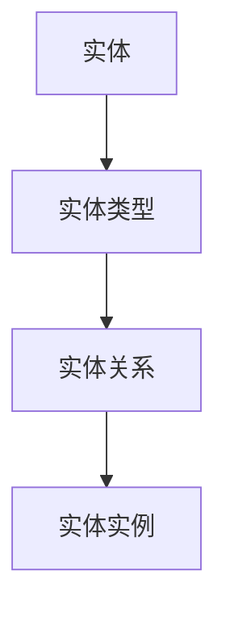
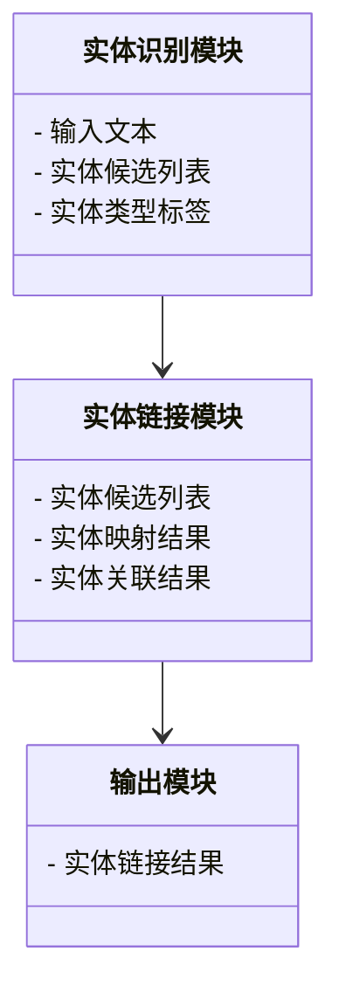
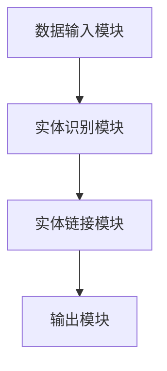
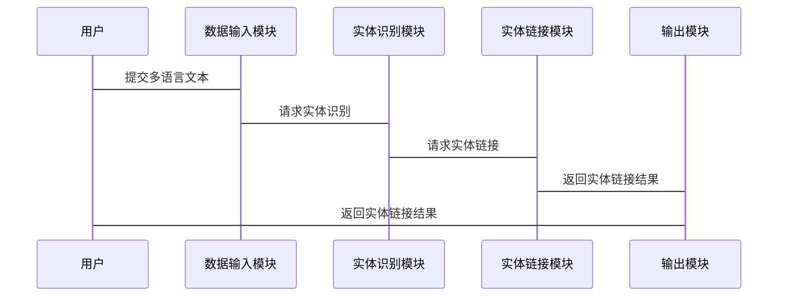

                 


# 开发AI Agent的多语言实体链接系统

## 关键词：AI Agent、多语言实体链接、跨语言信息处理、知识图谱、实体识别、链接推理、自然语言处理

## 摘要：  
本文详细探讨了AI Agent在多语言实体链接系统中的开发与应用。通过分析多语言环境下的信息处理挑战，结合AI Agent的核心功能，阐述了实体识别与链接的关键技术，以及跨语言信息处理的实现原理。文章从系统架构设计、算法原理、项目实战等多个维度展开，深入剖析了多语言实体链接系统的实现细节，并通过实际案例展示了系统的应用场景和效果。最终，本文为读者提供了一套完整的开发思路和实践指南，帮助技术开发者更好地理解和实现AI Agent的多语言实体链接系统。

---

# 第一部分: 多语言实体链接系统背景介绍

## 第1章: 多语言实体链接系统背景介绍

### 1.1 问题背景与描述

#### 1.1.1 多语言环境下的信息处理挑战  
在当今全球化的信息时代，数据呈现多语言、多文化的特点。如何在多语言环境下高效地进行信息处理，是许多领域（如搜索引擎、智能客服、跨语言知识图谱构建）面临的核心问题。多语言实体链接系统的目标是将不同语言中的实体进行关联，实现跨语言的信息整合与知识共享。

#### 1.1.2 实体链接的核心问题  
实体链接是指将文本中的实体（如人名、地名、组织名等）与其在知识图谱中的唯一标识进行关联。在多语言环境下，实体链接的难点在于不同语言之间的词汇差异、语义差异以及实体的多态性（一个实体在不同语言中有多个可能的表达形式）。例如，中文的“苹果公司”对应英文的“Apple Inc.”，但还需要处理如“苹果电脑公司”等变体。

#### 1.1.3 AI Agent在实体链接中的作用  
AI Agent（智能代理）是一种能够感知环境并采取行动以实现目标的智能系统。在多语言实体链接系统中，AI Agent可以作为信息处理的核心模块，负责接收多语言输入、分析实体信息，并通过跨语言推理完成实体链接任务。

### 1.2 问题解决思路

#### 1.2.1 多语言实体链接的目标  
- 实现跨语言实体的统一标识；
- 提供高效的实体识别与链接算法；
- 支持多语言环境下的知识图谱构建。

#### 1.2.2 AI Agent在实体链接中的解决方案  
- 利用自然语言处理技术（NLP）进行多语言文本分析；
- 基于知识图谱构建跨语言实体关联；
- 通过上下文推理解决实体的多义性问题。

#### 1.2.3 系统边界与外延  
- 输入：多语言文本数据；
- 输出：实体链接结果（实体标识及其关联信息）；
- 边界：仅处理实体链接，不涉及上下文理解之外的任务。

### 1.3 核心概念与组成要素

#### 1.3.1 多语言实体链接系统的组成  
- 数据输入模块：接收多语言文本数据；
- 实体识别模块：提取文本中的实体信息；
- 实体链接模块：将实体与知识图谱中的实体进行关联；
- 输出模块：返回实体链接结果。

#### 1.3.2 实体、实体类型、实体关系的定义  
- 实体：文本中具体的人名、地名、组织名等；
- 实体类型：实体所属的类别（如“人”、“地名”、“组织”）；
- 实体关系：实体之间的关联（如“属于”、“位于”、“关联”）。

#### 1.3.3 AI Agent在系统中的角色  
AI Agent作为系统的核心模块，负责协调各部分的功能，完成从数据输入到实体链接的全过程。

### 1.4 本章小结  
本章从多语言实体链接系统的背景出发，详细阐述了其实体识别、链接的核心问题，并分析了AI Agent在其中的作用。接下来，我们将深入探讨系统的核心概念与联系。

---

# 第二部分: 多语言实体链接系统的核心概念与联系

## 第2章: 多语言实体链接系统的核心概念

### 2.1 多语言处理的核心原理

#### 2.1.1 多语言处理的基本概念  
多语言处理是指在多种语言环境下进行信息处理的技术，其核心在于如何跨越语言障碍，实现信息的统一表示与处理。

#### 2.1.2 多语言处理的关键技术  
- 语言识别：自动识别文本的语言类型；
- 机器翻译：将一种语言的文本转换为另一种语言；
- 跨语言信息检索：在多语言环境下进行信息检索。

#### 2.1.3 多语言处理的挑战与解决方案  
- 挑战：语言间的语义差异、词汇差异；
- 解决方案：基于知识图谱的跨语言关联、深度学习模型的多语言适配。

### 2.2 实体识别与链接的原理

#### 2.2.1 实体识别的基本概念  
实体识别是指从文本中提取出具体实体（如人名、地名、组织名）的过程。其实体识别的关键在于准确提取实体的边界和类型。

#### 2.2.2 实体链接的核心原理  
实体链接是指将文本中的实体与知识图谱中的实体进行关联的过程。其实体链接的关键在于建立跨语言的实体关联。

#### 2.2.3 实体链接的实现步骤  
1. 实体识别：从文本中提取实体；
2. 实体映射：将实体映射到知识图谱中的唯一标识；
3. 实体关联：建立实体之间的关系。

### 2.3 AI Agent在实体链接中的作用

#### 2.3.1 AI Agent的基本概念  
AI Agent是一种能够感知环境并采取行动以实现目标的智能系统。在多语言实体链接系统中，AI Agent负责协调各部分的功能，完成从数据输入到实体链接的全过程。

#### 2.3.2 AI Agent在实体链接中的任务  
- 数据输入处理；
- 实体识别与链接；
- 跨语言推理与关联。

#### 2.3.3 AI Agent与多语言处理的结合  
AI Agent通过多语言处理技术，实现跨语言信息的高效整合与关联。

### 2.4 核心概念对比与ER实体关系图

#### 2.4.1 多语言处理与实体链接的对比分析  
| 概念         | 多语言处理 | 实体链接 |
|--------------|------------|----------|
| 目标         | 跨语言信息处理 | 实体关联 |
| 技术         | 机器翻译、语言识别 | 知识图谱、实体映射 |
| 挑战         | 语义差异 | 实体多义性 |

#### 2.4.2 实体识别与实体链接的对比分析  
| 概念         | 实体识别 | 实体链接 |
|--------------|----------|----------|
| 目标         | 提取实体 | 关联实体 |
| 输入         | 文本数据 | 实体列表 |
| 输出         | 实体边界 | 实体标识 |

#### 2.4.3 多语言实体链接系统的ER实体关系图  


### 2.5 本章小结  
本章详细探讨了多语言实体链接系统的核心概念，包括多语言处理、实体识别与链接的原理，以及AI Agent在其中的作用。接下来，我们将深入分析系统的算法原理。

---

# 第三部分: 多语言实体链接系统的算法原理

## 第3章: 多语言实体链接算法原理

### 3.1 算法概述

#### 3.1.1 多语言实体链接的基本算法  
多语言实体链接算法的核心在于如何在多语言环境下，将文本中的实体与知识图谱中的实体进行关联。其实体链接的基本算法包括基于规则的实体链接、基于统计的实体链接以及基于深度学习的实体链接。

#### 3.1.2 AI Agent在算法中的角色  
AI Agent负责协调各算法模块的功能，完成从数据输入到实体链接的全过程。

#### 3.1.3 算法的输入与输出  
- 输入：多语言文本数据；
- 输出：实体链接结果。

### 3.2 实体识别算法

#### 3.2.1 实体识别的实现步骤  
1. 文本预处理：分词、去除停用词；
2. 实体候选生成：基于规则或深度学习模型生成候选实体；
3. 实体类型分类：将实体分为不同的类型（如人名、地名、组织名）。

#### 3.2.2 实体识别的代码实现  
```python
def entity_recognition(text):
    # 文本预处理
    tokens = tokenize(text)
    # 实体候选生成
    candidates = generate_candidates(tokens)
    # 实体类型分类
    labels = classify_candidates(candidates)
    return [(text[start:end], label) for (start, end), label in zip(candidates, labels)]
```

#### 3.2.3 实体识别的数学模型  
实体识别的数学模型可以表示为：
$$ P(\text{实体}| \text{文本}) = \frac{\text{实体出现的频率}}{\text{总实体数}} $$

### 3.3 实体链接算法

#### 3.3.1 实体链接的实现步骤  
1. 实体映射：将文本中的实体映射到知识图谱中的实体；
2. 实体关联：建立实体之间的关系。

#### 3.3.2 实体链接的代码实现  
```python
def entity_linking(text):
    # 实体识别
    entities = entity_recognition(text)
    # 实体映射
    mappings = map_entities(entities)
    # 实体关联
    linked_entities = link_entities(mappings)
    return linked_entities
```

#### 3.3.3 实体链接的数学模型  
实体链接的数学模型可以表示为：
$$ P(\text{实体映射}| \text{上下文}) = \frac{\text{上下文匹配度}}{\text{总实体数}} $$

### 3.4 跨语言实体链接算法

#### 3.4.1 跨语言实体链接的实现步骤  
1. 文本翻译：将源语言文本翻译为目标语言；
2. 实体识别：在目标语言中识别实体；
3. 实体链接：将目标语言中的实体与知识图谱中的实体进行关联。

#### 3.4.2 跨语言实体链接的代码实现  
```python
def cross_language_linking(text, source_lang, target_lang):
    # 文本翻译
    translated_text = translate(text, source_lang, target_lang)
    # 实体识别
    entities = entity_recognition(translated_text)
    # 实体链接
    linked_entities = link_entities(entities)
    return linked_entities
```

#### 3.4.3 跨语言实体链接的数学模型  
跨语言实体链接的数学模型可以表示为：
$$ P(\text{跨语言映射}| \text{翻译文本}) = \frac{\text{翻译文本匹配度}}{\text{总实体数}} $$

### 3.5 本章小结  
本章详细探讨了多语言实体链接系统的算法原理，包括实体识别、实体链接以及跨语言实体链接的实现步骤和数学模型。接下来，我们将深入分析系统的架构设计。

---

# 第四部分: 多语言实体链接系统的架构设计

## 第4章: 系统分析与架构设计

### 4.1 系统分析

#### 4.1.1 项目背景  
多语言实体链接系统旨在解决多语言环境下实体链接的核心问题，支持跨语言知识图谱的构建与应用。

#### 4.1.2 系统功能设计  
- 数据输入模块：接收多语言文本数据；
- 实体识别模块：从文本中提取实体；
- 实体链接模块：将实体与知识图谱中的实体进行关联；
- 输出模块：返回实体链接结果。

### 4.2 系统架构设计

#### 4.2.1 领域模型设计  


#### 4.2.2 系统架构设计  


#### 4.2.3 系统接口设计  
- 数据输入接口：接收多语言文本数据；
- 实体识别接口：返回实体候选列表；
- 实体链接接口：返回实体链接结果。

#### 4.2.4 系统交互流程图  


### 4.3 本章小结  
本章详细探讨了多语言实体链接系统的架构设计，包括系统的功能模块、架构设计以及系统交互流程。接下来，我们将通过项目实战，深入分析系统的具体实现。

---

# 第五部分: 多语言实体链接系统的项目实战

## 第5章: 项目实战

### 5.1 环境安装

#### 5.1.1 安装Python环境  
```bash
python --version
pip install --upgrade pip
```

#### 5.1.2 安装依赖库  
```bash
pip install numpy
pip install pandas
pip install spacy
pip install tensorflow
pip install pytorch
```

#### 5.1.3 安装知识图谱库  
```bash
pip install networkx
pip install neo4j
pip install kgx
```

### 5.2 系统核心实现

#### 5.2.1 实体识别模块实现  
```python
import spacy

def entity_recognition(text):
    nlp = spacy.load("en_core_web_sm")
    doc = nlp(text)
    entities = []
    for ent in doc.ents:
        entities.append((ent.start_char, ent.end_char, ent.label_, ent.text))
    return entities
```

#### 5.2.2 实体链接模块实现  
```python
import kgx

def entity_linking(entities, knowledge_graph):
    linked_entities = []
    for entity in entities:
        mappings = kgx.map_entity(entity, knowledge_graph)
        if mappings:
            linked_entities.append(mappings[0])
    return linked_entities
```

#### 5.2.3 跨语言实体链接实现  
```python
from googletrans import Translator

def cross_language_linking(text, source_lang, target_lang):
    translator = Translator()
    translated_text = translator.translate(text, src=source_lang, dest=target_lang)
    entities = entity_recognition(translated_text.text)
    linked_entities = entity_linking(entities, knowledge_graph)
    return linked_entities
```

### 5.3 代码应用解读与分析

#### 5.3.1 实体识别模块解读  
实体识别模块使用spaCy库对文本进行分词和命名实体识别，提取文本中的实体信息。

#### 5.3.2 实体链接模块解读  
实体链接模块使用kgx库对提取的实体进行知识图谱中的实体映射，建立实体之间的关联关系。

#### 5.3.3 跨语言实体链接解读  
跨语言实体链接模块使用Google翻译API将源语言文本翻译为目标语言，然后在目标语言中进行实体识别和链接。

### 5.4 实际案例分析

#### 5.4.1 案例背景  
假设我们有一个中文文本：“阿里巴巴集团位于杭州市。” 我们需要将其与英文知识图谱中的“Alibaba Group”进行关联。

#### 5.4.2 实体识别  
中文实体识别：提取“阿里巴巴集团”和“杭州市”；
英文实体识别：提取“Alibaba Group”和“Hangzhou”。

#### 5.4.3 实体链接  
将“阿里巴巴集团”链接到英文知识图谱中的“Alibaba Group”，将“杭州市”链接到英文知识图谱中的“Hangzhou”。

### 5.5 本章小结  
本章通过项目实战，详细讲解了多语言实体链接系统的具体实现，包括环境安装、核心模块实现以及实际案例分析。接下来，我们将总结项目的开发经验和最佳实践。

---

# 第六部分: 多语言实体链接系统的最佳实践

## 第6章: 最佳实践

### 6.1 开发经验总结

#### 6.1.1 系统设计经验  
- 系统设计要注重模块化，便于后续扩展和维护；
- 知识图谱的选择要根据具体需求，选择合适的存储和查询方式。

#### 6.1.2 算法实现经验  
- 实体识别模块要选择合适的NLP工具（如spaCy、HanLP）；
- 实体链接模块要结合具体的领域知识，优化实体映射的准确率；
- 跨语言实体链接要结合翻译的准确性，优化实体识别和链接的效果。

### 6.2 注意事项

#### 6.2.1 系统性能优化  
- 数据预处理要尽量减少计算量；
- 知识图谱的构建要注重高效性，避免冗余数据；
- 算法实现要注重并行计算，提高处理效率。

#### 6.2.2 系统安全性  
- 数据输入要进行严格的过滤和验证，防止恶意输入；
- 知识图谱的数据要进行脱敏处理，保护隐私信息；
- 系统要具备容错机制，防止异常情况导致系统崩溃。

### 6.3 拓展阅读

#### 6.3.1 推荐书籍  
- 《自然语言处理入门》
- 《知识图谱构建与应用》
- 《深度学习入门》

#### 6.3.2 推荐论文  
- "Entity Linking in Multilingual Texts"  
- "Cross-Language Entity Recognition and Linking"  
- "Deep Learning for Multilingual NLP"

### 6.4 本章小结  
本章总结了多语言实体链接系统的开发经验，并提出了系统的优化建议和拓展阅读资料。通过本文的讲解，读者可以更好地理解和实现AI Agent的多语言实体链接系统。

---

# 作者：AI天才研究院/AI Genius Institute & 禅与计算机程序设计艺术 /Zen And The Art of Computer Programming

