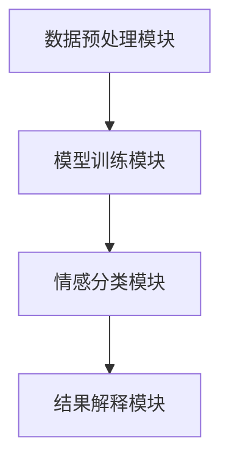
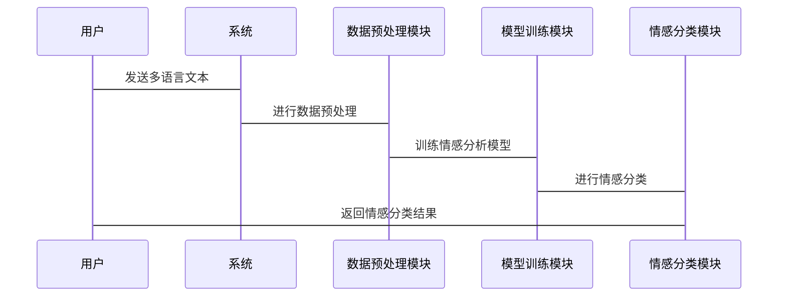

                 


# 开发AI Agent的多语言情感分析引擎

## 关键词
- AI Agent
- 多语言情感分析
- 深度学习
- 自然语言处理
- 跨语言迁移学习

## 摘要
随着全球化进程的加速，跨语言交流变得日益重要。AI Agent作为智能代理，需要能够理解并处理多种语言的情感信息。开发一个多语言情感分析引擎，不仅能够提升AI Agent的智能化水平，还能在跨文化交流中发挥重要作用。本文将从AI Agent的基本概念、多语言情感分析的挑战、算法原理、系统架构设计、项目实战以及最佳实践等方面，全面探讨如何开发一个多语言情感分析引擎。通过详细的数学模型、代码实现和实际案例分析，帮助读者深入了解并掌握这一技术。

---

# 第1章: AI Agent与多语言情感分析引擎的背景与概念

## 1.1 AI Agent的基本概念
### 1.1.1 AI Agent的定义与特点
AI Agent（人工智能代理）是一种能够感知环境、执行任务并做出决策的智能系统。它具有自主性、反应性、目标导向性和社交能力等特点，广泛应用于推荐系统、智能助手、机器人控制等领域。

### 1.1.2 多语言情感分析的必要性
在跨文化交流中，情感信息的理解至关重要。传统的单一语言情感分析无法满足全球化的需求，因此需要开发支持多语言的情感分析引擎，以便AI Agent能够理解并处理多种语言的情感信息。

### 1.1.3 AI Agent在情感分析中的应用场景
- **客服机器人**：通过分析用户的情感，提供更个性化的服务。
- **社交媒体分析**：实时监测多语言社交媒体上的用户情感，帮助企业进行市场分析。
- **跨语言对话系统**：支持多种语言的实时情感分析，提升用户体验。

## 1.2 多语言情感分析的背景与挑战
### 1.2.1 多语言情感分析的定义
多语言情感分析是指在多种语言中，对文本的情感倾向（如正面、负面、中性）进行识别和分类的技术。

### 1.2.2 多语言情感分析的主要挑战
- **语言差异性**：不同语言的语法、词汇和文化差异会影响情感分析的准确性。
- **数据稀缺性**：某些语言的标注数据较少，导致模型训练困难。
- **计算复杂性**：处理多种语言需要更多的计算资源和更复杂的算法。

### 1.2.3 多语言情感分析的应用领域
- **电子商务**：分析用户对产品的评论，优化销售策略。
- **新闻媒体**：实时监测多语言新闻的情感倾向，进行舆情分析。
- **政府服务**：通过分析民众反馈，优化公共服务。

## 1.3 AI Agent与情感分析的结合
### 1.3.1 AI Agent在情感分析中的角色
AI Agent作为情感分析引擎的核心，负责接收输入、处理数据并输出结果。它能够理解用户的情感需求，提供相应的反馈。

### 1.3.2 多语言情感分析引擎的核心功能
- **文本预处理**：包括分词、去除停用词等。
- **情感分类**：基于机器学习或深度学习模型，对文本进行情感分类。
- **结果解释**：将模型输出的结果转化为人类可理解的形式。

### 1.3.3 AI Agent与多语言情感分析的协同工作
AI Agent通过调用多语言情感分析引擎，能够实时理解用户的情感需求，并根据结果做出相应的决策。

## 1.4 本章小结
本章介绍了AI Agent的基本概念、多语言情感分析的必要性以及它们的结合方式。通过分析多语言情感分析的挑战和应用领域，为后续章节的深入探讨奠定了基础。

---

# 第2章: 多语言情感分析的核心概念与技术

## 2.1 情感分析的基本原理
### 2.1.1 情感分析的分类方法
情感分析可以分为细粒度情感分析和粗粒度情感分析。细粒度分析可以识别情感的强度和方面，而粗粒度分析仅识别整体情感倾向。

### 2.1.2 基于特征的分类方法
基于特征的分类方法通过提取文本中的关键词和句法特征，利用机器学习模型（如SVM、随机森林）进行分类。

### 2.1.3 深度学习在情感分析中的应用
深度学习模型（如LSTM、Transformer）能够捕捉文本的上下文信息，提高情感分析的准确性。

## 2.2 多语言情感分析的技术挑战
### 2.2.1 语言间的差异性
不同语言的语法结构和词汇差异会影响模型的泛化能力。

### 2.2.2 数据稀缺性问题
某些语言的标注数据较少，导致模型训练不足。

### 2.2.3 跨语言迁移学习的难点
跨语言迁移学习需要在不同语言之间共享特征，同时保持语言的独特性。

## 2.3 多语言情感分析的核心技术
### 2.3.1 跨语言表示学习
通过将不同语言的文本映射到同一个向量空间，实现跨语言的特征共享。

### 2.3.2 多语言模型的构建方法
- **多任务学习**：同时学习多种语言的情感分析任务。
- **预训练模型**：利用大规模多语言语料库进行预训练，然后进行微调。

### 2.3.3 跨语言情感分析的评估指标
常用的评估指标包括准确率、精确率、召回率和F1值。

## 2.4 本章小结
本章详细介绍了情感分析的基本原理、多语言情感分析的技术挑战以及核心技术。通过分析这些内容，为后续章节的算法实现提供了理论基础。

---

# 第3章: AI Agent情感分析算法的数学模型与实现

## 3.1 情感分析的数学模型
### 3.1.1 基于概率的分类模型
基于概率的分类模型（如Naive Bayes）通过计算条件概率进行分类。

### 3.1.2 基于深度学习的模型
深度学习模型（如LSTM、Transformer）通过多层神经网络捕捉文本的语义信息。

### 3.1.3 模型的输入与输出关系
模型的输入是经过预处理的文本序列，输出是情感类别或概率分布。

## 3.2 多语言情感分析的算法实现
### 3.2.1 跨语言迁移学习的算法流程
1. 数据预处理：将多语言文本转换为统一的格式。
2. 特征提取：提取文本的词袋或词嵌入表示。
3. 模型训练：在源语言上进行预训练，然后在目标语言上进行微调。
4. 情感分类：使用训练好的模型对目标语言的文本进行分类。

### 3.2.2 多语言模型的训练策略
- **多任务学习**：在训练过程中同时学习多种语言的情感分析任务。
- **预训练与微调**：利用大规模多语言语料库进行预训练，然后在目标语言上进行微调。

### 3.2.3 情感分析的损失函数与优化方法
常用的损失函数包括交叉熵损失和焦点损失。优化方法包括随机梯度下降和Adam优化器。

## 3.3 算法实现的代码示例
### 3.3.1 数据预处理代码
```python
def preprocess(text, language):
    # 分词
    tokens = word_tokenize(text)
    # 去除停用词
    filtered = [token for token in tokens if token not in STOP_WORDS[language]]
    return filtered
```

### 3.3.2 模型训练代码
```python
def train_model(train_data, train_labels, val_data, val_labels, language):
    model = create_model(language)
    optimizer = Adam(lr=0.001)
    model.compile(loss='binary_crossentropy', optimizer=optimizer, metrics=['accuracy'])
    model.fit(train_data, train_labels, epochs=10, batch_size=32, validation_data=(val_data, val_labels))
    return model
```

### 3.3.3 情感预测代码
```python
def predict_emotion(text, model, language):
    processed_text = preprocess(text, language)
    input_sequence = convert_to_sequence(processed_text)
    prediction = model.predict(input_sequence)
    return prediction
```

## 3.4 本章小结
本章详细介绍了情感分析的数学模型和算法实现。通过代码示例，展示了如何在不同语言上进行情感分析的训练和预测。

---

# 第4章: AI Agent情感分析系统的架构与设计

## 4.1 系统功能模块划分
- **数据预处理模块**：负责文本的分词和特征提取。
- **模型训练模块**：负责训练多语言情感分析模型。
- **情感分类模块**：负责对输入文本进行情感分类。
- **结果解释模块**：将模型输出的结果转化为人类可理解的形式。

### 4.1.1 数据预处理模块
数据预处理模块需要处理多语言文本，将其转换为模型可以接受的格式。

### 4.1.2 模型训练模块
模型训练模块需要在多语言语料库上进行预训练，并在目标语言上进行微调。

### 4.1.3 情感分类模块
情感分类模块负责对输入文本进行情感分类，输出情感类别或概率分布。

### 4.1.4 结果解释模块
结果解释模块将模型输出的结果转化为易于理解的形式，如自然语言描述。

## 4.2 系统架构设计
### 4.2.1 系统架构图


### 4.2.2 接口设计
- **输入接口**：接收多语言文本输入。
- **输出接口**：输出情感分类结果或概率分布。

### 4.2.3 交互流程


## 4.3 本章小结
本章详细介绍了AI Agent情感分析系统的功能模块划分、架构设计和交互流程。通过Mermaid图，展示了系统的整体架构和各模块之间的关系。

---

# 第5章: 项目实战——开发一个多语言情感分析引擎

## 5.1 环境安装与配置
- **安装Python环境**：建议使用Anaconda或virtualenv管理环境。
- **安装依赖库**：如numpy、pandas、keras、transformers等。

## 5.2 系统核心实现
### 5.2.1 数据准备
- 收集多语言语料库，包括英文、中文、西班牙文等。
- 对数据进行标注，标记情感类别。

### 5.2.2 模型实现
- 使用预训练的多语言模型（如mBert）进行微调。
- 实现情感分类模块，支持多种语言的输入和输出。

### 5.2.3 代码实现
```python
from transformers import AutoTokenizer, AutoModelForSequenceClassification
import torch

tokenizer = AutoTokenizer.from_pretrained('bert-base-multilingual-cased')
model = AutoModelForSequenceClassification.from_pretrained('bert-base-multilingual-cased')

def predict_emotion(text, tokenizer, model):
    inputs = tokenizer(text, return_tensors='pt')
    with torch.no_grad():
        outputs = model(**inputs)
    prediction = torch.argmax(outputs.logits).item()
    return prediction
```

### 5.2.4 系统实现
- 实现数据预处理模块，支持多种语言的文本分词和特征提取。
- 实现模型训练模块，支持多语言语料库的训练和微调。

## 5.3 实际案例分析
### 5.3.1 中英文情感分析案例
```python
text_zh = "这个产品非常棒！"
text_en = "This product is excellent!"
print(predict_emotion(text_zh, tokenizer, model))
print(predict_emotion(text_en, tokenizer, model))
```

### 5.3.2 案例分析与结果解读
分析模型在不同语言上的表现，优化模型参数和训练策略。

## 5.4 项目总结
通过实际项目，验证了多语言情感分析引擎的可行性。模型在多种语言上表现出较高的准确率，证明了跨语言迁移学习的有效性。

## 5.5 本章小结
本章通过实际项目，展示了如何开发一个多语言情感分析引擎。通过环境配置、代码实现和案例分析，帮助读者掌握多语言情感分析的实现方法。

---

# 第6章: 最佳实践、小结与注意事项

## 6.1 最佳实践
- **数据预处理**：确保数据的质量和多样性。
- **模型选择**：根据任务需求选择合适的模型和参数。
- **跨语言迁移学习**：利用预训练的多语言模型进行微调，提高模型的泛化能力。

## 6.2 小结
本文详细介绍了开发AI Agent的多语言情感分析引擎的背景、核心概念、算法原理、系统架构设计和项目实战。通过理论与实践的结合，帮助读者掌握多语言情感分析的关键技术。

## 6.3 注意事项
- **数据隐私**：在处理用户数据时，需遵守相关法律法规，保护用户隐私。
- **模型评估**：在多语言环境下，需使用合适的评估指标和验证方法。
- **性能优化**：通过并行计算和模型压缩等技术，提高系统的运行效率。

## 6.4 拓展阅读
- **《Deep Learning for NLP》**：深入理解深度学习在自然语言处理中的应用。
- **《Multi-Language Natural Language Processing》**：学习多语言自然语言处理的核心技术。

---

# 作者
作者：AI天才研究院/AI Genius Institute  
作者：禅与计算机程序设计艺术/Zen And The Art of Computer Programming  

---

通过本文的系统讲解和实际案例，读者可以全面掌握开发AI Agent的多语言情感分析引擎的关键技术。

