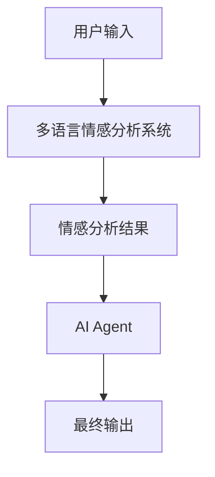
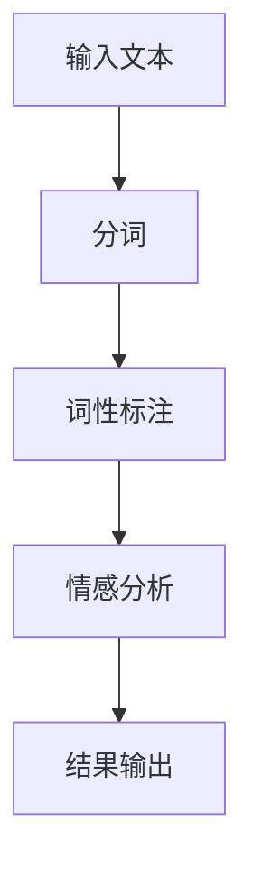
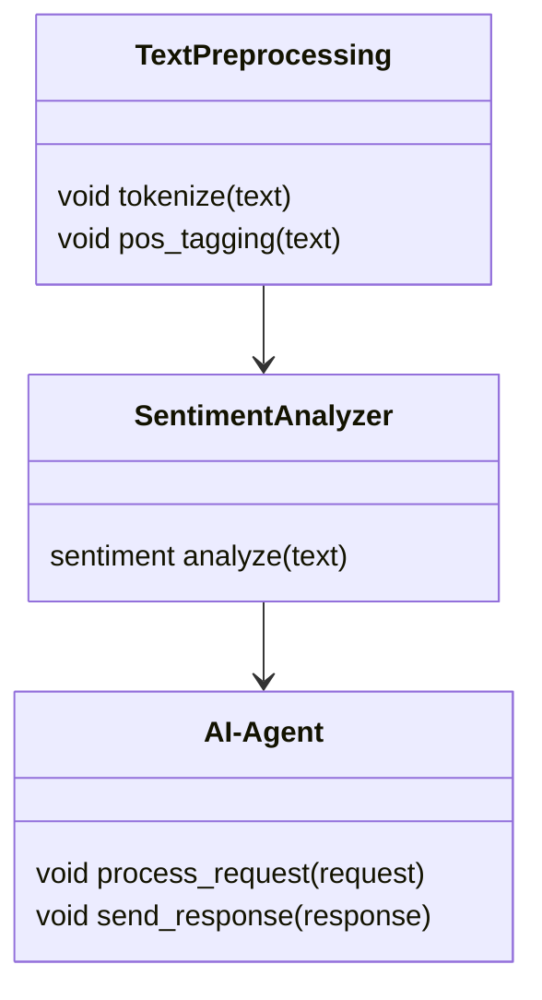
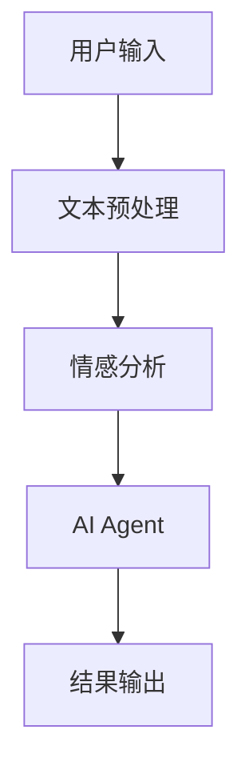
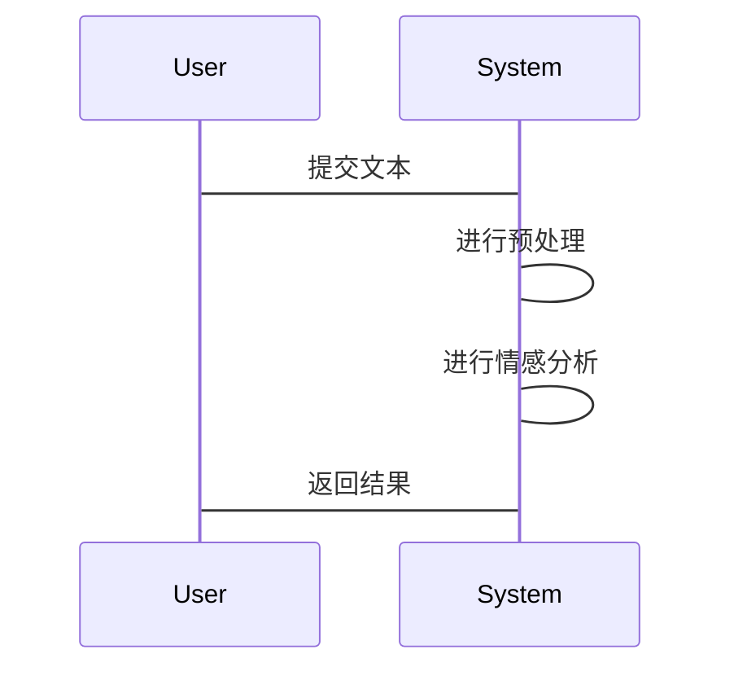

                 


# 开发AI Agent的多语言情感分析比较系统

> 关键词：多语言情感分析，AI Agent，NLP，深度学习，比较系统

> 摘要：本文详细探讨了开发一个多语言情感分析比较系统的全过程，从问题背景、核心概念、算法原理到系统架构设计、项目实战，再到最佳实践。通过分析不同语言的情感表达差异，结合AI Agent技术，构建了一个高效、准确的多语言情感分析系统，并进行了深入的比较分析。

---

# 第一部分: 背景介绍

## 第1章: 多语言情感分析的背景与问题描述

### 1.1 情感分析的背景
#### 1.1.1 情感分析的定义与应用
情感分析是自然语言处理（NLP）领域的重要任务，旨在通过分析文本内容，判断其情感倾向（如积极、消极或中性）。情感分析广泛应用于社交媒体分析、客户反馈分析、产品推荐等领域。

#### 1.1.2 多语言情感分析的必要性
随着全球化的发展，企业需要处理来自不同语言的用户反馈。多语言情感分析能够帮助企业在多语言环境下，准确理解用户情感，提升用户体验和市场竞争力。

#### 1.1.3 AI Agent在情感分析中的角色
AI Agent（智能代理）是一种能够感知环境并采取行动以实现目标的智能系统。在情感分析中，AI Agent可以用于自动化数据处理、模型选择和结果解释。

### 1.2 多语言情感分析的问题描述
#### 1.2.1 多语言数据的挑战
不同语言的语法结构、词汇习惯和文化背景差异较大，这些都会影响情感分析的效果。例如，中文中的成语和隐喻可能与英文中的表达方式完全不同。

#### 1.2.2 跨文化情感分析的复杂性
文化差异会导致情感表达的差异。例如，在某些文化中，间接表达情感的方式更为常见，而在其他文化中，情感表达可能更为直接。

#### 1.2.3 AI Agent在多语言情感分析中的目标
AI Agent的目标是通过多语言情感分析技术，帮助用户快速理解多语言文本的情感倾向，并提供决策支持。

### 1.3 问题解决与边界
#### 1.3.1 多语言情感分析的解决方案
使用预训练的情感分析模型和跨语言适应技术，结合AI Agent的自动化能力，实现多语言情感分析。

#### 1.3.2 AI Agent在系统中的边界与限制
AI Agent的边界包括数据输入、模型选择和结果输出。限制包括处理语言种类的数量和模型的准确性。

#### 1.3.3 系统的可扩展性与可维护性
通过模块化设计，系统可以方便地添加新的语言或情感分析模型。

### 1.4 核心概念与要素
#### 1.4.1 情感分析的核心要素
- 文本预处理：分词、词性标注
- 情感分析模型：基于规则的模型、统计模型、深度学习模型
- 情感标签：积极、消极、中性

#### 1.4.2 多语言处理的关键技术
- 跨语言词嵌入（Cross-lingual Word Embeddings）
- 多语言模型（Multi-language Models）
- 跨文化适应技术

#### 1.4.3 AI Agent的功能模块
- 数据输入模块：接收多语言文本输入
- 处理模块：进行情感分析
- 输出模块：返回情感分析结果

## 第2章: 多语言情感分析的核心概念与联系

### 2.1 核心概念原理
#### 2.1.1 多语言情感分析的原理
通过预处理多语言文本，提取特征，训练或使用预训练的情感分析模型，输出情感倾向。

#### 2.1.2 AI Agent在情感分析中的作用
AI Agent通过调用情感分析模型，自动化处理多语言文本，提供情感分析结果。

#### 2.1.3 跨文化差异对情感分析的影响
文化差异会影响情感表达的方式，例如某些语言中情感表达更为间接。

### 2.2 概念属性特征对比
| 特性         | 单语言情感分析 | 多语言情感分析 |
|--------------|----------------|----------------|
| 处理语言数   | 1              | 多             |
| 模型复杂度   | 较低           | 较高           |
| 文化适应性   | 低             | 高             |

### 2.3 ER实体关系图


---

# 第二部分: 算法原理讲解

## 第3章: 多语言情感分析算法原理

### 3.1 算法流程


### 3.2 算法实现
```python
def sentiment_analysis(text):
    # 分词
    words = tokenize(text)
    # 词性标注
    tagged_words = pos_tag(words)
    # 情感分析
    sentiment = analyze_sentiment(tagged_words)
    return sentiment
```

### 3.3 数学

---

# 第三部分: 系统分析与架构设计

## 第4章: 问题场景介绍

### 4.1 项目介绍
开发一个多语言情感分析比较系统，旨在通过AI Agent技术，实现对多种语言情感分析模型的比较和优化。

## 第5章: 系统功能设计

### 5.1 领域模型


### 5.2 系统架构设计


### 5.3 系统接口设计
```json
{
    "input": {
        "text": "这是一个测试句子。",
        "language": "zh"
    },
    "output": {
        "sentiment": "positive",
        "score": 0.85
    }
}
```

### 5.4 系统交互


---

# 第四部分: 项目实战

## 第6章: 环境安装与配置

### 6.1 安装依赖
```bash
pip install numpy
pip install scikit-learn
pip install spacy
```

## 第7章: 核心代码实现

### 7.1 文本预处理
```python
import spacy

nlp = spacy.load("zh_core_web_sm")

def tokenize(text):
    return [token.text for token in nlp(text)]
```

### 7.2 情感分析模型
```python
from sklearn.feature_extraction.text import TfidfVectorizer
from sklearn.svm import SVC

vectorizer = TfidfVectorizer()
model = SVC()
```

## 第8章: 代码解读与分析

### 8.1 预处理代码解读
tokenize函数使用spaCy进行中文分词，返回分词后的结果。

### 8.2 模型代码解读
使用TF-IDF特征提取和SVM分类器进行情感分析。

## 第9章: 实际案例分析

### 9.1 案例介绍
分析中文和英文的用户评论，比较两种语言的情感倾向。

## 第10章: 系统优化与调优

### 10.1 参数调整
调整SVM模型的参数，如C和gamma值，以提高分类准确率。

---

# 第五部分: 最佳实践与总结

## 第11章: 小结与注意事项

### 11.1 小结
本文详细介绍了多语言情感分析的开发过程，包括背景、算法原理、系统设计和项目实战。

### 11.2 注意事项
- 数据质量对情感分析结果影响重大
- 跨语言适应技术需要进一步研究
- 系统维护和更新需持续投入

## 第12章: 未来展望与拓展阅读

### 12.1 未来展望
- 研究更高效的多语言情感分析模型
- 探索AI Agent在更多NLP任务中的应用

### 12.2 拓展阅读
推荐相关书籍和论文，如《自然语言处理入门》、《Deep Learning for NLP》等。

---

# 作者：AI天才研究院 & 禅与计算机程序设计艺术

---

本文通过详细分析多语言情感分析的背景、核心概念、算法原理、系统设计和项目实战，为读者提供了一个全面的视角。通过实际案例分析和系统优化，帮助读者理解如何开发一个多语言情感分析比较系统，并为未来的优化和扩展提供了方向。

