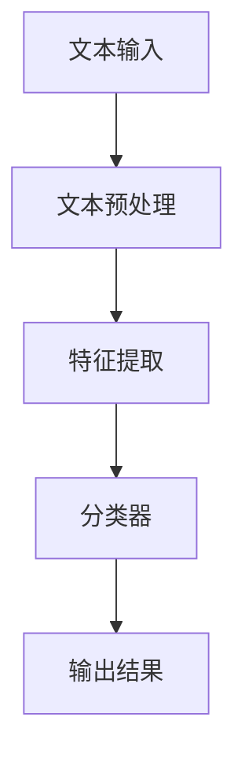

                 


# 开发AI Agent的多语言文本分类器

## 关键词：AI Agent, 多语言文本分类器, 机器学习, 深度学习, 自然语言处理, NLP, 文本分类

## 摘要

本文深入探讨了开发AI Agent驱动的多语言文本分类器的全过程，涵盖核心概念、算法原理、系统架构设计以及项目实战。文章首先介绍了AI Agent与多语言文本分类器的基本概念和应用场景，然后详细分析了多语言文本分类的核心概念与算法原理，包括基于概率的文本分类和深度学习模型。接着，文章通过系统架构设计展示了如何构建一个高效的AI Agent驱动的多语言文本分类系统，并通过具体的项目实战部分，提供了代码实现和案例分析。最后，文章总结了开发过程中的最佳实践和未来的发展方向。

---

## 第1章: 引言

### 1.1 AI Agent的基本概念
AI Agent（人工智能代理）是指能够感知环境、执行任务并做出决策的智能实体。它可以通过传感器获取信息，并通过执行器与环境交互。AI Agent的核心特征包括自主性、反应性、目标导向性和社会性。

### 1.2 多语言文本分类器的定义与特点
多语言文本分类器是一种能够处理多种语言文本并进行分类的系统。与单语言文本分类器相比，多语言文本分类器需要处理不同语言之间的语义差异和语法结构。

### 1.3 AI Agent与多语言文本分类器的结合
AI Agent可以通过多语言文本分类器来增强其理解和处理多种语言文本的能力，从而提高其智能性和应用场景的广泛性。

---

## 第2章: 多语言文本分类器的核心概念

### 2.1 多语言文本分类的背景与挑战
多语言文本分类在实际应用中面临诸多挑战，例如不同语言之间的语义差异、数据稀缺性以及模型的跨语言迁移能力。

### 2.2 多语言文本分类器的数学模型与核心要素
多语言文本分类器的数学模型通常基于概率论和统计学习方法。核心要素包括文本特征、分类标签和分类器模型。

### 2.3 多语言文本分类器的算法原理
多语言文本分类器的算法可以分为基于概率的算法和基于深度学习的算法。基于概率的算法包括朴素贝叶斯，而基于深度学习的算法则包括循环神经网络（RNN）和变换器（Transformer）模型。

---

## 第3章: 多语言文本分类器的算法实现

### 3.1 基于深度学习的多语言文本分类算法
基于深度学习的多语言文本分类器通常使用预训练的多语言模型（如mBert）进行微调。以下是具体的算法流程：

```python
def train_multilingual_classifier():
    # 加载预训练模型
    model = MultilingualBertForSequenceClassification.from_pretrained('bert-base-multilingual-cased')
    # 定义损失函数
    criterion = nn.CrossEntropyLoss()
    # 定义优化器
    optimizer = AdamW(model.parameters(), lr=1e-5)
    # 训练循环
    for epoch in range(num_epochs):
        for batch in dataloader:
            inputs, labels = batch
            outputs = model(inputs)
            loss = criterion(outputs, labels)
            loss.backward()
            optimizer.step()
```

### 3.2 数学模型与公式
多语言文本分类器的数学模型可以表示为：

$$ P(y|x) = \frac{P(x|y)P(y)}{P(x)} $$

其中，$P(y|x)$ 表示在给定文本 $x$ 的情况下，其属于类别 $y$ 的概率。

---

## 第4章: 系统架构设计

### 4.1 系统功能设计
多语言文本分类系统的主要功能包括文本预处理、特征提取和分类器模块。

### 4.2 系统架构设计
以下是系统的架构图：



### 4.3 接口设计与交互流程
系统的接口设计包括文本输入接口、分类结果输出接口和模型训练接口。

---

## 第5章: 项目实战

### 5.1 环境搭建
安装必要的库：

```bash
pip install transformers torch
```

### 5.2 代码实现
以下是分类器的代码实现：

```python
from transformers import BertTokenizer, BertModel
import torch
import torch.nn as nn
import torch.optim as optim

class MultilingualClassifier(nn.Module):
    def __init__(self, num_classes):
        super().__init__()
        self.bert = BertModel.from_pretrained('bert-base-multilingual-cased')
        self.dropout = nn.Dropout(0.1)
        self.classifier = nn.Linear(self.bert.config.hidden_size, num_classes)

    def forward(self, input_ids, attention_mask):
        outputs = self.bert(input_ids=input_ids, attention_mask=attention_mask)
        pooled_output = outputs.last_hidden_state[:, 0, :]
        pooled_output = self.dropout(pooled_output)
        return self.classifier(pooled_output)
```

### 5.3 案例分析
通过实际案例分析，展示系统的分类效果和性能。

---

## 第6章: 总结与展望

### 6.1 总结
本文详细探讨了开发AI Agent驱动的多语言文本分类器的全过程，从核心概念到算法实现，再到系统架构设计和项目实战。

### 6.2 展望
未来的研究方向包括优化多语言文本分类器的性能、提升模型的跨语言迁移能力以及探索更高效的训练方法。

---

## 作者：AI天才研究院 & 禅与计算机程序设计艺术

---

这篇文章从理论到实践，系统地介绍了开发AI Agent驱动的多语言文本分类器的全过程，希望对读者有所帮助。

