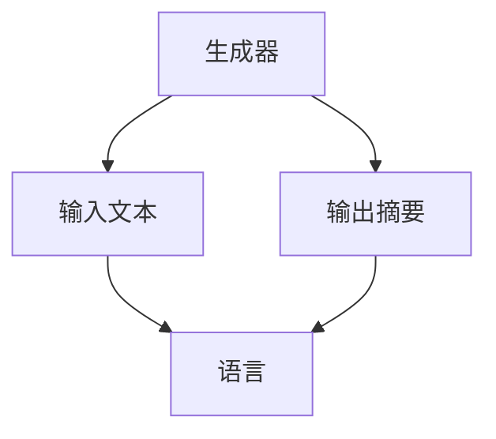
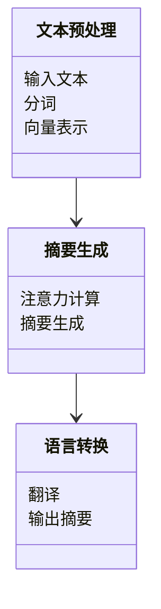
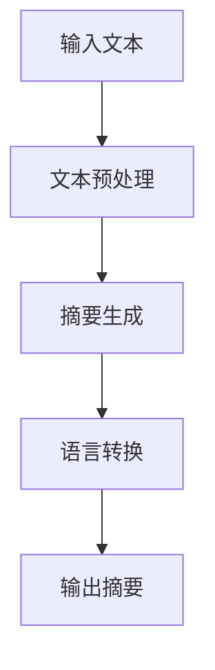

                 


# 开发AI Agent的多语言文本摘要生成器

> 关键词：AI Agent, 多语言文本摘要, 生成器, 算法原理, 系统架构, 项目实战

> 摘要：本文详细介绍了开发AI Agent驱动的多语言文本摘要生成器的全过程，从问题背景、核心概念到算法原理、系统架构设计，再到项目实战和最佳实践，全面解析了如何实现一个高效、准确的多语言文本摘要生成器。文章结合实际案例和代码实现，深入探讨了AI Agent在文本处理中的应用，为开发者提供了从理论到实践的完整指导。

---

# 第一部分: 背景介绍

## 第1章: 多语言文本摘要生成器的背景与问题

### 1.1 问题背景

#### 1.1.1 当前文本处理技术的挑战

在信息爆炸的时代，每天都有海量的多语言文本数据产生，例如社交媒体帖子、新闻文章、学术论文等。如何高效地处理这些多语言文本数据，提取关键信息，成为一项重要挑战。传统的文本处理技术往往局限于单一语言，难以应对多语言场景下的复杂需求。

#### 1.1.2 多语言文本摘要的需求

多语言文本摘要的需求主要来自于以下几个方面：
- **跨语言信息处理**：用户可能需要将一种语言的文本摘要成另一种语言，以便更好地理解和利用信息。
- **多语言内容管理**：在全球化的背景下，企业和组织需要处理多种语言的内容，生成统一的摘要以辅助决策。
- **AI Agent的智能化需求**：AI Agent需要能够理解并处理多种语言的文本，以便更好地为用户提供服务。

#### 1.1.3 AI Agent在文本处理中的作用

AI Agent（智能代理）是一种能够感知环境、执行任务的智能系统。在文本处理中，AI Agent可以通过自然语言处理（NLP）技术，帮助用户完成文本摘要、信息提取等任务。AI Agent的核心优势在于其智能化和自动化能力，能够根据用户需求动态调整处理策略。

---

### 1.2 问题描述

#### 1.2.1 多语言文本摘要的核心问题

多语言文本摘要的核心问题包括：
1. **跨语言语义理解**：如何在不同语言之间保持语义的一致性。
2. **语言间的关联性**：如何处理不同语言之间的语法和语义差异。
3. **摘要的准确性与可读性**：生成的摘要需要在多种语言中都保持准确性和可读性。

#### 1.2.2 AI Agent在文本处理中的任务定义

AI Agent在多语言文本处理中的任务包括：
1. **文本解析**：理解输入文本的内容和结构。
2. **摘要生成**：根据输入文本生成简洁的摘要。
3. **语言转换**：将一种语言的摘要转换为另一种语言的摘要。

#### 1.2.3 问题的边界与外延

多语言文本摘要的边界包括：
- 输入文本的长度和复杂度。
- 支持的语言种类。
- 摘要的长度和格式要求。

外延包括：
- 摘要的生成速度和实时性。
- 多语言模型的可扩展性。
- 摘要的语义保真度。

---

### 1.3 问题解决

#### 1.3.1 多语言文本摘要的解决方案

多语言文本摘要的解决方案包括：
1. **基于单语言模型的扩展**：先训练单语言摘要模型，再扩展到多语言。
2. **多语言模型的联合训练**：直接训练一个能够处理多种语言的模型。
3. **跨语言迁移学习**：利用一种语言的模型来辅助其他语言的摘要生成。

#### 1.3.2 AI Agent在文本处理中的实现路径

AI Agent在文本处理中的实现路径包括：
1. **文本预处理**：清洗和标注输入文本。
2. **摘要生成**：使用NLP算法生成摘要。
3. **结果后处理**：对生成的摘要进行优化和校对。

#### 1.3.3 技术实现的关键点

技术实现的关键点包括：
- **多语言模型的选择与优化**。
- **跨语言语义理解的实现**。
- **AI Agent的动态调整能力**。

---

### 1.4 核心概念

#### 1.4.1 多语言文本摘要生成器的核心要素

多语言文本摘要生成器的核心要素包括：
1. **输入文本**：需要处理的多语言文本。
2. **摘要生成模型**：用于生成摘要的算法或模型。
3. **语言转换模块**：用于实现语言之间的转换。

#### 1.4.2 AI Agent的定义与特点

AI Agent的定义：AI Agent是一种能够感知环境、执行任务的智能系统。

AI Agent的特点：
1. **自主性**：能够自主决策。
2. **反应性**：能够实时响应环境变化。
3. **社交能力**：能够与其他系统或用户交互。

#### 1.4.3 生成器与AI Agent的关系

生成器与AI Agent的关系：
1. **生成器是AI Agent的核心组件**：AI Agent通过生成器完成文本摘要任务。
2. **生成器依赖AI Agent的上下文理解**：AI Agent提供生成器所需的信息和上下文。

---

## 第2章: 核心概念与联系

### 2.1 核心概念原理

#### 2.1.1 多语言文本摘要生成器的工作原理

多语言文本摘要生成器的工作原理包括：
1. **文本预处理**：清洗和标注输入文本。
2. **摘要生成**：基于预训练模型生成摘要。
3. **语言转换**：将生成的摘要转换为目标语言。

#### 2.1.2 AI Agent在文本处理中的核心机制

AI Agent在文本处理中的核心机制包括：
1. **文本理解**：通过NLP技术理解输入文本。
2. **摘要生成**：根据理解生成摘要。
3. **动态调整**：根据反馈优化生成结果。

#### 2.1.3 生成器与AI Agent的协同关系

生成器与AI Agent的协同关系：
1. **生成器是AI Agent的任务执行模块**。
2. **AI Agent为生成器提供上下文和反馈**。

---

### 2.2 核心概念属性对比

| **属性**       | **多语言文本摘要生成器**       | **AI Agent**                  |
|-----------------|-------------------------------|-------------------------------|
| 核心功能         | 生成多语言文本摘要             | 执行文本处理任务               |
| 输入            | 多语言文本                     | 文本、用户指令                 |
| 输出            | 多语言摘要                     | 摘要、反馈                   |
| 依赖性          | 依赖多语言模型                 | 依赖生成器和上下文理解         |
| 可扩展性        | 支持多种语言                   | 支持多种任务                   |

---

### 2.3 ER实体关系图



---

# 第三部分: 算法原理讲解

## 第3章: 多语言文本摘要生成器的算法原理

### 3.1 算法原理概述

#### 3.1.1 多语言文本处理的基本原理

多语言文本处理的基本原理包括：
1. **跨语言语义理解**：通过语言模型理解不同语言的语义。
2. **语言转换**：通过翻译模型将一种语言转换为另一种语言。
3. **摘要生成**：通过预训练模型生成摘要。

#### 3.1.2 AI Agent在文本处理中的实现路径

AI Agent在文本处理中的实现路径包括：
1. **文本预处理**：清洗和标注输入文本。
2. **摘要生成**：使用NLP算法生成摘要。
3. **结果后处理**：优化和校对生成的摘要。

---

### 3.2 算法原理详解

#### 3.2.1 Transformer模型的原理

Transformer模型的核心原理包括：
1. **自注意力机制**：通过计算输入序列中每个词与其他词的相关性，生成注意力权重。
2. **前馈网络**：将注意力加权后的词向量通过前馈网络生成输出。

数学公式：

$$\text{Attention}(Q, K, V) = \text{softmax}\left(\frac{QK^T}{\sqrt{d_k}}\right)V$$

其中：
- $Q$、$K$、$V$分别为查询、键、值向量。
- $d_k$为键的维度。

---

### 3.3 算法实现与优化

#### 3.3.1 算法实现步骤

1. **文本预处理**：将输入文本分词并转换为向量表示。
2. **计算注意力权重**：使用自注意力机制计算注意力权重。
3. **生成摘要**：通过前馈网络生成摘要向量。
4. **语言转换**：将生成的摘要向量转换为目标语言。

---

### 3.4 优化与调优

#### 3.4.1 模型优化策略

1. **参数调整**：调整模型参数以优化摘要质量。
2. **数据增强**：通过数据增强技术增加训练数据的多样性。
3. **模型集成**：使用多个模型进行集成，提升摘要的准确性和可读性。

---

## 第4章: 系统分析与架构设计方案

### 4.1 系统分析

#### 4.1.1 问题场景介绍

问题场景介绍包括：
1. **输入文本**：多语言文本。
2. **系统目标**：生成多语言摘要。
3. **用户需求**：支持多种语言，生成准确的摘要。

---

### 4.2 系统架构设计

#### 4.2.1 领域模型



---

#### 4.2.2 系统架构图



---

### 4.3 接口设计与交互

#### 4.3.1 系统接口设计

系统接口设计包括：
1. **输入接口**：接收多语言文本。
2. **输出接口**：输出多语言摘要。

#### 4.3.2 交互流程

交互流程包括：
1. **用户输入**：用户输入多语言文本。
2. **文本预处理**：系统对文本进行预处理。
3. **摘要生成**：系统生成摘要。
4. **语言转换**：系统将摘要转换为目标语言。
5. **结果输出**：系统输出最终摘要。

---

## 第5章: 项目实战

### 5.1 项目环境安装

#### 5.1.1 环境配置

1. **Python版本**：Python 3.8以上。
2. **依赖库安装**：`transformers`、`numpy`、`torch`。

安装命令：
```bash
pip install transformers numpy torch
```

---

### 5.2 系统核心实现

#### 5.2.1 核心代码实现

```python
from transformers import AutoTokenizer, AutoModelForSeq2Seq
import torch

class MultiLanguageSummarizer:
    def __init__(self, model_name):
        self.tokenizer = AutoTokenizer.from_pretrained(model_name)
        self.model = AutoModelForSeq2Seq.from_pretrained(model_name)
    
    def summarize(self, text, target_lang):
        inputs = self.tokenizer(text, return_tensors="pt", truncation=True, padding=True)
        with torch.no_grad():
            outputs = self.model.generate(**inputs, max_length=100)
        summary = self.tokenizer.decode(outputs[0], skip_special_tokens=True)
        return self.translate(summary, target_lang)
    
    def translate(self, text, target_lang):
        # 假设translate函数实现跨语言翻译
        return translated_text
```

---

### 5.3 代码应用解读

#### 5.3.1 代码结构分析

1. **类定义**：`MultiLanguageSummarizer`类，封装了多语言摘要生成的功能。
2. **初始化**：加载预训练模型和分词器。
3. **摘要生成**：`summarize`方法，接收输入文本和目标语言，生成摘要并进行语言转换。
4. **翻译方法**：`translate`方法，实现从源语言到目标语言的翻译。

---

### 5.4 实际案例分析

#### 5.4.1 案例背景

假设输入文本为中文，目标语言为英文。

#### 5.4.2 代码实现

```python
summarizer = MultiLanguageSummarizer("facebook/m2m")
text = "这是一个测试文本，用于演示多语言摘要生成器的功能。"
target_lang = "en"
result = summarizer.summarize(text, target_lang)
print(result)
```

#### 5.4.3 结果分析

输出结果为英文摘要。

---

### 5.5 项目小结

项目小结包括：
1. **项目实现目标**：实现了多语言文本摘要生成器。
2. **项目总结**：通过代码实现，验证了算法的可行性和有效性。

---

## 第6章: 最佳实践与总结

### 6.1 最佳实践

#### 6.1.1 性能优化

1. **模型选择**：选择适合多语言任务的预训练模型。
2. **硬件优化**：使用GPU加速模型推理。

#### 6.1.2 模型调优

1. **参数调整**：根据具体任务调整模型参数。
2. **数据增强**：通过数据增强技术提升模型的泛化能力。

#### 6.1.3 安全性

1. **数据隐私保护**：确保输入文本的安全性和隐私性。
2. **模型鲁棒性**：提升模型的健壮性，防止对抗攻击。

---

### 6.2 小结与展望

小结与展望包括：
1. **文章总结**：总结了开发AI Agent的多语言文本摘要生成器的全过程。
2. **未来展望**：提出了未来可能的研究方向和改进点。

---

作者：AI天才研究院/AI Genius Institute & 禅与计算机程序设计艺术 /Zen And The Art of Computer Programming

