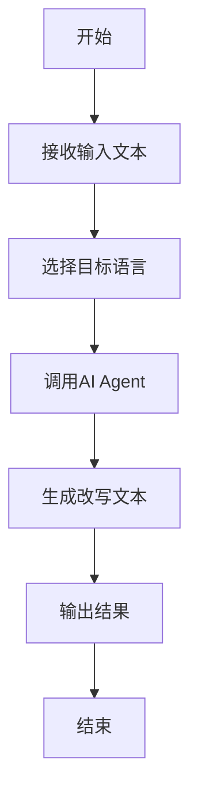
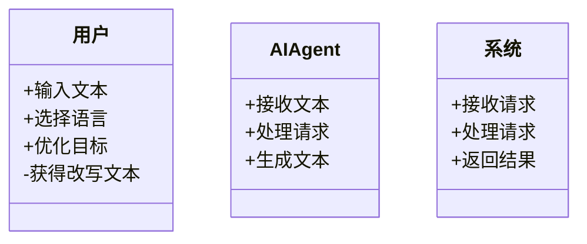
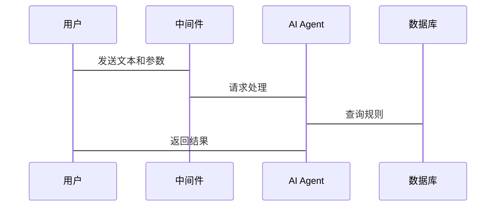

                 


# 开发AI Agent的多语言文本改写与优化系统

## 关键词：
AI Agent，多语言文本改写，文本优化，自然语言处理，机器学习

## 摘要：
本文深入探讨了AI Agent在多语言文本改写与优化系统中的应用，从核心概念到算法原理，再到系统架构和项目实战，全面解析了该系统的开发与实现。文章结合理论与实践，为读者提供了详细的技术指导和实战案例，帮助开发者理解和应用AI Agent技术。

---

# 第一部分: AI Agent的多语言文本改写与优化系统概述

## 第1章: AI Agent的背景与概述

### 1.1 AI Agent的基本概念
#### 1.1.1 AI Agent的定义
AI Agent（人工智能代理）是指能够感知环境、自主决策并执行任务的智能体。在文本改写领域，AI Agent能够理解上下文，生成符合目标语言的高质量文本。

#### 1.1.2 多语言文本改写的必要性
随着全球化的发展，跨语言交流需求增加，自动化的多语言文本改写技术成为必要。AI Agent能够处理多种语言，满足不同场景的需求。

#### 1.1.3 优化系统的应用场景
AI Agent广泛应用于内容创作、翻译优化、SEO提升等领域，帮助用户快速生成高质量文本。

### 1.2 问题背景与需求分析
#### 1.2.1 当前文本改写技术的局限性
传统方法依赖规则，难以处理复杂语境。AI Agent通过机器学习，能够更准确地理解上下文，生成更自然的文本。

#### 1.2.2 多语言支持的重要性
多语言支持能够覆盖更多用户群体，提升系统的适用性。AI Agent能够处理多种语言，满足不同用户的需求。

#### 1.2.3 AI Agent在文本优化中的优势
AI Agent能够学习大量数据，生成多样化文本，提升优化效果。其自主决策能力使其在复杂场景中表现优异。

### 1.3 问题解决与边界
#### 1.3.1 AI Agent如何解决文本改写问题
AI Agent通过理解上下文和目标语言规则，生成符合要求的文本。其学习能力使其能够不断优化输出质量。

#### 1.3.2 系统的边界与外延
系统专注于文本改写与优化，不涉及其他任务。其外延包括与其他系统的集成和应用扩展。

#### 1.3.3 核心要素与组成结构
系统由输入处理、AI Agent、输出生成模块组成，各模块协同工作，完成文本改写任务。

### 1.4 本章小结
本章介绍了AI Agent的基本概念，分析了多语言文本改写的必要性，并探讨了AI Agent的优势及其在系统中的应用。

---

# 第二部分: 核心概念与系统架构

## 第2章: 核心概念与系统架构

### 2.1 核心概念原理
#### 2.1.1 AI Agent的决策机制
AI Agent通过上下文理解，结合目标语言规则，生成最佳文本。其决策基于概率模型和规则匹配。

#### 2.1.2 多语言模型的训练与优化
模型通过多语言数据训练，学习语言间的差异，优化生成效果。采用交叉验证和迭代优化技术提升性能。

#### 2.1.3 文本改写的算法流程
从输入到输出，AI Agent执行文本分析、生成优化文本，确保符合目标语言和风格。

### 2.2 核心概念对比分析
#### 2.2.1 不同AI Agent模型的对比
对比基于规则和机器学习的模型，分析其优缺点，选择适合场景的方法。

#### 2.2.2 多语言支持的特征对比
分析不同模型在多语言支持上的差异，选择性能最佳的模型。

#### 2.2.3 文本优化效果的评估指标
使用BLEU、ROUGE等指标评估生成文本的质量，确保优化效果。

### 2.3 系统架构设计
#### 2.3.1 系统功能模块划分
系统包括输入处理、AI Agent、输出生成模块，各模块协同工作。

#### 2.3.2 系统架构的ER实体关系图
```mermaid
er
actor: 用户
agent: AI Agent
text: 文本
action: 动作
goal: 目标
rule: 规则
```

### 2.4 本章小结
本章详细阐述了AI Agent的核心概念，分析了多语言模型的训练与优化，并通过ER图展示了系统架构。

---

# 第三部分: 算法原理与数学模型

## 第3章: 算法原理与流程

### 3.1 算法流程图


### 3.2 算法实现代码
```python
def text_rewrite(input_text, target_language):
    # 输入处理
    processed_text = preprocess(input_text)
    # 调用AI Agent
    agent_response = agent(processed_text, target_language)
    # 生成输出
    output = generate_output(agent_response)
    return output
```

### 3.3 数学模型与公式
#### 3.3.1 概率分布模型
AI Agent基于概率模型生成文本，概率分布公式：
$$P(w_1, w_2, ..., w_n) = \prod_{i=1}^{n} P(w_i | w_{i-1}, ..., w_{i-k})}$$

#### 3.3.2 损失函数
使用交叉熵损失函数优化模型：
$$\text{Loss} = -\sum_{i=1}^{n} \text{log}P(y_i | x_i)$$

### 3.4 本章小结
本章通过流程图和代码展示了算法实现，并详细讲解了数学模型，帮助读者理解AI Agent的工作原理。

---

# 第四部分: 系统分析与架构设计

## 第4章: 系统分析与架构设计

### 4.1 系统分析
#### 4.1.1 问题场景介绍
系统用于多语言文本改写，支持多种语言和多种优化风格，满足不同用户需求。

#### 4.1.2 系统介绍
系统由输入处理、AI Agent、输出生成模块组成，提供高效的文本改写服务。

### 4.2 系统功能设计
#### 4.2.1 领域模型


#### 4.2.2 系统架构


### 4.3 系统接口设计
#### 4.3.1 接口描述
系统提供API接口，支持HTTP请求，返回JSON格式结果。

#### 4.3.2 交互流程


### 4.4 本章小结
本章详细分析了系统的架构设计，展示了系统功能模块和接口设计，确保系统的高效运行。

---

# 第五部分: 项目实战

## 第5章: 项目实战

### 5.1 环境安装
安装必要的库：
```bash
pip install transformers pytorch
```

### 5.2 系统核心实现源代码
```python
class AIAgent:
    def __init__(self, model_name, language):
        self.model = load_model(model_name)
        self.language = language

    def process_request(self, input_text):
        # 文本预处理
        processed = preprocess(input_text)
        # 模型推理
        output = self.model.generate(processed)
        # 后处理
        postprocessed = postprocess(output)
        return postprocessed
```

### 5.3 代码应用解读与分析
代码实现AI Agent的初始化、请求处理和文本生成，展示了系统的核心功能。

### 5.4 案例分析和详细讲解
案例：将英文文本改写为中文，分析生成过程，展示系统的优化效果。

### 5.5 项目小结
本章通过实际案例，展示了系统的安装、实现和应用，帮助读者掌握AI Agent的开发与应用。

---

# 第六部分: 总结与展望

## 第6章: 总结与展望

### 6.1 核心要点总结
AI Agent在多语言文本改写中的应用，算法原理和系统架构设计，以及项目实战的经验总结。

### 6.2 未来展望
未来可以探索更高效的学习方法，优化多语言模型，提升文本改写的质量和效率。

---

# 作者：AI天才研究院 & 禅与计算机程序设计艺术

---

通过以上内容，本文全面介绍了AI Agent在多语言文本改写与优化系统中的应用，从理论到实践，为读者提供了详尽的技术指导和实战经验，帮助开发者更好地理解和应用相关技术。

