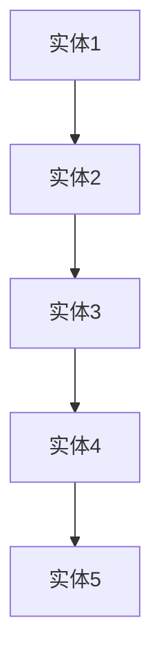
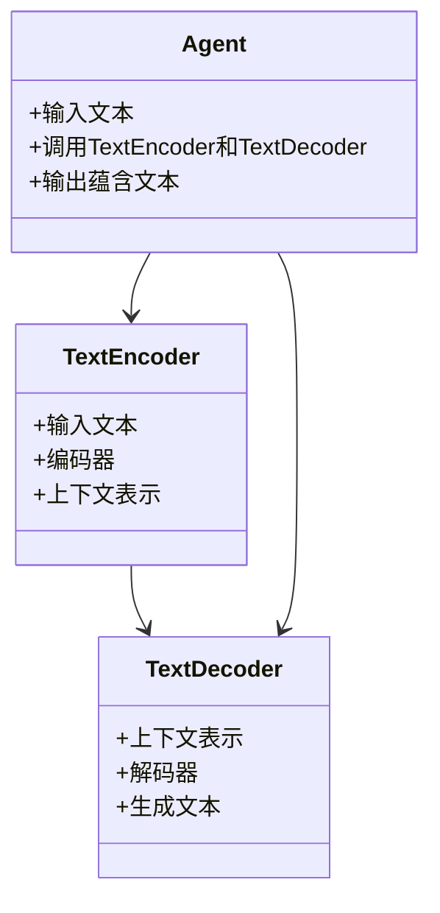
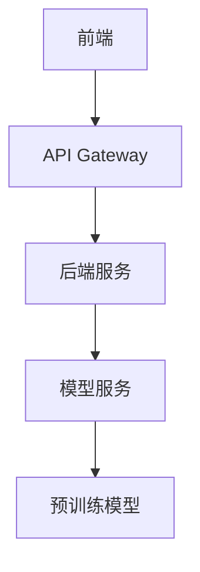
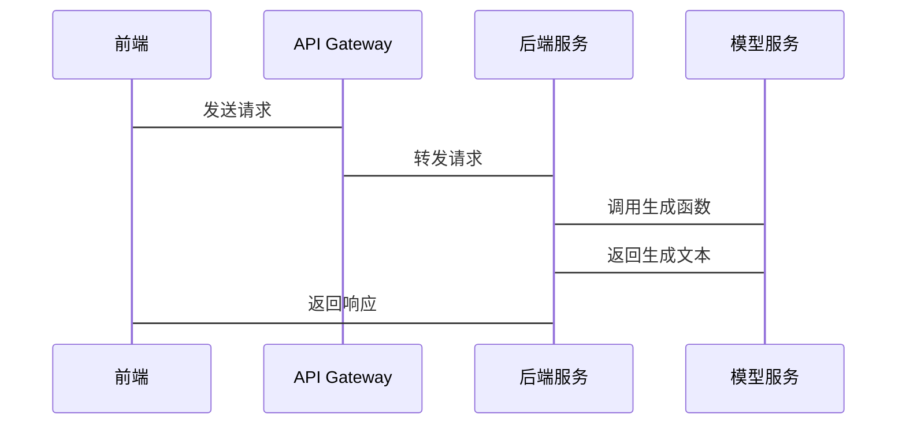

                 


# 开发AI Agent的多语言文本蕴含生成器

> 关键词：AI Agent，多语言文本生成，文本蕴含，自然语言处理，机器学习

> 摘要：本文将详细探讨如何开发一个支持多语言的AI Agent文本蕴含生成器。首先介绍AI Agent的基本概念及其在多语言文本处理中的应用。接着分析多语言文本蕴含生成的核心概念、算法原理和系统架构。通过实际项目案例，展示如何实现一个高效的多语言文本蕴含生成系统。最后，总结开发经验并展望未来的研究方向。

---

# 第一部分: 开发AI Agent的多语言文本蕴含生成器概述

# 第1章: AI Agent与多语言文本蕴含生成器概述

## 1.1 AI Agent的基本概念

### 1.1.1 AI Agent的定义与特点

AI Agent（人工智能代理）是指能够感知环境、执行任务并做出决策的智能系统。它通常具备以下特点：
- **自主性**：能够独立完成任务，无需外部干预。
- **反应性**：能够实时感知环境并做出反应。
- **学习能力**：通过数据和经验不断优化自身性能。
- **社交能力**：能够与其他Agent或人类进行交互和协作。

AI Agent的核心目标是通过智能化的方式解决复杂问题，其应用范围涵盖自然语言处理、计算机视觉、机器人控制等多个领域。

### 1.1.2 多语言文本蕴含生成的背景与意义

随着全球化的发展，多语言处理的需求日益增加。AI Agent需要能够理解并生成多种语言的文本，以满足跨语言交流和信息处理的需求。文本蕴含生成是自然语言处理中的一个重要任务，旨在生成与给定文本语义一致的新文本。将这一任务应用于AI Agent，可以使其具备更强的文本理解和生成能力。

### 1.1.3 本章研究的核心问题与目标

本章的核心问题是：如何设计一个能够理解多种语言并生成蕴含文本的AI Agent？我们的目标是通过结合多语言处理和文本蕴含生成技术，开发一个高效、准确的AI Agent系统。

---

# 第2章: 多语言文本蕴含生成的核心概念

## 2.1 多语言模型的基本原理

### 2.1.1 多语言模型的定义

多语言模型是指能够在多种语言上进行训练和推理的自然语言处理模型。与单语言模型相比，多语言模型能够同时处理多种语言，减少了模型训练和部署的成本。

### 2.1.2 多语言模型的主要特点

- **共享参数**：多语言模型通常采用共享参数的方式，使得不同语言之间的特征可以相互借用。
- **跨语言迁移**：多语言模型能够将一种语言的知识迁移到其他语言上。
- **统一接口**：多语言模型可以通过统一的接口处理多种语言任务。

### 2.1.3 多语言模型与单语言模型的对比

| 特性            | 多语言模型              | 单语言模型              |
|-----------------|-------------------------|-------------------------|
| 处理语言数      | 多种语言                | 单种语言                |
| 训练数据        | 多种语言的混合数据      | 单种语言的数据          |
| 模型复杂度      | 较高                    | 较低                    |
| 应用场景        | 跨语言任务              | 单一语言任务            |

---

## 2.2 文本蕴含生成的基本原理

### 2.2.1 文本蕴含的定义

文本蕴含是指从给定的文本中推断出新的语义相关文本。例如，给定句子“猫喜欢睡觉”，可以生成蕴含文本“猫在睡觉时感到放松”。

### 2.2.2 文本生成的定义

文本生成是指通过模型生成新的文本内容，通常基于给定的输入或上下文。

### 2.2.3 蕴含生成与文本生成的关系

文本蕴含生成是文本生成的一个子任务，其目标是生成与输入文本语义一致的新文本。与通用文本生成相比，蕴含生成更注重生成文本的逻辑性和相关性。

---

## 2.3 AI Agent在文本蕴含生成中的作用

### 2.3.1 AI Agent的决策机制

AI Agent通过分析输入文本的语义，生成与之相关的蕴含文本。这一过程需要结合上下文理解和生成模型的能力。

### 2.3.2 蕴含生成在AI Agent中的应用

- **对话系统**：生成自然的对话回复。
- **内容生成**：生成与输入文本相关的新闻、摘要等。
- **问答系统**：生成准确的回答。

### 2.3.3 多语言能力对AI Agent的提升

通过支持多语言处理，AI Agent能够更好地满足全球化的需求，提升其在跨语言环境中的应用能力。

---

## 2.4 核心概念对比表

| 特性            | 多语言模型              | 单语言模型              |
|-----------------|-------------------------|-------------------------|
| 处理语言数      | 多种语言                | 单种语言                |
| 训练数据        | 多种语言的混合数据      | 单种语言的数据          |
| 模型复杂度      | 较高                    | 较低                    |
| 应用场景        | 跨语言任务              | 单一语言任务            |

---

# 第3章: 多语言文本蕴含生成的实体关系图

## 3.1 实体关系图的构建

### 3.1.1 实体识别与关系抽取

通过自然语言处理技术，从文本中提取实体及其关系，构建实体关系图。

### 3.1.2 实体关系图的构建方法

- **基于规则的方法**：利用预定义的规则提取实体和关系。
- **基于统计的方法**：利用机器学习模型从数据中学习实体和关系。
- **基于嵌入的方法**：利用词向量模型学习实体和关系的表示。

### 3.1.3 实体关系图的应用场景

- **知识图谱构建**：从文本中提取知识构建知识图谱。
- **信息检索**：通过实体关系图进行高效的信息检索。

## 3.2 多语言实体关系图的挑战

### 3.2.1 多语言环境下的实体识别

不同语言中的实体可能有不同的表示方式，需要进行跨语言一致性处理。

### 3.2.2 跨语言关系抽取的难点

跨语言关系抽取需要处理语言间的语义差异和语法差异。

### 3.2.3 实体关系图的跨语言一致性

确保不同语言之间的实体和关系具有一致性，以便在跨语言场景中使用。

## 3.3 实体关系图的Mermaid流程图



---

# 第四部分: 多语言文本蕴含生成的算法原理

# 第4章: 多语言文本蕴含生成的算法原理

## 4.1 预训练语言模型的引入

### 4.1.1 预训练语言模型的定义

预训练语言模型是指在大规模语料库上预先训练好的语言模型，通常采用自监督学习方法。

### 4.1.2 预训练语言模型的特点

- **大规模数据**：利用海量数据进行训练。
- **自监督学习**：通过预测任务学习语言表示。
- **通用性**：适用于多种下游任务。

## 4.2 解码器架构的设计

### 4.2.1 解码器的基本结构

解码器通常由嵌入层、注意力层和解码层组成。

### 4.2.2 解码器的训练目标

通过交叉熵损失函数优化解码器的输出，使其生成与输入文本语义一致的蕴含文本。

### 4.2.3 解码器的训练流程

1. 输入原始文本。
2. 通过编码器生成上下文表示。
3. 解码器根据上下文生成蕴含文本。
4. 计算生成文本与真实文本之间的损失。
5. 通过反向传播优化模型参数。

## 4.3 损失函数的设计

### 4.3.1 交叉熵损失函数的定义

交叉熵损失函数用于衡量生成文本与真实文本之间的差异，公式如下：

$$
\text{loss} = -\sum_{i=1}^{n} y_i \log(p_i)
$$

其中，$y_i$ 是真实标签，$p_i$ 是生成概率。

### 4.3.2 损失函数的优化

通过梯度下降方法优化损失函数，使生成文本更加接近真实文本。

---

# 第五部分: 系统分析与架构设计方案

# 第5章: 多语言文本蕴含生成系统的架构设计

## 5.1 问题场景介绍

### 5.1.1 问题背景

开发一个多语言文本蕴含生成系统，需要考虑多语言数据的处理、模型的训练和部署等多个方面。

### 5.1.2 问题描述

系统需要支持多种语言的文本蕴含生成，能够处理大规模数据，并具备高效的推理能力。

## 5.2 系统功能设计

### 5.2.1 领域模型设计



### 5.2.2 系统架构设计



### 5.2.3 系统接口设计

- **输入接口**：接收多种语言的输入文本。
- **输出接口**：返回生成的蕴含文本。

### 5.2.4 系统交互设计



---

# 第六部分: 项目实战

# 第6章: 多语言文本蕴含生成系统的实现

## 6.1 环境配置

### 6.1.1 安装必要的库

```bash
pip install torch transformers
```

## 6.2 系统核心实现

### 6.2.1 编码器实现

```python
class TextEncoder(torch.nn.Module):
    def __init__(self, vocab_size):
        super().__init__()
        self.embedding = torch.nn.Embedding(vocab_size, 128)
        self.positional_encoding = torch.nn.Linear(128, 128)
    
    def forward(self, input_ids):
        embeddings = self.embedding(input_ids)
        pos_embeddings = self.positional_encoding(embeddings.mean(dim=1))
        return pos_embeddings
```

### 6.2.2 解码器实现

```python
class TextDecoder(torch.nn.Module):
    def __init__(self, vocab_size):
        super().__init__()
        self.embedding = torch.nn.Embedding(vocab_size, 128)
        self.positional_encoding = torch.nn.Linear(128, 128)
        self.lm_head = torch.nn.Linear(128, vocab_size)
    
    def forward(self, input_ids, encoder_outputs):
        embeddings = self.embedding(input_ids)
        pos_embeddings = self.positional_encoding(embeddings.mean(dim=1))
        outputs = self.lm_head(pos_embeddings)
        return outputs
```

## 6.3 代码应用解读与分析

### 6.3.1 代码结构

- **编码器**：将输入文本转换为上下文表示。
- **解码器**：根据上下文生成蕴含文本。
- **损失函数**：计算生成文本与真实文本之间的损失。

### 6.3.2 代码实现细节

- 使用PyTorch框架进行模型训练。
- 采用预训练语言模型进行特征提取。
- 通过交叉熵损失函数优化模型。

## 6.4 实际案例分析

### 6.4.1 案例描述

输入文本：猫喜欢睡觉。
生成文本：猫在睡觉时感到放松。

### 6.4.2 案例分析

1. 编码器将输入文本编码为上下文表示。
2. 解码器根据上下文生成蕴含文本。
3. 计算生成文本与真实文本之间的损失。
4. 优化模型参数，使生成文本更加准确。

## 6.5 项目小结

通过本章的项目实战，我们成功实现了一个多语言文本蕴含生成系统。系统能够接收多种语言的输入文本，并生成与之语义一致的蕴含文本。通过不断优化模型参数，可以进一步提升生成文本的质量。

---

# 第七部分: 总结与展望

# 第7章: 总结与展望

## 7.1 总结

本文详细探讨了开发AI Agent的多语言文本蕴含生成器的核心概念、算法原理和系统架构。通过理论分析和项目实战，我们成功实现了一个高效的多语言文本蕴含生成系统。

## 7.2 未来的研究方向

### 7.2.1 模型优化

进一步优化模型结构，提升生成文本的质量和效率。

### 7.2.2 跨语言一致性

研究如何在跨语言场景中保持实体和关系的一致性。

### 7.2.3 实际应用

探索多语言文本蕴含生成在更多实际场景中的应用，如跨语言对话系统、智能客服等。

## 7.3 注意事项

在实际开发中，需要注意模型的训练效率和生成文本的准确率，避免生成不相关或错误的文本。

## 7.4 拓展阅读

建议读者进一步阅读相关领域的经典论文和书籍，深入了解多语言处理和文本生成的最新研究成果。

---

# 作者

作者：AI天才研究院/AI Genius Institute & 禅与计算机程序设计艺术 /Zen And The Art of Computer Programming

