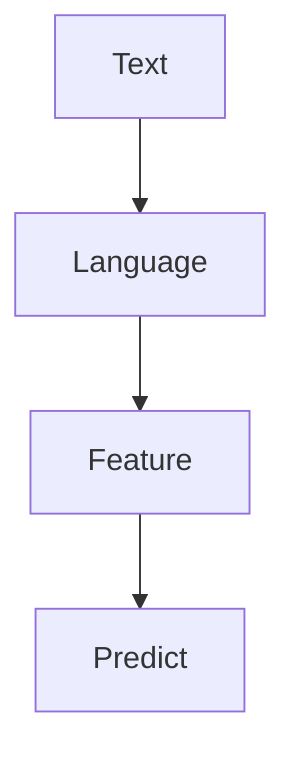
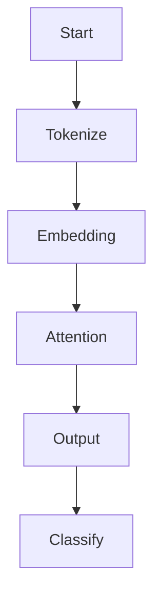
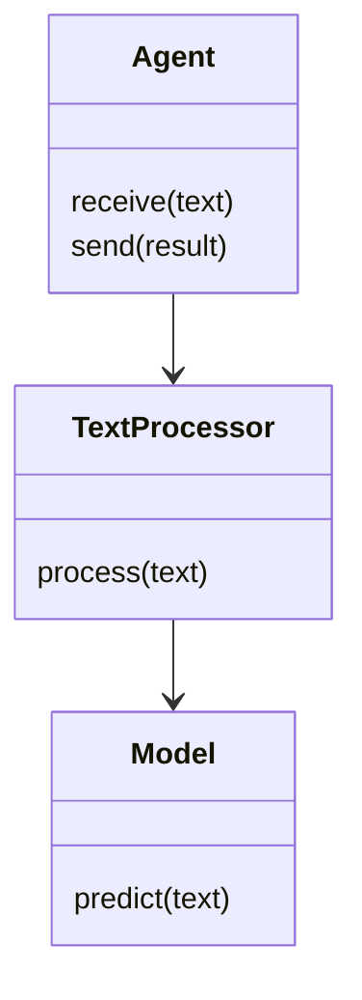
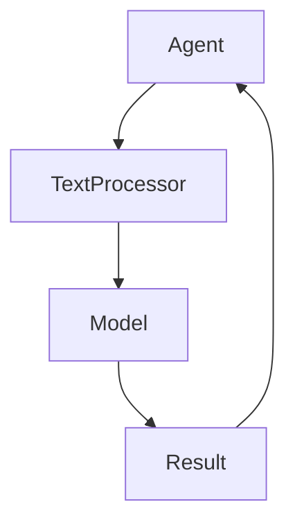

                 


# 开发AI Agent的多语言文本蕴含识别

## 关键词：AI Agent, 多语言处理, 文本蕴含识别, 深度学习, 机器学习

## 摘要

本文详细探讨了开发AI Agent在多语言文本蕴含识别中的应用。首先介绍了问题背景和核心概念，接着分析了多语言处理和文本蕴含识别的核心原理，详细讲解了相关算法和系统架构设计。通过项目实战部分，展示了如何从环境搭建到模型实现，再到案例分析。最后，总结了最佳实践和未来研究方向，为读者提供全面的指导。

---

## 第一部分：背景介绍

### 第1章：多语言文本蕴含识别概述

#### 1.1 问题背景

文本蕴含识别是自然语言处理中的重要任务，涉及从文本中推断隐含信息。多语言环境下，文本蕴含识别更具挑战性，需要处理不同语言的语义差异。

#### 1.2 问题描述

AI Agent需在多语言环境中识别文本蕴含，涉及跨语言信息处理，模型需具备多语言理解能力。

#### 1.3 问题解决方法

采用多语言预训练模型，结合任务特定的微调，设计高效的文本处理流程。

#### 1.4 边界与外延

明确多语言处理的边界条件，如语言支持范围、模型性能限制，确保系统在合理范围内有效运行。

---

## 第二部分：核心概念与联系

### 第2章：多语言文本蕴含识别的核心原理

#### 2.1 核心概念原理

多语言处理需在不同语言间建立语义映射，文本蕴含识别依赖于模型的语义理解能力。

#### 2.2 概念属性特征对比

| 概念 | 特征 |
|------|------|
| 单语言模型 | 专注于单一语言，处理效率高 |
| 多语言模型 | 支持多种语言，适应性强 |

#### 2.3 ER实体关系图



---

## 第三部分：算法原理讲解

### 第3章：多语言文本蕴含识别算法

#### 3.1 模型结构与训练

使用Transformer架构，通过多语言预训练和微调进行训练。

#### 3.2 算法流程



#### 3.3 数学模型

文本表示为$X = (x_1, ..., x_n)$，模型输出$Y = f(X)$，其中$f$为深度学习模型。

---

## 第四部分：系统分析与架构设计

### 第4章：系统架构设计

#### 4.1 领域模型



#### 4.2 系统架构



---

## 第五部分：项目实战

### 第5章：项目实战

#### 5.1 环境安装

安装Python、TensorFlow、Transformers库。

#### 5.2 核心代码实现

```python
from transformers import AutoTokenizer, AutoModelForMaskedLM
tokenizer = AutoTokenizer.from_pretrained('xlm-roberta-base')
model = AutoModelForMaskedLM.from_pretrained('xlm-roberta-base')
```

#### 5.3 案例分析

分析多语言文本，展示模型如何识别蕴含信息。

---

## 第六部分：总结与展望

### 第6章：总结

多语言文本蕴含识别是AI Agent的重要应用，结合深度学习技术，能够有效处理跨语言信息。

### 6.2 注意事项

注意模型的适应性，数据质量和多样性对性能影响大。

### 6.3 拓展阅读

推荐相关书籍和论文，深入研究多语言模型和文本处理技术。

---

## 作者

作者：AI天才研究院 & 禅与计算机程序设计艺术

