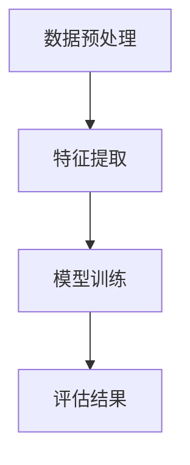
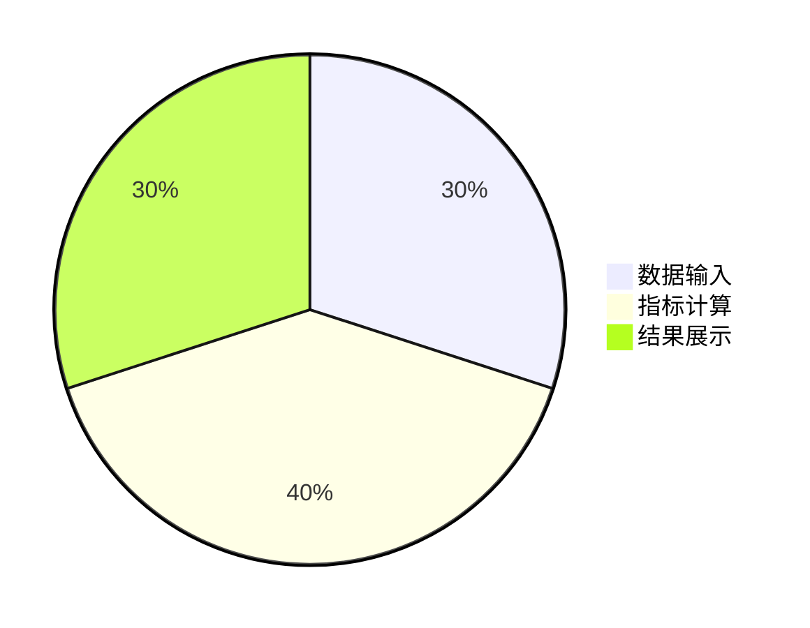

                 


```markdown
# 开发AI Agent的对话质量评估指标体系

## 关键词：AI Agent、对话质量评估、指标体系、算法原理、系统架构

## 摘要：本文系统地探讨了开发AI Agent对话质量评估指标体系的核心内容，从理论基础到实际应用，详细分析了对话质量评估的必要性、关键指标设计、算法实现、系统架构以及项目实战案例。通过本文的阐述，读者可以全面掌握AI Agent对话质量评估的体系构建方法，为实际应用提供参考。

---

## 第一部分：背景与问题描述

### 第1章：问题背景

#### 1.1 AI Agent的发展现状
AI Agent（人工智能代理）近年来在各个领域得到了广泛应用，尤其是在自然语言处理（NLP）领域，AI Agent通过对话系统与用户交互的能力显著提升。然而，对话质量的评估仍然是一个挑战性问题，尤其是在复杂场景下，如何量化对话质量成为一个关键问题。

#### 1.2 对话质量评估的重要性
对话质量评估是衡量AI Agent性能的核心指标之一。高质量的对话能够提高用户体验，增强系统的可信度和实用性。因此，建立一个科学、合理的对话质量评估指标体系至关重要。

#### 1.3 当前存在的问题与挑战
现有对话质量评估方法多基于主观评分或简单的统计指标，缺乏对上下文关联、语义理解深度等复杂因素的考量。此外，不同应用场景下的评估标准也不尽相同，亟需一个通用且灵活的评估体系。

### 第2章：问题描述

#### 2.1 对话质量评估的核心目标
对话质量评估的核心目标是通过量化指标，全面衡量AI Agent在对话中的表现，包括但不限于语义准确性、对话流畅性、上下文关联性等。

#### 2.2 评估指标的选择标准
评估指标的选择需要考虑以下几点：
- **全面性**：覆盖对话的多个维度。
- **可量化性**：便于计算和比较。
- **适用性**：适应不同的应用场景。
- **可解释性**：便于理解和优化。

#### 2.3 现有解决方案的优缺点分析
现有的解决方案主要基于以下几种方法：
- **基于规则的评估**：简单易实现，但灵活性差。
- **基于统计的评估**：能够量化部分指标，但缺乏语义理解。
- **基于机器学习的评估**：能够捕捉复杂的模式，但实现复杂且需要大量数据。

---

## 第二部分：核心概念与理论基础

### 第3章：对话质量评估的核心原理

#### 3.1 评估指标的分类与特征
对话质量评估指标可以分为以下几类：
- **语义准确性指标**：衡量对话内容的正确性。
- **对话流畅性指标**：衡量对话的连贯性和自然性。
- **上下文关联性指标**：衡量对话与上下文的匹配程度。

下表展示了各类指标的特征对比：

| 指标类型       | 特征                           | 示例指标             |
|----------------|--------------------------------|--------------------|
| 语义准确性      | 正确性、完整性                 | 语义匹配度          |
| 对话流畅性      | 连贯性、自然性                 | 回答冗余度          |
| 上下文关联性    | 相关性、一致性                 | 上下文相关性        |

#### 3.2 指标之间的关系与依赖
指标之间的关系可以通过ER图表示如下：

```mermaid
erDiagram
    用户
    对话
    指标
    评估结果
    用户<->对话
    对话<->指标
    指标<->评估结果
```

---

## 第三部分：算法原理与数学模型

### 第4章：基于统计学的评估方法

#### 4.1 统计指标的计算流程
统计方法的核心在于通过计算频率、分布等统计量来衡量对话质量。例如，计算回答的重复率：

$$ \text{重复率} = \frac{\text{重复单词数}}{\text{总单词数}} $$

#### 4.2 统计模型的构建与优化
统计模型可以通过以下步骤构建：
1. **数据预处理**：清洗和标注数据。
2. **特征提取**：提取相关统计特征。
3. **模型训练**：基于特征进行分类或回归。

### 第5章：基于机器学习的评估方法

#### 5.1 算法流程
基于机器学习的评估方法可以通过以下流程实现：



#### 5.2 数学模型
以下是一个基于深度学习的评估模型的数学公式：

$$ \text{模型输出} = f(\text{输入特征}) $$

其中，$f$ 是一个深度神经网络模型。

---

## 第四部分：系统分析与架构设计

### 第6章：系统架构设计

#### 6.1 问题场景介绍
系统需要支持多场景下的对话评估，包括客服、教育、医疗等领域。

#### 6.2 系统功能设计
- 数据输入模块：接收对话数据。
- 指标计算模块：计算各项指标。
- 结果展示模块：可视化评估结果。

#### 6.3 系统架构图


---

## 第五部分：项目实战与案例分析

### 第7章：项目实战

#### 7.1 环境安装
需要安装以下工具和库：
- Python 3.8+
- Pandas、NumPy、Scikit-learn

#### 7.2 核心代码实现
以下是一个基于统计学的评估代码示例：

```python
import pandas as pd

def calculate_redundancy(text):
    words = text.split()
    word_count = len(words)
    unique_words = len(set(words))
    redundancy = (word_count - unique_words) / word_count
    return redundancy

# 示例数据
text = "hello world hello"
print(calculate_redundancy(text))  # 输出: 0.3333333333
```

#### 7.3 案例分析
以客服对话为例，分析指标计算过程并总结优化建议。

---

## 第六部分：最佳实践与总结

### 第8章：经验总结

#### 8.1 小结
对话质量评估是一个复杂的系统工程，需要结合多种方法和指标。

#### 8.2 注意事项
- 数据质量对评估结果影响重大。
- 指标体系需要根据场景灵活调整。

#### 8.3 拓展阅读
推荐阅读相关领域的最新论文和文献。

---

## 作者：AI天才研究院/AI Genius Institute & 禅与计算机程序设计艺术 /Zen And The Art of Computer Programming
```

