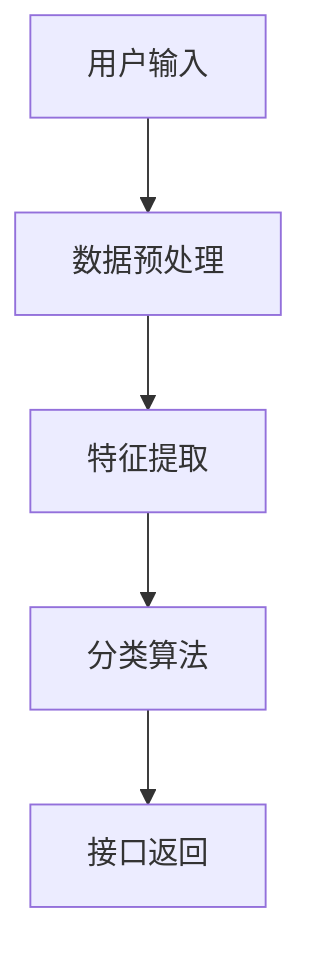

                 


# 开发AI Agent的情感分析引擎

---

## 关键词：AI Agent，情感分析，自然语言处理，深度学习，文本挖掘，机器学习

---

## 摘要：本文系统性地探讨了开发AI Agent情感分析引擎的核心技术与实现方法。从情感分析的基本概念到AI Agent的定义与应用场景，详细分析了情感分析引擎在AI Agent中的作用、核心算法与技术、系统架构设计、算法实现与优化，以及项目实战与最佳实践。文章通过丰富的案例分析、详细的代码实现和系统的架构设计，帮助读者全面理解并掌握AI Agent情感分析引擎的开发方法。

---

# 第一部分: 情感分析引擎与AI Agent的背景与核心概念

---

# 第1章: 情感分析引擎概述

## 1.1 情感分析的基本概念

### 1.1.1 情感分析的定义
情感分析（Sentiment Analysis），又称意见挖掘，是一种自然语言处理技术，旨在分析文本中蕴含的情感倾向（如正面、负面或中性）。它是通过计算语言学和机器学习技术，从文本中提取主观信息，判断说话者的情感态度。

### 1.1.2 情感分析的分类与应用场景
情感分析可以分为以下几类：
1. **二元情感分析**：将文本分为正面和负面两类。
2. **多分类情感分析**：将文本分为多个类别（如正面、中性、负面）。
3. **情感强度分析**：对情感的强度进行量化评估（如非常正面、稍微正面等）。
4. **方面情感分析**：针对特定方面（如产品质量、服务态度）进行情感分析。

情感分析的应用场景包括：
- 社交媒体分析（如Twitter、微博的情感分析）。
- 客服系统中的用户反馈分析。
- 电影、商品评论分析。
- 政治、经济领域的文本情感分析。

### 1.1.3 情感分析的核心问题与挑战
情感分析的核心问题包括：
1. 如何准确提取文本中的情感信息。
2. 如何处理文本中的歧义性和模糊性。
3. 如何应对不同领域和语境下的情感表达差异。

挑战包括：
- 数据的不平衡性。
- 复杂语义的理解。
- 高效算法的开发。

---

## 1.2 AI Agent的基本概念

### 1.2.1 AI Agent的定义与特点
AI Agent（人工智能代理）是一种能够感知环境、自主决策并执行任务的智能实体。它具有以下特点：
1. **自主性**：能够在没有外部干预的情况下独立运行。
2. **反应性**：能够感知环境并实时响应。
3. **目标导向性**：具有明确的目标，能够采取行动以实现目标。
4. **学习能力**：能够通过经验改进自身性能。

### 1.2.2 AI Agent的分类与应用场景
AI Agent可以分为以下几类：
1. **简单反射型Agent**：基于当前感知做出简单反应。
2. **基于模型的反应型Agent**：利用内部模型进行决策。
3. **目标驱动型Agent**：以目标为导向进行决策。
4. **实用驱动型Agent**：以效用函数为驱动进行决策。

AI Agent的应用场景包括：
- 智能客服系统。
- 自动交易系统。
- 智能推荐系统。
- 智能对话系统。

### 1.2.3 AI Agent与情感分析的结合
AI Agent可以通过情感分析技术来理解用户的意图和情感倾向，从而做出更智能的决策。例如：
- 在智能客服系统中，AI Agent可以根据用户的情感倾向调整回应方式。
- 在智能对话系统中，AI Agent可以根据用户的情感状态调整对话内容。

---

## 1.3 情感分析引擎在AI Agent中的作用

### 1.3.1 情感分析引擎的功能与价值
情感分析引擎在AI Agent中的功能包括：
1. **情感识别**：识别文本中的情感倾向。
2. **情感强度分析**：量化情感的强度。
3. **情感分类**：将文本分类到特定的情感类别中。

情感分析引擎的价值体现在：
1. 提高AI Agent的用户体验。
2. 增强AI Agent的智能性。
3. 为决策提供情感依据。

### 1.3.2 情感分析引擎与AI Agent的交互流程
1. AI Agent接收用户的输入（如文本或语音）。
2. 情感分析引擎对输入进行处理，提取情感信息。
3. AI Agent根据情感信息调整响应策略。

### 1.3.3 情感分析引擎的性能指标与评估方法
性能指标包括：
1. 准确率（Accuracy）。
2. 召回率（Recall）。
3. F1分数（F1-score）。

评估方法包括：
1. 基于测试集的性能评估。
2. 基于真实用户的性能评估。

---

## 1.4 本章小结

---

# 第2章: 情感分析的核心算法与技术

## 2.1 文本预处理技术

### 2.1.1 分词与词干提取
分词是将文本分割成词语的过程。词干提取是去除词语的后缀，保留词干的过程。

### 2.1.2 停用词过滤与词向量表示
停用词过滤是去除无实际意义的词语（如“的”、“了”）。词向量表示是将词语映射为向量的过程。

### 2.1.3 文本清洗与标准化
文本清洗包括去除特殊字符、转换大小写等。文本标准化是将文本统一为某种格式的过程。

---

## 2.2 情感分析的特征提取

### 2.2.1 词袋模型与词嵌入
词袋模型是将词语视为无序的集合。词嵌入是将词语映射为低维向量的过程。

### 2.2.2 语义向量与深度学习特征
语义向量是能够表示词语或句子语义的向量。深度学习特征是通过深度学习模型提取的特征。

### 2.2.3 预训练语言模型的应用
预训练语言模型（如BERT、GPT）可以直接用于情感分析任务。

---

## 2.3 情感分类算法

### 2.3.1 基于传统机器学习的分类算法
- **支持向量机（SVM）**：通过构建超平面进行分类。
- **随机森林（Random Forest）**：通过决策树的集成进行分类。

### 2.3.2 基于深度学习的分类算法
- **卷积神经网络（CNN）**：通过卷积操作提取局部特征。
- **长短时记忆网络（LSTM）**：通过记忆单元处理序列数据。
- **变压器（Transformer）**：通过自注意力机制处理序列数据。

### 2.3.3 混合模型与集成学习
混合模型是将多种模型的结果进行融合。集成学习是通过集成多个模型的结果来提高性能。

---

## 2.4 情感分析的模型训练与优化

### 2.4.1 数据增强与模型调参
数据增强是通过生成更多样化的数据来提高模型的泛化能力。模型调参是通过调整超参数来优化模型性能。

### 2.4.2 模型评估与性能优化
模型评估是通过测试集评估模型的性能。性能优化是通过改进算法或调整参数来提高模型性能。

### 2.4.3 情感分析的可解释性与鲁棒性
可解释性是通过模型的解释性方法（如LIME）来解释模型的决策过程。鲁棒性是通过模型在不同场景下的稳定性能来保证。

---

## 2.5 本章小结

---

# 第3章: AI Agent的情感分析引擎架构设计

## 3.1 情感分析引擎的系统架构

### 3.1.1 模块化设计与功能划分
情感分析引擎的模块化设计包括：
1. 数据预处理模块。
2. 特征提取模块。
3. 分类算法模块。
4. 接口模块。

### 3.1.2 数据流与交互流程
数据流包括：
1. 数据预处理模块接收原始数据。
2. 特征提取模块提取特征。
3. 分类算法模块进行分类。
4. 接口模块返回结果。

### 3.1.3 架构的可扩展性与灵活性
架构的可扩展性体现在模块化设计上，可以通过更换模块来扩展功能。架构的灵活性体现在可以通过调整参数来适应不同的场景。

---

## 3.2 情感分析引擎的系统设计

### 3.2.1 领域模型设计
领域模型包括：
1. 用户输入模块。
2. 数据预处理模块。
3. 特征提取模块。
4. 分类算法模块。
5. 接口模块。

### 3.2.2 系统架构图（Mermaid图）


### 3.2.3 接口设计与交互流程
接口设计包括：
1. 接收输入数据。
2. 返回情感分析结果。

交互流程包括：
1. 用户输入文本。
2. 系统预处理文本。
3. 系统提取特征。
4. 系统进行分类。
5. 系统返回结果。

---

## 3.3 情感分析引擎的实现方案

### 3.3.1 数据预处理模块实现
数据预处理模块包括：
1. 分词。
2. 词干提取。
3. 停用词过滤。

### 3.3.2 特征提取模块实现
特征提取模块包括：
1. 词袋模型。
2. 词嵌入。
3. 语义向量。

### 3.3.3 分类算法模块实现
分类算法模块包括：
1. SVM。
2. LSTM。
3. Transformer。

---

## 3.4 本章小结

---

# 第4章: 情感分析引擎的算法实现与优化

## 4.1 基于深度学习的情感分析算法

### 4.1.1 LSTM网络结构与实现
LSTM网络结构包括：
1. 输入层。
2. 长期记忆单元（LSTM单元）。
3. 输出层。

### 4.1.2 Transformer模型与注意力机制
Transformer模型包括：
1. 输入嵌入。
2. 多头注意力机制。
3. 前馈网络。

### 4.1.3 BERT模型在情感分析中的应用
BERT模型通过预训练和微调进行情感分析任务。

---

## 4.2 情感分析的模型优化策略

### 4.2.1 参数优化与学习率调整
参数优化是通过调整模型参数来提高性能。学习率调整是通过调整学习率来优化训练过程。

### 4.2.2 正则化技术与模型压缩
正则化技术包括L1正则化和L2正则化。模型压缩是通过减少模型参数数量来优化性能。

### 4.2.3 模型融合与集成学习
模型融合是通过将多个模型的结果进行融合来提高性能。集成学习是通过集成多个模型的结果来提高性能。

---

## 4.3 情感分析的可解释性与鲁棒性

### 4.3.1 可视化技术在情感分析中的应用
可视化技术包括词云、情感分布图等。

### 4.3.2 解释性模型的构建与优化
解释性模型包括LIME和SHAP等。

### 4.3.3 情感分析结果的可信度评估
可信度评估是通过模型的置信度来评估结果的可信度。

---

## 4.4 本章小结

---

# 第5章: 情感分析引擎的项目实战与最佳实践

## 5.1 项目实战

### 5.1.1 环境安装
安装必要的Python库：
```bash
pip install numpy
pip install scikit-learn
pip install tensorflow
pip install keras
```

### 5.1.2 核心实现

#### 5.1.2.1 数据预处理
```python
import numpy as np
from sklearn.feature_extraction.text import TfidfVectorizer
from sklearn.svm import SVC

# 数据加载
texts = ["I love this product!", "This is terrible.", "The service is good."]
labels = [1, 0, 1]

# 数据预处理
vectorizer = TfidfVectorizer()
X = vectorizer.fit_transform(texts)
y = np.array(labels)

# 模型训练
model = SVC()
model.fit(X, y)

# 模型预测
test_texts = ["This product is great!"]
X_test = vectorizer.transform(test_texts)
print(model.predict(X_test))  # 输出：[[1]]
```

#### 5.1.2.2 模型训练与部署
```python
import tensorflow as tf
from tensorflow.keras import layers

# 模型定义
model = tf.keras.Sequential()
model.add(layers.Embedding(input_dim=10000, output_dim=64))
model.add(layers.LSTM(64))
model.add(layers.Dense(1, activation='sigmoid'))

# 模型编译
model.compile(loss='binary_crossentropy', optimizer='adam', metrics=['accuracy'])

# 模型训练
model.fit(X_train, y_train, epochs=5, batch_size=32)
```

### 5.1.3 案例分析与详细解读
通过实际案例分析，详细解读情感分析引擎的实现过程和优化方法。

---

## 5.2 最佳实践

### 5.2.1 开发注意事项
1. 数据预处理是关键。
2. 模型选择要根据任务需求。
3. 模型调优要结合实际场景。

### 5.2.2 小结
通过实际项目的开发，总结情感分析引擎开发中的经验和教训。

### 5.2.3 注意事项
1. 数据质量和数量对模型性能影响很大。
2. 模型选择要结合实际场景。
3. 模型部署要考虑计算资源和性能。

### 5.2.4 拓展阅读
推荐相关书籍和论文，供读者进一步学习。

---

## 5.3 本章小结

---

# 第6章: 总结与展望

## 6.1 总结
情感分析引擎是AI Agent的重要组成部分，通过情感分析引擎可以提高AI Agent的智能性和用户体验。

## 6.2 展望
随着自然语言处理技术的发展，情感分析引擎将在更多领域得到应用。

---

# 作者：AI天才研究院/AI Genius Institute & 禅与计算机程序设计艺术 /Zen And The Art of Computer Programming

