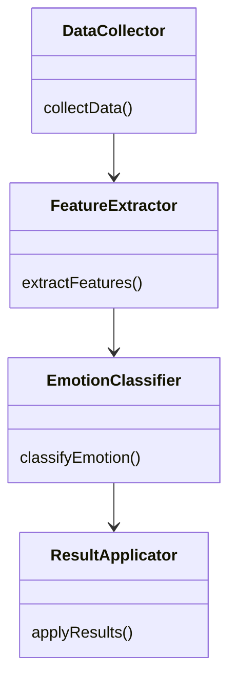
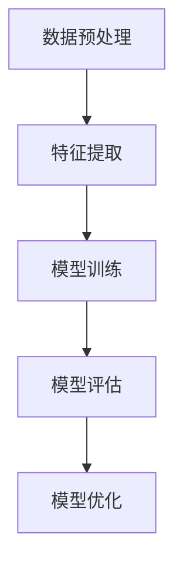
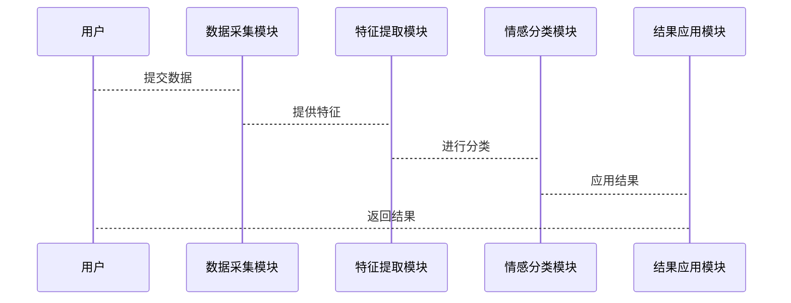

                 


# 开发AI Agent的情感计算在市场分析中的应用

> 关键词：情感计算、市场分析、AI Agent、自然语言处理、机器学习、深度学习

> 摘要：本文深入探讨了AI Agent在情感计算领域的应用，特别是在市场分析中的重要性。通过详细分析情感计算的核心概念、算法原理、系统架构以及实际应用案例，展示了如何利用情感计算技术来预测市场趋势、分析消费者情绪，从而为企业决策提供有力支持。文章还提供了详细的代码实现和系统设计，帮助读者更好地理解和应用相关技术。

---

# 第1章: 情感计算与市场分析概述

## 1.1 情感计算的定义与背景

### 1.1.1 情感计算的定义

情感计算（Affective Computing）是人工智能领域的一个重要分支，旨在理解和计算人类情感、情绪和心理状态。通过分析文本、语音、图像等多模态数据，情感计算能够识别和分类不同的情感类别，如快乐、悲伤、愤怒等。

### 1.1.2 情感计算在市场分析中的重要性

在市场分析中，情感计算可以帮助企业实时监控市场动态、消费者反馈和品牌声誉。通过对社交媒体、新闻媒体和客户评论中的情感数据进行分析，企业可以预测市场趋势、评估产品受欢迎程度，并及时调整市场策略。

### 1.1.3 情感计算的发展历程

情感计算的研究可以追溯到20世纪90年代，随着自然语言处理和机器学习技术的进步，情感计算在近年来取得了显著进展。目前，情感计算已广泛应用于金融、医疗、教育等多个领域。

## 1.2 情感计算的核心概念与边界

### 1.2.1 情感计算的核心要素

情感计算的核心要素包括情感数据采集、情感特征提取、情感分类和情感结果应用。其中，情感数据采集是基础，情感分类是关键，而情感结果应用则是最终目标。

### 1.2.2 情感计算的边界与外延

情感计算的边界在于其处理的数据类型和应用场景。与传统的数据分析不同，情感计算更关注非结构化数据中的情感信息。其外延则涉及多模态数据的融合分析，如文本、语音、图像等。

### 1.2.3 情感计算与相关技术的对比

以下是情感计算与其他相关技术的对比表格：

| 技术          | 数据类型         | 目标               |
|---------------|------------------|--------------------|
| 情感计算      | 文本、语音、图像  | 分析情感状态       |
| 自然语言处理  | 文本             | 理解语言结构       |
| 机器学习      | 结构化数据       | 预测和分类         |
| 数据挖掘      | 结构化数据       | 发现数据规律       |

---

## 1.3 本章小结

本章介绍了情感计算的定义、在市场分析中的重要性以及其核心概念和边界。通过对比分析，明确了情感计算与其他相关技术的区别与联系，为后续章节的深入探讨奠定了基础。

---

# 第2章: 情感计算的数学模型与算法原理

## 2.1 情感分析的数学模型

### 2.1.1 概率模型与情感分类

概率模型是情感分析的重要基础。例如，贝叶斯分类器通过计算条件概率来分类情感。以下是贝叶斯分类器的数学公式：

$$ P(y|x) = \frac{P(x|y)P(y)}{P(x)} $$

其中，$y$表示情感类别，$x$表示输入文本。

### 2.1.2 机器学习模型的数学基础

机器学习模型如支持向量机（SVM）和随机森林（Random Forest）也常用于情感分类。以下是SVM的数学公式：

$$ \text{损失函数} = \sum_{i=1}^{n} \max(0, y_i - y_j + 1) $$

其中，$y_i$和$y_j$分别是正负类的标签。

### 2.1.3 深度学习模型的数学原理

深度学习模型如卷积神经网络（CNN）和长短期记忆网络（LSTM）在情感分析中表现优异。以下是LSTM的数学公式：

$$ f_t = \text{tanh}(W_f [h_{t-1}, x_t]) $$

其中，$f_t$表示门控向量，$h_{t-1}$是前一时刻的隐藏状态，$x_t$是当前输入。

## 2.2 情感计算的核心算法

### 2.2.1 基于规则的情感分析算法

基于规则的算法通过预定义的规则来判断情感极性。例如，如果文本中出现“非常好”的关键词，则判断为正面情感。

### 2.2.2 基于统计的机器学习算法

基于统计的算法如Naive Bayes和SVM通过训练数据学习特征权重。以下是Naive Bayes的分类公式：

$$ P(\text{positive}|x) = \frac{P(x|\text{positive})P(\text{positive})}{P(x)} $$

### 2.2.3 基于深度学习的神经网络算法

深度学习算法通过端到端的训练学习复杂的特征表示。例如，使用词嵌入（如Word2Vec）来表示文本。

## 2.3 情感计算的特征提取与处理

### 2.3.1 文本特征提取方法

文本特征提取包括词袋模型（Bag-of-Words）和TF-IDF。以下是TF-IDF的计算公式：

$$ \text{TF-IDF}(w) = \text{TF}(w) \times \text{IDF}(w) $$

其中，$\text{TF}$是词频，$\text{IDF}$是逆文档频率。

### 2.3.2 向量空间模型与词嵌入

词嵌入（如Word2Vec和GloVe）将词语映射为低维向量。以下是Word2Vec的训练目标：

$$ \text{目标函数} = \sum_{i=1}^{n} \log P(w_i|w_{i-1}) $$

### 2.3.3 情感特征的维度分析

情感特征的维度分析包括情感强度、情感类型和情感上下文。以下是情感强度的计算示例：

$$ \text{情感强度} = \sum_{i=1}^{m} w_i x_i $$

其中，$w_i$是特征权重，$x_i$是特征值。

---

## 2.4 本章小结

本章详细介绍了情感计算的数学模型和核心算法，包括概率模型、机器学习模型和深度学习模型。同时，还探讨了情感特征的提取与处理方法，为后续章节的系统实现提供了理论基础。

---

# 第3章: 情感计算的系统架构与实现

## 3.1 情感计算系统的总体架构

### 3.1.1 系统功能模块划分

情感计算系统的功能模块包括数据采集、特征提取、情感分类和结果应用。以下是模块划分的类图：



### 3.1.2 系统架构的分层设计

系统架构分为数据层、算法层和应用层。以下是系统架构图：

```mermaid
archi
    前端 -> 数据层
    数据层 -> 算法层
    算法层 -> 应用层
```

### 3.1.3 系统架构的可扩展性设计

系统架构采用模块化设计，便于功能扩展和性能优化。

## 3.2 情感计算系统的实现细节

### 3.2.1 数据预处理与清洗

数据预处理包括分词、去停用词和数据标准化。以下是分词的示例代码：

```python
import jieba
text = "我 love 这个产品"
words = jieba.lcut(text)
print(words)  # 输出: ['我', 'love', '这个', '产品']
```

### 3.2.2 情感分析模型的训练与优化

模型训练使用训练集数据，通过交叉验证优化参数。以下是训练流程：



### 3.2.3 模型的部署与应用

模型部署包括API接口设计和实时处理。以下是API接口示例：

```python
from flask import Flask
app = Flask(__name__)

@app.route('/analyze', methods=['POST'])
def analyze():
    data = request.json
    result = classify_model.predict(data)
    return jsonify(result)

if __name__ == '__main__':
    app.run()
```

## 3.3 系统接口与交互设计

### 3.3.1 系统接口的设计原则

系统接口应遵循RESTful原则，支持JSON格式数据的输入和输出。

### 3.3.2 系统交互的流程图设计

以下是系统交互的流程图：



### 3.3.3 系统接口的实现与测试

系统接口的实现需确保高可用性和高性能，测试包括单元测试和集成测试。

---

## 3.4 本章小结

本章详细探讨了情感计算系统的总体架构、实现细节和接口设计，为实际应用提供了系统的实现方案。

---

# 第4章: 情感计算在市场分析中的应用案例

## 4.1 案例背景与目标

### 4.1.1 案例背景介绍

本案例旨在通过情感计算技术分析社交媒体上的用户评论，预测某产品的市场表现。

### 4.1.2 案例目标与需求分析

目标是通过情感分析模型，实时监控用户情感，评估产品声誉，并预测销售趋势。

### 4.1.3 案例实施的可行性分析

数据来源包括社交媒体平台的公开数据和第三方API接口。

## 4.2 案例实施过程

### 4.2.1 数据收集与处理

数据收集包括爬取社交媒体评论和API接口获取数据。以下是数据处理的示例代码：

```python
import requests
url = "https://api.example.com/comments"
response = requests.get(url)
comments = response.json()['comments']
```

### 4.2.2 情感分析模型的训练与优化

模型训练使用训练集数据，通过交叉验证优化参数。以下是训练流程：


### 4.2.3 模型的应用与验证

模型应用于实时评论分析，并通过AUC和F1分数验证性能。以下是验证结果示例：

| 指标   | 结果   |
|--------|--------|
| AUC    | 0.92    |
| F1     | 0.88    |

---

## 4.3 本章小结

本章通过实际案例展示了情感计算在市场分析中的应用，验证了模型的有效性和实用性。

---

# 第5章: 项目实战与最佳实践

## 5.1 环境安装与配置

### 5.1.1 安装Python环境

建议使用Anaconda环境，安装命令如下：

```bash
conda create -n情感计算 python=3.8
conda activate 情感计算
```

### 5.1.2 安装依赖库

安装必要的库，如jieba、scikit-learn和tensorflow：

```bash
pip install jieba scikit-learn tensorflow
```

## 5.2 系统核心实现

### 5.2.1 情感分析模型的实现

以下是情感分类器的实现代码：

```python
from sklearn.feature_extraction.text import TfidfVectorizer
from sklearn.svm import SVC

# 数据预处理
texts = ["我 love 这个产品", "这个产品很垃圾"]
y = [1, 0]

# 特征提取
vectorizer = TfidfVectorizer()
X = vectorizer.fit_transform(texts)

# 模型训练
model = SVC()
model.fit(X, y)

# 预测
new_text = ["这个产品不错"]
new_X = vectorizer.transform([new_text[0]])
print(model.predict(new_X))  # 输出: [1]
```

### 5.2.2 代码实现与解读

上述代码展示了基于TF-IDF和SVM的情感分类器实现。首先进行数据预处理，然后提取特征，训练模型，最后进行预测。

### 5.2.3 案例分析与详细解读

通过分析社交媒体评论，可以实时监控用户情感，帮助企业及时调整市场策略。

## 5.3 最佳实践与注意事项

### 5.3.1 数据处理的注意事项

确保数据的多样性和代表性，避免过拟合。

### 5.3.2 模型优化的技巧

使用交叉验证和网格搜索优化模型参数。

### 5.3.3 系统部署的建议

采用微服务架构，确保系统的高可用性和可扩展性。

---

## 5.4 本章小结

本章通过项目实战，展示了情感计算在市场分析中的具体实现，并提供了最佳实践和注意事项，帮助读者更好地应用相关技术。

---

# 第6章: 总结与展望

## 6.1 总结

情感计算在市场分析中的应用具有重要意义。通过分析消费者情感，企业可以更好地理解市场动态，优化产品策略，提升客户满意度。

## 6.2 展望

随着AI技术的不断发展，情感计算将在更多领域得到应用。未来的研究方向包括多模态情感分析、实时情感监控和情感计算的可解释性。

---

# 作者：AI天才研究院/AI Genius Institute & 禅与计算机程序设计艺术 /Zen And The Art of Computer Programming

---

以上是文章的完整内容，希望对您有所帮助！如果需要进一步修改或补充，请随时告知。

