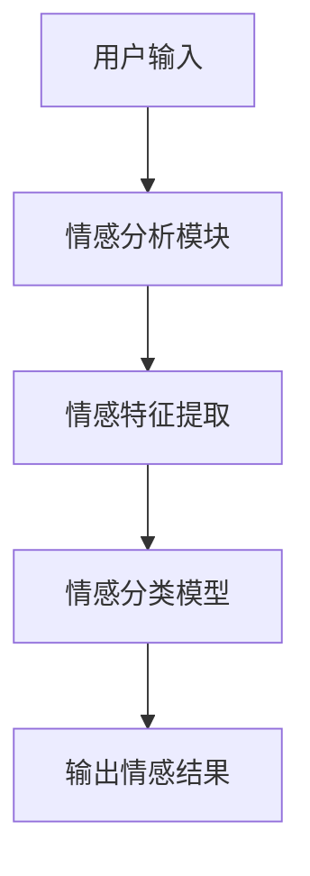
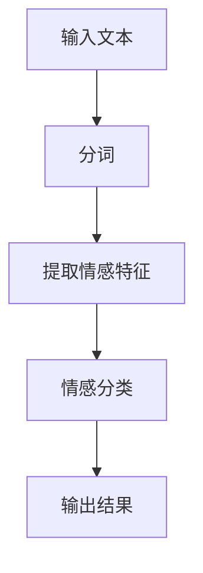
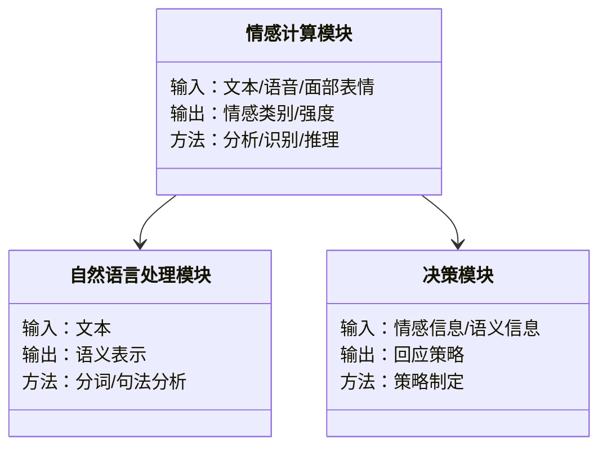
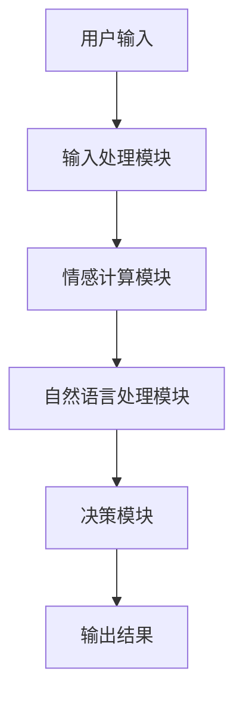
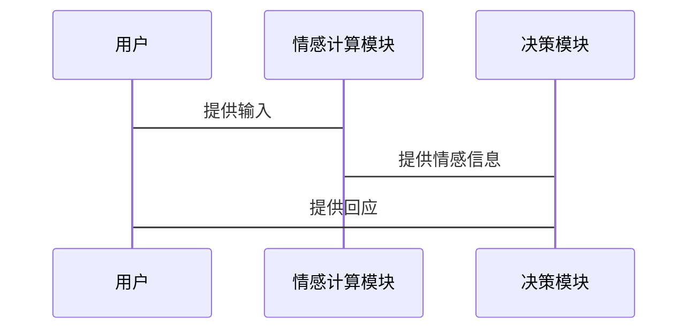

                 


# 开发AI Agent的情感计算模块

> 关键词：情感计算、AI Agent、自然语言处理、机器学习、深度学习

> 摘要：情感计算是人工智能领域的重要研究方向，它使AI Agent能够理解和处理人类情感，从而实现更自然的交互。本文详细探讨情感计算的核心概念、算法原理、系统架构以及开发实践，帮助开发者构建高效的情感计算模块。

---

# 第1章: 情感计算模块的背景与应用

## 1.1 情感计算的定义与背景

### 1.1.1 情感计算的定义
情感计算（Affective Computing）是指通过计算机技术来识别、理解、分析和处理人类情感的过程。它是人工智能的一个重要分支，旨在让机器能够像人类一样感知和回应情感。

### 1.1.2 情感计算的发展历程
情感计算的研究可以追溯到20世纪60年代。随着自然语言处理和机器学习技术的进步，情感计算逐渐从理论研究走向实际应用。

### 1.1.3 情感计算在AI Agent中的重要性
AI Agent需要与人类交互，理解用户的情感状态是实现自然交互的关键。情感计算模块能够帮助AI Agent做出更符合人类情感的回应。

## 1.2 情感计算的应用领域

### 1.2.1 情感计算在智能客服中的应用
通过分析用户的情感状态，智能客服可以更好地理解用户需求，提供更贴心的服务。

### 1.2.2 情感计算在社交机器人中的应用
社交机器人需要能够识别和回应用户的感情，从而建立更深层次的用户关系。

### 1.2.3 情感计算在游戏AI中的应用
游戏AI可以根据玩家的情感状态调整游戏难度和情节，提升用户体验。

## 1.3 情感计算的技术挑战

### 1.3.1 数据获取与处理的挑战
情感数据的获取需要考虑隐私和伦理问题，同时数据的质量和多样性也是关键。

### 1.3.2 情感分析的准确性问题
情感分析的准确性受到数据偏差、语言复杂性等因素的影响。

### 1.3.3 实时性与计算效率的平衡
在实时交互中，情感计算需要在有限的时间内完成，这对计算效率提出了更高的要求。

## 1.4 本章小结
情感计算在AI Agent中的应用广泛，但实现起来面临诸多挑战。理解这些挑战是开发情感计算模块的第一步。

---

# 第2章: 情感计算的核心概念与技术联系

## 2.1 情感计算的核心概念

### 2.1.1 情感分析
情感分析是通过自然语言处理技术对文本的情感倾向进行分析。常见的任务包括二分类（正面/负面）和多分类（正面、中性、负面等）。

### 2.1.2 情绪识别
情绪识别是通过语音、面部表情等多模态数据来识别用户的情绪状态。

### 2.1.3 情感记忆
情感记忆是指系统能够记录和存储用户过去的情感状态，以便在未来与用户交互时参考。

### 2.1.4 情感推理
情感推理是指系统能够根据上下文推断用户的情感状态，而不仅仅是基于当前输入。

## 2.2 情感计算与AI Agent的关系

### 2.2.1 情感计算作为AI Agent的核心模块
情感计算模块负责处理用户的输入，提取情感信息，并将结果传递给其他模块（如决策模块）。

### 2.2.2 情感计算与其他模块的交互
情感计算模块需要与自然语言处理模块、决策模块等进行协作，共同完成AI Agent的任务。

## 2.3 情感计算的核心技术对比

### 2.3.1 基于规则的情感计算
基于规则的情感计算通过预定义的规则来判断情感，适用于简单场景。

### 2.3.2 基于机器学习的情感计算
基于机器学习的情感计算通过训练模型来自动学习情感特征，具有更强的泛化能力。

### 2.3.3 深度学习在情感计算中的应用
深度学习（如LSTM、Transformer）在情感计算中表现出色，能够捕捉复杂的语义信息。

## 2.4 情感计算的实体关系图



---

# 第3章: 情感计算的算法原理与实现

## 3.1 情感计算的主要算法

### 3.1.1 基于规则的算法
通过预定义的关键词和规则来判断情感。

### 3.1.2 基于机器学习的算法
使用SVM、随机森林等传统机器学习算法进行情感分类。

### 3.1.3 基于深度学习的算法
使用LSTM、Transformer等深度学习模型进行情感分析。

## 3.2 情感计算的流程图



## 3.3 情感计算的数学模型

### 3.3.1 基于余弦相似度的情感相似度计算
$$ \text{相似度} = \frac{\vec{A} \cdot \vec{B}}{|\vec{A}| \cdot |\vec{B}|} $$

### 3.3.2 基于词嵌入的情感分类
$$ \text{输出} = \text{模型}(\text{输入}) $$

---

# 第4章: 情感计算模块的系统架构设计

## 4.1 问题场景介绍
AI Agent需要与用户进行交互，实时分析用户的情感状态，并根据结果调整回应策略。

## 4.2 系统功能设计



## 4.3 系统架构设计



## 4.4 系统接口设计
- 输入接口：接收用户输入（文本、语音、面部表情等）。
- 输出接口：输出情感计算结果（情感类别、强度等）。

## 4.5 系统交互流程



---

# 第5章: 情感计算模块的项目实战

## 5.1 环境搭建
安装必要的库，如`numpy`、`pandas`、`scikit-learn`、`transformers`。

## 5.2 核心实现

```python
from transformers import pipeline

# 初始化情感分析管道
sentiment_analyzer = pipeline("sentiment-analysis")

# 输入文本
text = "I love this product!"

# 进行情感分析
result = sentiment_analyzer(text)
print(result)  # 输出情感类别和概率
```

## 5.3 实际案例分析
分析用户对产品反馈的情感倾向，调整回应策略。

---

# 第6章: 最佳实践与小结

## 6.1 最佳实践
- 数据预处理：清洗和标注情感数据。
- 模型调优：尝试不同的算法和超参数。
- 多模态融合：结合文本、语音、面部表情等多种信息。

## 6.2 小结
情感计算是AI Agent实现自然交互的核心技术。通过理解情感计算的核心概念、算法原理和系统架构，开发者可以更好地构建高效的情感计算模块。

---

# 附录

## 附录A: 推荐的论文与工具
- 论文：《A Survey on Affective Computing》
- 工具：Hugging Face的Transformers库。

## 附录B: 常用工具与资源
- 数据集：AffectNet、EmoBank。
- 框架：TensorFlow、PyTorch。

---

# 作者：AI天才研究院 & 禅与计算机程序设计艺术

---

本文系统地介绍了AI Agent情感计算模块的开发背景、核心概念、算法原理和系统架构，同时通过实战案例展示了如何实现情感计算模块。希望本文能为开发者提供有价值的参考和启发。

