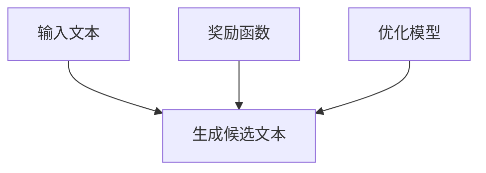

                 


# 开发AI Agent的文本生成控制能力

> 关键词：AI Agent，文本生成，控制能力，生成式AI，强化学习，RLHF

> 摘要：本文详细探讨了AI Agent在文本生成中的控制能力开发，从背景介绍到核心算法，再到系统设计和项目实战，全面解析了如何有效控制生成式AI的行为，确保其生成的文本既符合任务需求，又具备高质量和可解释性。

---

# 第一部分: AI Agent与文本生成控制能力的背景介绍

## 第1章: AI Agent与文本生成的背景与挑战

### 1.1 AI Agent的基本概念
- **1.1.1 AI Agent的定义与分类**
  - AI Agent是能够感知环境并采取行动以实现目标的智能体。
  - 分为简单反射型、基于模型的、实用推理型和目标驱动型。

- **1.1.2 文本生成在AI Agent中的重要性**
  - 文本生成是AI Agent与人类交互的重要方式。
  - 生成的文本需要具备准确性和可理解性。

- **1.1.3 AI Agent的控制能力与应用场景**
  - 控制能力确保生成的文本符合上下文和目标。
  - 应用于聊天机器人、内容生成、对话系统等场景。

### 1.2 文本生成的挑战与控制需求
- **1.2.1 文本生成的常见问题**
  - 多义性：同一输入可能生成多种结果。
  - 偏见性：模型可能生成带有偏见的内容。
  - 不可控制性：生成的内容难以精确掌控。

- **1.2.2 控制能力在文本生成中的作用**
  - 通过提示和奖励机制，引导生成内容的方向。
  - 确保生成内容的语义连贯性和目标一致性。

- **1.2.3 AI Agent文本生成的边界与外延**
  - 边界：生成内容的范围和限制。
  - 外延：扩展到多模态生成和其他复杂场景。

### 1.3 本章小结
- 本章介绍了AI Agent的基本概念和文本生成的重要性，分析了控制能力在其中的作用，并提出了开发控制能力的必要性。

---

# 第二部分: AI Agent文本生成控制的核心概念与联系

## 第2章: 核心概念与原理

### 2.1 生成式AI的基本原理
- **2.1.1 生成式AI的数学模型概述**
  - 基于概率分布生成文本。
  - 使用语言模型（LM）预测下一个词的概率。

- **2.1.2 概率生成模型与确定性生成模型的对比**
  | 模型类型       | 描述                              |
  |----------------|-----------------------------------|
  | 概率生成模型   | 输出概率分布，如GPT系列。       |
  | 确定性生成模型 | 输出固定结果，如规则生成文本。   |

- **2.1.3 基于强化学习的生成控制（RLHF）**
  - RLHF：通过强化学习优化生成过程。
  - 奖励函数用于评估生成文本的质量。

### 2.2 文本生成控制的实现机制
- **2.2.1 输入提示（Prompt）的设计与优化**
  - 提示语：明确生成内容的方向和风格。
  - 示例：生成一段科技新闻，要求正式且简洁。

- **2.2.2 基于奖励模型的生成控制**
  - 奖励模型：评估生成文本的优劣。
  - 示例：生成文本的流畅性得分。

- **2.2.3 基于规则的生成控制**
  - 使用正则表达式或语义规则约束生成内容。
  - 示例：生成文本必须包含特定关键词。

### 2.3 核心概念对比与ER实体关系图
- **2.3.1 生成式AI与判别式AI的对比分析**
  - 生成式AI：生成新内容。
  - 判别式AI：分类或识别内容。

- **2.3.2 控制参数与生成模型的关系**
  - 控制参数影响生成模型的输出。
  - 示例：温度参数调整生成的创意性。

- **2.3.3 ER实体关系图展示**
  ```mermaid
  graph TD
  A[生成模型] --> B[控制参数]
  C[输入提示] --> B
  D[奖励函数] --> B
  ```

### 2.4 本章小结
- 本章分析了生成式AI的基本原理，探讨了多种生成控制机制，并通过ER图展示了各组件的关系。

---

# 第三部分: AI Agent文本生成控制的算法原理

## 第3章: 基于强化学习的生成控制算法

### 3.1 强化学习基础
- **3.1.1 强化学习的基本概念**
  - 智能体通过与环境互动获得奖励。
  - 状态、动作、奖励、策略。

- **3.1.2 Markov决策过程（MDP）的数学模型**
  - 状态空间：S
  - 行动空间：A
  - 转移概率：P(s'|s,a)
  - 奖励函数：R(s,a,s')

- **3.1.3 奖励函数的设计与实现**
  - 示例：生成文本的流畅性奖励函数。

### 3.2 RLHF算法原理
- **3.2.1 RLHF的基本思想**
  - 使用人类反馈优化生成模型。
  - 示例：通过人类评分调整生成策略。

- **3.2.2 RLHF的数学模型与公式**
  - 奖励函数：$$ R(y|x) = \sum_{i=1}^{n} r_i(y|x_i) $$
  - 生成策略：$$ \theta = \arg\max_\theta \mathbb{E}_{x,y}[R(y|x)] $$

- **3.2.3 RLHF的训练流程与优化策略**
  - 收集人类反馈。
  - 使用强化学习优化模型参数。

### 3.3 算法流程图


### 3.4 本章小结
- 本章详细讲解了RLHF算法的原理和实现，展示了其在文本生成控制中的应用。

---

# 第四部分: AI Agent文本生成控制的系统设计

## 第4章: 系统分析与架构设计

### 4.1 系统功能设计
- **领域模型：文本生成与控制模块**
  ```mermaid
  classDiagram
  class AI Agent {
    +输入提示
    +生成模型
    +奖励函数
    +控制参数
  }
  ```

- **系统架构设计**
  ```mermaid
  graph TD
  A[输入提示] --> B[生成模型]
  C[奖励函数] --> B
  D[控制参数] --> B
  E[生成文本] --> B
  ```

### 4.2 系统接口设计
- 输入接口：接收用户提示和控制参数。
- 输出接口：返回生成文本和奖励分数。

### 4.3 系统交互设计
- 生成流程：
  1. 用户输入提示。
  2. 系统调用生成模型。
  3. 奖励函数评估生成文本。
  4. 系统返回优化后的文本。

### 4.4 本章小结
- 本章设计了AI Agent的系统架构，展示了各模块的交互流程。

---

# 第五部分: AI Agent文本生成控制的项目实战

## 第5章: 项目实战与代码实现

### 5.1 环境安装与配置
- 安装Python和相关库（如TensorFlow、Keras）。
- 示例代码环境：Python 3.8及以上版本。

### 5.2 核心实现代码
```python
import tensorflow as tf
from tensorflow.keras import layers

class Generator(tf.keras.Model):
    def __init__(self, vocab_size, embedding_dim, hidden_dim):
        super(Generator, self).__init__()
        self.embedding = layers.Embedding(vocab_size, embedding_dim)
        self.rnn = layers.GRU(hidden_dim, return_sequences=True)
        self.fc = layers.Dense(vocab_size, activation='softmax')

    def call(self, inputs):
        embedded = self.embedding(inputs)
        output = self.rnn(embedded)
        output = self.fc(output)
        return output

# 示例训练代码
generator = Generator(vocab_size=10000, embedding_dim=256, hidden_dim=512)
```

### 5.3 代码解读与分析
- 生成器模型：使用RNN生成文本。
- 奖励函数：评估生成文本的质量。

### 5.4 实际案例分析
- 案例：生成一段科技新闻。
- 输入提示：生成一篇关于AI的新闻，要求正式且简洁。

### 5.5 项目小结
- 本章通过实战项目展示了AI Agent文本生成控制的实现过程。

---

# 第六部分: 总结与展望

## 第6章: 总结与最佳实践

### 6.1 总结
- 开发AI Agent的文本生成控制能力需要结合生成式AI和强化学习技术。
- 控制机制的选择和设计是关键。

### 6.2 最佳实践 tips
- 使用清晰的提示语。
- 定期优化奖励函数。
- 结合领域知识优化生成结果。

### 6.3 本章小结
- 本章总结了开发AI Agent文本生成控制能力的核心要点，并提出了未来的研究方向。

---

# 作者：AI天才研究院/AI Genius Institute & 禅与计算机程序设计艺术 /Zen And The Art of Computer Programming

