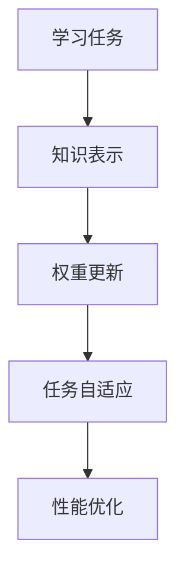
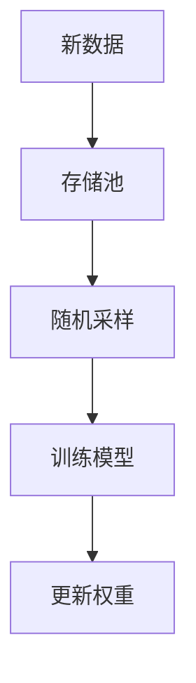
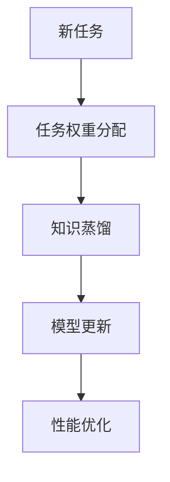

                 


# 开发AI Agent的自学习能力：持续学习机制

> 关键词：AI Agent，自学习能力，持续学习，机器学习，知识蒸馏

> 摘要：本文探讨了AI Agent的自学习能力，重点分析了持续学习机制的核心原理、算法实现及系统设计。通过实际案例和代码实现，详细阐述了如何构建具备持续学习能力的AI Agent，并提供了最佳实践和未来研究方向。

---

# 第1章: 问题背景与概念介绍

## 1.1 问题背景

### 1.1.1 传统机器学习的局限性
传统机器学习算法依赖于离线训练，无法适应动态变化的环境。例如，图像分类模型在训练完成后，若遇到新的类别或数据分布变化，无法有效调整，导致性能下降。

### 1.1.2 AI Agent的定义与特点
AI Agent是一种智能体，能够感知环境、自主决策并执行任务。其特点包括自主性、反应性、学习能力和社交能力。

### 1.1.3 持续学习的必要性
AI Agent需要在动态环境中不断学习新知识，适应新任务，保持高性能。

## 1.2 问题描述

### 1.2.1 AI Agent面临的动态环境挑战
环境变化可能导致模型失效，例如推荐系统面对用户偏好的变化。

### 1.2.2 知识更新与任务多样性的需求
AI Agent需要处理多种任务，且知识需持续更新。

### 1.2.3 持续学习的核心目标
通过在线学习，逐步优化模型，保持高精度。

## 1.3 问题解决思路

### 1.3.1 知识表示与更新机制
使用知识蒸馏等技术，将旧知识迁移到新任务中。

### 1.3.2 任务自适应策略
动态调整模型参数，适应新任务。

### 1.3.3 多模态学习与迁移
结合多源数据，提升模型的泛化能力。

## 1.4 边界与外延

### 1.4.1 持续学习的边界条件
有限计算资源和数据量。

### 1.4.2 相关概念的区分
区分在线学习、终身学习和增量学习。

### 1.4.3 应用场景的外延
扩展到智能助手、自动驾驶等领域。

## 1.5 概念结构与核心要素

### 1.5.1 核心概念的层次结构
从基础概念到高级机制的层次结构。

### 1.5.2 核心要素的对比分析
任务、模型、数据三者的关系对比。

### 1.5.3 概念之间的关系图
使用Mermaid绘制的概念关系图。

---

# 第2章: 持续学习机制的核心概念与联系

## 2.1 核心原理

### 2.1.1 知识蒸馏与参数更新
通过教师模型指导学生模型学习新知识。

### 2.1.2 任务自适应与权重分配
动态调整模型参数，以适应新任务。

### 2.1.3 多任务学习与经验重放
通过经验重放缓解遗忘问题。

## 2.2 核心概念对比

### 2.2.1 不同持续学习方法的对比分析
从算法复杂度、性能和适用场景对比。

### 2.2.2 算法复杂度与性能对比
比较不同算法的优缺点。

### 2.2.3 场景适用性的对比
适用于在线推荐、智能助手等场景。

## 2.3 实体关系图



---

# 第3章: 持续学习算法的原理与实现

## 3.1 算法选择

### 3.1.1 增量式学习算法
逐步更新模型，适应新数据。

### 3.1.2 知识蒸馏算法
通过教师模型指导学生模型学习。

### 3.1.3 经验重放算法
缓解遗忘问题，通过重放旧数据。

## 3.2 算法流程

### 3.2.1 经验重放算法流程


### 3.2.2 弹性权重 consolidate 算法流程


## 3.3 算法实现

### 3.3.1 经验重放算法实现
```python
import random

class ExperienceReplay:
    def __init__(self, capacity):
        self.capacity = capacity
        self.memory = []
    
    def remember(self, state, action, reward, next_state):
        self.memory.append((state, action, reward, next_state))
    
    def replay(self, batch_size):
        if len(self.memory) < batch_size:
            return []
        indices = random.sample(range(len(self.memory)), batch_size)
        return [self.memory[i] for i in indices]
```

### 3.3.2 弹性权重 consolidate 算法实现
```python
import torch

class EWC:
    def __init__(self, model, old_model, eps=1e-3):
        self.model = model
        self.old_model = old_model
        self.eps = eps
        self.fisher = {}
    
    def compute_fisher(self, loader, criterion):
        for param in self.model.parameters():
            self.fisher[param] = 0
        for data in loader:
            outputs = self.model(data)
            loss = criterion(outputs, labels)
            loss.backward()
            for param in self.model.parameters():
                self.fisher[param] += (param.grad ** 2).mean().item()

    def consolidate(self):
        for param in self.model.parameters():
            param.grad = (param - self.old_model.parameters()[param]) / (self.fisher[param] + self.eps)
```

## 3.4 数学模型与公式

### 3.4.1 经验重放
经验重放通过随机采样历史数据，防止模型遗忘。

### 3.4.2 弹性权重 consolidate
使用Fisher信息矩阵，计算任务权重，平衡新旧任务。

---

# 第4章: 系统分析与架构设计

## 4.1 应用场景

### 4.1.1 智能助手
动态适应用户查询。

### 4.1.2 推荐系统
实时更新推荐策略。

## 4.2 系统功能设计

### 4.2.1 领域模型
使用Mermaid类图展示模型结构。

### 4.2.2 系统架构设计
使用Mermaid架构图展示整体架构。

### 4.2.3 系统接口设计
定义API接口，如`/train`和`/predict`。

### 4.2.4 系统交互设计
使用Mermaid序列图展示交互流程。

---

# 第5章: 项目实战

## 5.1 环境安装

### 5.1.1 安装Python和相关库
安装TensorFlow或PyTorch。

## 5.2 核心实现

### 5.2.1 持续学习模型实现
代码示例，如经验重放网络。

### 5.2.2 任务切换与模型更新
代码实现任务切换逻辑。

## 5.3 案例分析

### 5.3.1 智能助手案例
实时对话中的知识更新。

### 5.3.2 推荐系统案例
动态更新推荐列表。

---

# 第6章: 最佳实践与小结

## 6.1 小结

### 6.1.1 核心知识点总结
持续学习机制的核心原理和算法。

### 6.1.2 系统设计要点
模块化设计和接口规范。

## 6.2 注意事项

### 6.2.1 计算资源限制
内存和计算能力的平衡。

### 6.2.2 数据质量
数据清洗和特征工程的重要性。

## 6.3 拓展阅读

### 6.3.1 推荐书目
《机器学习实战》和《深度学习》。

### 6.3.2 在线资源
推荐教程和GitHub仓库。

---

# 作者：AI天才研究院 & 禅与计算机程序设计艺术

