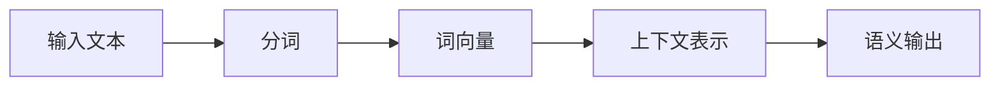
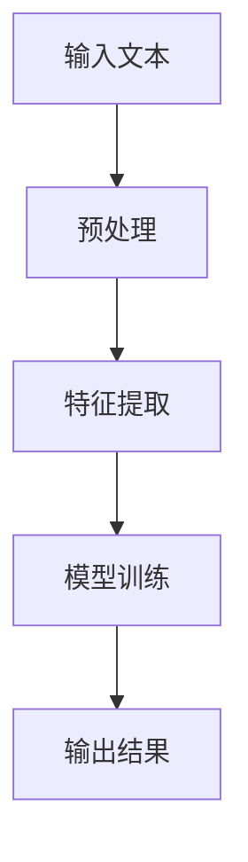
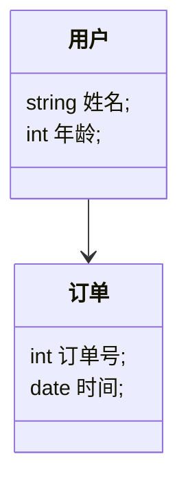

                 


# 开发AI Agent的语义理解深度：从字面到隐含

## 关键词：AI Agent，语义理解，深度学习，NLP，文本分析，知识图谱

## 摘要：  
语义理解是AI Agent实现智能交互的核心能力，从字面理解到隐含理解的深度决定了AI Agent的智能化水平。本文系统阐述了AI Agent语义理解的背景、核心概念、算法原理、系统架构、项目实战及未来发展方向。通过详细分析语义理解的层次结构，结合深度学习算法，展示了如何构建高效的语义理解系统，并通过实际案例分析，为开发者提供实践指导和优化建议。

---

# 第1章: AI Agent语义理解的背景与问题定义

## 1.1 什么是AI Agent
### 1.1.1 AI Agent的定义与特点
AI Agent（人工智能代理）是一种能够感知环境、自主决策并执行任务的智能实体。它通过与用户或环境交互，理解意图并提供相应的服务。AI Agent的特点包括：
1. **自主性**：能够独立决策和行动。
2. **反应性**：能够实时感知并响应环境变化。
3. **社会性**：能够与人类或其他Agent进行交互。

### 1.1.2 语义理解在AI Agent中的重要性
语义理解是AI Agent实现智能交互的基础。通过语义理解，AI Agent能够从输入的文本中提取深层含义，理解用户的意图，并生成合适的回应。

### 1.1.3 AI Agent与传统程序的区别
AI Agent的核心区别在于其具备智能性和适应性。传统程序依赖于固定的规则和逻辑，而AI Agent能够通过学习和推理，适应新的输入和场景。

## 1.2 语义理解的定义与范围
### 1.2.1 语义理解的核心概念
语义理解（Semantic Understanding）是指通过语言处理技术，从文本中提取语义信息，理解其含义和意图的过程。它包括字面理解（Literal Understanding）和隐含理解（Inferential Understanding）两个层次。

### 1.2.2 字面理解与隐含理解的对比
| 特性 | 字面理解 | 隐含理解 |
|------|----------|----------|
| 定义 | 基于文本的直接含义 | 需要推理和上下文信息 |
| 示例 | "猫"是动物 | 猫可以捉老鼠 |

### 1.2.3 语义理解的边界与外延
语义理解的边界包括文本处理、上下文分析和知识库的构建。外延则涉及多语言支持、情感分析和意图识别。

## 1.3 问题背景与挑战
### 1.3.1 当前语义理解技术的局限性
当前技术主要依赖于深度学习模型，但在处理复杂场景时仍存在挑战，如模糊表达和知识推理。

### 1.3.2 AI Agent在复杂场景中的语义理解需求
AI Agent需要在多场景中理解用户意图，如客服系统中的问题解决。

### 1.3.3 语义理解中的常见问题与解决方案
常见问题包括歧义性、知识缺乏和推理困难，解决方案包括结合知识图谱和强化学习。

## 1.4 本章小结
本章介绍了AI Agent的定义和特点，阐述了语义理解的重要性，并分析了当前技术的挑战和解决方案。

---

# 第2章: 语义理解的核心概念与联系

## 2.1 语义理解的核心原理
### 2.1.1 语义理解的三要素
语义理解的核心要素包括输入、输出和模型。

### 2.1.2 语义理解的层次分解
语义理解分为词、句、段落和篇章四个层次。

### 2.1.3 语义理解的数学模型基础
数学模型包括词嵌入和语言模型。

## 2.2 核心概念的对比分析
### 2.2.1 语义理解的实体关系图


### 2.2.2 语义理解流程图


## 2.3 本章小结
本章通过Mermaid图展示了语义理解的实体关系和流程，帮助读者理解其内部机制。

---

# 第3章: 语义理解的算法原理

## 3.1 主流语义理解算法概述
### 3.1.1 基于规则的语义理解
### 3.1.2 统计学习模型
### 3.1.3 深度学习模型

## 3.2 深度学习模型的数学基础
### 3.2.1 词嵌入的数学表示
使用Word2Vec模型，通过训练得到词向量表示。

### 3.2.2 语言模型的损失函数
交叉熵损失函数：
$$ \text{损失函数} = -\frac{1}{N}\sum_{i=1}^{N}\sum_{j=1}^{n} y_{i,j}\log p(y_{i,j}|y_{i,1},...,y_{i,j-1})} $$

## 3.3 深度学习模型的实现
### 3.3.1 环境安装
安装必要的库，如TensorFlow和Keras。

### 3.3.2 核心代码实现
```python
import tensorflow as tf
from tensorflow.keras import layers

model = tf.keras.Sequential()
model.add(layers.Embedding(input_dim=10000, output_dim=100))
model.add(layers.LSTM(64))
model.add(layers.Dense(2, activation='softmax'))
```

## 3.4 模型调优与优化
### 3.4.1 超参数选择
选择合适的嵌入维度和模型结构。

### 3.4.2 优化策略
使用Adam优化器和交叉熵损失函数。

## 3.5 本章小结
本章详细讲解了深度学习模型的数学基础和实现细节，为后续章节奠定了基础。

---

# 第4章: 系统分析与架构设计

## 4.1 项目场景介绍
构建一个智能客服系统，利用语义理解技术解决用户问题。

## 4.2 系统功能设计
### 4.2.1 领域模型


### 4.2.2 系统架构


## 4.3 系统接口设计
定义RESTful API接口，处理用户请求和返回结果。

## 4.4 本章小结
本章通过领域模型和架构图展示了系统设计，为实际开发提供了指导。

---

# 第5章: 项目实战

## 5.1 环境安装
安装Python、TensorFlow和Keras。

## 5.2 核心代码实现
### 5.2.1 数据预处理
对文本数据进行分词和向量化处理。

### 5.2.2 模型训练
使用训练数据训练语言模型。

### 5.2.3 模型预测
对输入文本进行语义分析并生成回应。

## 5.3 代码解读与分析
详细解读每部分代码的功能和实现细节。

## 5.4 实际案例分析
以智能客服系统为例，展示如何应用语义理解技术解决问题。

## 5.5 本章小结
本章通过实际案例展示了语义理解技术的应用，为读者提供了实践指导。

---

# 第6章: 最佳实践与小结

## 6.1 核心要素总结
总结语义理解的核心要素和关键点。

## 6.2 技术实现中的注意事项
包括数据质量、模型选择和性能优化。

## 6.3 未来发展方向
探讨多模态融合和可解释性等发展方向。

## 6.4 拓展阅读
推荐相关书籍和论文，帮助读者深入学习。

## 6.5 本章小结
本章总结了语义理解技术的核心要素和未来发展方向，为读者提供了进一步学习的方向。

---

# 附录

## 7.1 术语表
解释关键术语，如词嵌入和交叉熵损失函数。

## 7.2 参考文献
列出参考的书籍和论文，如《深度学习》和《自然语言处理入门》。

---

# 作者：AI天才研究院/AI Genius Institute & 禅与计算机程序设计艺术 /Zen And The Art of Computer Programming

---

通过以上思考和规划，我可以开始撰写完整的文章，确保每一部分都符合用户的要求，内容详实且逻辑清晰。

