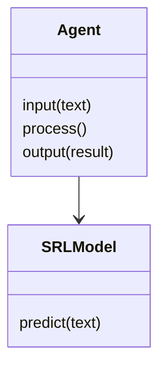
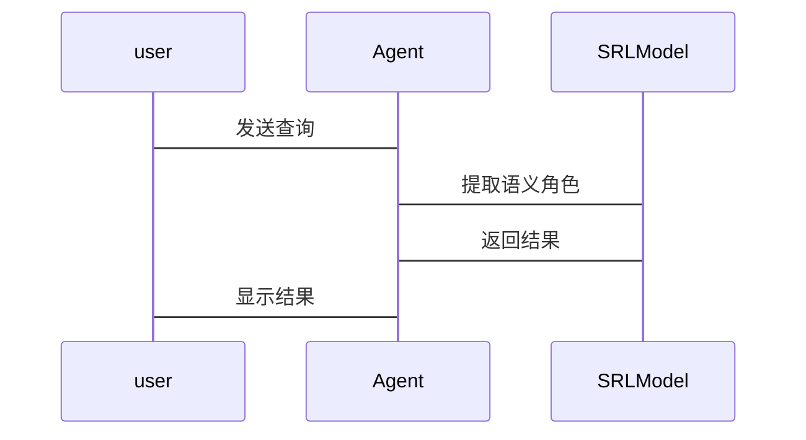

                 


# 开发AI Agent的语义角色标注能力

## 关键词：语义角色标注，AI Agent，自然语言处理，条件随机场，BERT模型

## 摘要：  
本文深入探讨了开发AI Agent的语义角色标注能力的关键技术。从语义角色标注的基本概念出发，分析了其在AI Agent中的重要性，详细讲解了语义角色标注的核心原理、算法实现及系统架构设计。通过具体的项目实战，展示了如何基于BERT模型构建高效的语义角色标注系统，并提出了优化建议和未来发展方向。

---

## 第一部分：背景介绍

### 第1章：语义角色标注的基本概念

#### 1.1 语义角色标注的定义与作用  
语义角色标注（Semantic Role Labeling, SRL）是自然语言处理中的一个关键任务，旨在识别句子中每个词语的语义角色。例如，在句子“张三给了李四一本书”中，“张三”是主语，“给”是谓语，“李四”是宾语，“书”是宾语补语。SRL的核心目标是为句子中的每个单词或短语分配一个语义角色，使其能够被计算机理解和处理。

**作用**：  
- 增强AI Agent的自然语言理解能力。  
- 为信息抽取、问答系统、机器翻译等任务提供基础支持。  

#### 1.2 AI Agent的定义与语义理解  
AI Agent是一种能够感知环境、执行任务并做出决策的智能实体。  
语义理解是AI Agent与人类交互的核心能力，而语义角色标注是实现语义理解的关键技术之一。

**AI Agent对语义角色标注的需求**：  
- 理解用户输入的自然语言指令。  
- 从复杂句子中提取关键信息并执行任务。  

---

## 第二部分：核心概念与联系

### 第2章：语义角色标注的核心原理

#### 2.1 语义角色标注的特征提取  
语义角色标注需要从文本中提取多种特征，包括：  
1. **语法特征**：如词性、句法结构。  
2. **语义特征**：如词语的语义类别（名词、动词等）。  
3. **上下文特征**：如上下文中的词语关系。  

#### 2.2 语义角色标注的模式匹配  
模式匹配是基于规则的方法，通过预定义的模式匹配句子结构。例如：  
- 主谓宾结构：主语-动词-宾语。  
- 宾语补语结构：宾语-动词-补语。  

#### 2.3 不同模型的对比分析  
| 模型类型 | 基于规则 | 基于统计 | 深度学习（如BERT） |  
|---------|----------|----------|------------------|  
| 优缺点 | 简单易懂，但规则复杂；准确率有限 | 数据依赖性低，但规则不够灵活 | 高准确率，但训练数据需求大 |  

---

## 第三部分：算法原理讲解

### 第3章：基于条件随机场的SRL实现

#### 3.1 条件随机场（CRF）原理  
CRF是一种用于序列标注的模型，广泛应用于NLP任务。其核心思想是通过转移概率和发射概率来预测每个位置的标签。  

**数学模型**：  
$$ P(y|x) = \frac{\exp(\sum_{i=1}^n \lambda y_i + \sum_{i=1}^n \theta y_i x_i)}{\sum_{y'} \exp(\sum_{i=1}^n \lambda y'_i + \sum_{i=1}^n \theta y'_i x_i)}} $$  

**流程图**：  


#### 3.2 基于BERT的SRL实现  
BERT是一种基于Transformer的预训练模型，能够有效捕捉上下文信息。  

**流程图**：  


**Python代码示例**：  
```python
import torch
from transformers import BertForTokenClassification, BertTokenizer

model = BertForTokenClassification.from_pretrained('bert-base-cased')
tokenizer = BertTokenizer.from_pretrained('bert-base-cased')

def predict_role(text):
    inputs = tokenizer(text, return_tensors='pt')
    with torch.no_grad():
        outputs = model(**inputs)
    predicted_labels = outputs.logits.argmax(dim=-1).item()
    return predicted_labels
```

---

## 第四部分：系统分析与架构设计方案

### 第4章：AI Agent的语义角色标注系统设计

#### 4.1 系统功能设计  
- **需求分析**：识别用户输入中的语义角色。  
- **系统架构设计**：模块化设计，包括输入处理、特征提取、模型预测和结果输出。  

**类图**：  


#### 4.2 接口设计与交互流程  
**交互流程图**：  


---

## 第五部分：项目实战

### 第5章：基于BERT的语义角色标注系统实现

#### 5.1 环境安装与配置  
```bash
pip install transformers torch
```

#### 5.2 系统核心代码实现  
```python
import torch
from transformers import BertForTokenClassification, BertTokenizer

class SRLAgent:
    def __init__(self):
        self.model = BertForTokenClassification.from_pretrained('bert-base-cased')
        self.tokenizer = BertTokenizer.from_pretrained('bert-base-cased')

    def process_input(self, text):
        inputs = self.tokenizer(text, return_tensors='pt')
        with torch.no_grad():
            outputs = self.model(**inputs)
        predicted_labels = outputs.logits.argmax(dim=-1).squeeze()
        return predicted_labels

    def output_result(self, labels):
        role_map = {0: '主语', 1: '谓语', 2: '宾语'}
        result = []
        for i, label in enumerate(labels):
            result.append((i, role_map[label.item()]))
        return result
```

#### 5.3 实际案例分析  
案例：输入句子“张三给了李四一本书”。  
输出结果：  
- 0: 主语（张三）  
- 1: 谓语（给）  
- 2: 宾语（李四）  
- 3: 宾语补语（书）  

---

## 第六部分：最佳实践与总结

### 第6章：总结与优化建议

#### 6.1 总结  
语义角色标注是开发AI Agent的核心技术之一。通过本文的讲解，读者可以深入了解SRL的基本原理、实现方法和系统设计。

#### 6.2 优化建议  
- **模型优化**：尝试使用更复杂的模型（如ALBERT）提升准确率。  
- **数据增强**：通过数据增强技术（如同义词替换）提高模型的泛化能力。  
- **系统优化**：优化系统架构，提高处理效率。  

---

## 作者：AI天才研究院/AI Genius Institute & 禅与计算机程序设计艺术 /Zen And The Art of Computer Programming

---

本文系统性地探讨了开发AI Agent的语义角色标注能力的关键技术，从理论到实践，为读者提供了全面的指导和参考。

