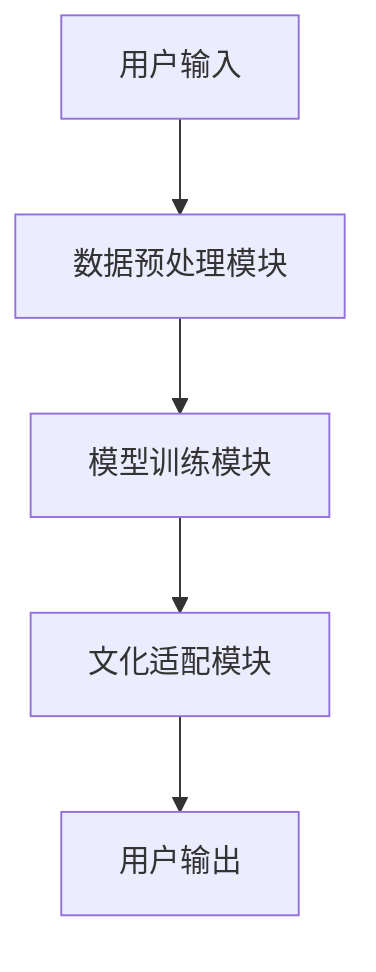
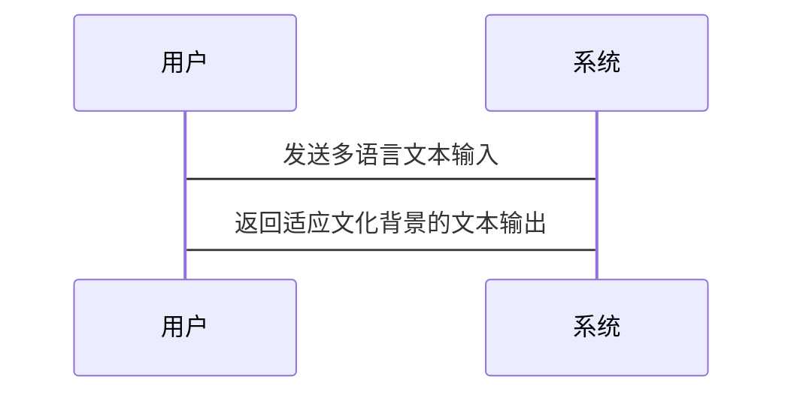

                 


# 开发AI Agent的跨文化交际能力

> 关键词：AI Agent，跨文化交际，自然语言处理，文化适配算法，情感计算，多语言支持，系统架构设计

> 摘要：AI Agent的跨文化交际能力是实现智能化交互的重要组成部分。随着全球化的深入，AI Agent需要能够理解和适应不同文化背景下的语言和行为模式。本文从AI Agent的背景、跨文化交际的核心概念、算法实现、系统架构设计、项目实战以及总结展望等多方面展开讨论，深入剖析AI Agent跨文化交际能力的开发与实现。

---

# 第1章 背景介绍与问题背景

## 1.1 AI Agent的基本概念

### 1.1.1 AI Agent的定义与特点
AI Agent（人工智能代理）是一种能够感知环境、自主决策并执行任务的智能系统。其核心特点包括：
- **自主性**：能够在没有外部干预的情况下独立运行。
- **反应性**：能够实时感知环境并做出反应。
- **目标导向性**：具有明确的目标，并通过行为选择来优化目标的实现。

### 1.1.2 跨文化交际能力的定义
跨文化交际能力是指个体在不同文化背景下，能够准确理解、有效沟通并适应文化差异的能力。对于AI Agent而言，这意味着它需要具备理解并生成符合不同文化背景的自然语言文本的能力。

### 1.1.3 问题背景与重要性
随着AI Agent的应用场景越来越广泛，尤其是在全球化和多语言环境下，跨文化交际能力变得尤为重要。例如，在跨国客服、多语言对话系统中，AI Agent需要能够理解并适应不同文化背景下的语言习惯和表达方式。

---

## 1.2 跨文化交际能力的核心要素

### 1.2.1 语言理解与生成
AI Agent需要能够理解多种语言，并根据文化背景生成合适的语言表达。例如，在中文和英文中，某些表达方式可能存在文化差异，AI Agent需要能够识别并调整这些差异。

### 1.2.2 文化敏感性
文化敏感性是指AI Agent能够识别并适应不同文化背景下的非语言信号，例如肢体语言、面部表情、语调等。这些因素在跨文化交际中起着重要作用。

### 1.2.3 情感识别与表达
在跨文化交际中，情感的表达和理解尤为重要。不同文化背景下，人们表达情感的方式可能存在差异，AI Agent需要能够准确识别并生成符合目标文化背景的情感表达。

---

# 第2章 跨文化交际能力的核心概念

## 2.1 跨文化交际能力的理论基础

### 2.1.1 跨文化交际理论
跨文化交际理论强调不同文化之间的差异和共性。AI Agent需要基于这些理论，设计能够适应不同文化背景的交互模型。

### 2.1.2 AI Agent在跨文化交际中的角色
AI Agent在跨文化交际中扮演着桥梁的角色，它需要能够理解用户的需求，并生成符合用户文化背景的回应。

---

## 2.2 跨文化交际能力的模型构建

### 2.2.1 层次模型
层次模型将跨文化交际能力划分为多个层次，例如：
- **表层**：语言理解和生成。
- **中层**：文化适配。
- **深层**：情感计算。

### 2.2.2 语境模型
语境模型用于描述不同文化背景下的语言和行为模式。例如，在商务谈判中，某些文化更倾向于直接表达意见，而另一些文化则倾向于间接表达。

### 2.2.3 情感模型
情感模型用于描述不同文化背景下情感表达的差异。例如，在某些文化中，情感表达可能更加直接，而在另一些文化中则相对隐晦。

---

# 第3章 跨文化交际能力的算法与实现

## 3.1 跨文化语料库的构建

### 3.1.1 多语言语料库
多语言语料库是AI Agent实现跨文化交际的基础。它需要包含多种语言的文本数据，并标注文化背景信息。

### 3.1.2 文化语料库
文化语料库用于存储不同文化背景下的语言表达方式和文化习惯。例如，某些文化中常用的成语和俗语。

### 3.1.3 数据清洗与标注
数据清洗是指对语料库中的数据进行去噪和预处理，确保数据的质量。标注则需要对数据进行分类和标记，以便后续的算法训练。

---

## 3.2 跨文化适配算法

### 3.2.1 文化适配策略
文化适配策略是指AI Agent在不同文化背景下选择合适的语言和行为方式的策略。例如，基于用户的语言和文化背景，动态调整响应内容。

### 3.2.2 基于文化的语义理解
语义理解需要结合文化背景，理解文本的深层含义。例如，在某些文化中，某些词汇可能具有特定的文化内涵。

### 3.2.3 文化敏感性评估
文化敏感性评估是指AI Agent能够识别并避免文化冲突的表达方式。例如，在某些文化中，直接批评他人可能被视为不礼貌。

---

## 3.3 跨文化交际能力的数学模型

### 3.3.1 跨文化语义理解模型
跨文化语义理解模型用于理解不同文化背景下文本的语义。例如，使用向量空间模型（Vector Space Model）表示不同语言的语义相似性。

### 3.3.2 跨文化情感计算模型
跨文化情感计算模型用于计算不同文化背景下文本的情感倾向。例如，使用情感分类模型（Sentiment Classification）结合文化背景信息，动态调整情感计算结果。

---

## 3.4 算法实现

### 3.4.1 跨文化适配算法的实现步骤
1. **数据预处理**：清洗和标注多语言语料库。
2. **模型训练**：基于标注数据训练跨文化语义理解模型和情感计算模型。
3. **文化适配策略设计**：根据用户的文化背景动态调整响应内容。

### 3.4.2 代码实现
以下是跨文化适配算法的伪代码示例：

```python
def cross_cultural_adaptation(user_input, user_culture):
    # 数据预处理
    preprocess(user_input)
    # 文化适配策略
    if user_culture == 'Chinese':
        response = generate_response_chinese(user_input)
    elif user_culture == 'English':
        response = generate_response_english(user_input)
    return response
```

---

# 第4章 系统架构与设计

## 4.1 系统功能设计

### 4.1.1 多语言支持模块
多语言支持模块负责处理多种语言的文本输入和输出。

### 4.1.2 文化适配模块
文化适配模块根据用户的文化背景动态调整响应内容。

### 4.1.3 情感计算模块
情感计算模块负责计算用户输入的情感倾向，并根据文化背景调整情感计算结果。

---

## 4.2 系统架构设计

### 4.2.1 系统组件关系
- **用户输入**：多语言文本输入。
- **数据预处理模块**：清洗和标注输入数据。
- **模型训练模块**：训练跨文化语义理解模型和情感计算模型。
- **文化适配模块**：动态调整响应内容。

### 4.2.2 数据流图


---

## 4.3 系统接口与交互设计

### 4.3.1 系统接口设计
- **输入接口**：支持多种语言的文本输入。
- **输出接口**：根据文化背景生成相应的文本输出。

### 4.3.2 交互流程


---

# 第5章 项目实战

## 5.1 环境安装

### 5.1.1 开发环境
- **编程语言**：Python
- **深度学习框架**：TensorFlow或PyTorch
- **自然语言处理库**：spaCy或NLTK

### 5.1.2 依赖安装
```bash
pip install tensorflow nltk spacy
python -m spacy download en_core_web_sm
```

---

## 5.2 核心代码实现

### 5.2.1 多语言语料库的构建
```python
import nltk
nltk.download('punkt')
nltk.download('wordnet')
```

### 5.2.2 跨文化适配算法的实现
```python
def generate_response(user_input, user_culture):
    if user_culture == 'Chinese':
        # 处理中文输入
        response = "您说的内容我已理解，请继续提问。"
    elif user_culture == 'English':
        # 处理英文输入
        response = "I understand your message. Please continue."
    return response
```

---

## 5.3 案例分析

### 5.3.1 中文场景
用户输入：您好，您能帮助我吗？
系统响应：当然可以，请告诉我您需要什么帮助。

### 5.3.2 英文场景
用户输入：Can you help me?
系统响应：Sure, what can I do for you?

---

## 5.4 项目小结
通过上述实战，我们可以看到，AI Agent的跨文化交际能力的开发需要结合多语言支持、文化适配算法和情感计算等多方面的内容。只有在实践中不断优化和调整，才能真正实现智能化的跨文化交际能力。

---

# 第6章 总结与展望

## 6.1 总结
本文从AI Agent的背景、跨文化交际能力的核心概念、算法实现、系统架构设计、项目实战等方面进行了深入探讨。通过理论与实践的结合，我们看到了AI Agent跨文化交际能力开发的潜力和挑战。

## 6.2 未来展望
未来，随着全球化和多语言需求的增加，AI Agent的跨文化交际能力将变得更加重要。我们需要进一步研究和优化跨文化语义理解模型和情感计算模型，以实现更加智能化和个性化的跨文化交际能力。

## 6.3 注意事项
在开发AI Agent的跨文化交际能力时，需要注意以下几点：
- **数据质量**：确保多语言语料库的质量和多样性。
- **文化敏感性**：避免文化冲突和冒犯。
- **算法优化**：不断优化跨文化适配算法，提高准确性和效率。

---

作者：AI天才研究院/AI Genius Institute & 禅与计算机程序设计艺术 /Zen And The Art of Computer Programming

