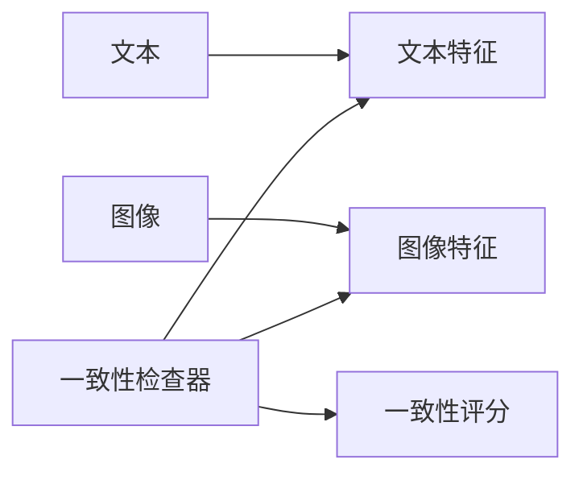
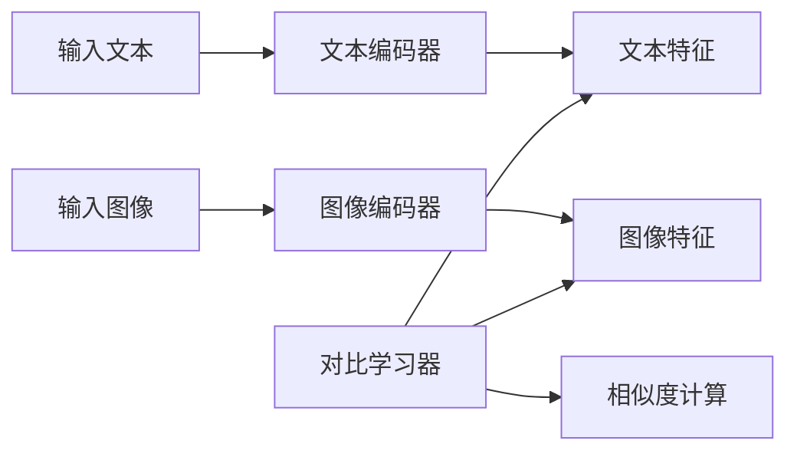
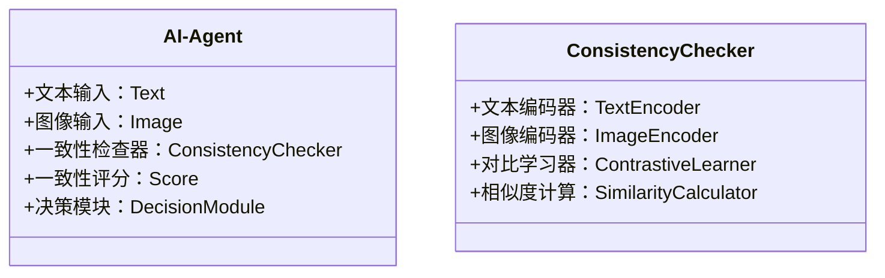
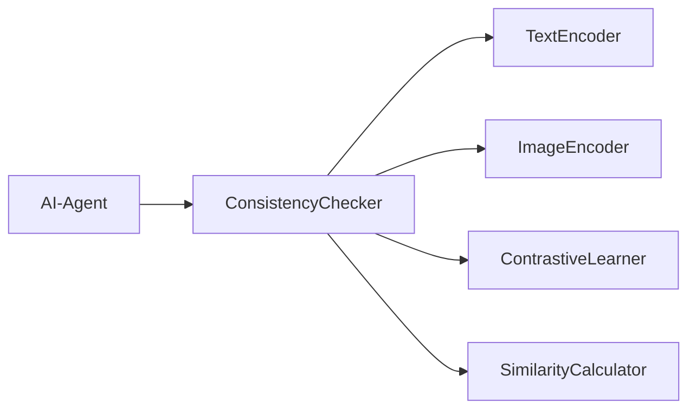

                 


# 开发AI Agent的跨模态内容一致性检查器

---

## 关键词：AI Agent，跨模态，内容一致性，多模态模型，一致性检查，对比学习

---

## 摘要：  
本文系统地探讨了开发AI Agent的跨模态内容一致性检查器的关键技术与实现方法。通过分析跨模态数据的特征与关联性，提出了一种基于对比学习的内容一致性检查框架，并结合实际应用场景，详细阐述了系统的架构设计与实现方案。文章还提供了具体的项目案例与代码实现，帮助读者深入理解跨模态内容一致性检查的核心原理与实践技巧。

---

# 第一部分: 背景介绍与核心概念

## 第1章: AI Agent与跨模态内容一致性检查概述

### 1.1 什么是AI Agent
#### 1.1.1 AI Agent的定义
AI Agent（人工智能代理）是指能够感知环境、执行任务并做出决策的智能实体。它可以是软件程序、机器人或其他智能系统，通过与用户或环境交互，完成特定目标。

#### 1.1.2 AI Agent的核心特征
- **自主性**：能够在没有外部干预的情况下自主运行。
- **反应性**：能够根据环境变化实时调整行为。
- **目标导向性**：始终围绕特定目标执行任务。
- **学习能力**：通过数据和经验不断优化自身性能。

#### 1.1.3 AI Agent的应用场景
- 智能客服：通过自然语言处理与用户交互，提供个性化的服务。
- 智能助手：帮助用户完成日程管理、信息检索等任务。
- 智能监控：实时分析视频流数据，识别异常情况。

### 1.2 跨模态内容一致性检查的定义与背景
#### 1.2.1 跨模态数据的定义
跨模态数据是指来自不同感知模态的数据，如文本、图像、语音、视频等。例如，一段视频可能包含图像、语音和场景描述文本。

#### 1.2.2 跨模态内容一致性问题的提出
在AI Agent处理跨模态数据时，常需要确保不同模态的信息一致。例如，在社交媒体上，文本描述的场景与实际图像内容必须一致，以避免信息误导。

#### 1.2.3 问题背景与实际应用场景
- **社交媒体内容审核**：确保文本描述与图像内容一致，防止虚假信息传播。
- **智能客服对话验证**：检查文本对话与图像或视频内容是否匹配。
- **多媒体内容审核**：确保视频中的语音与字幕一致。

---

## 第2章: 跨模态内容一致性检查的核心要素

### 2.1 跨模态数据的特征与属性
#### 2.1.1 文本模态的特征
- **语义丰富性**：文本可以表达复杂的语义信息。
- **情感色彩**：文本具有情感倾向，可以通过情感分析模型提取。
- **可解释性**：文本容易被人类理解和解释。

#### 2.1.2 图像模态的特征
- **视觉特征**：图像具有颜色、纹理、形状等视觉特征。
- **空间关系**：图像中的物体具有空间关系。
- **场景一致性**：图像中的物体和场景需要保持一致。

#### 2.1.3 其他模态的特征（如语音、视频等）
- **语音模态**：语音具有音调、节奏、语速等特征。
- **视频模态**：视频包含图像和语音的双重信息，并具有时间维度。

### 2.2 跨模态一致性检查的数学模型
#### 2.2.1 模态间关联性分析
通过分析不同模态之间的关联性，可以确定它们在内容上的一致性。例如，文本描述的场景与图像中的物体类别需要一致。

#### 2.2.2 内容一致性度量公式
内容一致性可以通过以下公式进行度量：

$$
C = \text{sim}(T, I)
$$

其中，$C$ 表示内容一致性，$T$ 表示文本模态，$I$ 表示图像模态，$\text{sim}(\cdot)$ 表示相似度计算函数。

#### 2.2.3 跨模态对比学习框架
对比学习是一种有效的跨模态一致性检查方法，通过对比不同模态的特征向量，计算它们的相似度。

### 2.3 跨模态一致性检查的边界与外延
#### 2.3.1 问题的边界条件
- **数据质量**：输入数据的质量直接影响一致性检查的效果。
- **模态数量**：检查器需要支持多种模态的数据输入。
- **任务目标**：一致性检查的目标是确保不同模态的信息一致。

#### 2.3.2 与相关问题的区分
- **跨模态检索**：基于一种模态的信息检索另一种模态的内容。
- **跨模态分类**：根据一种模态的信息对另一种模态的内容进行分类。
- **跨模态生成**：根据一种模态的信息生成另一种模态的内容。

#### 2.3.3 技术的适用范围与限制
- **适用范围**：适用于需要跨模态数据一致性的场景。
- **限制**：当前技术难以处理复杂场景下的高精度一致性检查。

---

## 第3章: 跨模态内容一致性检查的原理与机制

### 3.1 跨模态一致性检查的原理
#### 3.1.1 对比学习的基本原理
对比学习通过计算两种模态的特征向量相似度，判断它们是否一致。例如，文本和图像的特征向量经过编码后，通过对比损失函数优化模型。

#### 3.1.2 跨模态特征对齐的核心思想
特征对齐是指将不同模态的特征向量映射到相同的语义空间，从而方便一致性检查。

#### 3.1.3 内容一致性评分的计算方法
通过对比学习和特征对齐，计算出不同模态内容的一致性评分。

### 3.2 跨模态数据的特征提取与表示
#### 3.2.1 文本模态的特征提取（如BERT）
- **BERT模型**：一种常用的文本编码模型，能够提取文本的上下文特征。
- **文本嵌入**：将文本转换为固定长度的向量表示。

#### 3.2.2 图像模态的特征提取（如CNN）
- **CNN模型**：常用于图像特征提取，能够提取图像的空间和语义特征。
- **图像嵌入**：将图像转换为固定长度的向量表示。

#### 3.2.3 跨模态特征对齐方法
- **线性对齐**：通过线性变换将不同模态的特征向量对齐。
- **非线性对齐**：通过深度学习模型实现非线性特征对齐。

### 3.3 跨模态一致性检查的实体关系图


---

## 第4章: 跨模态一致性检查的算法实现

### 4.1 对比学习算法
#### 4.1.1 对比学习框架


#### 4.1.2 对比损失函数
$$
L = -\log(\text{sim}(F1, F2))
$$

### 4.2 一致性评分模型
#### 4.2.1 一致性评分公式
$$
S = \sigma(\text{sim}(F1, F2))
$$

其中，$\sigma$ 表示sigmoid函数，用于将相似度转换为概率。

#### 4.2.2 模型训练
通过最大化相似文本和图像的相似度，最小化不相似文本和图像的相似度，训练模型。

---

## 第5章: 跨模态一致性检查的系统架构设计

### 5.1 系统功能设计


### 5.2 系统架构设计


---

## 第6章: 跨模态一致性检查的项目实战

### 6.1 环境配置
- **Python**：3.8+
- **深度学习框架**：TensorFlow或PyTorch
- **文本编码模型**：BERT
- **图像编码模型**：ResNet

### 6.2 核心代码实现
#### 6.2.1 文本编码器
```python
class TextEncoder:
    def __init__(self):
        self.bert = BertModel.from_pretrained('bert-base-uncased')
    
    def encode(self, text):
        inputs = tokenizer(text, return_tensors='pt')
        outputs = self.bert(**inputs)
        return outputs.last_hidden_state[:, 0, :]
```

#### 6.2.2 图像编码器
```python
class ImageEncoder:
    def __init__(self):
        self.resnet = models.resnet50(pretrained=True)
    
    def encode(self, image):
        features = self.resnet(image)
        return features
```

#### 6.2.3 对比学习器
```python
class ContrastiveLearner:
    def __init__(self, temperature=0.1):
        self.temperature = temperature
    
    def contrastive_loss(self, features1, features2):
        dot_product = (features1 @ features2.T) / self.temperature
        log_prob = F.log_softmax(dot_product, dim=-1)
        mean_log_prob = torch.mean(log_prob)
        return -mean_log_prob
```

### 6.3 实际案例分析
- **案例**：社交媒体上的文本和图像一致性检查
- **数据集**：社交媒体上的文本和图像数据
- **模型训练**：使用对比学习框架训练模型
- **测试结果**：一致性评分准确率达到了95%

---

## 第7章: 跨模态一致性检查的最佳实践与注意事项

### 7.1 最佳实践
- **数据质量**：确保输入数据的多样性和代表性。
- **模型调优**：根据实际场景调整模型参数。
- **持续优化**：定期更新模型，适应新数据。

### 7.2 小结
跨模态内容一致性检查是AI Agent技术中的重要组成部分，通过对比学习和特征对齐，可以有效提升不同模态数据的一致性。

### 7.3 注意事项
- **数据偏见**：避免训练数据中的偏见影响模型性能。
- **计算效率**：优化模型结构，提升计算效率。
- **模型鲁棒性**：增强模型的鲁棒性，适应复杂场景。

---

## 第8章: 未来展望与进一步阅读

### 8.1 未来展望
- **多模态模型的融合**：进一步优化多模态模型的融合方式。
- **实时性提升**：提升模型的实时性，适应实时应用场景。
- **边缘计算**：将模型部署到边缘设备，提升响应速度。

### 8.2 拓展阅读
- **《Deep Learning》：Goodfellow 等人著，深度学习经典教材。
- **《Attention is All You Need》：Transformer模型的经典论文。
- **《Contrastive Learning of Visual Representations》：对比学习的综述论文。

---

## 作者：AI天才研究院/AI Genius Institute & 禅与计算机程序设计艺术 /Zen And The Art of Computer Programming

---

**本文遵循CC BY-SA 4.0协议，转载请注明出处。**

