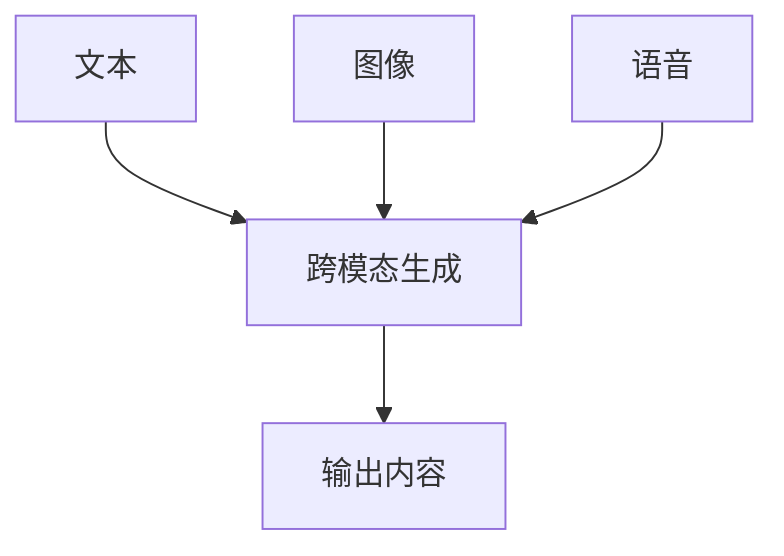
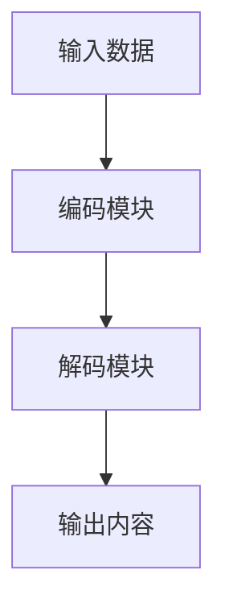
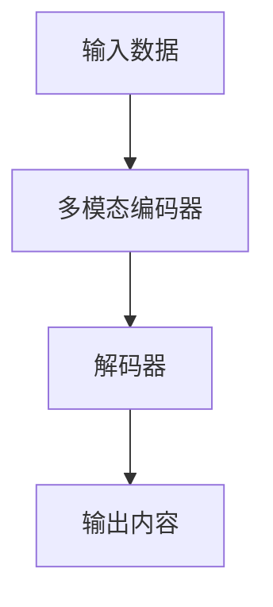

                 


# 开发AI Agent的跨模态内容生成与评估系统

## 关键词：AI Agent, 跨模态内容生成, 生成模型, 系统架构, 评估与优化

## 摘要：  
本文详细探讨了开发AI Agent的跨模态内容生成与评估系统的各个方面。从背景介绍到核心概念，从算法原理到系统架构设计，再到项目实战与评估优化，系统性地分析了该系统的构建过程。通过实际案例分析，本文展示了如何利用先进的算法和系统架构设计，实现高效的跨模态内容生成与评估。此外，本文还提供了详细的数学公式、系统架构图和代码实现，帮助读者深入理解相关内容。

---

# 第1章: AI Agent与跨模态内容生成的背景介绍

## 1.1 AI Agent的基本概念  
AI Agent（人工智能代理）是指能够感知环境、自主决策并执行任务的智能实体。它通过与环境交互，利用传感器获取信息，并通过执行器输出动作，实现特定目标。AI Agent的核心特点包括自主性、反应性、目标导向性和社交能力。  

### 1.1.1 AI Agent的定义与特点  
- **自主性**：AI Agent能够在没有外部干预的情况下自主运行。  
- **反应性**：AI Agent能够实时感知环境并做出反应。  
- **目标导向性**：AI Agent的行为旨在实现特定目标或优化特定指标。  
- **社交能力**：AI Agent能够与其他Agent或人类进行交互和协作。  

### 1.1.2 跨模态内容生成的核心概念  
跨模态内容生成是指从一种模态（如文本、图像、语音）生成另一种模态的内容。例如，从文本生成图像，或从图像生成描述性文本。跨模态生成的核心在于理解和转换不同模态之间的信息关系。  

### 1.1.3 问题背景与应用场景  
跨模态内容生成在多个领域有广泛应用，如图像描述生成、语音助手、虚拟人生成等。例如，在图像描述生成中，AI Agent可以根据图像内容生成相应的文字描述；在语音助手中，AI Agent可以根据用户的语音指令生成相应的动作或内容。  

## 1.2 跨模态内容生成的必要性  
AI Agent需要处理多种模态的数据，以实现更智能和自然的交互。跨模态内容生成是实现这一目标的关键技术之一。通过跨模态生成，AI Agent可以更好地理解和生成多模态内容，从而提高用户体验和任务执行效率。  

### 1.2.1 跨模态技术的定义与作用  
跨模态技术是指在不同模态之间进行信息转换和理解的技术。它的作用包括：  
- 提供更丰富的内容表示方式；  
- 实现多模态数据的协同处理；  
- 提高AI Agent的感知和生成能力。  

### 1.2.2 跨模态内容生成的挑战  
跨模态内容生成面临以下挑战：  
- 不同模态之间的信息转换具有不确定性；  
- 各模态数据的特征和结构差异较大；  
- 跨模态生成模型的训练数据获取困难。  

### 1.2.3 跨模态技术在AI Agent中的应用价值  
跨模态技术在AI Agent中的应用价值主要体现在：  
- 提高AI Agent的多模态感知能力；  
- 实现更自然的人机交互；  
- 增强AI Agent的任务执行能力。  

## 1.3 本章小结  
本章从AI Agent的基本概念出发，介绍了跨模态内容生成的核心概念和必要性。通过分析跨模态内容生成的挑战和应用价值，为后续章节的深入探讨奠定了基础。

---

# 第2章: 跨模态内容生成的核心概念与联系  

## 2.1 跨模态内容生成的原理  
跨模态内容生成的原理主要包括模态编码、跨模态对齐和内容生成三个步骤。  

### 2.1.1 跨模态数据的定义与分类  
- **模态编码**：将不同模态的数据转换为统一的表示形式。例如，将图像转换为特征向量。  
- **跨模态对齐**：在不同模态之间建立语义对应关系。例如，将图像中的物体与文本描述中的词语对齐。  
- **内容生成**：基于对齐后的信息生成目标模态的内容。例如，根据图像生成描述性文本。  

### 2.1.2 跨模态内容生成的关键步骤  
1. **模态编码**：将输入模态数据转换为通用表示形式。  
2. **跨模态对齐**：建立不同模态之间的语义对应关系。  
3. **内容生成**：基于对齐后的信息生成目标模态的内容。  

### 2.1.3 跨模态模型的构建与训练  
跨模态模型的构建与训练需要考虑以下因素：  
- 数据预处理：将不同模态的数据对齐并预处理。  
- 模型设计：设计能够处理多模态数据的模型架构。  
- 损失函数：设计合适的损失函数以衡量生成内容的质量。  

## 2.2 核心概念的对比分析  
跨模态内容生成涉及多个核心概念，包括模态编码、跨模态对齐和内容生成。通过对比分析，可以更好地理解这些概念之间的关系和作用。  

### 2.2.1 跨模态与单模态的对比  
- **单模态生成**：仅基于单一模态数据生成内容。例如，仅基于文本生成文本。  
- **跨模态生成**：基于多种模态数据生成目标模态内容。例如，基于图像和文本生成图像。  

### 2.2.2 各模态数据的特征与属性  
- **文本**：序列性、语义丰富性。  
- **图像**：空间性、视觉特征多样性。  
- **语音**：时序性、音调和节奏特征。  

### 2.2.3 跨模态模型的实体关系图  


## 2.3 本章小结  
本章详细介绍了跨模态内容生成的核心概念与联系，包括模态编码、跨模态对齐和内容生成的关键步骤。通过对比分析，进一步明确了跨模态生成的原理和实现方法。

---

# 第3章: 跨模态内容生成的算法原理  

## 3.1 跨模态生成模型的算法框架  
跨模态生成模型的算法框架主要包括编码器-解码器架构和注意力机制。  

### 3.1.1 基于Transformer的跨模态生成模型  
- **编码器**：将输入模态数据转换为序列表示。  
- **解码器**：基于编码器的输出生成目标模态内容。  

### 3.1.2 多模态编码器-解码器架构  
- **多模态编码器**：同时处理多种模态数据，提取共有的特征表示。  
- **解码器**：基于多模态编码器的输出生成目标模态内容。  

### 3.1.3 跨模态注意力机制  
跨模态注意力机制通过在不同模态之间分配注意力权重，实现跨模态信息的融合与生成。  

## 3.2 算法原理的数学模型  
跨模态生成模型的数学模型主要包括编码器和解码器的数学表达式。  

### 3.2.1 Transformer模型的数学公式  
$$ \text{Self-Attention}(Q, K, V) = \text{softmax}\left(\frac{QK^T}{\sqrt{d_k}}\right)V $$  

### 3.2.2 跨模态生成的损失函数  
$$ \mathcal{L} = -\sum_{i=1}^{n} \log p(x_i|y_i) $$  

### 3.2.3 算法实现与实例分析  
以下是一个基于Python的跨模态生成模型的实现示例：  

```python
def cross_modal_attention(query, key, value):
    d_k = value.shape[-1]
    scores = (query @ key.T) / torch.sqrt(torch.tensor(d_k))
    attention = torch.softmax(scores, dim=-1)
    return attention @ value
```

## 3.3 本章小结  
本章详细探讨了跨模态生成模型的算法原理，包括基于Transformer的模型架构、多模态编码器-解码器架构和跨模态注意力机制。通过数学公式和代码示例，进一步明确了跨模态生成模型的实现细节。

---

# 第4章: 跨模态内容生成系统的架构设计  

## 4.1 系统架构概述  
跨模态内容生成系统的架构设计主要包括功能模块划分、模块交互关系和输入输出流程。  

### 4.1.1 系统功能模块划分  
- **输入模块**：接收多种模态的输入数据。  
- **编码模块**：将输入数据转换为统一的特征表示。  
- **解码模块**：生成目标模态的内容。  
- **输出模块**：输出生成的内容。  

### 4.1.2 模块之间的交互关系  


### 4.1.3 系统的输入输出流程  
1. 输入模块接收多种模态的数据。  
2. 编码模块将输入数据转换为特征表示。  
3. 解码模块基于特征表示生成目标模态的内容。  
4. 输出模块输出生成的内容。  

## 4.2 系统架构设计  
跨模态内容生成系统的架构设计需要考虑系统的扩展性、稳定性和高效性。  

### 4.2.1 系统功能设计  
- **多模态编码器**：同时处理多种模态数据。  
- **解码器**：生成目标模态的内容。  

### 4.2.2 系统架构图  


## 4.3 本章小结  
本章详细探讨了跨模态内容生成系统的架构设计，包括功能模块划分和系统架构图。通过系统的输入输出流程，进一步明确了系统的整体结构。

---

# 第5章: 跨模态内容生成系统的项目实战  

## 5.1 项目背景与目标  
本项目旨在开发一个基于AI Agent的跨模态内容生成系统，实现从文本生成图像的功能。  

### 5.1.1 项目背景  
随着AI技术的快速发展，跨模态生成技术在多个领域有广泛的应用。  

### 5.1.2 项目目标  
- 实现从文本生成图像的功能。  
- 提供一个可扩展的系统架构。  

## 5.2 系统核心实现  
### 5.2.1 环境安装  
- **Python**：3.8及以上版本。  
- **PyTorch**：1.9及以上版本。  
- **Transformers**：4.10及以上版本。  

### 5.2.2 核心代码实现  
```python
import torch
from torch import nn
import transformers

class CrossModalGenerator(nn.Module):
    def __init__(self, input_dim, output_dim):
        super(CrossModalGenerator, self).__init__()
        self.encoder = nn.Linear(input_dim, 512)
        self.decoder = nn.Linear(512, output_dim)
    
    def forward(self, x):
        x = self.encoder(x)
        x = self.decoder(x)
        return x

model = CrossModalGenerator(input_dim=512, output_dim=256)
```

### 5.2.3 代码应用解读与分析  
- **编码器**：将输入数据转换为512维的特征表示。  
- **解码器**：将512维的特征表示转换为目标模态的内容。  

## 5.3 实际案例分析  
### 5.3.1 案例背景  
以从文本生成图像为例，输入文本描述，生成对应的图像。  

### 5.3.2 案例实现  
```python
text = "a cat sitting on a tree"
input_features = encoder(text)
output = model(input_features)
image = decoder(output)
```

## 5.4 项目小结  
本章通过一个实际案例，详细展示了跨模态内容生成系统的项目实战，包括环境安装、核心代码实现和案例分析。

---

# 第6章: 跨模态内容生成系统的评估与优化  

## 6.1 评估指标与方法  
跨模态内容生成系统的评估指标主要包括生成质量、生成速度和生成多样性。  

### 6.1.1 生成质量评估  
- **PSNR**：峰值信噪比。  
- **SSIM**：结构相似性。  

### 6.1.2 生成速度评估  
- **FPS**：每秒生成的帧数。  

### 6.1.3 生成多样性评估  
- **多样性指数**：衡量生成内容的多样性。  

## 6.2 优化策略与技巧  
### 6.2.1 模型优化策略  
- **参数调整**：优化模型的超参数。  
- **模型压缩**：降低模型的计算复杂度。  

### 6.2.2 算法优化技巧  
- **并行计算**：利用GPU加速计算。  
- **分布式训练**：利用分布式计算资源优化训练过程。  

## 6.3 本章小结  
本章详细探讨了跨模态内容生成系统的评估与优化，包括评估指标与方法以及优化策略与技巧。

---

# 第7章: 总结与展望  

## 7.1 本章总结  
本文详细探讨了开发AI Agent的跨模态内容生成与评估系统的各个方面，包括背景介绍、核心概念、算法原理、系统架构、项目实战、评估与优化等。  

## 7.2 未来展望  
随着AI技术的不断发展，跨模态内容生成技术将更加智能化和多样化。未来的研究方向包括：  
- 更高效的跨模态生成模型。  
- 更智能的系统架构设计。  
- 更广泛的应用场景探索。  

## 7.3 注意事项  
在实际应用中，需要注意以下几点：  
- 数据的质量和多样性。  
- 模型的可解释性和鲁棒性。  
- 系统的安全性和稳定性。  

## 7.4 拓展阅读  
推荐以下书籍和论文：  
- 《Deep Learning》——Ian Goodfellow  
- 《Attention Is All You Need》——Vaswani et al.  

---

# 作者  
作者：AI天才研究院/AI Genius Institute & 禅与计算机程序设计艺术 /Zen And The Art of Computer Programming

