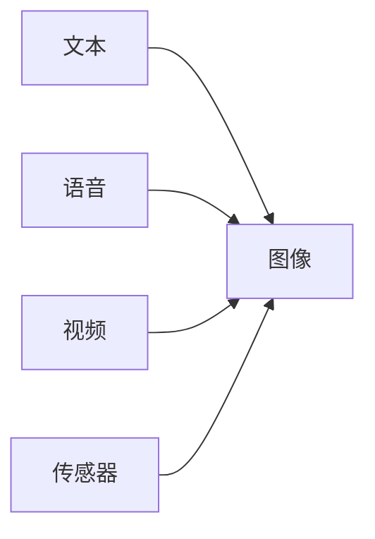
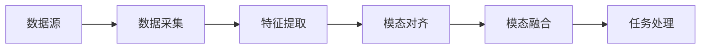

                 


# 开发AI Agent的跨模态学习能力：整合多源信息

> 关键词：AI Agent，跨模态学习，多模态数据，深度学习，模式识别

> 摘要：  
> 跨模态学习是开发具有强大感知和决策能力的AI Agent的核心技术。本文从跨模态学习的基本概念、算法原理、系统架构到实际应用，全面探讨如何整合多源信息，提升AI Agent的跨模态理解与交互能力。通过理论分析与实践案例结合，为AI开发者提供深度技术洞察。

---

# 第一部分: 跨模态学习与AI Agent的背景

## 第1章: 跨模态学习的背景与核心概念

### 1.1 跨模态学习的定义与问题背景

#### 1.1.1 跨模态学习的定义
跨模态学习（Cross-Modality Learning）是指在多个数据模态（如文本、图像、语音、视频、传感器数据等）之间建立关联，并通过融合这些模态的信息来提升模型理解能力的过程。与单模态学习相比，跨模态学习能够利用多源信息，增强模型的泛化能力和鲁棒性。

#### 1.1.2 跨模态学习的核心问题
跨模态学习的核心问题在于不同模态的数据具有不同的特性：
- **异构性**：不同模态的数据形式和语义表达方式不同。
- **模态间关联性**：模态之间可能存在相关性，但也可能存在冗余或矛盾。
- **对齐难度**：如何将不同模态的数据对齐，以建立有效的关联关系。

#### 1.1.3 跨模态学习的边界与外延
- 跨模态学习的边界在于如何在多个模态之间建立有效的关联，同时避免模态之间的信息冲突。
- 其外延包括多模态学习（Multi-Modality Learning）、模态融合（Modality Fusion）和模态对齐（Modality Alignment）等技术。

---

### 1.2 跨模态学习与AI Agent的联系

#### 1.2.1 跨模态学习在AI Agent中的作用
跨模态学习能够显著提升AI Agent的能力：
- **多源信息处理**：通过整合文本、图像、语音等多种数据，增强AI Agent的感知能力。
- **任务增强**：在目标识别、自然语言处理、人机交互等任务中，跨模态学习能够提高任务的准确性和鲁棒性。
- **决策优化**：通过多模态数据的融合，AI Agent能够做出更全面、更可靠的决策。

#### 1.2.2 跨模态学习与AI Agent的核心要素
- **数据模态**：AI Agent需要处理的多模态数据类型。
- **模态对齐**：不同模态数据之间的关联与对齐。
- **模态融合**：如何将多模态数据融合，以提升模型的性能。

---

## 第2章: 跨模态学习与AI Agent的核心要素

### 2.1 跨模态学习的核心概念
#### 2.1.1 跨模态学习的模态类型
- **文本模态**：包括自然语言文本、结构化数据等。
- **图像模态**：包括视觉数据、图像特征等。
- **语音模态**：包括语音信号、声学特征等。
- **视频模态**：包括视频流、动作特征等。
- **传感器模态**：包括温度、压力、加速度等物理信号。

#### 2.1.2 跨模态学习的关键属性
- **模态独立性**：不同模态的数据可以独立处理。
- **模态相关性**：模态之间存在潜在的关联性。
- **模态互补性**：不同模态可以互补信息，提升整体性能。

#### 2.1.3 跨模态学习的实体关系图


---

## 第3章: 跨模态学习的核心问题与挑战

### 3.1 跨模态学习的核心问题
- **模态间信息对齐**：如何将不同模态的数据对齐到相同的语义空间。
- **模态间关联建模**：如何建模不同模态之间的关联关系。
- **模态融合策略**：如何有效地融合多模态数据。

### 3.2 跨模态学习的挑战
- **数据异构性**：不同模态的数据形式和语义表达不同。
- **数据不平衡性**：某些模态的数据量可能远少于其他模态。
- **计算复杂度**：多模态数据的处理需要较高的计算资源。

---

# 第二部分: 跨模态学习的算法原理

## 第4章: 跨模态对齐算法

### 4.1 跨模态对齐的基本原理
跨模态对齐的目标是将不同模态的数据映射到相同的语义空间，以便后续处理。常用的对齐方法包括：
- **对比学习**：通过最大化相似模态之间的相似性，最小化不相似模态之间的相似性。
- **注意力机制**：通过注意力权重来对齐不同模态的特征。
- **自对对齐网络**：通过自适应的方式学习模态之间的对齐关系。

### 4.2 跨模态对齐的实现算法

#### 4.2.1 对比学习算法
对比学习通过设计对比损失函数来对齐不同模态的数据：
$$ L = -\log(\text{sim}(x_i, y_j))^{\gamma} - \log(1 - \text{sim}(x_i, y_k))^{\gamma} $$
其中，$\text{sim}$ 表示相似度计算函数，$\gamma$ 是温度参数。

#### 4.2.2 注意力机制算法
注意力机制通过计算不同模态特征之间的权重来实现对齐：
$$ \alpha_i = \frac{\exp(a_i)}{\sum_j \exp(a_j)} $$
其中，$a_i$ 是注意力权重的计算值。

---

## 第5章: 跨模态融合算法

### 5.1 跨模态融合的基本原理
跨模态融合的目标是将不同模态的数据融合到一个统一的表示空间中。常用的融合方法包括：
- **早期融合**：在特征提取阶段对多模态数据进行融合。
- **晚期融合**：在分类或预测阶段对多模态数据进行融合。

### 5.2 跨模态融合的实现算法

#### 5.2.1 早期融合算法
早期融合通过将不同模态的特征向量进行线性组合来实现融合：
$$ z = \sum_{i=1}^n w_i x_i $$
其中，$w_i$ 是融合权重，$x_i$ 是不同模态的特征向量。

#### 5.2.2 晚期融合算法
晚期融合通过将不同模态的分类结果进行加权融合来实现：
$$ p = \sum_{i=1}^n \lambda_i p_i $$
其中，$\lambda_i$ 是融合权重，$p_i$ 是不同模态的预测概率。

---

## 第6章: 跨模态学习的系统架构与设计

### 6.1 跨模态学习的系统架构

#### 6.1.1 系统功能设计
- **数据采集**：从多种模态中采集数据。
- **特征提取**：对不同模态的数据进行特征提取。
- **模态对齐**：将不同模态的特征对齐到相同的语义空间。
- **模态融合**：将对齐后的特征进行融合。
- **任务处理**：根据融合后的特征进行目标任务的处理（如分类、回归等）。

#### 6.1.2 系统架构图


---

## 第7章: 跨模态学习的项目实战

### 7.1 项目背景与目标
以构建一个多模态问答系统为例，目标是通过整合文本、语音和图像数据，提升问答系统的准确性和用户体验。

### 7.2 系统实现

#### 7.2.1 环境搭建
- **工具安装**：安装Python、TensorFlow、PyTorch等开发工具。
- **数据集准备**：收集多模态问答数据集，包括文本、语音和图像数据。

#### 7.2.2 核心实现
```python
# 示例代码：多模态特征融合
import numpy as np

# 文本特征
text_features = np.random.rand(10, 5)
# 图像特征
image_features = np.random.rand(10, 5)
# 融合特征
merged_features = np.concatenate([text_features, image_features], axis=1)
```

### 7.3 案例分析与优化

#### 7.3.1 案例分析
通过对实际案例的分析，验证跨模态学习算法的有效性。

#### 7.3.2 优化建议
根据实验结果，提出优化建议，例如调整融合权重、改进对齐算法等。

---

## 第8章: 总结与展望

### 8.1 跨模态学习的核心总结
跨模态学习是开发具有强大感知和决策能力的AI Agent的关键技术，其核心在于如何有效地对齐和融合多模态数据。

### 8.2 跨模态学习的未来展望
随着深度学习技术的不断发展，跨模态学习将在更多领域中得到应用，例如自动驾驶、智能机器人、医疗健康等。

### 8.3 最佳实践 Tips
- 在实际应用中，需要根据具体任务选择合适的跨模态学习算法。
- 注意数据的质量和多样性，避免因数据不足或偏差导致性能下降。
- 在系统设计中，需要考虑多模态数据的高效处理和存储问题。

---

# 作者：AI天才研究院/AI Genius Institute & 禅与计算机程序设计艺术 /Zen And The Art of Computer Programming

