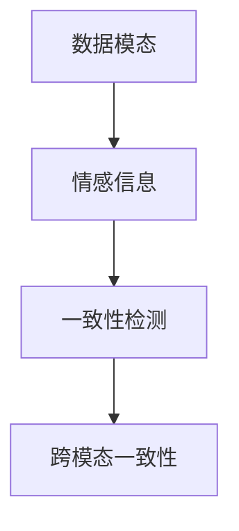

                 


# 开发AI Agent的跨模态情感一致性检测

> 关键词：AI Agent, 跨模态情感一致性检测, 情感分析, 多模态数据融合, 深度学习, 人工智能

> 摘要：本文深入探讨了开发AI Agent的跨模态情感一致性检测的技术挑战与解决方案。从背景介绍、核心概念、算法原理到系统架构设计、项目实战，再到最佳实践，全面剖析了如何实现跨模态数据的情感一致性检测，并在实际应用中提升AI Agent的交互能力和用户体验。

---

# 第一部分: 背景介绍

## 第1章: 问题背景与描述

### 1.1 问题背景
#### 1.1.1 AI Agent的定义与应用
AI Agent（人工智能代理）是一种能够感知环境、执行任务并做出决策的智能实体。它可以应用于智能客服、智能助手、自动驾驶等领域。

#### 1.1.2 跨模态情感一致性检测的必要性
在多模态交互中，情感一致性检测是确保AI Agent与用户有效沟通的关键。例如，在智能客服中，AI Agent需要通过文本、语音和情感信息来准确理解用户需求。

#### 1.1.3 当前技术挑战与研究现状
跨模态数据的复杂性、情感信息的多样性以及不同模态之间的关联性，使得情感一致性检测成为一个具有挑战性的任务。

### 1.2 问题描述
#### 1.2.1 跨模态数据的定义与特点
跨模态数据指的是来自不同感知渠道（如文本、语音、图像等）的数据。这些数据具有异构性、多样性和互补性。

#### 1.2.2 情感一致性检测的定义
情感一致性检测是指在不同模态的数据中，识别情感表达是否一致的过程。

#### 1.2.3 跨模态情感一致性检测的难点
跨模态数据的异构性、情感信息的模糊性以及模态间特征的对齐问题，是跨模态情感一致性检测的主要难点。

### 1.3 问题解决方法
#### 1.3.1 跨模态数据处理方法
采用模态间特征对齐、多模态融合等技术，解决跨模态数据的异构性问题。

#### 1.3.2 情感一致性检测的算法思路
通过深度学习模型（如Transformer、LSTM等）对跨模态数据进行特征提取和情感预测。

#### 1.3.3 综合解决方案的提出
结合跨模态数据处理和情感一致性检测技术，提出一种端到端的解决方案。

### 1.4 边界与外延
#### 1.4.1 跨模态数据的边界
跨模态数据的边界在于不同模态之间的数据类型和特征空间的差异。

#### 1.4.2 情感一致性检测的适用范围
适用于多模态交互场景，如智能客服、虚拟助手、情感社交机器人等。

#### 1.4.3 相关领域的区别与联系
与情感计算、跨模态检索、人机交互等领域密切相关。

### 1.5 概念结构与核心要素
#### 1.5.1 核心概念的层次结构
从下至上分别为：数据模态、情感信息、一致性检测、跨模态一致性。

#### 1.5.2 核心要素的定义与作用
- 数据模态：输入数据的类型（如文本、语音、图像）。
- 情感信息：数据中蕴含的情感倾向。
- 一致性检测：判断不同模态的情感信息是否一致。
- 跨模态一致性：不同模态情感信息的一致性。

#### 1.5.3 概念结构的可视化


---

# 第二部分: 核心概念与联系

## 第2章: 核心概念原理

### 2.1 跨模态数据处理
#### 2.1.1 多模态数据融合方法
- 并行融合：分别处理每个模态的数据，然后进行特征融合。
- 串行融合：按顺序处理模态数据，逐步提取特征。

#### 2.1.2 模态间特征对齐技术
- 使用注意力机制对齐不同模态的特征。
- 基于对比学习的特征对齐方法。

#### 2.1.3 跨模态数据检索与匹配
- 基于向量的相似度计算。
- 多模态检索模型（如CLIP）的应用。

### 2.2 情感一致性检测
#### 2.2.1 情感分析的基本原理
- 文本情感分析：基于词嵌入和深度学习模型（如LSTM、BERT）进行情感预测。
- 语音情感分析：基于声学特征和情感识别模型进行情感判断。

#### 2.2.2 跨模态情感一致性检测的指标
- 情感一致性分数（如余弦相似度）。
- 一致性检测的准确率、召回率和F1值。

#### 2.2.3 情感一致性检测的度量方法
- 基于概率的度量方法。
- 基于距离的度量方法。

### 2.3 核心概念的联系
#### 2.3.1 跨模态数据与情感一致性的关系
跨模态数据的多样性为情感一致性检测提供了丰富的信息，但其异构性也增加了检测的难度。

#### 2.3.2 不同模态对情感一致性的影响
文本模态提供情感语义信息，语音模态提供情感语调信息，图像模态提供情感视觉信息。

#### 2.3.3 情感一致性检测在AI Agent中的作用
通过情感一致性检测，AI Agent可以更准确地理解用户的情感状态，从而提供更个性化的服务。

## 第2章附录: 概念属性特征对比表

```plaintext
| 概念       | 属性1   | 属性2   | 属性3   |
|------------|---------|---------|---------|
| 数据模态    | 类型     | 特征空间 | 数据形式|
| 情感信息    | 语义     | 语调     | 视觉信息|
| 一致性检测  | 方法     | 指标     | 度量方式|
| 跨模态一致性 | 融合方式 | 对齐技术 | 检索模型|

----------------------------------------------------------------

* 接下来，我会按照这个大纲继续完成后续的章节内容。如果您对后续内容有任何修改或补充的需求，请随时告知我。
```

